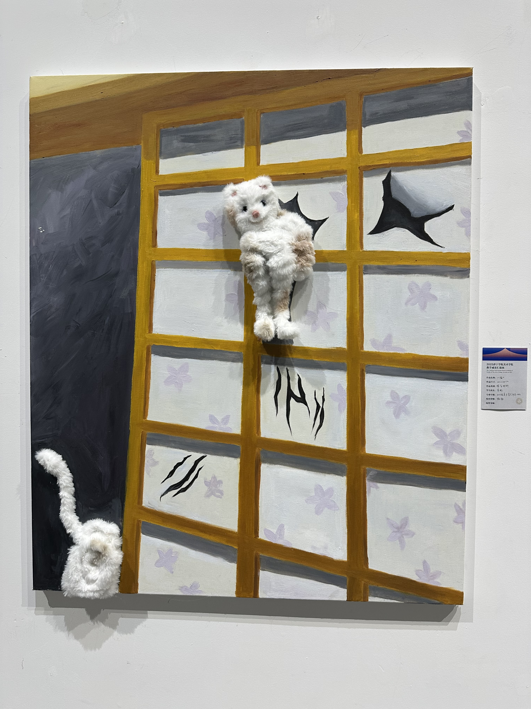

图为孔子和他的学生, 拍摄地为 <a href="https://surl.amap.com/b1pnF3z1q5zD" target="_blank">济宁市博物馆文化中心馆</a>

***逝者如斯夫, 不舍昼夜***, 意为 **时间像流水一样, 日夜不停地流逝**, 这句话表达了孔子对时间流逝的感叹，也蕴含着珍惜时间，不虚度光阴的哲理

## 工作变动

**人生总是充满了变数**, 因工作变动, 我从 `6` 月份开始前往济宁出差, 开始了一场 **魔幻的被无限拉长的出差经历**

- `6` 月份时得到消息: 干到 `6` 月底就回原工作地
- `6` 月中旬得知: 没希望了, 无法回来
- `7` 月初得知: 应该稳了, 可以回来
- `7` 月初又得知: 双方领导层正在协商, 可以回来
- `7` 月中旬又得知: `8` 月份就可以回原工作地
- `8` 月初得知: 正在确认细节
- `8` 月初又得知: 还在走流程
- `8` 中旬得知: 即将返回原工作地
- `8` 中旬: 返程

从商业谈判的角度来看, 这其中发生的故事肯定非常精彩, 但对于真正的劳动力来说, 这可一点都不好玩

> 
> 

> 希望是美好的，也许是人间至善，而美好的事物永不消逝。  
> Hope is a good thing, maybe the best of things, and no good thing ever dies.  

这趟旅程像极了 <a href="https://www.bilibili.com/bangumi/play/ep284310" target="_blank">🎬 肖申克的救赎</a>, 在一次次希望与绝望之间等待最终的救赎, 我们或许未必经历过监狱, 但谁没有被生活的高墙围堵过? 唯独美好的事物永不消逝

## 内卷

但如今就业环境非常恶劣, 一方面劳动力越来越多, 另一方面就业岗位越来越少, 而且降本增效之风已经蔓延到了各行各业, **我们正在陷入一个挣扎的内卷时代, 在这个内卷旋涡中没有人可以独善其身**

## 出发
由于我的行李比较多(一个大件行李, 一个行李箱, 一个电脑包), 所以打算开车去

经过 `4` 个多小时最终到达济宁的出租屋(公司提供的宿舍), **这是一个三居室, 但只有一个卧室有空调, 另一个空调在客厅**

图为客厅(打扫后), 我们安顿好之后立马出去买了拖把, 把洗手间和客厅打扫了一遍(简直太脏了 😫)

右侧为厨房, 厨房非常的脏, 一开门全是土, 里面堆着面和油, 没有招来老鼠蟑螂也是个奇迹

图为唯一一个有空调的卧室(我的卧室), 在酷热的夏天能有一台空调续命真的太舒服了, 我宣布 **空调是最伟大的发明**

图为卧室门, 据说之前是小孩子的卧室, 这种标语对小孩子应该会有激励作用, 但对我们来说...
- 如果努力就可以成功, 这个世界的首富应该是我们村里的驴
- 应该努力让自己成为自己想成为的人, 而不是活成别人希望的样子

## 济你太美
之前从未来过济宁, 对济宁的认知还停留在 **孔孟之乡** 和 **<a href="https://www.douyin.com/user/MS4wLjABAAAAoC6BLDETRW9UFXZ4p4Y-_lKwXWrImjkRYZDxIXs3G3HjYQDAcmWTGUGHUja8K-O-" target="_blank">汤姆张</a>** 上, 没想到搜了一下济宁, 意外的发现了济宁文旅竟然在蹭哥哥的热度, 济宁居然真的有 <a href="https://surl.amap.com/gBriRHn1aH6" target="_blank">蔡徐村</a>

<video controls width="100%" src="/static-videos/jining-kunkun.mp4" type="video/quicktime"></video>

视频作者为 <a href="https://www.douyin.com/user/MS4wLjABAAAAKwBGPrZNyFY1CnnFd60nmzQ1b_Ziprh-BE7adF0uNqo" target="_blank">济宁你好</a>, 看起来并不是网传的由济宁文旅制作

点击查看 <a href="https://surl.amap.com/gBriRHn1aH6" target="_blank">蔡徐村</a>

### 初来乍到

图为刚开始下雨时的天空, 在小区内拍摄, 深色的乌云像水墨一样逐渐晕染开来

图为济宁的公交车, 印有 "情系万里, 德行济宁", 据说早晚高峰免费, 但是来了这么久没坐过公交

图为济宁北站出站口的展示牌, *青年发展友好型城市*

但现实情况是, 疯狂宣传的往往是有所欠缺的, 根据济宁市统计局的数据, 2024年相比于2023年, 济宁市常住人口减少了 5.32 万人(824.05 - 818.73), 降幅创近十年新高, 详见 <a href="https://www.sohu.com/a/892879874_121123761">济宁及各县市区最新常住人口数据公布</a>

我觉得应该改成生活节奏友好型城市, 这是一座生活节奏比较慢的城市, 大家都比较随性, 有生活气息, 人与人之间基本没有距离感

### 散装的济宁
济宁市区在任城, 济宁的其他下辖地市都比任城知名度高, 例如 曲阜 / 邹城 / 兖州 / 梁山
- 机场也在嘉祥, 没错, 济宁的机场叫做曲阜国际机场, 不在曲阜也不在城区, 而在嘉祥
- 京沪高铁也没有经过城区, 而是在曲阜设有曲阜东站
任城与兖州邹城曲阜之间又有成片的煤矿塌陷区, 无法连片发展

更加令人疑惑的是, 主城区四处建设新区, 最后哪都没发展起来:
- 东边建立了高新区, 但因为煤矿大量开采, 土地塌陷越来越严重, 根本不适合开发
- 西边建立了经开区, 往西向距离较近的嘉祥发展, 但同样没有发展起来
- 南边建立了太白湖新区, 但太白湖往南是南阳湖, 根本没有发展的空间
- 把高铁站(济宁北站)放到了距离城区很远的北边

### 煤矿塌陷区
为什么济宁的城市规划如此散装? 因为在济宁 **分布着数量众多的煤矿开采区和塌陷区**, 因为煤矿塌陷区的阻隔, 各辖区无法连片发展, 济宁也正在积极治理因煤矿开采带来的诸多问题

<iframe width="100%" height="468" src="//player.bilibili.com/player.html?isOutside=true&aid=616189435&bvid=BV1ph4y1L7d9&cid=1202992399&p=1&autoplay=0" scrolling="no" border="0" frameborder="no" framespacing="0" allowfullscreen="true"></iframe>

### 工作
这个项目是老系统升级改造, 即参考原系统代码在新系统中实现, 没有让我们评估工时, 而且工期非常紧，所以一直加班

#### 老系统升级

这又是一个充满槽点的话题, **限于篇幅, 以后有时间会单独写一篇文章**

由于原项目是 vue2, 新项目是 vue3, 所以为了代码迁移时少掉一些头发, 我还特地尝试了基于 gogocode 的 <a href="https://sublimect.github.io/gogocode-playground/#code/N4IglgdgDgrgLgYQPYBMCmIBcIQBoQDuSATgNbLpYgBmMEAxnGEhAARzECGEAztSQFsAFNTAAbNAEkI-XK05QwcpFCYseASlbAAOm1b11cVgBJWAXnmKAdAHMk9w+j2sDR1jyQxi9NBdaiEtL81p7evi5uvMacPMaWJkJhPmhyuvquUJzEPGgA8qrMvJjaka6uyb4AKgCeUGglAOQCqDASjbhl5WLctjCctg2sjQBuMGgdXZliMLaQPCUA2o1wdWg89MRgqo0Aup0ZrAC+B65HGnqRAPRXrMRocN5sNV7E7Fy8-MQCaChu6KwABZoe6RQzRdhoARQHpwPyWWJwayiCAoISNAA8cOhsLQAD4MVdsTDOHC8Y0LvpwXEPJttvF5HFkZA0ZiNltVASruz6eTKddblioSSyaxABcJgDAlSKA7goCRVYW4oTE3H8qnuKDEFQ8fyLXYC1gYnmc8VS-Qy1ESADKdNUSVtcDkmu1atcEmMTnhjKRgwgINJaCErtYN1YgG-PQAmaaw0AAPKAkYzoaicNrGYBHViAKeVAG6KgFDFMWAELdAOgJgHflMGoL33FojNAAUTjCYAImhk6mhJ7Ka5Pf5OCgUABBCA1KpIABidEYRQACtlOAIeO2K53-l7PdZ7iTfOijQ7yXI2Q6PA8YFBWD0ILZzDoQHAeNe+Zd9PdHsQ2J69EdH7QGGo2FWkDW9bxsQcDNq2YhwIu6BaOkrjPk8K5dOuaCboGVzUnAOg6DwADUQiLJwAC0ABe-aEQAWgA+iYuw4Rc2EAFRXox9zUFhQj4Vhd46FauwMQA-PRGi4Fctj7hhpgAIz+KxQgmAATBoADcFJIRuPRblcQhYQARt+k4sLpXEMQRJFkVRNGLFhBA0QxxnsUI-GYIsAB6QbprsAA+7GuUGfFYRoGh2To9E8MFwBWdhWG8QJ9FXFhwV8GxUU6MF8U6J+jEiWJwwmJJWEQEcqmHMhqFCFcsbAZh2E4UmKYQfZOi6IxVz7gVYDQgm2h3C2ygQAAsl4EBwigciGNC8C-McARagIrBYaM4wLQVxXlKwpUaWhWFHEp-HGY55gYlh3K7horXDKt5QbZwmnHQlXHUMl3Fpdl+4qcurjXbdOjpYlj1cfdP3bQFr3DOc71qShm3lXdqUPU9gM3DljSXZ96k3WhlFwICYDcdYon7tjuPWKj63o5pIzZFxWM4zwBMXR9ZNQxj5VCJTxCee6nkYaFDE07jxnMWFRM8Lt9Mo4zX2YyLgvGSLYvI6TUvlTLOjWJxOgoNZWFYZRtH0eVyN5eikvk2hqvq5FWs6AQOs6HrdHi3l1iUzMEym8zmkW1hJhQmA1WG-ufuQUrZsq7TWHWD7rF4xr1sEPrTuSS7nBu6HnvmxHavRy23GLMs167HH1n6wXID6jouxJynace2VVyYJgIyEegKHaYxGhCNYDG88A4uYK3UByYp2jp-XFsmOCojfOx4u1mI-XrDwAxoAAQkgMbWFPYDfCbH5fhOv5ArK8qKgGypn3CMEGmgYiETp8BwCw7BrFeN6xphICsIAAOmAIGRgA28YAI2NABcctGO+D84BPzYKseob9NQdWyDUa8Z5ICkEAEAMkQVQBmVl0TEt976P2fjAtAb84Qxk-qYEwJgAAMeIqF5UJPgiBUC9y4IxEwwh0DX7XngQIRByCxCoMoTQuhVDJKMPAZw8kkRlxYLhDgw4eC74oDAKnBwrAm64zADpCQoQagMDfiYaiyD6G0PoeIiqyjVFiAcKwxR7CrFqNsKwZuLR0BiEMcYr+pjREMMsS3axtjGgyP3hAPQ+kj4WjlGgG0HJILGkdKwZ0UBNClH0KGBJytGiVS6nVVM2h6FFX3PQikSlywQm7JYTJKJWQ5JAqwPJEEClUKKspcszgSph0aONeMfphoLHTB0BmkMyrNDADGeYzldhDIliM6GjQIBziGEYkwMyx7zMCHCHIJRBn7lDFUPIjY8isA6jCKEaB+kBHEFsngl13ydIzuiZJAzCkzP2Yc459hHAVlYIAA9NACrNoAEE1ABgLoAGV1ADqmoAT+1ACGMXIQAAkaAFO5P+kLAAr1oABLtADHcoAQA9ABXgYAGQjAD-ZoAgqElnnmCTJANAU4tQpKEMAQpZ0GIBGoKwBiVw7kViQjU9EKBSScCDNoVpXKWTongq+QVpNQxZJWXJaiMEVlFOGBJFZ-hZUmBKNwGoWhzB4gKdRIVDzRkrMwCsmZyrqIyRbGqjQ6yWaNDFWwelLSZklOXGuLpvK4D8vlc64pVCOUdLWsyVE6IemTRQJgQZdd5kyo0E6kwirunuBVZYMNI0OLat1c1CA9CCpXCZY9VlVxzi2q3I0awFa+FQCtF6uEckqE2v3KWwMSaJojR2a8v1qy3WcpKtyxoBBST0EBJGg1QaunGuAFEiQxBrXxqOImwdcBh0Zp1Ss3A1qdXZtzR+G10a7WTunSCdyhTF1DsBKuuh1EN0aC3QVHdhU91zJZlMeaIBGimsjUe2dKy42FNwIPTAHBxifjwK+gd57L3rs3XieduBgCAeA2gEtXR91blfdeD91FGhfpPse3987QOnDWsMJdK6gxruvTB7dVCCoocOGhwMGGQA6xACs1juHLT4blXBxDxAQPXmI2tCDy6L0UavSYDdv6t3-oQ2gFCQH+PIZtah596HDiuGvKx9jWEsBTrwz+njp7BPgbI2J29EmpNyrvXoB99G1qMfRDKgjnbSOQfE9B39Fgs33to7u5tTnqInt9W50TUGqOZtKLZvzj6AvBLY14udrmRPkci55uV3mos5piyWxzwSdBYZMAtYLCaZlmfC5JgVOqst2afYa+Z152NYACIfIorAkshZS+ZzLKqrMmEizRor-m8sLR0zhlrP4iglbPWFjzEXMuDbo3V8djyuuRuS669paBhUhuaA8QEqABljqumHcDsR9H0FMEF0xf6xFFLOzwC7E2DJsGc1Q6hPq8p5vzcyotRVVP1YPdd97t28qJoiW1t7NDr7Ra+3oH7ha2XHbRqt87DAruJFB4mtHl2IfP1jTVmLCOWVI7i7G+dMy8evaC59vNBaSfFriz8bGh31udc2+qQNJ3VubDQAGNEWOZksFXi2EgaBBp0EguJxbw21MtpaJL3402hcDSGum6XvmhsQGJ395b3PRk6VF-cAAqhABXw1lf7mF0btApvzdS4szL2LeW6D26V4Lq3EA7dq6Vxr2HS24uG6+GgZscQtQ1Et8Ma3wfveS8vU73LcueXrCfsQGo7uKee9j8NX3jvNcB+XFtpPKxabWBMD8Hgy9Bhl+u3KmZ89F6V5XjXxIv7iqfm1wxOybAmXAMAL+KgAHU0AFnagBJOQLIAIeUB+AG-bQABUqsAAAYaqHPP1ggBvH0ANHqgAIf8ALBygAseRBYPwAwDGAApXQAkP8uCZQAASyFwOa3ZAD5yoAac1WC1HqLE+krBsUX9YJfh1OoiWABwKgWF-j3vFDIK1s-L2AOEOCOOOJNiwDOLfguB2GknBMeOKu6o8l0KGIAKNygAnMqACyic9kfKPpvoAO6KgAsCqABoRoABYRgAffGADw+qfoADD-gAu-KACD0QAYAEbpgA9GaoHlBaS6RU66SOSYBcQ4SRQ2T6z8TeQ6B6QQFhJyG8wOSuQaB8RCSNR9xiRdBCCUROisTjJyBcAECIFzipLVawQkYSQnieq-CmHzgyScAmGzjzivqfQ8Awj+zoi4CkxBpVpCA35zgLZuHlASQcAdQ-B-CWCBECDWDhHCCMwkYnIspCAACE8RkRWgDq7wERvwj4SRa0oYgAz7GADj8YAE+6gAZHob4hisCADHkYACHmNR9wNIk+IRrgYAKRGRvw1gkA9AMw6AC4OGFIrAnknkIYLkiwzUeo3cVwcRKeyoWwAgmRIxYxXRKAoQXqIEPAAA6v7BeuWhWhSNfBpgUdkWsW0ccPkQUa4KGIAJDmgAG3mAAl0YADwKgAWP+ABjRoAAhGrAiyPwrAgAMSpPHPEXEdHtZrE9EMD9HrDojmBHH8HXFdjuCLCkBoA1ByBJi7D+DgkeGCIhywkaDWD+E6jVY8BxGLFBiJGnHoFsDz4mDAAok1BHBL41D+B0lJhHDz4XEd4XGhi-JAnMGAAvboAKXGM+G+Fx2RtJwAaxTJ8gy+IR5wIR1gAAVkgJAN4cMMGGtBKXSZqC2OMkcHJMADYfzvYTwOcNoJyYcB3q4JSB3ngOANAPAAADK9BUBjAYD4Ayg8DUoPBMAghYDJhiC5D4A8AwA6QABqYAaABAr+GA2APS2QGARwQAA" target="_blank">🔗 迁移脚本</a>

用于将 `vue2` 转换为 `composition API` 的 `vue3` 代码, 由于时间关系, 脚本只是个半成品, 并不完美

#### 工作体验
程序员加班或许已经是行业共识，大家好像也习以为常，总是被迫愿意用更多的工作时间来换取项目的尽快交付，经历了两个月高强度的加班，让我深切的感受到: **软件行业是劳动密集型产业**

我们看似投入了时间，精力，想法，产出的是某些系统或功能模块。实际上我们投入的是敲击键盘鼠标，得到的是工资到账。因为在老板眼里，你与工地搬砖的工人和村里种地的农民无异，**我们在用脑力搬砖或者挥舞锄头**，所以程序员群体都戏称自己是码农。

#### 搬砖?
可是我们所做的工作明明是有技术含量的，为什么会有搬砖的感觉呢？

因为程序员在角色分工中就是最基层的制造者

程序员不像 画家/ 设计师, 程序员的工作整体分为系统设计和编码两部分:
* 系统设计: 分析需求并找到可行的实现方案
* 编码: 根据实现方案编写代码

在系统设计阶段,我们做的是创造性的工作, 这一阶段很像画家作画, 设计师作图, 从零到一找到解决方案; 第二阶段编码更像是搭积木, 根据自己设计的图纸一步一步搭建自己的城堡, 在编码时应该是按图索骥水到渠成的, 看起来很美好对不对?
实际上系统设计阶段所花费的时间和精力往往被低估, 需要验证可行性, 技术选型, 需求分析, 与产品经理反复确认需求
再说编码阶段, 如果时间充足, 编码过程是很美好的, 但如果工期很紧, 就是截然不同的工作体验了:

* 赶进度 = 以最快的方式实现功能 = 牺牲代码质量 = 写屎山代码 = 增加维护成本
* 人的工作效率是会随着连续工作时间增长而下降的, 加班时间越多, 注意力越难以集中, 作为碳基生物感到愈发疲惫
* 工作没有正向反馈, 只有负面反馈, 非程序员难以理解开发中的坑, 就像长安的荔枝中的李善德, 一路跋山涉水快马加鞭把荔枝运到了长安, 无人在意途中发生了什么, 这只是本该送到的普通水果罢了, 博得妃子笑是因为荔枝本身香甜可口,荔枝不新鲜了或者没送到才是意外

#### 加班

回到加班这件事上, **到底为什么程序员群体会普遍加班呢?**

* 工时评估时迷之乐观
* 低估系统迁移工作量, 忽略原系统复杂度和代码量
* 需求不明确或没有分析透彻, 只看到了整体需求的冰山一角
* 公司崇尚加班文化 / 内卷文化 / 能者多劳文化
* 低估了 debug / 联调 / 系统设计 所需的时间
* 所做的功能模块缺少数据或者需要等待其他人开发完前置功能
* 过于相信队友, 高估了队友的能力
* 拥有一个不懂技术又喜欢指导一切的领导
* 团队内缺少专业的产品经理和测试角色
* 忽略屎山项目的代码阅读成本
* 忽略前期项目环境搭建和配置的耗时
* 低估了需求变动导致的额外工作量
* 忽视文档编写 / 参加会议浪费的时间
* 莫名其妙的机器思维, 认为人可以像机器一样全神贯注地每天运转至少8小时
* 项目缩减工期或要求提前完成任务
* 需求频繁变动, 把新需求当成 bug
* 工作不被认可影响心情, 用代码量评估工作量, 用 bug 数量确定工作能力, 就像用硬盘大小评估一台电脑的性能, 用发热量作为所有硬件的唯一评估标准
* 拥有一台卡到想砸烂的电脑, 严重影响编码体验和开发速度
* 程序的世界中总是充满了各种稀奇古怪的问题, 你总会花时间解决你根本无法预料的报错, 如果遇到了解决不了的问题, 还可能调整方案或推翻设计方案重新设计

#### 剧场效应

在一个剧院里，大家都在看戏，突然前排有个观众站起来了，周围的人劝他坐下，他置若罔闻，求助剧场管理员，管理员却不在岗位。

于是逐渐整个剧院的人都站起来了，**大家看到的是跟之前一样的视角，但每个人都更累了。**

更悲剧的是，虽然大家都叫苦叫累，**但不会有人选择坐下来，因为坐下就真的什么都看不到了。**

#### 被硅基生物取代?

在 `ChatGPT` 诞生之前, 应该很少有人会考虑这个问题, 但在 `AI` 具备越来越强大的工具属性, 甚至能嗅到 `AGI` 的意味之后, 这个问题的答案仿佛无限趋向于肯定

碳基生物最大的缺点就是饿了要吃饭, 困了要睡觉, 如果有一种程序员可以不知疲倦的 `24h` 敲代码, 没有性格缺陷, 听从指挥任劳任怨, 那老板们岂不是做梦都要笑醒?

在可以预见的未来, AI 会取代相当一部分程序员岗位, 这取决于 AI 进化的速度

**限于篇幅, 以后有时间会单独写一篇文章**

### 吃喝
#### 甏肉

图为济宁甏肉, 口感软糯肥而不腻, 这不就是把子肉吗, 为什么叫甏肉？

**甏：一种盛放食物的器皿**

在北宋年间，这里的水泊梁山就成了好汉们的聚义地。随着梁山名气渐大，投奔而来的英雄剧增，普通炊具做饭量少愈慢。厨房伙计无奈之下用腌咸菜的大甏（beng，四声）充当炊具。把大块五花肉放在甏中，加老汤，填葱姜，佐料适中，将甏置于挖好的坑中，用干柴引火，木炭燃料，慢火细炖，逐渐甏内如玛瑙般微泡四起，肉香扑鼻，碳白火暗。取大勺每人满碗，大块肉放入嘴中，闭口间，肉已滑入肚内，爽滑至极，却不油、不腻。饮大坛米酒，顿觉满口生津，荡气回肠。虽不是山珍美味，也没有精挑细选，然大块吃肉、大口喝酒，已是赛似神仙般逍遥快活，越发彰显出梁山英雄的豪迈气概。

#### 葡萄鸡丁

图为葡萄鸡丁, 黑暗料理, 口味偏甜, 吃不惯, 好好的葡萄为什么要炒它?

#### 醋溜肉丝

口感不错, 很合胃口

#### 大盘面条鸡

真的好大一盘, 桌子都显得小了, 底下还有面条

#### 四孔鲤鱼

图为四孔鲤鱼, 就是有四个鼻孔的鱼, 其实味道跟普通的鲤鱼差不多

> 在微山湖周围，有着丰富的关于微山湖鲤鱼的掌故和传说。孔圣人的夫人生了孩子，鲁国国君专派人送了一条活鲤鱼祝贺，孔子因此给儿子取名孔鲤，可见孔子对鲤鱼的喜爱。明朝正德皇帝沿京杭运河南巡，住在微山湖南岸庙道口宋家楼，在李翠莲开的酒肆里吃到了李翠莲做的湖水炖湖鱼（鲤鱼），龙颜大悦，与年轻美貌的李大姐演绎了一场浪漫佳话，在当地传诵至今。乾隆皇帝游江南，亦过微山湖，也吃到了微山湖鲤鱼，赞赏之余，又把微山湖 鲤鱼封为贡品，从此微山湖鲤鱼年年上到皇宫龙宴。明末清初，微山湖西岸出了一个大诗人阎尔梅，诗文中对微山湖鲤鱼亦是非常喜爱，“烟水昭阳万顷漩，香城隐隐住琴仙；我来闲访红鲤市，偏有邻家认酒钱。”四孔鲤鱼的特点是头小背宽，乌红发亮，身长而健，只有尾巴是红色，而且是有四个鼻孔、四个鱼须，这种外形是微山湖鲤鱼所特有的。鱼的肉质非常鲜嫩，为微山湖区宴席中上品佳肴。之所以是地方特产，就是说换个地方，离开这湖水就没这特点了。所以鲤鱼虽到处都有，但此鲤鱼非彼鲤鱼，你只有在湖区才能品到这鲤鱼。

#### 济宁家宴

图为酒爵, 据说是古代喝酒的容器

<video controls width="100%" src="/static-videos/jining-change-face.mp4"></video>

店内的变脸表演

#### 民谣酒馆

图为 <a href="https://surl.amap.com/ji10ZYdgfZN" target="_blank">吴陆柒民谣酒馆</a>, 位于秀水河, 周围都是酒馆

<video controls width="100%" src="/static-videos/jining-singing-and-playing.mp4"></video>

每晚九点有驻场歌手弹唱表演

### 玩乐

宿舍附近的台球厅, 距离宿舍非常近, 所以经常光顾

压抑的环境需要释放一些多巴胺来缓解

### 探索
#### 济宁市博物馆
博物馆人很少, 现场扫码预约即可

图为博物馆中心位置, 楼内的廊道螺旋向上, 可以从一楼一直走到五楼

图为楼内视角

图为孔子和他的学生

图为悟空

窗外为太白湖(市民公园部分)

### 济宁市美术馆
人流量很少, 无需预约

图为济宁市美术馆入口处, 馆内有非常多济宁学院美术学院的学生作品

#### 星期一的晚上

#### 续章

#### 猫

#### 花

#### 婚礼

#### 剧场

#### xxx

#### 共生系列插画设计

### 孔庙

图为孔庙入口处的城门 万仞宫墙, 可以看到里面一排的牌坊

图为棂星门, 皇帝祭天时, 要先祭棂星, 在天文学上, 棂星属于恒星;

图为勾心斗角, 十三碑亭院内, 大成门房檐的一端插入了另一座房屋的两层屋檐的中心位置, 这就是所谓的“钩心”。屋檐的左右四角相对，即所谓的“斗角”。
按孔庙的建筑发展，清代碑亭应建在大中门前，清皇帝为了显示自己，将碑拥挤在各碑亭之前，故在此院内出现了双檐穿插交错的拥挤现象。

<video controls width="100%" src="/static-videos/jining-dachengdian.mp4"></video>
图为 **大成殿**, 大成殿为孔庙中的正殿，亦为孔庙中的核心建筑单体，唐代时称为文宣王殿，宋崇宁三年（1104）宋徽宗以《孟子.万章下》“孔子之谓集大成”之义，下诏将曲阜孔庙正殿更名为大成殿，宋政和四年（1114）又颁诏谕定天下孔庙正殿均更名大成殿，元代称宣圣殿，明代称先师庙，清代复称大成殿，意为“集古圣先贤之大成”。

图为**龙柱**, 曲阜孔庙大成殿的四周回廊有２８根高约６米的浮雕龙石柱环绕，石柱全为整石雕刻，共１２９６条神态各异团龙。前檐十根龙柱最精美。滚龙柱采用徽州深浮雕刻工艺，由徽州巧匠制成，10根龙柱各具变化，无一雷同。她是孔庙最为神奇的珍宝，其艺术价值之高，超过故宫金銮殿的贴金龙柱。

图为龙柏树

### 孔府

图为重光门

#### 南孔

图为全国部分孔庙书院等儒家文化遗产分布图, 其实历经千年, 基本上历朝历代都将孔子奉为圣人, 孔家地位也非常崇高

但并不是所有的孔家后裔都在曲阜, 最为著名的是北宋末年南迁的孔子嫡长孙孔端友分支, 称为 **南孔**, 其弟弟孔端超分支则世代守在曲阜

> 靖康之难后，建炎二年（1128年）十一月，宋高宗赵构于扬州行宫举行继统后首次祀天大典，衍圣公孔端友与堂叔孔传奉诏陪位。孔端友返回曲阜后，**因金兵大举入侵，遂恭负传家宝“孔子及亓官夫人楷木像”（据传为子贡亲手雕刻）、“唐吴道子绘孔子佩剑图”和“至圣文宣王庙祀朱印”等，与部分族人南迁，后家于浙江衢州。其子孙孔玠、孔搢、孔文远、孔万春、孔洙依次承袭衍圣公，史称南宗。**

> 元朝灭南宋后的至元十九年（1282年），元世祖议立孔子后，以寓衢者为大宗，欲召孔洙回曲阜袭封奉祀。**孔洙称先代庐墓在衢州，不忍离去，乃辞让。**元世祖大加赞赏，称孔洙“宁违荣而不违亲，真圣人后也”。于是下诏免去孔洙的衍圣公爵号，任命其为国子祭酒、承务郎，兼提举浙东学校事，并赠给保护南宗林庙的玺书。同时，为避免南北两宗发生争执，又制定了《整治孔子弟子违犯家规》，既不许违犯圣朝授爵制度，亦不准背忘孔洙德让之风范。**南宗失去爵位后，地位日衰，一度猥如庶氓。**

> 弘治十八年（1505年），衢州知府沈杰拟〈为条陈孔氏家规以彰圣教〉，上奏明孝宗，“乞将衢州孔端友子孙一人，添授以世袭翰林院五经博士一员，以主家庙祭祀”。明武宗正德元年（1506年），遂 **册封五十九代孙孔彦绳为正八品翰林院五经博士，子孙世袭。**

> 民国二年（1913年），北洋政府颁布《崇圣典例》，**保留衍圣公爵位，仍由北宗的前清衍圣公孔令贻袭爵，改南宗五经博士孔庆仪为大成至圣先师南宗奉祀官，世袭**, 1923年冬，孔庆仪去世，其子孔繁豪袭任。国民政府北伐后，孔令贻之子、衍圣公孔德成有感世袭爵位不宜存于民国，遂于1935年主动请求政府撤销爵号。国民政府以为道统不可废，乃改衍圣公作大成至圣先师奉祀官，享特任官的职位及待遇，相当于部长；而孔繁豪仍任大成至圣先师南宗奉祀官，享简任官职位及待遇，约比照司长级，视特任官官阶为低，与孟子“亚圣”、颜子“复圣”、曾子“宗圣”、子思“述圣”奉祀官同等级。1944年10月，孔繁豪去世，无子，乃以其二弟孔繁英长子孔祥楷受封。1949年，**孔祥楷未随国民政府迁台，南宗奉祀官世职遂废。**

## 徐州
来济宁两个月了, 还没有出去玩一玩, 利用周末去了趟徐州

图为地锅鸡, 看起来很小的一锅, 实际上也并不大, 应该是这家店的问题

图为餐馆里的猫

图为回龙窝的刘姥姥酸梅汤

图为洛馍卷馓子

徐州地铁, 居然有马车标志

### 云龙山

图为观景台, 可以一览云龙湖和城区的景色

### 徐州市博物馆
#### 预约购票
进入博物馆游览有两种方式:
- 免费预约: 根据微信公众号的 官方公告, **提前一周的 `20:00` 放票**, **其次是当天动态放票**, 但如果你翻翻小红书就会发现, 每天 `8:55` 到 `9:00` 会放出大约一千张票, 这个大量放票的时间点官方只字未提
- 付费购买特展门票(45 💰): 只要花钱就能进!!!

这种预约规则, 你品, 你细品

对于没有提前一周 `20:00` 准时抢票的游客来说, 基本上 **每次打开预约页面都显示已约满, 这是非常糟糕的预约体验!**

#### 预约页面
预约页面同样设计的令人反感, 好像故意阻碍我预约:

- **必须先进入预约页面才能填写预约人信息**, 等你填好预约人信息, 票早就被别人抢到了
- **每天全天候不定时放票(每次只有几张), 而且每次都是秒无**, 这只有刷票脚本才能秒约上吧

首先, 如果你从未预约过, 并且打开预约页面就是全约满的情况, 那么恭喜你, 你不仅预约不上, 你连预约人的个人信息也没法填写, **在全约满的情况下, 没办法提前填写预约人信息!**

解决方案就是, 找到有余票的时间段, 大概率这不是你想要游览的时间段, 点击立即预约, 并填写个人信息, 并且不能提交预约

这个页面还有另外一个坑, 就是你必须点击日期和时间段, 才能点立即预约, 然后进入真正的预约页面:

如果你要预约的时间恰好有余票, 你需要:
1. 点击时间
2. 点击时间段
2. 点击立即预约
4. 选择预约人(没有填写过需要先添加)
5. 输入手机号(这里没有对手机号进行验证码验证, 也就是说你可以填写任意手机号)
6. 点击 提交预约

如果这些你都做完了, 你也抢不到票, 因为这时候仅有的几张余票已经没了

#### 预约攻略
首先你要等到你预约的时间段有余票, 然后点击进入预约页面

然后正常选择预约人信息, 点击提交预约的时候会报错: *当前时间余票不足, 请重新选择*, 这时 **不要离开这个页面, 要继续不停地点击提交预约按钮**, 因为每点击一次都会发起一个请求, 等到下次有余票了, 恭喜你, 你会以秒级的预约时间击败所有人, 成功完成预约

如果你连续点击了 `30` 次 `提交预约`, 那么恭喜你, 触发了彩蛋, 这时直接显示了 `vConsole`, 通过查看 `Network`, 我们发现这跟我预想的一样, 只要请求的频率够快, 就大概率可以成功预约上

图为接口返回的 `json` 数据

图为预约成功页面

#### 展品

在一楼展厅门口就有自助寄存的提示牌

可以在一楼自助寄存行李

看起来像是存钱罐?

这枕头感觉好硬, 枕着不会头疼吗

图为金缕玉衣

## 参考
- [二〇二三年度济宁市统计年鉴.pdf](https://tjj.jining.gov.cn/module/download/downfile.jsp?classid=0&showname=%E4%BA%8C%E3%80%87%E4%BA%8C%E4%B8%89%E5%B9%B4%E5%BA%A6%E6%B5%8E%E5%AE%81%E5%B8%82%E7%BB%9F%E8%AE%A1%E5%B9%B4%E9%89%B4.pdf&filename=a9d32f56e9c5480f98397534e7560b62.pdf)
- [2024 年济宁市国民经济和社会发展统计公报.pdf](https://tjj.jining.gov.cn/module/download/downfile.jsp?classid=0&showname=2024%E5%B9%B4%E6%B5%8E%E5%AE%81%E5%B8%82%E5%9B%BD%E6%B0%91%E7%BB%8F%E6%B5%8E%E5%92%8C%E7%A4%BE%E4%BC%9A%E5%8F%91%E5%B1%95%E7%BB%9F%E8%AE%A1%E5%85%AC%E6%8A%A5.pdf&filename=d661b4bfe7454441a5635848f526eeb0.pdf)
- [为什么济宁不把兖州曲阜邹城连成片?](https://www.zhihu.com/question/351200673/answer/911811350)
- [济宁城市规划有多难做：位置偏人文差，到处是塌陷区](https://www.bilibili.com/video/BV1q8411m7hs)
- [甏肉干饭](https://baike.baidu.com/item/%E7%94%8F%E8%82%89%E5%B9%B2%E9%A5%AD/987180)
- [微山湖四鼻孔鲤鱼的传说](http://www.weishan.gov.cn/art/2019/1/9/art_23092_1305943.html)
- [孔氏南宗 - Wekipedia](https://zh.wikipedia.org/wiki/孔氏南宗)