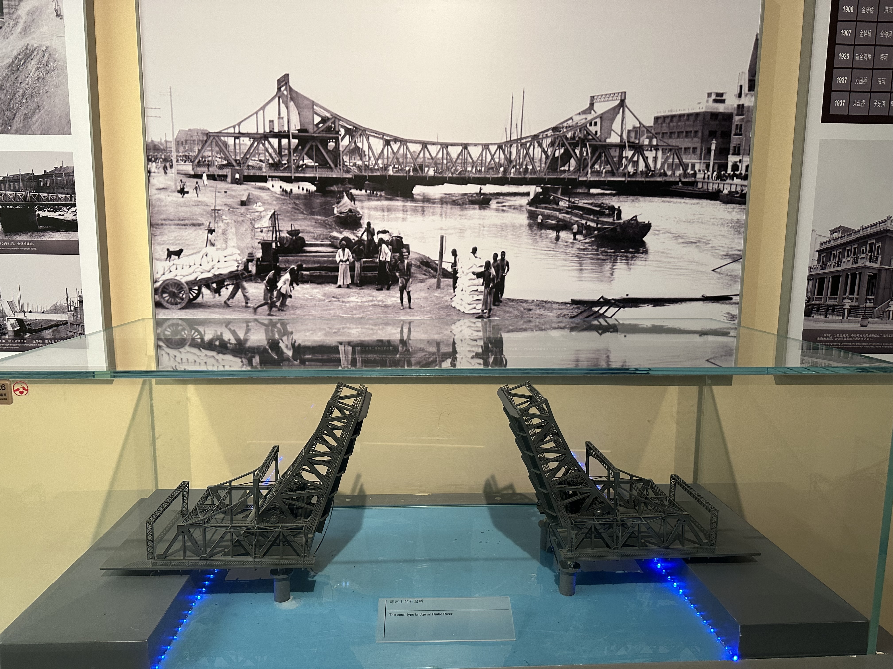

## 前言
`2025` 年的我已经无限接近 `30` 岁, 回顾最近几年, 好像一直忙于工作, 传统观念中的三十而立已至, 然而我的生活却毫无变化;

最近看到一句话, **人无法判断一个瞬间的价值, 直到它成为回忆**; 我无法确定这个瞬间是指什么, 但肯定不是指日复一日的敲代码, 也不是指每天上下班的路途, 或许我的生活 **缺少值得回忆的瞬间**, 我有点理解人为什么都期待旅行, 因为旅行可以使自己跳出物理生活圈, 感受旅途中的每一件事物, 或许这就是瞬间的价值;

> 如果人生是一场开放世界游戏, 那么旅行就是一个个支线任务, 它是感受游戏世界的绝佳机会

## 行程规划
- 酒店: 考虑到要去滨海区, 所以选择了 9 号线 附近, 并且最好是中转站, 所以选择了 *直沽* 附近, 附近的酒店是真贵啊, 普通的周末最便宜的房间三百多 😭
- 行程:
  - 天津站附近
  - 五大道
  - 海港公园
  - 天津博物馆

备忘录中的攻略截图:

实际走下来, 最值得去的是天津博物馆和意风区

## 启程
在周五晚从我所在的城市坐 🚄 出发, 可以到达天津, 虽然要中转, 但 3h 就能到, 所以其实天津是很近的

由于高铁晚点 `14 min`, 所以直到 `22:50` 才到 天津南站 🚉, 原本计划坐 `1h` 地铁, 但时间太晚了, 坐到营口道站就打车去了酒店, 到达酒店就已经 `23:50` 了

刚进门就发现门框快掉下来了, 真是毫不避讳, 然而我已经困得不行了 😴, 马上就休息了一下睡觉了

## 天津站附近
### 津湾广场
坐地铁到达 🚇 津湾广场站, 对岸就是天津站, 解放桥和世纪钟就是城市地标 😎

解放桥 / 海河 / 世纪钟

早期解放桥

这座风格独特、现代感极强的铁桥，出自法国建筑设计大师，巴黎艾菲尔铁塔的设计者居斯塔夫·埃菲尔之手

大沽桥下, 大爷们正在悠闲地钓鱼🎣

大光明桥夜景

天津是沿海河发展的, 所以桥特别多, 而且建造的非常精致, 当年这里是 9 国租界, 如今这里是我国直辖市, 北方第二城

### 意式风情区

意式风情区 🇮🇹 的一个路口, 商业化非常足, 路口处有天津工业展览馆, 电动三轮车为游客提供讲解服务, 这里可以坐三轮车的, 但我更喜欢步行 🚶

这里的商业化比较严重, 虽然有很多独特的建筑, 但我对建筑不是很感兴趣, 再放几张有意思的照片:

意大利兵营, 现在已经是纯粹的商业区了, 里面有各种餐饮店, 还有画室, 感觉商业化比较严重, 就没进去

充满意大利风情的雕像, 不明白为啥这么多人围着看

### 游泳大爷

<video controls width="100%" src="/static-videos/tianjin-swimming.MOV" type="video/quicktime"></video>

点击播放 ▶️, 据说冬天也会来游泳 🏊🏻

## 海港公园
海港公园是十年前大爆炸的核心区域, 互联网上几乎没有关于这个公园的介绍, 我为什么要来这里呢? 因为前段时间刷到了这个视频:

<video controls width="100%" src="/static-videos/tianjin-firefighter.mp4"></video>

这里不再描写当年 [大爆炸事故](https://baike.baidu.com/item/8%C2%B712%E5%A4%A9%E6%B4%A5%E6%BB%A8%E6%B5%B7%E6%96%B0%E5%8C%BA%E7%88%86%E7%82%B8%E4%BA%8B%E6%95%85/18370029) 的惨烈, 只放一张网图来对比过去和现在:

`2015` 年我还在上大学, 依稀记得 `QQ` 群里曾经传过一些爆炸的视频, 问了几个人都说不记得这件事了, 果然 **时间是一剂良药**, 互联网也是没有记忆的

现在的公园:

公园前广场, 海港公园

海港公园介绍, 没有任何关于大爆炸的记录

漫步在蜿蜒的小路 🚶, 非常解压, 路旁的草地中长满了黄色的小花朵

令人不解的是, 当年爆炸留下的建筑依然没有没拆掉, 不过后面的小区建筑非常干净整洁

天津地铁 9 号线的一辆车, 9 号线大部分路段都在地上

## 天津博物馆

天津博物馆非常值得一去, 展品质量都很高, 这里只放我感觉好看的部分照片 😁

早上 `9:00` 开馆, 还没开馆就已经排起了长队

镇馆之宝: [翡翠蝈蝈白菜](https://www.tjbwg.com/cn/collectionInfo.aspx?Id=2630), 看起来相当漂亮 👍🏻

镇馆之宝: [太保鼎](https://www.tjbwg.com/cn/collectionInfo.aspx?Id=2345), 鼎身高大、造型厚重、比例匀称, 铸造与西周时期, 是商周青铜器的典型代表

[翡翠缠枝菊花纹环耳扁盖瓶](https://www.tjbwg.com/cn/collectionInfo.aspx?Id=2673), 此瓶由一块大的翡翠料抛开制成一对, 淡翠绿色，间少许淡粉色，色泽均匀柔和，美丽晶莹。此瓶另一看点是工艺高超，雕琢精湛。盖有桃形钮，盖身及瓶两侧镂雕缠枝菊花纹，颈肩镂空花耳上各套一活环，瓶身光素，抛光匀细，椭圆圈足，足下附座，上阴线刻兽面纹。尤其是对花、叶纹饰采用镂雕技法，雕琢更为精细，颇具阿拉伯地域风格，这与翡翠晶莹璀璨的质感交相辉映，为这对高贵典雅的大瓶又增添了一种灵动之感

翡翠以其深稳凝重、变幻莫测的翠绿色和温润柔美的特性受到举国上下的喜爱，特别是以慈禧为代表的统治阶层的青睐，传说慈禧宁要翡翠饰物而不要金刚石头饰贡品，官员们则投其所好，选上等的翡翠进奉，以求名利，因此翡翠又有“皇家玉”、“玉王”之称。天津博物馆展出的这对翡翠大瓶用料为缅甸翡翠且成对保存至今非常难得。

`1860` 年, 英、法、俄强迫清政府签订了《北京条约》, 天津被迫辟为通商口岸; 英国、法国、美国、德国、日本、奥匈帝国、意大利、俄国、比利时等 9 国先后在天津强设了近 15 平方公里的租界地, 相当于天津旧城的8倍。一大批外国冒险家、传教士、富豪纷至沓来，营建洋行、银号、商店、花园、娱乐场、办公楼，开办仓储、航运、进出口贸易，建立医院、学校，盖洋房，造别墅、戏院

这身衣服惊艳到我了, 黑蓝配色的衣服非常独特, 古朴华贵

## 总结
- 非常推荐 **天津博物馆** 和 **意风区**, 受限于篇幅还有很多图片没有放上
- 天津大部分景点在海河边沿河分布, 例如各种 桥 / 摩天轮 🎡 / 租界区
- 个人感觉商业化有点严重, 但这不是问题
- 如果不想像我一样一天 2w 步, 可以预约 海河游船 / 双层观光巴士, 或乘坐 电动三轮车
