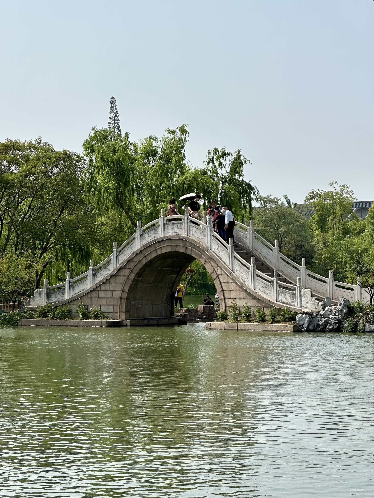
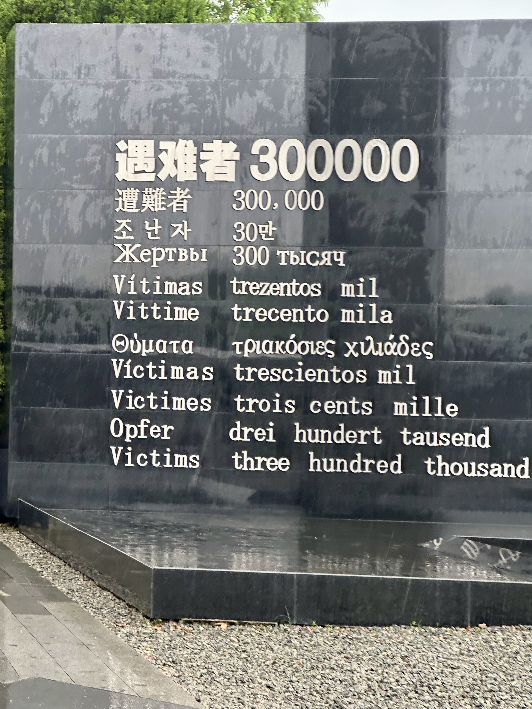
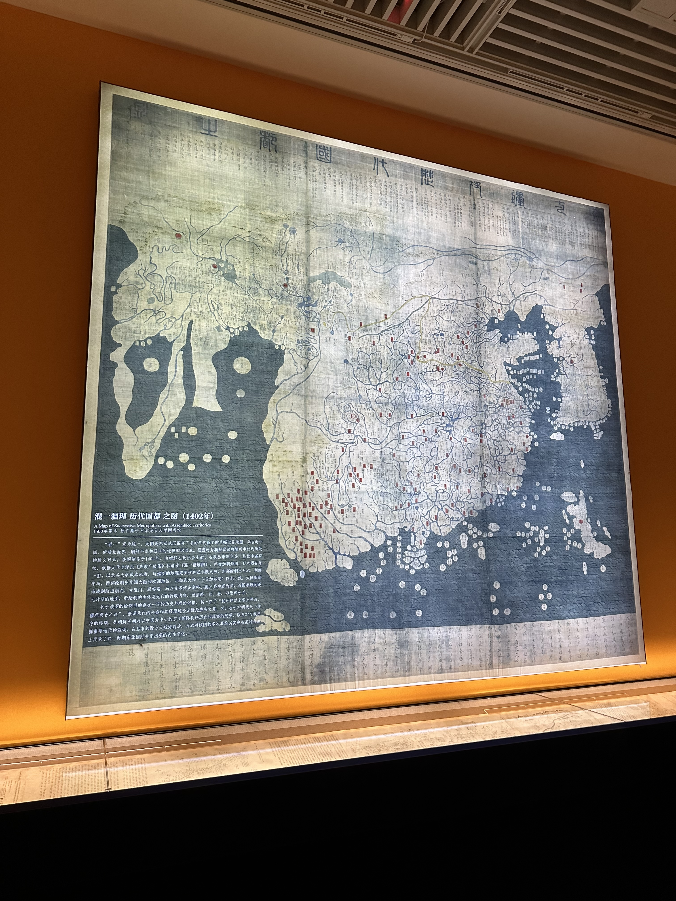

图为南京秦淮河畔平江桥夜景, 拍摄地为旁边的东元桥, <a href="https://surl.amap.com/1WXisGkd6qC" target="_blank">点击查看拍摄地</a>

## 前言
`2025` 年 `5` 月份, 我迎来了职业生涯最长的空窗期; 乐观来看, 这是难得的放松休息的机会, 但人是一种奇怪的动物, **当生活没有被日程填满时, 就会被焦虑反噬**; 除此之外, 还要面对大环境下的各种不确定性, 对当下的焦虑和对未知的恐惧情绪让我感觉必须出去走走了 😨

## 出游规划
`5` 月份迎来了夏天, 恰逢五一假期, 回想起经历过的节假日糟糕的出行体验, 我决定五一假期期间我就不出去了 🤔, 待假期结束就出发

在选择路线时, 我规划了两条路线:
- 郑州 ➡️ 西安
- 扬州 ➡️ 南京

这两条路线都很不错, 有我想去玩的地方, 例如很久之前我就刷到了 [▶️ 只有河南戏剧幻城](https://www.bilibili.com/video/BV1be4y167Hu/?share_source=copy_web&vd_source=d37db75e273dded1851145dc064395e4), 对于喜欢看舞台剧的人来说简直太有吸引力了, *虽然这次没去, 下次一定 😏*

最终我选择了扬州南京, 因为我更想去南京

## 行程规划

出发前做了各种规划, 基本按计划都完成了, 但应为天气原因和预约的原因有一部分没有完成, 后文细说

具体规划如下:
- 扬州
  - <a target="_blank" href="https://surl.amap.com/4Gh5sYDBcoK">中国大运河博物馆</a>
  - <a target="_blank" href="https://surl.amap.com/ucEumud1u2Dt">江泽民故居</a>
  - <a target="_blank" href="https://surl.amap.com/tWy9jq91beCt">瘦西湖景区</a>
  - <a target="_blank" href="https://surl.amap.com/uorntoVSb0G">东关街</a>
- 南京
  - <a target="_blank" href="https://surl.amap.com/9PUJVhUe4s">侵华日军南京大屠杀遇难同胞纪念馆</a>
  - <a target="_blank" href="https://surl.amap.com/6NGE1cY0L1EH">秦淮河</a>
  - <a target="_blank" href="https://surl.amap.com/1blzNSJkgqi">南京博物院</a>
  - <a target="_blank" href="https://surl.amap.com/eeqQTI192OH">中山陵</a>
  - <a target="_blank" href="https://surl.amap.com/D3gSOHK4OB">灵谷景区</a>

## 扬州
在去扬州之前, 能想到的关于扬州的东西可能就只有江南园林和扬州炒饭 🍚 了, 但在历史上, 扬州是古九州之一, 因其重要的地理位置和优越的自然环境, 在历朝历代几乎都是繁华的工商业城市

### 大运河

在古代漕运是非常重要的物资运输方式, 漕粮更是国家战略物资

扬州地处大运河的重要节点, 图中可以看到重要的港口城市如今都已衰落, 主要原因如下:
- 黄河改道导致运河山东段逐渐淤废
- 现在海运和铁路运输非常发达

江南丝织业发达, 图为丝锦龙袍和龙泉窑碎片

镇水文化历史悠久, 图为三神石人, 为开凿都江堰的李冰, 被古人奉为水神

大运河博物馆楼顶, 视野开阔, 可以看到整个扬州市区, 右侧的阁楼需付费购票进入, 以下是楼顶的视角

大运河博物馆旁边就是古运河, 近处的桥为剪影桥

古运河中的游船

### 瘦西湖

瘦西湖是扬州著名景点, 随处都有江南水乡的意境, 只是门票略贵, 白天 💰 100, 晚上更贵

瘦西湖名称的来历，是乾隆年间寓居扬州的诗人汪沆的一首感慨富商挥金如土的诗作:“ **垂柳不断接残芜，雁齿红桥俨画图；也是销金一锅子，故应唤作瘦西湖。**”

图为二十四桥, 唐代诗人杜牧有流传千古代诗篇《寄扬州韩绰判官》：“**青山隐隐水迢迢，秋尽江南草未凋。二十四桥明月夜，玉人何处教吹箫？**”

徐园门外深情对望的狮子 🦁

极速前进的小鸭子

### 江泽民故居
由于江老的名字是敏感字, 所以在小红书上搜索不到任何帖子, 在抖音上也只能搜到一模一样的重复的文案, 很少有介绍如何预约的文章

等我找到预约方式时, 就只能预约下周的了, 所以很遗憾 😭 没有去成

预约方式为: 微信小程序直接搜索以上关键字, 进入小程序, 并且至少提前一周预约, 根据预约须知, **内部不能拍照**, 地址在 <a target="_blank" href="https://surl.amap.com/ucEumud1u2Dt">东关街附近</a>

## 南京
都说 **一座南京城, 半部民国史**, 也有 **南京是亡国之都** 的说法, 南京城也是六朝古都, 十朝都会, 但近代民国时期的国力孱弱和战争历程, 也使得我们每每提到南京时, 都会想到它的波折跌宕的历史

### 梧桐树

南京城区的梧桐树, 南京真的路边都是梧桐树, 当然最好看的还是 [🔗 梧桐大道](https://www.xiaohongshu.com/discovery/item/66f95b7c000000002c02b175?source=webshare&xhsshare=pc_web&xsec_token=AB00WqJT3cPVryPYMkcepvokr8l_4NM85PI2XvweozYqE=&xsec_source=pc_share), 位于 [钟山风景区南京梧桐大道](https://surl.amap.com/cd0W8OoL4rK)

### 侵华日军南京大屠杀遇难同胞纪念馆
在南京这片土地上, 发生过惨绝人寰的南京大屠杀, 这对南京人乃至中华民族来说都是一段痛苦沉痛的记忆, 但我们尊重历史, 也尊重遇难同胞, 所以我们在 1985 年 江东门集体屠杀遗址和万人坑遗址上建起了这座纪念馆, 以告慰遇难同胞, 在展示大屠杀的残酷血腥的同时, 也向全世界展示了我们珍爱和平, 维护和平的决心

#### 时间线
- 1937 年 8 月 13 日, 日军进攻上海, 中国军队顽强抵抗了三个月才攻破沿岸地区, 也就是惨烈的 [淞沪会战](https://zh.wikipedia.org/wiki/%E6%B7%9E%E6%B2%AA%E4%BC%9A%E6%88%98)
- 1937 年 11 月中旬, 日军决定进攻首都南京 
- 1937 年 11 月 20 日，蒋介石任命唐生智为南京卫戍司令官, 固守南京
- 1937 年 12 月 8 日，日军全面占领南京外围阵地
- 1937 年 12 月 13 日, 南京沦陷, 日军开始了惨无人道的大屠杀, 日军犯下了一系列罄竹难书的反人类罪行, 持续 6 周以上

#### 雕塑

图为雕塑 《家破人亡》, 充满了绝望与无助

#### 公祭广场

使用 11 种文字展示的 `遇难者 30 万`

#### 馆内
馆内展品很多, 让人感觉心情特别沉重, 只拍了很少的一部分:

南京保卫战部分殉国将士名录

#### 馆外

图为和平雕像

<video controls width="100%" src="/static-videos/nanjing-history.mp4" type="video/quicktime"></video>

南京下起了大雨, 我在雨中参观了遇难同胞纪念馆

### 南京博物院
<video controls width="100%" src="/static-videos/nanjing-yangzhou-horse.mp4" type="video/quicktime"></video>

博物院内的网红🐴 太抽象了

### 钟山风景区
钟山风景区非常大, 包含了: 明孝陵 / 美龄宫 / 中山陵 / 灵谷景区 等, 由于时间关系我只去了 [中山陵](#中山陵) 和 灵谷景区

#### 行程
🚌 乘坐观光车 1 号线 从 🚇 苜蓿园站 前往 中山陵南站, <a href="https://surl.amap.com/3bbYa051hcqi" target="_blank">点击查看路线</a>

🚌 乘坐观光车 4 号线 到达灵谷景区, <a href="https://surl.amap.com/2uICGHz1efcx" target="_blank">点击查看路线</a>

> 💡 注意: 景区观光车 💰 10 块一次, 包天 💰 30 块, 建议根据导航优先乘坐普通公交车

### 中山陵
中山陵是孙中山先生的陵墓, 孙先生逝世后国民政府遵照他的遗愿在南京为其修建陵墓, 中山陵吸取中国古代陵墓的对称布局，利用墓道和台阶将主要建筑连为轴线，并布置大片绿地，将陵墓建筑群联接成与背景山势相称的宏大整体。陵墓主体建筑采用中国古典宫殿式建筑的大屋顶造型，应用西方建筑的设计和建造技术，以肃穆的蓝白色调和严谨的建筑构型表现出沉静恢弘的气度，被认为是中国近现代建筑史上融合中西的经典作品

图为前往中山陵的路上, 没想到避开了节假日和周末, 还是没有避开学生和老年团 😭, 人还是很多

图为博爱坊 [📌](https://surl.amap.com/6EHlcHcc1j5RM), 中门横楣上的石额刻有孙中山手书的“博爱”二个鎏金大字

图为陵门 [📌](https://surl.amap.com/z09D1djjd86), 陵门是中山陵的正门, 处于中山陵中轴线正中, “天下为公”出自《礼记·礼运》之“大道之行也，天下为公。” **孙中山将“天下为公”借用为对“民权主义”的解释，说明政权为广大平民所共有**, 这一思想对于近代中国的思想观念的转变具有重要意义

图为碑亭 [📌](https://surl.amap.com/cx3Tr0p1c4ZH), “中国国民党葬 总理孙先生于此 中华民国十八年六月一日”，由谭延闿以颜体书写

#### 祭堂
祭堂位于中山陵最顶部

门楣上方的额枋上从东到西分别为张静江所书写的“民族”、“民权”、“民生”六个篆书金字，代表国父孙中山创立的三民主义的三个组成部分。正中间的民生门略大，上下重檐之间嵌有直额，上刻有孙中山所题“天地正气”四个金字

祭堂内部需要从右侧排队进入参观

在祭堂顶部眺望南京城区

在祭堂顶部俯瞰陵门

#### 孙中山纪念馆

### 灵谷景区
#### 灵谷胜境

#### 阵亡将士公墓牌坊

#### 无梁殿

该殿建于洪武十四年（1381年），原为灵谷寺内供奉无量寿佛的无量殿，因为整座建筑采用砖砌拱券结构、不设木梁，因此又称“无梁殿”。民国二十一年（1931年），国民政府将无梁殿改建为国民革命军阵亡将士公墓的祭堂，命名为“正气堂”

#### 淞沪抗战阵亡将士纪念碑

图为第十九路军淞沪抗战阵亡将士纪念碑, 第十九路军是一支粤军, 淞沪抗战在淞沪会战之前, 第十九路军也是首个与日军全面对抗的中国军队, 以几乎全军覆没为代价抵抗了日军多次进攻

图为第五军淞沪抗战阵亡将士纪念碑, 1月30日，中国国民政府宣布迁都洛阳，蒋通电抗日，并派精锐之第五军增援上海

### 秦淮河

## 参考
- [京杭大运河 - wikipedia](https://zh.wikipedia.org/wiki/京杭大运河)
- [中山陵 - wikipedia](https://zh.wikipedia.org/wiki/%E4%B8%AD%E5%B1%B1%E9%99%B5#%E7%A2%91%E4%BA%AD)
- [灵谷寺无梁殿 - wikipedia](https://zh.wikipedia.org/wiki/%E7%81%B5%E8%B0%B7%E5%AF%BA%E6%97%A0%E6%A2%81%E6%AE%BF)
