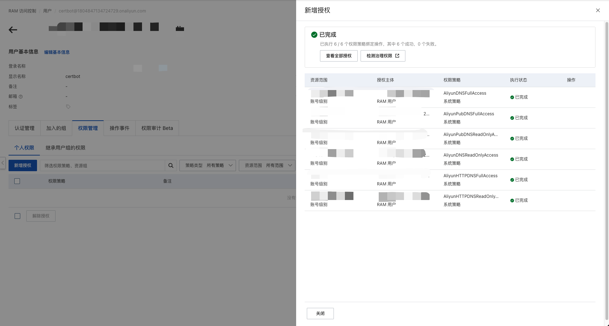
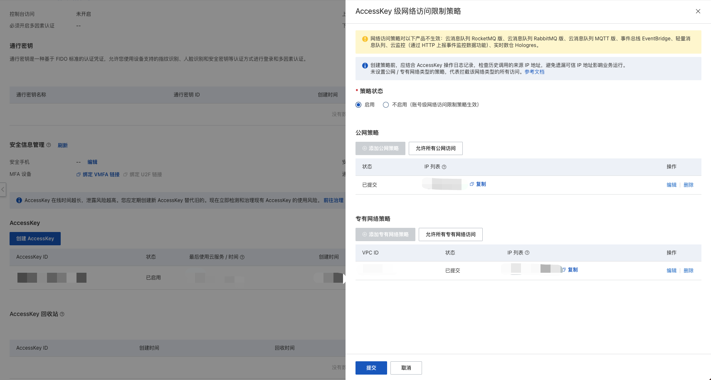
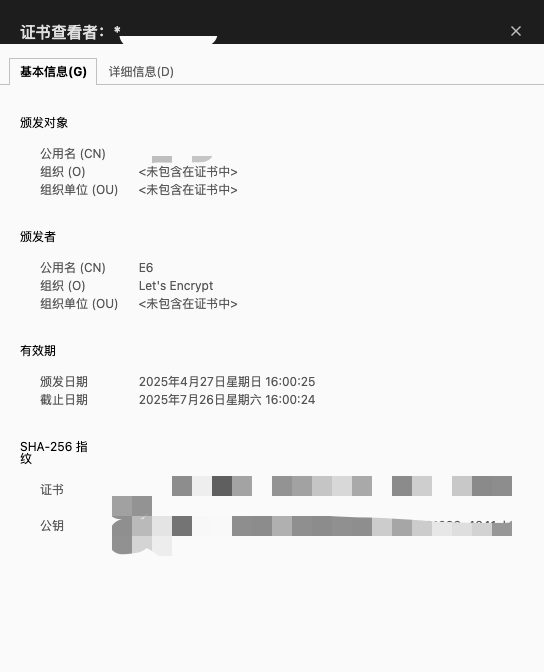

现在阿里云的免费证书有效期只有 3 个月, 过期之后还要重新签发 😡, 所以我开始尝试寻找免费可自动续签的证书服务, 就是使用 [Certbot](https://github.com/certbot/certbot) 配置 [Let's Encrypt](https://letsencrypt.org/zh-cn/) 免费证书

## 介绍

### Let's Encrypt

[Let's Encrypt](https://letsencrypt.org/zh-cn/): 这是一个由非营利性组织互联网安全研究小组（`ISRG`）提供的免费、自动化和开放的证书颁发机构。它为众多网站提供 `TLS` 证书，其免费证书的签发/续签可以通过脚本自动化完成, **简而言之就是可以免费一直用**

### certbot
[Let's Encrypt](https://letsencrypt.org/zh-cn/) 使用 `ACME` 协议来验证您对给定域名的控制权并向您颁发证书。 要获得 [Let's Encrypt](https://letsencrypt.org/zh-cn/) 证书，您需要选择一个使用 ACME 客户端软件, 而 [Certbot](https://github.com/certbot/certbot) 就是 [Let's Encrypt](https://letsencrypt.org/zh-cn/) 推荐的客户端

## 安装 cerbot
:::tip
服务器环境为 `Ubuntu 22.04`
:::

```bash
sudo snap install --classic certbot
# sudo apt-get install certbot # 或者使用 apt 安装
```

## 安装 aliyun cli
```bash
wget https://aliyuncli.alicdn.com/aliyun-cli-linux-latest-amd64.tgz
tar xzvf aliyun-cli-linux-latest-amd64.tgz
sudo cp aliyun /usr/local/bin
rm aliyun
```

## 配置 aliyun cli
1. 创建 `RAM` 用户, 参考 [创建 RAM 用户的 AccessKey](https://help.aliyun.com/zh/ram/user-guide/create-an-accesskey-pair?spm=a2c4g.11186623.0.0.50e633afOaV9gV#title-ebf-nrl-l0i)
2. 点击 *权限管理* -> *新增授权*, 为 `RAM` 用户添加 `DNS` 解析相关的权限(可在权限列表中搜索 `DNS`)



3. 点击 *认证管理* -> *AccessKey*, 创建 `AccessKey`
4. 配置 `AccessKey` 的网络访问权限


5. 执行 aliyun configure

```bash
aliyun configure
Configuring profile 'default' in 'AK' authenticate mode...
Access Key Id [*********************SQK]:
Access Key Secret [***************************LJL]:
Default Region Id [cn-hangzhou]:
Default Output Format [json]: json (Only support json)
Default Language [zh|en] zh:
Saving profile[default] ...Done.

Configure Done!!!
..............888888888888888888888 ........=8888888888888888888D=..............
...........88888888888888888888888 ..........D8888888888888888888888I...........
.........,8888888888888ZI: ...........................=Z88D8888888888D..........
.........+88888888 ..........................................88888888D..........
.........+88888888 .......Welcome to use Alibaba Cloud.......O8888888D..........
.........+88888888 ............. ************* ..............O8888888D..........
.........+88888888 .... Command Line Interface(Reloaded) ....O8888888D..........
.........+88888888...........................................88888888D..........
..........D888888888888DO+. ..........................?ND888888888888D..........
...........O8888888888888888888888...........D8888888888888888888888=...........
............ .:D8888888888888888888.........78888888888888888888O ..............
```

>[!TIP]
输出最后的阿里云 `logo` 图案表示配置成功

## 安装 certbot-dns-aliyun 插件
::github{repo="justjavac/certbot-dns-aliyun"}

```bash
wget https://cdn.jsdelivr.net/gh/justjavac/certbot-dns-aliyun@main/alidns.sh
sudo cp alidns.sh /usr/local/bin
sudo chmod +x /usr/local/bin/alidns.sh
sudo ln -s /usr/local/bin/alidns.sh /usr/local/bin/alidns
rm alidns.sh
```

## 申请证书

### 测试是否能正确申请证书

```bash
certbot certonly -d "*.example.com" --manual --preferred-challenges dns --manual-auth-hook "alidns" --manual-cleanup-hook "alidns clean" --dry-run

The following error was encountered:
[Errno 13] Permission denied: '/var/log/letsencrypt/.certbot.lock'
Either run as root, or set --config-dir, --work-dir, and --logs-dir to writeable paths.
Ask for help or search for solutions at https://community.letsencrypt.org. See the logfile /tmp/certbot-log-4krk5x0b/log or re-run Certbot with -v for more details.
```

>[!TIP]
把 `example.com` 替换为实际的域名

这里我们使用的是非 `root` 用户, 所以是没有 `/var/log/letsencrypt` 的访问权限的, 所以我们根据提示信息配置生成的目录:

```bash
certbot certonly -d "*.example.com" --config-dir $HOME/.certbot/config --work-dir $HOME/.certbot/work --logs-dir $HOME/.certbot/logs --manual --preferred-challenges dns --manual-auth-hook "alidns" --manual-cleanup-hook "alidns clean" --dry-run
Saving debug log to /home/admin/.certbot/logs/letsencrypt.log
Enter email address or hit Enter to skip.
 (Enter 'c' to cancel):

- - - - - - - - - - - - - - - - - - - - - - - - - - - - - - - - - - - - - - - -
Please read the Terms of Service at:
https://letsencrypt.org/documents/LE-SA-v1.5-February-24-2025.pdf
You must agree in order to register with the ACME server. Do you agree?
- - - - - - - - - - - - - - - - - - - - - - - - - - - - - - - - - - - - - - - -
(Y)es/(N)o: Y
Account registered.
Simulating a certificate request for *.example.com
Hook '--manual-auth-hook' for example.com ran with output:
 {
 	"RecordId": "1234",
 	"RequestId": "5678"
 }
Hook '--manual-cleanup-hook' for example.com ran with output:
 {
 	"RecordId": "1234",
 	"RequestId": "5678"
 }
The dry run was successful.
```

其中 `~/.certbot/config` 是存放证书和私钥的目录, 请按照实际情况进行修改

>[!TIP]
此命令申请的是 `*.example.com` 的证书, 如需同时申请顶级域名或其他 **多个域名的证书**, 可以增加 `-d example.com` 参数生成, 并增加 `--cert-name` 指定生成的目录(因为生成顶级域名和子域域名证书时, 生成的目录名可能重复, 此时会生成例如 `example.com-0001` 的目录名)


### 正式申请证书
把 `--dry-run` 参数去掉就可以申请到证书了, 只要有 `--dry-run` 参数时执行成功, 就可以正确生成证书了

最终的命令如下:

```bash
# 1. 申请顶级域名的证书
certbot certonly -d "example.com" --cert-name "example.com" --config-dir $HOME/.certbot/config --work-dir $HOME/.certbot/work --logs-dir $HOME/.certbot/logs --manual --preferred-challenges dns --manual-auth-hook "alidns" --manual-cleanup-hook "alidns clean"

# 2. 申请一级子域名通配符证书
certbot certonly -d "*.example.com" --cert-name "all.example.com" --config-dir $HOME/.certbot/config --work-dir $HOME/.certbot/work --logs-dir $HOME/.certbot/logs --manual --preferred-challenges dns --manual-auth-hook "alidns" --manual-cleanup-hook "alidns clean"
```

### 证书续期
```bash
certbot renew --manual --config-dir $HOME/.certbot/config --work-dir $HOME/.certbot/work --logs-dir $HOME/.certbot/logs --preferred-challenges dns --manual-auth-hook "alidns" --manual-cleanup-hook "alidns clean"
Saving debug log to /home/admin/.certbot/logs/letsencrypt.log

- - - - - - - - - - - - - - - - - - - - - - - - - - - - - - - - - - - - - - - -
Processing /home/admin/.certbot/config/renewal/all.example.com.conf
- - - - - - - - - - - - - - - - - - - - - - - - - - - - - - - - - - - - - - - -
Certificate not yet due for renewal

- - - - - - - - - - - - - - - - - - - - - - - - - - - - - - - - - - - - - - - -
Processing /home/admin/.certbot/config/renewal/example.com.conf
- - - - - - - - - - - - - - - - - - - - - - - - - - - - - - - - - - - - - - - -
Certificate not yet due for renewal

- - - - - - - - - - - - - - - - - - - - - - - - - - - - - - - - - - - - - - - -
The following certificates are not due for renewal yet:
  /home/admin/.certbot/config/live/all.example.com/fullchain.pem expires on 2025-07-26 (skipped)
  /home/admin/.certbot/config/live/example.com/fullchain.pem expires on 2025-07-26 (skipped)
No renewals were attempted.
- - - - - - - - - - - - - - - - - - - - - - - - - - - - - - - - - - - - - - - -
```

### 配置定时自动续期

```bash
crontab -e
```

```bash
# certbot renew
1 1 */1 * * bash -l -c 'source /home/admin/.profile && certbot renew --manual --config-dir $HOME/.certbot/config --work-dir $HOME/.certbot/work --logs-dir $HOME/.certbot/logs --preferred-challenges dns --manual-auth-hook "alidns" --manual-cleanup-hook "alidns clean" --deploy-hook "sudo nginx -s reload"'
```

这里我用的是 `admin` 用户, 而不是 `root`, 所以 `source /home/admin/.profile` 是为了加载 `admin` 用户的环境变量

### 配置 nginx
配置一下 `nginx` 配置文件, 创建一个软连接将指定域名的证书文件链接到我们生成的证书目录下

```bash
server {
  listen 443 ssl;
  server_name example.com;
  charset utf-8;

  ###### certbot START ########
  #填写证书文件绝对路径
  ssl_certificate conf.d/certbot/example.com/fullchain.pem;
  #填写证书私钥文件绝对路径
  ssl_certificate_key conf.d/certbot/example.com/privkey.pem;
  ###### certbot END ########

	ssl_session_cache shared:SSL:1m;
	ssl_session_timeout 5m;

	#自定义设置使用的TLS协议的类型以及加密套件（以下为配置示例，请您自行评估是否需要配置）
	#TLS协议版本越高，HTTPS通信的安全性越高，但是相较于低版本TLS协议，高版本TLS协议对浏览器的兼容性较差。
	ssl_ciphers ECDHE-RSA-AES128-GCM-SHA256:ECDHE:ECDH:AES:HIGH:!NULL:!aNULL:!MD5:!ADH:!RC4;
	ssl_protocols TLSv1.1 TLSv1.2 TLSv1.3;

	#表示优先使用服务端加密套件。默认开启
	ssl_prefer_server_ciphers on;

  # example.com => blog.example.com
  rewrite ^/(.*)$ https://blog.example.com/$1 permanent;
}
```

其中 `ssl_certificate` 是证书文件路径, `ssl_certificate_key` 是证书私钥文件路径

```bash
sudo ln -s /home/admin/.certbot/config/live/example.com /etc/nginx/conf.d/certbotexample.com/
sudo ln -s /home/admin/.certbot/config/live/all.example.com /etc/nginx/conf.d/certbot/allexample.com
```
>[!TIP]
这里根据实际情况进行配置, 以上路径只是实例

最后在浏览器中查看证书信息:



如果颁发者组织是 `Let's Encrypt`, 表示配置成功 🎉

## 参考
- [Certbot](https://github.com/certbot/certbot)
- [Let's Encrypt](https://letsencrypt.org/zh-cn/)
- [ACME 客户端](https://letsencrypt.org/zh-cn/docs/client-options/)
- [使用Let's Encrypt 申请通配符证书](https://juejin.cn/post/7383263356184641573)
- [certbot-dns-aliyun](https://github.com/justjavac/certbot-dns-aliyun)

