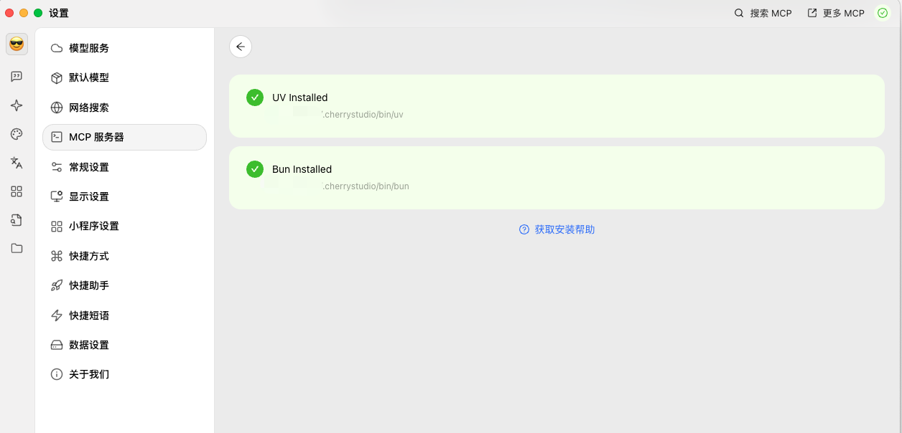
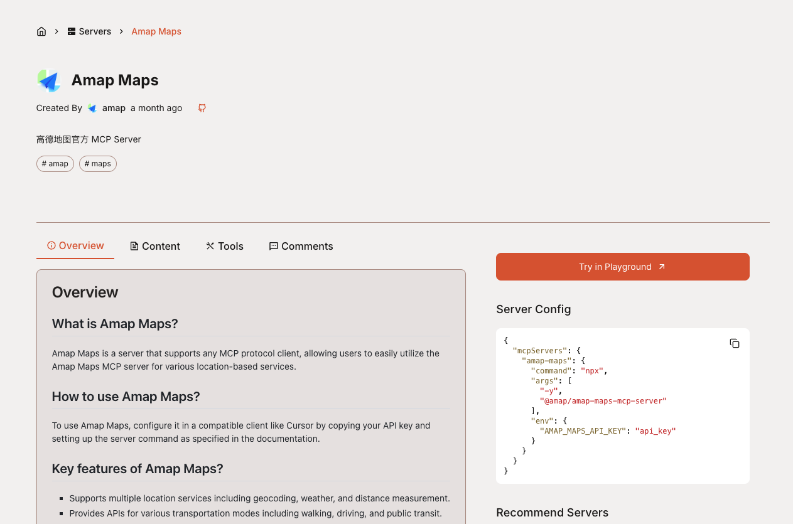
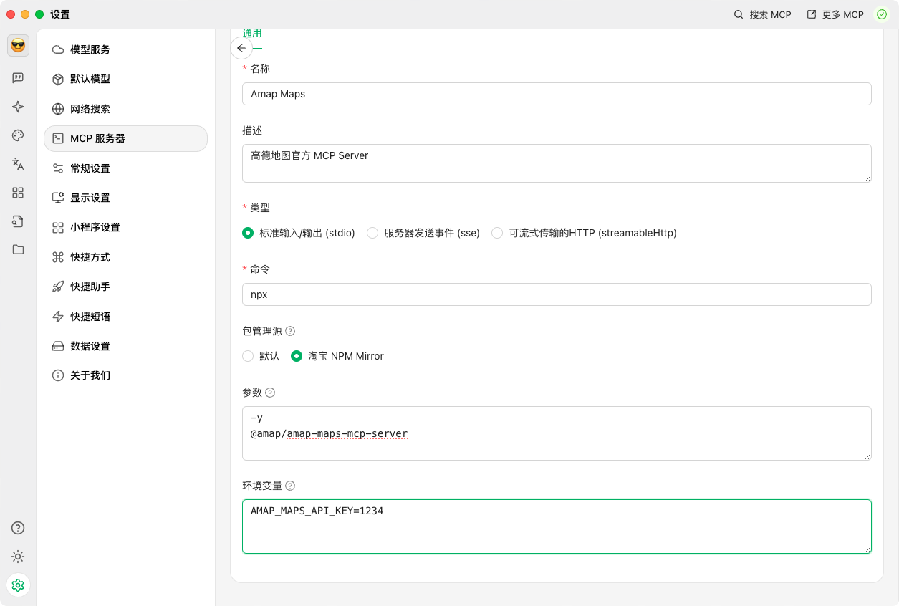
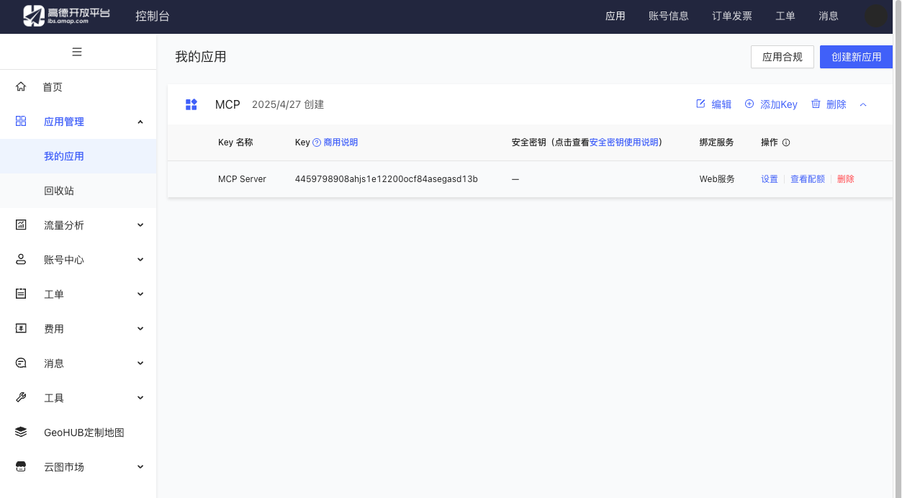
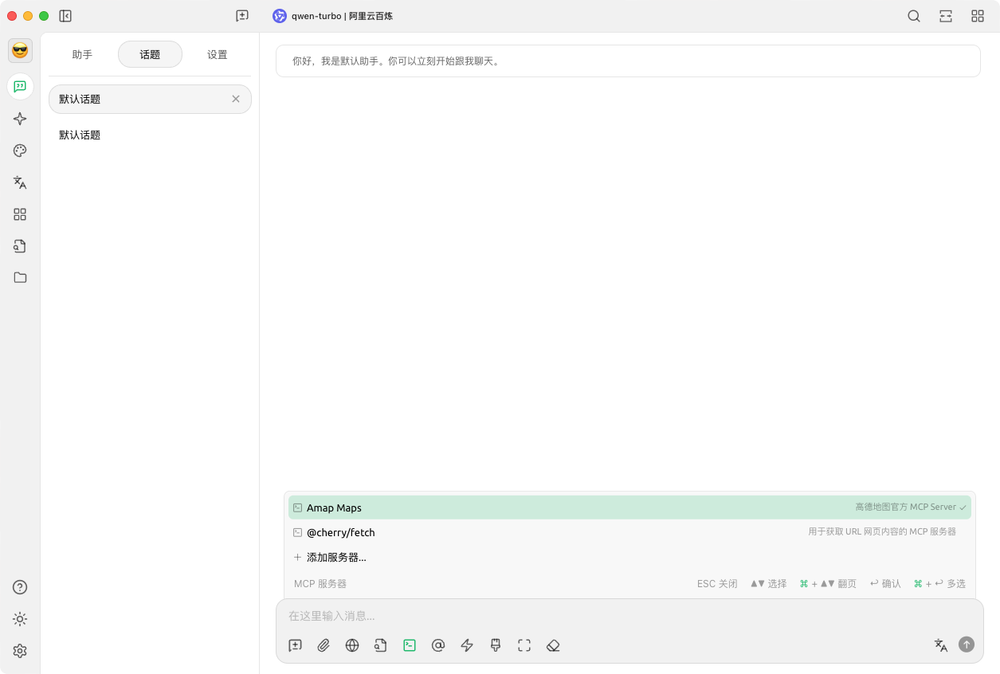
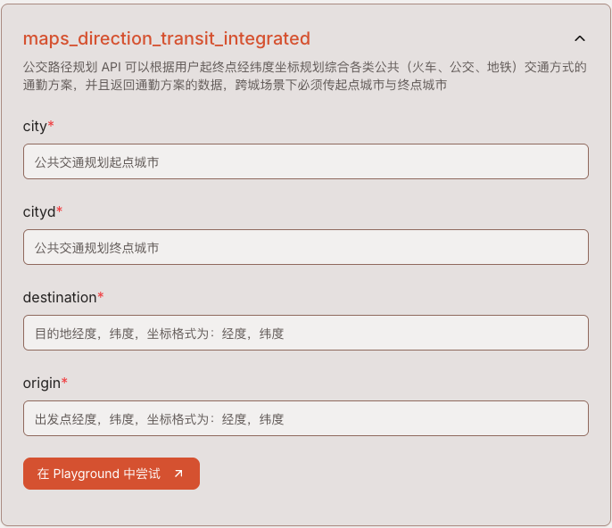

## 前言
在 `LLM` 被普遍使用的今天, `MCP` 大大提升了 `LLM` 的实用性和本地化操作的能力, 本文将介绍如何基于 [Cherry Studio](https://cherry-ai.com/) 来体验 `MCP` 的强大能力

其实在选择支持 `MCP` 的客户端时, 我更加倾向于使用 `vscode`, 因为它使用的是 `Github Copilot`, 而且已经 [在最新版对 `MCP` 进行了支持](https://code.visualstudio.com/blogs/2025/04/07/agentMode), 但 `vscode` 需要付费才能自定义使用的模型, 所以我选择了更加通用的免费的 [Cherry Studio](https://cherry-ai.com/), 当然现阶段还有其他的支持 `MCP` 的客户端, 这里我选择了 [Cherry Studio](https://cherry-ai.com/)

## 安装
### Cherry Studio
直接从 [download page](https://cherry-ai.com/download) 下载

然后需要创建 `~/.cherrystudio/bin` 目录, 用于存放 `bun` / `uv` / `uvx`, 这是 `Cherry Studio` `MCP` 服务所需的依赖, 可参考 [官方文档](https://docs.cherry-ai.com/advanced-basic/mcp/install)

```bash
mkdir -p ~/.cherrystudio/bin
```

官方只使用 `~/.cherrystudio/bin` 中的 `bun` / `uv` / `uvx`, 而不是全局的 `bun` / `uv` / `uvx`, 这很令人不解, 这里选择手动全局安装, 然后软连接到 `~/.cherrystudio/bin`, 下面将介绍如何安装及配置这些依赖

### bun
> 我是 `MacOS` 和 `fish shell`, 以下命令适用于我的环境, 下文不再赘述; 
> 其他系统安装参考官方页面 [installation - bun](https://bun.sh/docs/installation)

```bash
curl -fsSL https://bun.sh/install | bash # for macOS, Linux, and WSL
source ~/.config/fish/config.fish # 重新载入环境变量
sudo ln -s $(which bun) ~/.cherrystudio/bin/bun # 将 bun 软链接到 ~/.cherrystudio/bin/bun
```

### uv
> 其他系统安装参考官方页面 [installation - uv](https://docs.astral.sh/uv/getting-started/installation/)

```bash
curl -LsSf https://astral.sh/uv/install.sh | sh
source $HOME/.local/bin/env.fish # 重新载入环境变量
sudo ln -s $(which uv) ~/.cherrystudio/bin/uv
sudo ln -s $(which uvx) ~/.cherrystudio/bin/uvx
```

### 检查 mcp 安装
进入 *设置* -> *MCP 服务器*



## 使用 MCP
### 添加 MCP 服务
这里我们以 [高德地图官方的 MCP Server](https://mcp.so/server/amap-maps/amap) 为例:

1. 进入 [Amap Maps - mcp.so](https://mcp.so/server/amap-maps/amap)
2. 找到 **服务器配置**, 按照配置中的 `command` / `args` / `env` 创建 *MCP 服务器*




3. 进入 [高德地图开放平台控制台](https://console.amap.com/), 进入 *应用管理* -> *创建新应用*, 服务平台选择 *Web 平台*, 然后在 *我的应用* 中找到 *Key*, 并复制到 `Cherry Studio` 中新创建的 *高德地图* 服务中


4. 点保存并启用
5. 新建聊天并选择我们刚创建的 `Amap Maps` 服务



<video controls>
  <source src="/static-videos/cherry-studio-amap-test.mp4" type="video/mp4">
</video>

翻车了朋友们 😓, 天津南站明明有地铁站, 竟然让我步行到下瓦房站; 在查看 高德地图的 `tools` 时发现, 大模型没有调用 `maps_geo`, 正确的调用方式应该是:

1. 调用 `maps_gep`, 获取起点和终点的准确经纬度
2. 调用 `maps_direction_transit_integrated`, 传入起点和终点经纬度, 获取行程信息
3. 调用 `maps_around_search` 获取周边酒店信息



> [!TIP]
看来 `LLM` 的能力才是最基本的, 一个好的模型才能发挥 `MCP` 的能力, 这里我用的是 `qwen-turbo`, 属实拉胯

## 参考
- [Cherry Studio](https://cherry-ai.com/)
- [installation - uv](https://docs.astral.sh/uv/getting-started/installation/)
- [installation - bun](https://bun.sh/docs/installation)
