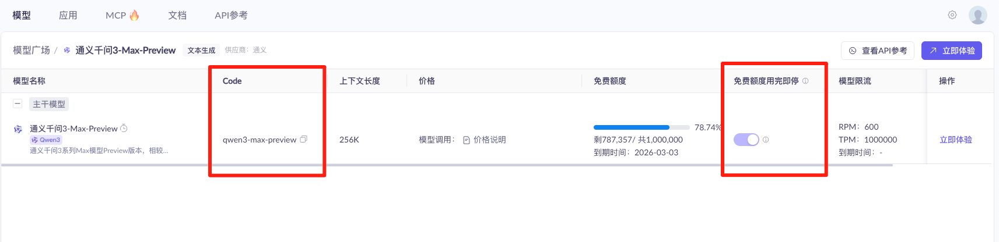
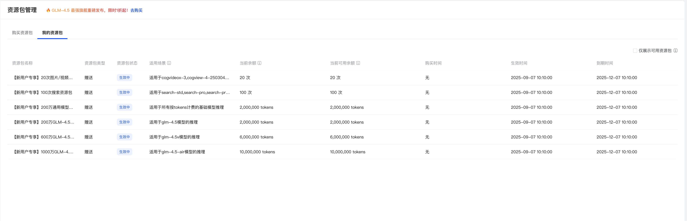
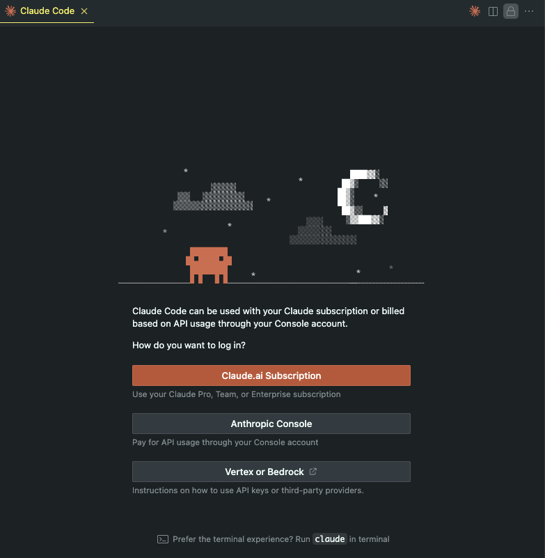
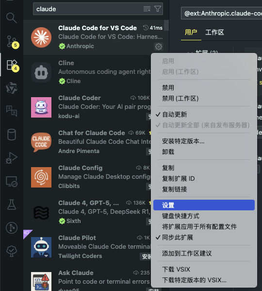
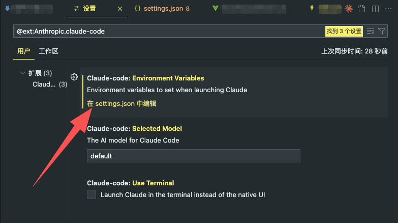
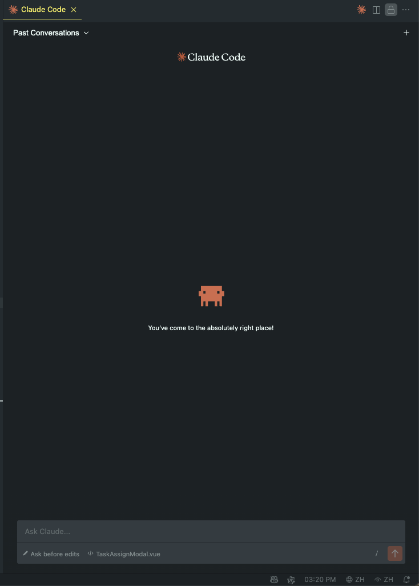

本文将介绍最近爆火的 `Claude Code` **在国内环境的使用**, 包括安装与配置, 以及如何 **接入国产模型 <a href="https://www.bigmodel.cn/claude-code?cc=fission_glmcode_sub_v1&ic=Q2N8XA4W77&n=a****3" target="_blank">智谱 GLM</a>**

> `2025-09-05`, `Anthropic` 发布了一篇公告: [更新对不受支持地区的销售限制](https://www.anthropic.com/news/updating-restrictions-of-sales-to-unsupported-regions), 将中国定义为敌对国家, 并且不再为中国公司(包含超过 50% 所有权的中国公司的子公司)提供服务
> 
> 这意味着 **在未来我们使用 `Claude` 服务的难度将越来越大**

> [!TIP]
> 如果想要获得最好的 `Vibe Coding` 体验, 推荐购买 <a href="https://www.bigmodel.cn/claude-code?cc=fission_glmcode_sub_v1&ic=Q2N8XA4W77&n=a****3" target="_blank">🔗 GLM Coding Lite</a> 服务, 包月只要 20 💰, `Lite` 版本的按 `Prompt` 计费, 每 `5` 小时最多约 `120` 次 `prompts`, 原因如下:
> - `Claude Code` 消耗的 `token` 非常多(我现在一个月已经消耗了 `3` 亿多 `tokens` 💪), 如果按 `token` 消耗量计费会非常贵, 使用包月套餐可以无需担心消耗的 `token` 数量, 专注于 `Vibe Coding`
> - `Claude Code` 是 `Anthropic` 推出的工具, 自然与 `Claude` 系列模型支持度最好, 其他大模型与 `Claude Code API` 不兼容, 也没有对 `Claude Code` 进行优化, 这也是 `@musistudio/claude-code-router` 库存在的意义; **<a href="https://www.bigmodel.cn/claude-code?cc=fission_glmcode_sub_v1&ic=Q2N8XA4W77&n=a****3" target="_blank">GLM Coding Lite</a> 专门提供了 `Claude Code` 的 `API`**


## vibe coding
最近有个一很火的概念: `Vibe Coding`, 直译过来就是 **氛围编程**, `Vibe Coding` 的概念出自 `Andrej Karpathy`(前特斯拉人工智能总监, `OpenAI` 的创始成员之一) 的一条推文:


> There's a new kind of coding I call "vibe coding", where you fully give in to the vibes, embrace exponentials, and forget that the code even exists. It's possible because the LLMs (e.g. Cursor Composer w Sonnet) are getting too good. Also I just talk to Composer with SuperWhisper so I barely even touch the keyboard. I ask for the dumbest things like "decrease the padding on the sidebar by half" because I'm too lazy to find it. I "Accept All" always, I don't read the diffs anymore. When I get error messages I just copy paste them in with no comment, usually that fixes it. The code grows beyond my usual comprehension, I'd have to really read through it for a while. Sometimes the LLMs can't fix a bug so I just work around it or ask for random changes until it goes away. It's not too bad for throwaway weekend projects, but still quite amusing. I'm building a project or webapp, but it's not really coding - I just see stuff, say stuff, run stuff, and copy paste stuff, and it mostly works.

> 有一种新的编程方式，我称之为“氛围编程”，在这种编程中，你完全沉浸在大脑波中，拥抱指数增长，甚至忘记代码的存在。这是可能的，因为大型语言模型（例如Cursor Composer w Sonnet）变得越来越出色。此外，我只需用SuperWhisper与Composer交谈，几乎都不用碰键盘。我会要求一些愚蠢的事情，比如“将侧边栏的填充减少一半”，因为我懒得去找。我总是“全部接受”，不再阅读差异了。当收到错误信息时，我只是复制粘贴，通常这样就能解决问题。代码超出了我的理解范围，我不得不花很长时间阅读它。有时大型语言模型无法修复错误，我就绕过去或者要求随机更改，直到它消失。对于一次性周末项目来说，这还不错，但仍然很有趣。我正在构建一个项目或网络应用程序，但这并不是真正的编程——我只是看到东西，说出东西，运行东西，复制粘贴东西，而且大部分都能工作。

`Vibe Coding` 描绘了一个全新的编程方式:
- **更少的关注代码, 更多的描述需求**, 甚至完全通过对话完成编码任务
- 只关注结果, **代码质量不再重要**, 不再做 `code review`

要实现 `Vibe Coding`, **就需要让 `LLM` 了解整个项目, 所以它通常需要更长的上下文和更合适的提示词**, 更多细节可以参考 <a href="https://guangzhengli.com/blog/zh/vibe-coding-and-context-coding" target="_blank">这篇文章</a>

## Claude Code
`Claude Code` 是 `Anthropic` 公司推出的一个 `AI` 编程工具, 它基于 `Anthropic` 公司的 `Claude` 模型, 相比于 `Cursor`, 它只能在命令行中使用, 并且它使用 `grep find git cat` 等命令来检索上下文, 更多差异可参考 <a href="https://guangzhengli.com/blog/zh/vibe-coding-and-context-coding#claude-code" target="_blank">这篇文章</a>

## 安装
> `Claude Code` 可以通过 `npm / pnpm` 来安装, 所以需要 `Nodejs` 环境, 需要先安装 [Nodejs](http://nodejs.org/zh-cn/download)

```bash
# 这里使用的是 npm, 也可以使用 pnpm 或 yarn
npm i -g @anthropic-ai/claude-code
```

如果需要接入阿里云模型, 则需要安装 `@musistudio/claude-code-router`, **使用智谱的 <a href="https://www.bigmodel.cn/claude-code?cc=fission_glmcode_sub_v1&ic=Q2N8XA4W77&n=a****3" target="_blank">GLM Coding</a> 服务, 则无需安装**
```bash
npm i -g @musistudio/claude-code-router
```

这里全局安装了两个包:
- `@anthropic-ai/claude-code`: 这是 `Claude Code` 的核心包, 它提供了 `Claude Code` 的功能
- <a href="https://github.com/musistudio/claude-code-router/blob/main/README_zh.md">@musistudio/claude-code-router</a>: **是一款可将 `Claude Code` 请求路由到不同的模型的工具, 也是实现接入国产模型的关键**:
  - 模型路由: 根据需求将请求路由到不同的模型（例如，后台任务、思考、长上下文）
  - 多提供商支持: 支持 `OpenRouter` / `DeepSeek` / `Ollama` / `Gemini` / `Volcengine` / `SiliconFlow` 等各种模型提供商
  - 请求/响应转换: 使用转换器为不同的提供商自定义请求和响应。
  - 动态模型切换: 在 `Claude Code` 中使用 `/model` 命令动态切换模型。
  - `GitHub Actions` 集成: 在您的 `GitHub` 工作流程中触发 `Claude Code` 任务。
  - 插件系统: 使用自定义转换器扩展功能。

## 更新 Claude Code
<a href="https://www.npmjs.com/package/@anthropic-ai/claude-code" target="_blank">`Claude Code`</a> 更新频率非常高, 要获得最佳的使用体验, 应该经常更新 `Claude Code`:

```bash
# 这里使用的是 npm, 也可以使用 pnpm 或 yarn
npm i -g @anthropic-ai/claude-code@latest
```

## 配置
创建 `~/.claude-code-router/config.json` 文件(`windows` 下为对应的用户目录)

这里展示了接入 阿里云 / `GLM` 模型的方式, 利用各大供应商的免费 `tokens` 额度实现免费使用, **如果免费额度用完, 或者想要满足日常使用的需求, 建议购买 <a href="https://www.bigmodel.cn/claude-code?cc=fission_glmcode_sub_v1&ic=Q2N8XA4W77&n=a****3" target="_blank">GLM Coding Lite</a>**

| 大模型提供商 | 模型                                                                                            | 计费方式                                                                                                                                                            | 是否针对 `Anthropic API` 进行兼容优化                                                                                                 | 说明         |
| ------------ | ----------------------------------------------------------------------------------------------- | ------------------------------------------------------------------------------------------------------------------------------------------------------------------- | ------------------------------------------------------------------------------------------------------------------------------------- | ------------ |
| 阿里云       | <a href="https://bailian.console.aliyun.com/?tab=model#/model-market">模型广场 - 阿里云百炼</a> | 有免费额度, **只能按 `token` 消耗量付费**                                                                                                                           | 无                                                                                                                                    | ❌ 不推荐使用 |
| 智谱         | `GLM 4.6`                                                                                       | 可以购买 **包月/包季/包年 套餐** <a href="https://www.bigmodel.cn/claude-code?cc=fission_glmcode_sub_v1&ic=Q2N8XA4W77&n=a****3" target="_blank">GLM Coding Lite</a> | 提供了兼容 `Anthropic API` 的端点, 详见 <a href="https://docs.bigmodel.cn/cn/guide/develop/claude#claude-code">接入 `Claude Code`</a> | ✅ 推荐使用   |

> [!TIP]
> 推荐购买 <a href="https://www.bigmodel.cn/claude-code?cc=fission_glmcode_sub_v1&ic=Q2N8XA4W77&n=a****3" target="_blank">GLM Coding Lite</a> 服务, 包月只要 20 💰, `Lite` 版本的按 `Prompt` 计费, 每 `5` 小时最多约 `120` 次 `prompts`, 原因如下:
> - `Claude Code` 消耗的 `token` 非常多(我现在已经消耗了 `3` 亿 `tokens` 💪), 如果按 `token` 消耗量计费会非常贵, 使用包月套餐可以无需担心消耗的 `token` 数量, 专注于 `Vibe Coding`
> - `Claude Code` 是 `Anthropic` 推出的工具, 自然与 `Claude` 系列模型支持度最好, 其他大模型与 `Claude Code API` 不兼容, 也没有对 `Claude Code` 进行优化, 这也是 `@musistudio/claude-code-router` 库存在的意义; **<a href="https://www.bigmodel.cn/claude-code?cc=fission_glmcode_sub_v1&ic=Q2N8XA4W77&n=a****3" target="_blank">GLM Coding Lite</a> 专门提供了 `Claude Code` 的 `API`**


### 阿里云百炼
> **阿里云百炼有非常多的免费模型, 免费模型普遍都有一百万 `token` 额度**

1. 进入 [模型广场 - 阿里云百炼](https://bailian.console.aliyun.com/?tab=model#/model-market), 挑选几个免费模型(例如 `通义千问3-Max-Preview`), 点击 **查看详情**


2. 复制有免费额度模型的 **`Code`** 值, 并 **启用 免费额度用完即停**


3. 创建 `~/.claude-code-router/config.json` 文件, **将模型添加到 `Providers` 数组中**, 将第二步复制的 `Code` 填入 `Providers.models`, **并在 `Router` 中指定模型路由**

```bash
{
  "LOG": true,
  "HOST": "127.0.0.1",
  "APIKEY": "yourpassword",
  "PORT": 65430,
  "Providers": [
    {
      "name": "aliyun",
      "api_base_url": "https://dashscope.aliyuncs.com/compatible-mode/v1/chat/completions",
      "api_key": "sk-kljsaoeifklahshgoasieofjio",
      "models": [
        "qwen3-max-preview",
        "qwen-flash",
        "Moonshot-Kimi-K2-Instruct",
        "deepseek-v3.1",
        "deepseek-r1-0528"
      ]
    }
  ],
  "Router": {
    "default": "aliyun,qwen3-max-preview",
    "background": "GLM,deepseek-v3.1",
    "think": "aliyun,deepseek-r1-0528",
    "longContext": "GLM,deepseek-v3.1",
    "longContextThreshold": 50000,
    "webSearch": "GLM,qwen3-max-preview"
  }
}
```

> [!TIP]
> **请将 `api_key` 替换为自己的 `api key`**

- `LOG`: 打印的日志类型
- `HOST`: `claude-code-router` 启动的本地服务; <a href="https://github.com/musistudio/claude-code-router/blob/main/README_zh.md">@musistudio/claude-code-router</a> 的原理就是在本地启动一个服务, 然后让 `Claude Code` 去访问本地的服务, 从而实现不访问 `Claude API`, 而使用我们指定的国产模型
- `APIKEY`: `Claude Code` 链接服务时使用的 `API Key`, 这里我们可以随意填写
- `PORT`: `claude-code-router` 启动的端口, 默认是 `6543`, 我习惯修改端口
- <a href="https://github.com/musistudio/claude-code-router/blob/main/README_zh.md#providers" target="_blank">Providers</a>: 模型的提供商, 可以添加多个, 这里我们使用阿里云百炼
- <a href="https://github.com/musistudio/claude-code-router/blob/main/README_zh.md#router" target="_blank">Router</a>: 用于设置路由规则:
  - `default`: 用于常规任务的默认模型。
  - `background`: 用于后台任务的模型。这可以是一个较小的本地模型以节省成本。
  - `think`: 用于推理密集型任务（如计划模式）的模型。
  - `longContext`: 用于处理长上下文（例如，> 60K 令牌）的模型。
  - `longContextThreshold` (可选): 触发长上下文模型的令牌数阈值。如果未指定，默认为 60000。
  - `webSearch`: 用于处理网络搜索任务，需要模型本身支持。如果使用openrouter需要在模型后面加上:online后缀。
  - `image`(测试版): 用于处理图片类任务（采用CCR内置的agent支持），如果该模型不支持工具调用，需要将config.forceUseImageAgent属性设置为true。

更多参数及配置请参考 <a href="https://github.com/musistudio/claude-code-router/blob/main/README_zh.md#2-%E9%85%8D%E7%BD%AE" target="_blank">官方文档</a>

### 智谱
> 智谱的新用户有 **两千万的免费 `tokens` 额度(不同模型)**, 或者可以使用按 `Prompt` 计次的包月服务 <a href="https://www.bigmodel.cn/claude-code?cc=fission_glmcode_sub_v1&ic=Q2N8XA4W77&n=a****3" target="_blank">GLM Coding Lite</a>

1. 进入 [智谱 BigModel](https://bigmodel.cn/finance-center/resource-package/package-mgmt), 点击右上角的 **财务**, 点击 **资源包管理 > 我的资源包** 查看免费额度



> [!NOTE]
> 由于 <span style="color: red;">`Claude Code` 消耗的 `token` 非常多(轻轻松松消耗上百万 `token` 😭)</span>, 如果只是用免费额度或使用按 `token` 计费的服务, 需要在此页面时刻留意剩余的 `Tokens`  


> [!TIP]
> 或者使用付费的 <a href="https://www.bigmodel.cn/claude-code?cc=fission_glmcode_sub_v1&ic=Q2N8XA4W77&n=a****3" target="_blank">GLM Coding Lite</a> 服务, `Lite` 版本的按 `Prompt` 计费, **只需关注提问次数, 完全不用担心 `tokens` 消耗量**

2. 前往 <a href="https://open.bigmodel.cn/usercenter/proj-mgmt/apikeys" target="_blank">设置页面</a> 添加 `API Key`
3. 创建 `~/.claude-code-router/config.json` 文件, **将模型添加到 `Providers` 数组中**, 将第二步复制的 `API Key` 填入 `Providers.api_key`, **并在 `Router` 中指定模型路由**

```json
{
  "LOG": true,
  "HOST": "127.0.0.1",
  "APIKEY": "yourpassword",
  "PORT": 65430,
  "Providers": [
    {
      "name": "GLM",
      "api_base_url": "https://open.bigmodel.cn/api/paas/v4/chat/completions",
      "api_key": "aosiejflaJOIeifhwiofhjajsdf.sldfjaiOSioef",
      "models": [
        "glm-4.5",
        "glm-4.5-air",
        "glm-4-long",
        "glm-4-flash"
      ]
    }
  ],
  "Router": {
    "default": "GLM,glm-4.5",
    "background": "GLM,glm-4.5-air",
    "longContext": "GLM,glm-4.5-air",
    "longContextThreshold": 50000,
    "webSearch": "GLM,glm-4.5-air"
  }
}
```

## 配置 Claude Code
`claude-code-router` 提供了 `ccr` 命令来代理访问 `Claude Code`, 但 **直接使用 `ccr` 会导致很多问题**: 
- 无法在 `vscode` 的 `Claude Code Plugin` 中使用我们配置的模型
- 也无法在命令行中直接使用 `claude` 命令访问国产模型
- 无法使用智谱的 <a href="https://www.bigmodel.cn/claude-code?cc=fission_glmcode_sub_v1&ic=Q2N8XA4W77&n=a****3" target="_blank">GLM Coding Lite</a> 服务

因此我们要实现直接使用 `claude` 命令使用 `Claude Code`, 而不是使用 `ccr` 命令:

创建 `~/.claude/settings.json` 文件

### 使用免费的国产模型
```json
{
  "env": {
    "ANTHROPIC_BASE_URL": "http://127.0.0.1:65430",
    "ANTHROPIC_API_KEY": "yourpassword",
  }
}
```
这里的 `ANTHROPIC_API_KEY` 就是 `~/.claude-code-router/config.json` 中的 `APIKEY`

### 使用智谱的 GLM Coding Lite 服务
> 因为 <a href="https://www.bigmodel.cn/claude-code?cc=fission_glmcode_sub_v1&ic=Q2N8XA4W77&n=a****3" target="_blank">GLM Coding Lite</a> 使用了类似 `Claude Max` / `Claude Pro` 的包时服务, 所以配置与直接访问 `API` 的配置不同

```json
{
  "env": {
    "ANTHROPIC_BASE_URL": "https://open.bigmodel.cn/api/anthropic",
    "ANTHROPIC_AUTH_TOKEN": "asoiejilfjJIOfejwiofji.OIsfjosiaejnlf"
  }
}
```

这里的 `ANTHROPIC_AUTH_TOKEN` 是智谱平台的 `API Key`

> [!WARNING]
> 如果已经启动了 `Claude Code`, 每次修改配置文件后都需要执行 `claude restart`(`ccr` 对应 `ccr restart` 命令)

## 初始化
配置完成后就可以直接通过 `claude` 命令启动 `Claude Code` 了

1. 启动 `Claude Code`

```bash
cd your-project
claude

╭──────────────────────────╮
│ ✻ Welcome to Claude Code │
╰──────────────────────────╯

 Let's get started.

 Choose the text style that looks best with your terminal:
 To change this later, run /theme

 ❯ 1. Dark mode✔
   2. Light mode
   3. Dark mode (colorblind-friendly)
   4. Light mode (colorblind-friendly)
   5. Dark mode (ANSI colors only)
   6. Light mode (ANSI colors only)


 Preview
 ╭─────────────────────────────────────────────────────────────────────────────────────────────────────────────────────────────────╮
 │   1   function greet() {                                                                                                        │
 │   2 -    console.log("Hello, World!");                                                                                          │
 │   2 +    console.log("Hello, Claude!");                                                                                         │
 │   3   }                                                                                                                         │
 ╰─────────────────────────────────────────────────────────────────────────────────────────────────────────────────────────────────╯
```

这里是选择主题, 直接选择 `Dark mode` 即可(按下 `Enter`)

如果执行结果是:

```bash
╭──────────────────────────╮
│ ✻ Welcome to Claude Code │
╰──────────────────────────╯

 Unable to connect to Anthropic services

 Failed to connect to console.anthropic.com: ERR_BAD_REQUEST

 Please check your internet connection and network settings.

 Note: Claude Code might not be available in your country. Check supported countries at https://anthropic.com/supported-countries
```

则说明设置失败, 请检查配置文件格式是否正确, 以及是否已经设置了环境变量 `ANTHROPIC_BASE_URL` / `ANTHROPIC_AUTH_TOKEN`, 如果已经设置了需要清除

2. 随后是一个安全说明 
```bash
╭──────────────────────────╮
│ ✻ Welcome to Claude Code │
╰──────────────────────────╯

 Security notes:

  Claude can make mistakes
  You should always review Claude's responses, especially when
  running code.

  Due to prompt injection risks, only use it with code you trust
  For more details see:
  https://docs.anthropic.com/s/claude-code-security

 Press Enter to continue…
```

直接按 `Enter` 继续

3. 设置换行方式
```bash
╭──────────────────────────╮
│ ✻ Welcome to Claude Code │
╰──────────────────────────╯

 Use Claude Code's terminal setup?

 For the optimal coding experience, enable the recommended settings
 for your terminal: Shift+Enter for newlines

 ❯ 1. Yes, use recommended settings
   2. No, maybe later with /terminal-setup

 Enter to confirm · Esc to skip
```

直接按 `Enter` 继续

4. 安全风险提示
```bash
╭───────────────────────────────────────────────────────────────────────────────────────────────────────────────────────────────────╮
│                                                                                                                                   │
│ Do you trust the files in this folder?                                                                                            │
│                                                                                                                                   │
│ /Users/xxx/projects/xxxxxxxxx                                                                                                     │
│                                                                                                                                   │
│ Claude Code may read, write, or execute files contained in this directory. This can pose security risks, so only use files from   │
│ trusted sources.                                                                                                                  │
│                                                                                                                                   │
│ Learn more ( https://docs.anthropic.com/s/claude-code-security )                                                                  │
│                                                                                                                                   │
│ ❯ 1. Yes, proceed                                                                                                                 │
│   2. No, exit                                                                                                                     │
│                                                                                                                                   │
╰───────────────────────────────────────────────────────────────────────────────────────────────────────────────────────────────────╯
   Enter to confirm · Esc to exit
```

这里提示的是是否信任 `Claude Code` 读取源码, 直接按 `Enter` 继续

5. 进入对话
```bash
╭───────────────────────────────────────────────────╮
│ ✻ Welcome to Claude Code!                         │
│                                                   │
│   /help for help, /status for your current setup  │
│                                                   │
│   cwd: /Users/xxx/projects/xxxxxxxxx              │
│                                                   │
│   ─────────────────────────────────────────────── │
│                                                   │
│   Overrides (via env):                            │
│                                                   │
│   • API Base URL:                                 │
│   https://open.bigmodel.cn/api/anthropic          │
╰───────────────────────────────────────────────────╯

 Tips for getting started:

  Run /init to create a CLAUDE.md file with instructions for Claude
  Use Claude to help with file analysis, editing, bash commands and git
  Be as specific as you would with another engineer for the best results
  ✔ Run /terminal-setup to set up terminal integration

╭───────────────────────────────────────────────────────────────────────────────────────────────────────────────────────────────────╮
│ > Try "write a test for <filepath>"                                                                                               │
╰───────────────────────────────────────────────────────────────────────────────────────────────────────────────────────────────────╯
  ? for shortcuts                                    ✗ Auto-update failed · Try claude doctor or npm i -g @anthropic-ai/claude-code
```

## 使用
项目首次使用 `Claude Code` 会提示执行 `/init` 命令创建 `CLAUDE.md` 文件, 这一步 `Claude Code` 会扫描整个项目, 并进行代码分析和总结, 从而为大模型理解整个项目提供帮助

```bash
/init


⏺ I'll analyze the codebase to understand its structure and create a comprehensive CLAUDE.md file.

⏺ Task(Analyze codebase structure)
  ⎿  total 48
     drwxr-xr-x  27 xxxxx  staff    864  9  5 10:13 .
     drwxr-xr-x  21 xxxxx  staff    672  9  5 10:13 ..
     … +25 lines (ctrl+r to expand)
     src/test/index.ts
     src/test/test/hasRole.ts
     src/test/test/hasPermi.ts
     … +17 lines (ctrl+r to expand)
     +12 more tool uses

· Puzzling… (esc to interrupt)

```

第一次执行扫描时会比较慢, 如果代码量过大, 也可能直接中断, 这里我就直接中断了:

然后我又问了 `为什么没有生成 CLAUDE.md ?`, 看上去它读取了部分文件, 然后生成出了 `CLAUDE.md`
```bash
> 为什么没有生成 CLAUDE.md ?

⏺ I'll analyze the codebase directly to create the CLAUDE.md file.

⏺ Read(package.json)
  ⎿  Read 142 lines (ctrl+r to expand)

⏺ Read(README.md)
  ⎿  Read 12 lines (ctrl+r to expand)

⏺ Search(pattern: "*.md")
  ⎿  Found 1 file (ctrl+r to expand)

⏺ Read(vite.config.ts)
  ⎿  Read 162 lines (ctrl+r to expand)

⏺ Read(.eslintrc.cjs)
  ⎿  Read 52 lines (ctrl+r to expand)

⏺ Search(pattern: "src/**")
  ⎿  Found 100 files (ctrl+r to expand)

⏺ Read(src/router/index.ts)
  ⎿  Read 8 lines (ctrl+r to expand)

⏺ Search(pattern: "src/store/**")
  ⎿  Found 11 files (ctrl+r to expand)

⏺ Search(pattern: "src/api/**")
  ⎿  Found 100 files (ctrl+r to expand)

⏺ Search(pattern: "src/views/**")
  ⎿  Found 100 files (ctrl+r to expand)

⏺ Read(src/store/readme.md)
  ⎿  Read 57 lines (ctrl+r to expand)

⏺ Search(pattern: "scripts/**")
  ⎿  Found 8 files (ctrl+r to expand)

⏺ Search(pattern: ".cursor/**")
  ⎿  Found 0 files

⏺ Search(pattern: ".cursorrules")
  ⎿  Found 0 files

⏺ Search(pattern: ".github/copilot-instructions.md")
  ⎿  Found 0 files

⏺ Read(scripts/openapi-codegen.ts)
  ⎿  Read 17 lines (ctrl+r to expand)

⏺ Read(src/views/foo/bar/baz/index.vue)
  ⎿  Read 50 lines (ctrl+r to expand)

⏺ Write(CLAUDE.md)
  ⎿  User rejected write to CLAUDE.md
         1 +  # CLAUDE.md
         2 +
         3 + 这里我省略了 ...
       117   \ No newline at end of file

╭───────────────────────────────────────────────────────────────────────────────────────────────────────────────────────────────────╮
│ Overwrite file                                                                                                                    │
│ ╭───────────────────────────────────────────────────────────────────────────────────────────────────────────────────────────────╮ │
│ │ CLAUDE.md                                                                                                                     │ │
│ │                                                                                                                               │ │
│ ╰───────────────────────────────────────────────────────────────────────────────────────────────────────────────────────────────╯ │
│ Do you want to overwrite CLAUDE.md?                                                                                               │
│ ❯ 1. Yes                                                                                                                          │
│   2. Yes, allow all edits during this session (shift+tab)                                                                         │
│   3. No, and tell Claude what to do differently (esc)                                                                             │
│                                                                                                                                   │
╰───────────────────────────────────────────────────────────────────────────────────────────────────────────────────────────────────╯
```

按下 `Enter` 创建 `ClAUDE.md`

## context7 MCP
<a href="https://context7.com/" target="_blank">context7 MCP</a> 能实时注入最新文档到某 `Claude` 的上下文中, 解决模型知识的滞后性

1. 访问 [Dashboard 页面](https://context7.com/dashboard) 登录并创建 `API Key`

2. 执行命令安装 `context7`
```bash
claude mcp add --transport http context7 https://mcp.context7.com/mcp --header "CONTEXT7_API_KEY: ctx7sk-0iksefjl1-iwe2c-29n4-19nd-sliefoajn11"
```

将 `YOUR_API_KEY` 替换为自己的 `API Key`

## vim mode
`Claude Code` 支持 `vim` 模式(`vim` 党狂喜 😁), 虽然只支持一些常用键

可以通过执行 `/vim` 启用, 或者 `/config` 永久启用:

1. 输入 `/config`
```bash
╭───────────────────────────────────────────────────────────────────────────────────────────────────────────────────────────────────╮
│ > /config                                                                                                                         │
╰───────────────────────────────────────────────────────────────────────────────────────────────────────────────────────────────────╯
  /config (theme)     Open config panel
  /agents             Manage agent configurations
  /hooks              Manage hook configurations for tool events
```

2. 将光标移动到 `Editor mode`, 按下 `Enter`, 显示 `vim` 后按 `Esc` 退出

```bash
╭───────────────────────────────────────────────────────────────────────────────────────────────────────────────────────────────────╮
│ Settings                                                                                                                          │
│ Configure Claude Code preferences                                                                                                 │
│                                                                                                                                   │
│ ❯ Auto-compact                              true                                                                                  │
│                                                                                                                                   │
│   Use todo list                             true                                                                                  │
│                                                                                                                                   │
│   Verbose output                            false                                                                                 │
│                                                                                                                                   │
│   Auto-updates                              true                                                                                  │
│                                                                                                                                   │
│   Theme                                     Dark mode                                                                             │
│                                                                                                                                   │
│   Notifications                             Auto                                                                                  │
│                                                                                                                                   │
│   Output style                              default                                                                               │
│                                                                                                                                   │
│   Editor mode                               vim                                                                                   │
│                                                                                                                                   │
│   Model                                     Default (recommended)                                                                 │
│                                                                                                                                   │
│   Auto-connect to IDE (external terminal)   false                                                                                 │
│                                                                                                                                   │
╰───────────────────────────────────────────────────────────────────────────────────────────────────────────────────────────────────╯
```

## vscode 插件
可以直接在 vscode 应用市场中搜索并安装 `Claude Code` 插件, 点击右上角的 `Claude Code` 图标即可启动

1. 安装插件后, 点击右上角的 ❄️ `Claude Code` 插件图标, 显示如下界面


这是因为插件 **默认使用 `Anthropic` 官方的 `Claude` 系列模型**, 我们需要修改插件的配置:

2. 在左侧插件列表中搜索 `Claude Code`, 然后找到 `Claude Code for VS Code`, 点击 ⚙️ 按钮, 点击设置



3. 进入设置页面, 我们需要修改的是 `Environment Variables`, 点击 `在 settings.json 中编辑`



4. 在 `settings.json` 中增加环境变量配置

```diff
{
+  "claude-code.environmentVariables": [
+    {
+        "name": "ANTHROPIC_BASE_URL",
+        "value": "https://open.bigmodel.cn/api/anthropic"
+    },
+    {
+        "name": "ANTHROPIC_AUTH_TOKEN",
+        "value": "asoiejilfjJIOfejwiofji.OIsfjosiaejnlf"
+    },
+  ]
}
```

> [!TIP]
> **请将 `ANTHROPIC_AUTH_TOKEN` 对应的 `value`, 替换为自己的 `api key`**

5. 关闭 `Claude Code` 窗口, 再次点击 ❄️ `Claude Code` 插件图标, 此时就可以正常进行对话了



## ccusage
`ccusage` 是一个用于统计 `Claude Code` 使用量的工具, 它从 `~/.claude/projects` 目录读取了大模型的对话历史记录, 从而统计每天的 `tokens` 消耗量

1. 安装 ccusage
```bash
pnpm i -g ccusage
```

2. 执行 `ccusage daily` 查看每天的 `tokens` 消耗量
```bash
ccusage daily

 WARN  Fetching latest model pricing from LiteLLM...                                                               ccusage 15:18:05

ℹ Loaded pricing for 1491 models                                                                                  ccusage 15:18:05

 ╭──────────────────────────────────────────╮
 │                                          │
 │  Claude Code Token Usage Report - Daily  │
 │                                          │
 ╰──────────────────────────────────────────╯

┌────────────┬───────────────┬────────────┬───────────┬───────────────┬─────────────┬───────────────┬─────────────┐
│ Date       │ Models        │      Input │    Output │  Cache Create │  Cache Read │  Total Tokens │  Cost (USD) │
├────────────┼───────────────┼────────────┼───────────┼───────────────┼─────────────┼───────────────┼─────────────┤
│ 2025-09-08 │ - sonnet-4    │  1,038,167 │   100,264 │             0 │   6,720,666 │     7,859,097 │       $6.63 │
├────────────┼───────────────┼────────────┼───────────┼───────────────┼─────────────┼───────────────┼─────────────┤
│ 2025-09-09 │ - sonnet-4    │  1,319,907 │    73,242 │             0 │  24,117,626 │    25,510,775 │      $12.29 │
├────────────┼───────────────┼────────────┼───────────┼───────────────┼─────────────┼───────────────┼─────────────┤
│ Total      │               │  2,358,074 │   173,506 │             0 │  30,838,292 │    33,369,872 │      $18.93 │
└────────────┴───────────────┴────────────┴───────────┴───────────────┴─────────────┴───────────────┴─────────────┘
```

## 参考
- [谈谈 AI 编程工具的进化与 Vibe Coding](https://guangzhengli.com/blog/zh/vibe-coding-and-context-coding)
- [看这一篇就够了！Claude Code 接入四大国产编程模型 DeepSeek、GLM、Qwen、Kimi 全指南](https://juejin.cn/post/7543530064106602547)
- [3 分钟讲透 Win 版 Claude Code部署：整合 Qwen-Coder + GLM-4.5，零翻墙平替 Cursor！](https://mp.weixin.qq.com/s/hJj13IDO4ysiGx_cPldwjg)
- [claude-code-router 中文文档](https://github.com/musistudio/claude-code-router/blob/main/README_zh.md)
- [GLM Coding Lite](https://www.bigmodel.cn/claude-code?cc=fission_glmcode_sub_v1&ic=Q2N8XA4W77&n=a****3)
- [接入 Claude Code - GLM](https://docs.bigmodel.cn/cn/guide/develop/claude)
- [#3166642325](https://github.com/musistudio/claude-code-router/issues/427#issuecomment-3166642325)
- [context7](https://context7.com/)