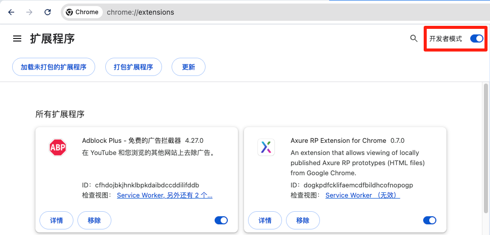
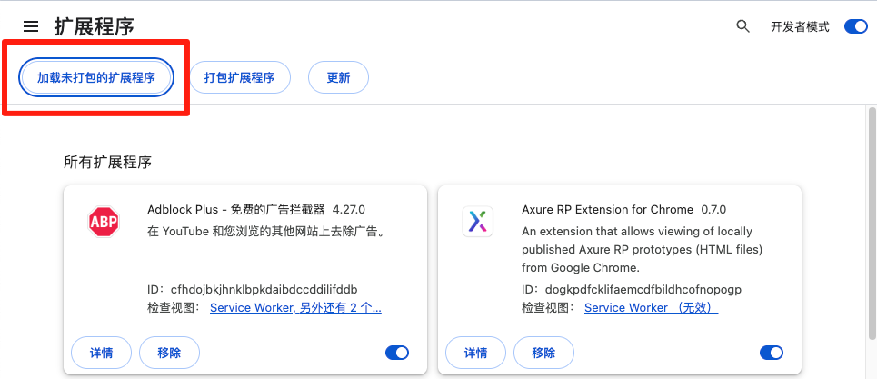
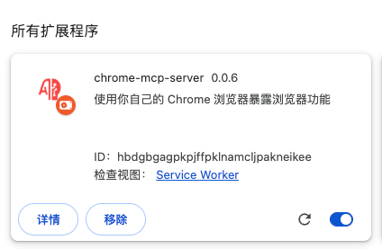
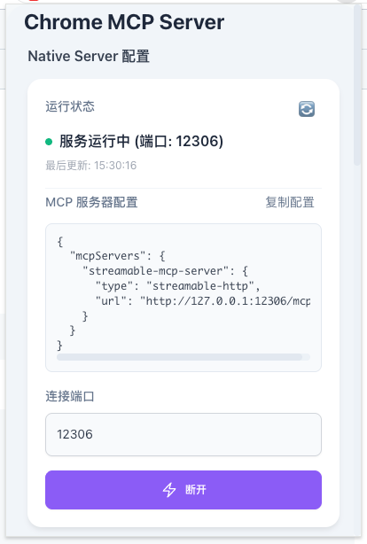

本文介绍 <a href="https://github.com/hangwin/mcp-chrome" target="_blank">mcp-chrome</a> 的安装和使用, 以及如何使用 <a href="https://github.com/hangwin/mcp-chrome" target="_blank">mcp-chrome</a> 完善我们的工作流

## 浏览器自动化

目前 **通过程序调用浏览器来完成某些任务**, 可以实现的库有以下几种:
- 浏览器端到端自动化测试库: 例如 <a href="https://playwright.dev/" target="_blank">playwright</a> / <a href="https://www.selenium.dev/" target="_blank">selenium</a> / <a href="https://www.cypress.io/" target="_blank">cypress</a>
- 浏览器自动化库: <a href="https://pptr.dev/" target="_blank">puppeteer</a>
- 基于浏览器插件的自动化库: <a href="https://github.com/hangwin/mcp-chrome" target="_blank">mcp-chrome</a> / <a href="https://github.com/Oanakiaja/chrome-extension-bridge-mcp" target="_blank">chrome-extension-bridge-mcp</a>

与同类项目对比:

| 对比维度           | 基于浏览器端到端自动化测试库 / 浏览器自动化库                      | 基于Chrome插件的MCP Server                                   |
| ------------------ | ------------------------------------------------------------------ | ------------------------------------------------------------ |
| **资源占用**       | ❌ 需启动独立浏览器进程，需要安装Playwright依赖，下载浏览器二进制等 | ✅ 无需启动独立的浏览器进程，直接利用用户已打开的Chrome浏览器 |
| **用户会话复用**   | ❌ 需重新登录                                                       | ✅ 自动使用已登录状态                                         |
| **浏览器环境保持** | ❌ 干净环境缺少用户设置                                             | ✅ 完整保留用户环境                                           |
| **API访问权限**    | ⚠️ 受限于Playwright API                                             | ✅ Chrome原生API全访问                                        |
| **启动速度**       | ❌ 需启动浏览器进程                                                 | ✅ 只需激活插件                                               |
| **响应速度**       | 50-200ms进程间通信                                                 | ✅ 更快                                                       |

简而言之, `mcp-chrome` 更适合在本地环境使用, 可以 **让 `AI` 直接接管我们的 `Chrome`, 而不是没有任何上下文的空白浏览器**

## 介绍

::github{repo="hangwin/mcp-chrome"}

<a href="https://github.com/hangwin/mcp-chrome" target="_blank">mcp-chrome</a> 是一个基于 `chrome` 插件的 **模型上下文协议 (MCP) 服务器**，它将您的 `Chrome` 浏览器功能暴露给 `Claude` 等 `AI` 助手，实现复杂的浏览器自动化、内容分析和语义搜索等。与传统的浏览器自动化工具（如 `playwright`）不同，**<a href="https://github.com/hangwin/mcp-chrome" target="_blank">mcp-chrome</a>** 直接使用您日常使用的 `chrome` 浏览器，基于现有的用户习惯和配置、登录态，让各种大模型或者各种 `chatbot` 都可以接管你的浏览器，真正成为你的如常助手

### ✨ 核心特性

- 😁 **chatbot/模型无关**：让任意你喜欢的llm或chatbot客户端或agent来自动化操作你的浏览器
- ⭐️ **使用你原本的浏览器**：无缝集成用户本身的浏览器环境（你的配置、登录态等）
- 💻 **完全本地运行**：纯本地运行的mcp server，保证用户隐私
- 🚄 **Streamable http**：Streamable http的连接方式
- 🏎 **跨标签页** 跨标签页的上下文
- 🧠 **语义搜索**：内置向量数据库和本地小模型，智能发现浏览器标签页内容
- 🔍 **智能内容分析**：AI 驱动的文本提取和相似度匹配
- 🌐 **20+ 工具**：支持截图、网络监控、交互操作、书签管理、浏览历史等20多种工具
- 🚀 **SIMD 加速 AI**：自定义 WebAssembly SIMD 优化，向量运算速度提升 4-8 倍

### 环境要求

- `Node.js` >= 18.19.0
- `Chrome/Chromium` 浏览器

## 安装

### 安装浏览器插件
1. 访问 <a href="https://github.com/hangwin/mcp-chrome/releases" target="_blank">GitHub Release</a> 下载 `chrome-mcp-server-*.*.*.zip`, 并解压
2. 访问 `chrome://extensions/`
3. 开启 **开发者模式**

4. 点击 **加载未打包的扩展程序**

5. 选择解压后的目录, 例如 `chrome-mcp-server-*.*.*`


### 安装 mcp-chrome
- 使用 npm 安装:
```bash
npm i -g mcp-chrome-bridge
```

- 或使用 pnpm:
```bash
# 方法1：全局启用脚本（推荐）
pnpm config set enable-pre-post-scripts true
pnpm install -g mcp-chrome-bridge

# 方法2：如果 postinstall 没有运行，手动注册
pnpm install -g mcp-chrome-bridge
mcp-chrome-bridge register
```

## MCP
目前 `Claude Code` 支持两种服务连接方式:
| 接入方式                | 描述                                  | 性能 | 延迟 |
| ----------------------- | ------------------------------------- | ---- | ---- |
| `http(s)` / `websocket` | 基于 `http(s)` / `ws` 的连接方式      | 稍差 | 稍差 |
| `stdio`                 | 基于 `stdio` 的连接方式, 只能本地调用 | 高   | 快速 |

这里 <a href="https://github.com/hangwin/mcp-chrome" target="_blank">mcp-chrome</a> 就非常适合使用 `stdio` 的方式进行连接, 因为 <a href="https://github.com/hangwin/mcp-chrome" target="_blank">mcp-chrome</a> 调用的是本地的 `Chrome`, 没有必要启动 `http(s)` 服务

了解更多 `MCP` 安装和配置方式, 可参考 <a href="https://docs.claude.com/zh-CN/docs/claude-code/mcp?utm_source=chatgpt.com" target="_blank">通过 MCP 将 Claude Code 连接到工具 - 官方文档</a>

## 在 Claude Code 中使用
1. 查看 全局安装的 `mcp-chrome-bridge` 路径
```bash
pnpm list -g mcp-chrome-bridge

Legend: production dependency, optional only, dev only

/Users/xxx/Library/pnpm/global/5

dependencies:
mcp-chrome-bridge 1.0.29
```

假设上面的命令输出的路径是: `/Users/xxx/Library/pnpm/global/5` 那么你的最终路径就是: `/Users/xxx/Library/pnpm/global/5/node_modules/mcp-chrome-bridge/dist/mcp/mcp-server-stdio.js`

2. 添加 `Claude Code` `MCP`, 可以根据需要将 `mcp-chrome` 服务添加到 <a href="https://docs.claude.com/zh-CN/docs/claude-code/mcp?utm_source=chatgpt.com#%E6%9C%AC%E5%9C%B0%E8%8C%83%E5%9B%B4" target="_blank">本地</a> 或者 <a href="https://docs.claude.com/zh-CN/docs/claude-code/mcp?utm_source=chatgpt.com#%E9%A1%B9%E7%9B%AE%E8%8C%83%E5%9B%B4" target="_blank">项目</a> / <a href="https://docs.claude.com/zh-CN/docs/claude-code/mcp?utm_source=chatgpt.com#%E7%94%A8%E6%88%B7%E8%8C%83%E5%9B%B4" target="_blank">用户</a> 范围
  - 本地范围(只允许当前用户在当前项目中使用): `claude mcp add chrome-mcp-stdio -- node /Users/xxx/Library/pnpm/global/5/node_modules/mcp-chrome-bridge/dist/mcp/mcp-server-stdio.js`
  - 项目范围(只在为当前项目添加 `mcp-chrome` 服务): `claude mcp add chrome-mcp-stdio --scope project -- node /Users/xxx/Library/pnpm/global/5/node_modules/mcp-chrome-bridge/dist/mcp/mcp-server-stdio.js`
  - 用户范围(当前用户可在全局使用): `claude mcp add chrome-mcp-stdio --scope user -- node /Users/xxx/Library/pnpm/global/5/node_modules/mcp-chrome-bridge/dist/mcp/mcp-server-stdio.js`

| 范围                                                                                                                                                  | 描述                                                                                        | 应用范围 | 是否共享 | 参数              |
| ----------------------------------------------------------------------------------------------------------------------------------------------------- | ------------------------------------------------------------------------------------------- | -------- | -------- | ----------------- |
| <a href="https://docs.claude.com/zh-CN/docs/claude-code/mcp?utm_source=chatgpt.com#%E6%9C%AC%E5%9C%B0%E8%8C%83%E5%9B%B4" target="_blank">本地范围</a> | 只允许当前用户在当前项目中使用                                                              | 当前项目 | 否       | ``                |
| <a href="https://docs.claude.com/zh-CN/docs/claude-code/mcp?utm_source=chatgpt.com#%E9%A1%B9%E7%9B%AE%E8%8C%83%E5%9B%B4" target="_blank">项目范围</a> | 只为当前项目添加 `mcp-chrome` 服务, 会写入 `.claude.json` 中的 `projects.xxx.mcpServers` 中 | 当前项目 | 是       | `--scope project` |
| <a href="https://docs.claude.com/zh-CN/docs/claude-code/mcp?utm_source=chatgpt.com#%E7%94%A8%E6%88%B7%E8%8C%83%E5%9B%B4" target="_blank">用户范围</a> | 为所有项目添加 `mcp-chrome` 服务, 会写入 `.claude.json` 中的 `projects.xxx.mcpServers` 中   | 所有项目 | 是       | `--scope user`    |

这里我们选择在 **用户范围** 添加 `mcp-chrome` 服务:
```bash
claude mcp add chrome-mcp-stdio -- node /Users/xxx/Library/pnpm/global/5/node_modules/mcp-chrome-bridge/dist/mcp/mcp-server-stdio.js

Added stdio MCP server chrome-mcp-stdio with command: node /Users/xxx/Library/pnpm/global/5/node_modules/mcp-chrome-bridge/dist/mcp/mcp-server-stdio.js to user config
File modified: /Users/xxx/.claude.json
```

通过输出的内容, 我们发现 `mcp-chrome` 服务已经添加到 `.claude.json` 文件中:
```json
{
  "mcpServers": {
    "chrome-mcp-stdio": {
      "type": "stdio",
      "command": "node",
      "args": [
        "/Users/xxx/Library/pnpm/global/5/node_modules/mcp-chrome-bridge/dist/mcp/mcp-server-stdio.js"
      ],
      "env": {}
    }
  }
}
```

最后, 我们检查一下 `Claude Code` 的 `MCP` 列表中是否存在 `mcp-chrome` 服务:
```bash
claude mcp list                      (base) 607ms  三  9/17 15:02:20 2025

Checking MCP server health...

chrome-mcp-stdio: node /Users/xxx/Library/pnpm/global/5/node_modules/mcp-chrome-bridge/dist/mcp/mcp-server-stdio.js - ✓ Connected
context7: https://mcp.context7.com/mcp (HTTP) - ✓ Connected
```

### 移除 MCP
```bash
claude mcp remove chrome-mcp-stdio
```

## 使用
### 连接服务
点击浏览器插件中的链接按钮, 如果连接成功, 则会看到如下界面:


如果遇到服务未启动, 可能是 `mcp-chrome-bridge` 没有注册成功, 可以手动注册:
```bash
mcp-chrome-bridge register

Writing Node.js path: /usr/local/bin/node
✓ Node.js path written for run_host scripts
Registering user-level Native Messaging host...
Attempting to register user-level Native Messaging host...
✓ Set execution permissions for index.js
✓ Set execution permissions for run_host.sh
✓ Set execution permissions for cli.js
manifest path==> {
  name: 'com.chromemcp.nativehost',
  description: 'Node.js Host for Browser Bridge Extension',
  path: '/Users/xxx/Library/pnpm/global/5/.pnpm/mcp-chrome-bridge@1.0.29/node_modules/mcp-chrome-bridge/dist/run_host.sh',
  type: 'stdio',
  allowed_origins: [ 'chrome-extension://hbdgbgagpkpjffpklnamcljpakneikee/' ]
} /Users/xxx/Library/Application Support/Google/Chrome/NativeMessagingHosts/com.chromemcp.nativehost.json
Successfully registered user-level Native Messaging host!
Native Messaging host registered successfully!
You can now use connectNative in Chrome extension to connect to this service.
```

### 调用 mcp-chrome
启动 `Claude Code`, 并输入以下内容来调取浏览器获取仓库的 star 数量信息:

```bash
claude

> 调用 Chrome MCP, 检查 Github 上我的所有仓库, 并按 star 数量进行从大到小排序

⏺ I'll help you check all your GitHub repositories and sort them by star count. Let me use the Chrome MCP to navigate to
  GitHub and retrieve this information.

⏺ chrome-mcp-stdio - chrome_navigate (MCP)(url: "https://github.com/SublimeCT")

  Todos
  ☐ Navigate to GitHub profile page
  ☐ Extract repository information including star counts
  ☐ Sort repositories by star count in descending order

╭──────────────────────────────────────────────────────────────────────────────────────────────────────────────────────────────╮
│ Tool use                                                                                                                     │
│                                                                                                                              │
│   chrome-mcp-stdio - chrome_navigate(url: "https://github.com/SublimeCT") (MCP)                                              │
│   Navigate to a URL or refresh the current tab                                                                               │
│                                                                                                                              │
│ Do you want to proceed?                                                                                                      │
│ ❯ 1. Yes                                                                                                                     │
│   2. Yes, and don't ask again for chrome-mcp-stdio - chrome_navigate commands in /Users/xxx/projects/blog.xiaban.run       │
│   3. No, and tell Claude what to do differently (esc)                                                                        │
│                                                                                                                              │
╰──────────────────────────────────────────────────────────────────────────────────────────────────────────────────────────────╯
```

## 使用体验
实际体验比较差, 没有达到我的预期, 因为 `Claude Code` 将操作分解为了很多步骤, 例如
1. 先获取元素
2. 再点击 `xxx`
3. 再获取数据
4. `...`

实际上 **每一步操作都有时间间隔, 导致操作速度非常慢 **😡, 所以需要多个操作步骤的需求还是应该使用定制化的 `MCP` 服务

## 参考

- <a href="https://github.com/hangwin/mcp-chrome" target="_blank">mcp-chrome</a>
- <a href="https://github.com/hangwin/mcp-chrome/blob/master/README_zh.md" target="_blank">mcp-chrome 中文文档</a>
- <a href="https://github.com/hangwin/mcp-chrome/blob/master/docs/TOOLS_zh.md" target="_blank">mcp-chrome MCP Server API 中文文档</a>
- <a href="https://playwright.dev/" target="_blank">playwright</a>
- <a href="https://www.selenium.dev/" target="_blank">selenium</a>
- <a href="https://www.cypress.io/" target="_blank">cypress</a>
- <a href="https://pptr.dev/" target="_blank">puppeteer</a>
- <a href="https://github.com/Oanakiaja/chrome-extension-bridge-mcp" target="_blank">chrome-extension-bridge-mcp</a>
- <a href="https://docs.claude.com/zh-CN/docs/claude-code/mcp?utm_source=chatgpt.com" target="_blank">通过 MCP 将 Claude Code 连接到工具 - 官方文档</a>
