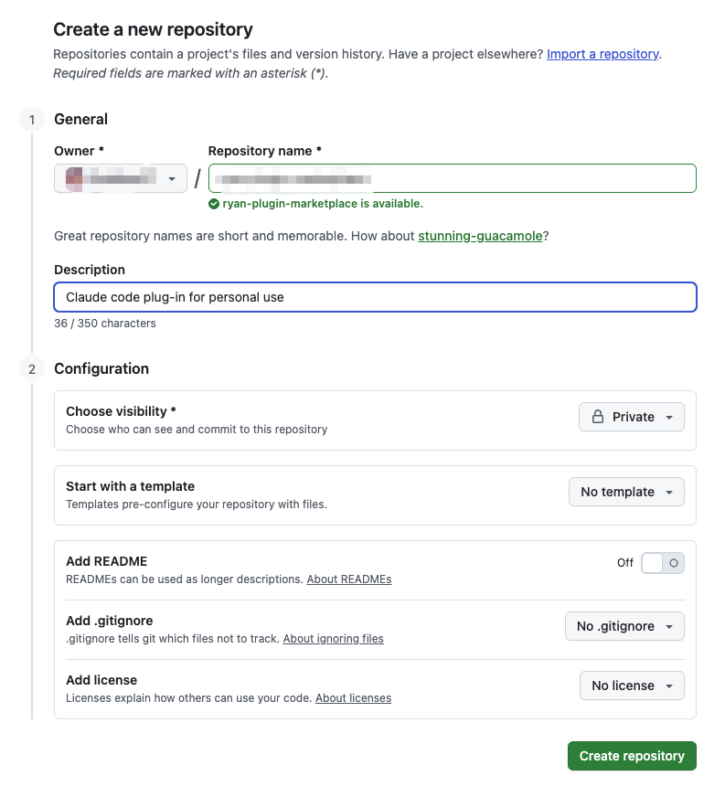

> [!TIP]
> 如果想要获得性价比最高的 `Vibe Coding` 体验, 推荐购买 <a href="https://www.bigmodel.cn/claude-code?cc=fission_glmcode_sub_v1&ic=Q2N8XA4W77&n=a****3" target="_blank">🔗 GLM Coding Lite</a> 服务, `Lite` 版本的按 `Prompt` 计费, 每 `5` 小时最多约 `120` 次 `prompts`

## Claude Code 核心功能
我们在使用 `Claude Code` 时, 可以通过以下功能来 **配置或者扩展 `Claude Code` 的能力**, 这些能力都是 `Claude Code` 的核心功能

- <a href="https://code.claude.com/docs/zh-CN/slash-commands" target="_blank">Commands</a>: 自定义命令
- <a href="https://code.claude.com/docs/zh-CN/sub-agents" target="_blank">Agents</a>: 子代理
- <a href="https://code.claude.com/docs/zh-CN/hooks" target="_blank">Hooks</a>: 基于事件的自动化工作流
- <a href="https://code.claude.com/docs/zh-CN/skills" target="_blank">Skills</a>: 技能
- <a href="https://code.claude.com/docs/zh-CN/mcp" target="_blank">MCP</a>: MCP 服务

## Plugin
**<a href="https://code.claude.com/docs/zh-CN/plugins" target="_blank">Claude Code 插件</a> 是一种将 `Claude Code` 的 核心功能(<a href="https://code.claude.com/docs/zh-CN/slash-commands" target="_blank">Commands</a> / <a href="https://code.claude.com/docs/zh-CN/sub-agents" target="_blank">Agents</a> / <a href="https://code.claude.com/docs/zh-CN/hooks" target="_blank">Hooks</a> / <a href="https://code.claude.com/docs/zh-CN/skills" target="_blank">Skills</a> / <a href="https://code.claude.com/docs/zh-CN/mcp" target="_blank">MCP</a>) 打包封装** 的一种方式, 它实现了对于这些核心功能的 **分离** 和 **共享**, 任何安装了插件的项目都可以使用插件内置的 `Claude Code` 核心功能

## 用途
- 将自己在工作中创建的通用 <a href="https://code.claude.com/docs/zh-CN/slash-commands" target="_blank">Commands</a> / <a href="https://code.claude.com/docs/zh-CN/sub-agents" target="_blank">Agents</a> / <a href="https://code.claude.com/docs/zh-CN/hooks" target="_blank">Hooks</a> / <a href="https://code.claude.com/docs/zh-CN/skills" target="_blank">Skills</a> / <a href="https://code.claude.com/docs/zh-CN/mcp" target="_blank">MCP</a> 封装成插件, **在创建新项目时可以直接通过安装插件的方式来使用这些能力**
- 想要将自己创建的 <a href="https://code.claude.com/docs/zh-CN/slash-commands" target="_blank">Commands</a> / <a href="https://code.claude.com/docs/zh-CN/sub-agents" target="_blank">Agents</a> / <a href="https://code.claude.com/docs/zh-CN/hooks" target="_blank">Hooks</a> / <a href="https://code.claude.com/docs/zh-CN/skills" target="_blank">Skills</a> / <a href="https://code.claude.com/docs/zh-CN/mcp" target="_blank">MCP</a> **在团队内共享或直接开源**, 让别人也可以使用这些能力

## 目录结构
一个插件的目录中包含了这些核心功能的文件, 目录结构与 `.claude` 中的路径结构相同, 结构如下:

```bash
my-first-plugin/
├── .claude-plugin/
│   └── plugin.json          # 插件元数据
├── commands/                 # 自定义斜杠命令（可选）
│   └── hello.md
├── agents/                   # 自定义代理（可选）
│   └── helper.md
├── skills/                   # 代理技能（可选）
│   └── my-skill/
│       └── SKILL.md
└── hooks/                    # 事件处理程序（可选）
    └── hooks.json
```

## 创建一个插件
### 前置条件
1. 安装 <a href="https://www.npmjs.com/package/@anthropic-ai/claude-code" target="_blank">@anthropic-ai/claude-code</a>
```bash
npm install -g @anthropic-ai/claude-code # 或使用 pnpm 安装
```

2. 购买 `Claude Code` 服务(使用 `GLM Coding Plan` 服务)
> [!WARNING]
> **在国内无法直接购买和使用 `Claude` 系列模型**, 目前国内对于 `Claude Code` **支持度最好的是智谱的 <a href="https://www.bigmodel.cn/claude-code?cc=fission_glmcode_sub_v1&ic=Q2N8XA4W77&n=a****3" target="_blank">🔗 GLM Coding Plan</a> 服务**, 性价比最高, 可以直接作为平替使用

购买 <a href="https://www.bigmodel.cn/claude-code?cc=fission_glmcode_sub_v1&ic=Q2N8XA4W77&n=a****3" target="_blank">🔗 GLM Coding Lite</a> 服务, 然后根据 <a href="https://docs.bigmodel.cn/cn/coding-plan/tool/claude" target="_blank">官方文档</a> 进行配置

### 插件市场

插件市场(`Plugin Marketplace`) 指的是包含一系列插件的用于共享和分发的项目, 本质上是一个包含描述文件(`.claude-plugin/marketplace.json`)的项目, 我们可以通过将其发布到 `Github` 或者私有仓库中进行共享

### 创建插件市场
1. 创建一个空目录并进行初始化
```bash
mkdir ryan-plugin-marketplace
cd ryan-plugin-marketplace && pnpm init && git init
```

2. 创建 `.claude-plugin/marketplace.json` 文件, 并填写以下内容
```json
{
  "name": "ryan-plugin-marketplace",
  "owner": {
    "name": "Ryan",
    "email": "ryan@example.com"
  },
  "plugins": [
    {
      "name": "dev",
      "source": "./plugins/dev",
      "description": "Functions used in daily development",
      "version": "1.0.0",
      "author": {
        "name": "Ryan"
      }
    }
  ]
}
```

3. 创建 `plugins/dev/commands/hello.md`
```md
你好👋
```

4. 将项目发布到 github


```bash
git add -A && git commit -m 'init: Initialization project'
git remote add origin git@github.com:SublimeCT/ryan-plugin-marketplace.git
git push -u origin main
```

## 安装插件
### 插件市场的安装范围
- 对当前用户的所有项目都生效:
```bash
claude

> /plugin marketplace add anthropics/claude-code
```
- 对某个项目生效(修改 `.claude/settings.json`):
```json
{
  "extraKnownMarketplaces": {
    "my-marketplace": {
      "source": {
        "source": "github",
        "repo": "owner/repo"
      }
    }
  }
}
```
- 对某个项目生效, 但不提交到版本控制中(修改 `.claude/settings.local.json`):
```json
{
  "extraKnownMarketplaces": {
    "my-marketplace": {
      "source": {
        "source": "github",
        "repo": "owner/repo"
      }
    }
  }
}
```

这里我们选择对当前用户的所有项目都生效的安装方式:

```bash
claude

> /plugin marketplace add xxx/ryan-plugin-marketplace
  ⎿  Successfully added marketplace: ryan-plugin-marketplace
```

### 插件的安装范围
默认安装的插件会在所有项目中生效, 但有时我们想让插件只在某个项目中使用, `Claude Code` 提供了 `--scope` 参数指定插件的安装范围:

- `User scope`(**默认选项**): 插件在当前用户下的所有项目都生效
- `Project scope`(**在交互式命令行界面中默认使用**): 插件只在当前项目下生效, 配置保存在 `.claude/settings.json`, 会与团队共享
- `Local scope`: 仅对当前仓库生效, 且不会提交到版本控制

这里我们选择 `User scope`:

```bash
claude plugin install dev@ryan-plugin-marketplace
✔ Successfully installed plugin: dev@ryan-plugin-marketplace
```

### 测试
测试插件是否安装成功:

```bash
claude

 ▐▛███▜▌   Claude Code v2.0.37
▝▜█████▛▘  Sonnet 4.5 · API Usage Billing
  ▘▘ ▝▝    /Users/xxx/projects/openapi-codegen

────────────────────────────────────────────────────────────────────────────────────────────────────────────────────────────────────────────
> /dev
────────────────────────────────────────────────────────────────────────────────────────────────────────────────────────────────────────────
  /dev:base      base command (plugin:dev@ryan-plugin-marketplace)
  /dev:hello     你好👋 (plugin:dev@ryan-plugin-marketplace)
```

```bash
> /dev:hello is running…

⏺ 你好！我可以帮助你处理这个项目的任务。

  我看到这是一个基于 OpenAPI/Swagger 的代码生成工具项目。有什么我可以帮你的吗？比如：

  - 修复 bug
  - 添加新功能
  - 代码重构
  - 运行测试
  - 代码生成相关的问题
  - 或者其他任何开发任务

  请告诉我你需要什么帮助！
```

## 管理插件
```bash
claude

> /plugin
╭──────────────────────────────────────────────────────────────────────────────────────────────────────────────────────────────────────────╮
│ Plugins                                                                                                                                  │
│                                                                                                                                          │
│   1. Browse and install plugins                                                                                                          │
│ ❯ 2. Manage and uninstall plugins                                                                                                        │
│   3. Add marketplace                                                                                                                     │
│   4. Manage marketplaces                                                                                                                 │
╰──────────────────────────────────────────────────────────────────────────────────────────────────────────────────────────────────────────╯
   Press ↑↓ to navigate · Enter to select · Esc to exit

```

我们选择 `Manage and uninstall plugins` 后, 就可以 **对插件进行 禁用 / 更新 / 卸载** 了:

```bash
> /plugin
╭──────────────────────────────────────────────────────────────────────────────────────────────────────────────────────────────────────────╮
│ dev @ ryan-plugin-marketplace                                                                                                            │
│                                                                                                                                          │
│ Version: 1.0.0                                                                                                                           │
│                                                                                                                                          │
│ Functions used in daily development                                                                                                      │
│                                                                                                                                          │
│ Author: Ryan                                                                                                                             │
│                                                                                                                                          │
│ Status: Enabled                                                                                                                          │
│                                                                                                                                          │
│ Installed components:                                                                                                                    │
│ • Commands: base, hello                                                                                                                  │
│                                                                                                                                          │
│                                                                                                                                          │
│ ❯ Disable plugin                                                                                                                         │
│   Mark for update                                                                                                                        │
│   Update now                                                                                                                             │
│   Uninstall                                                                                                                              │
│   Back to plugin list                                                                                                                    │
╰──────────────────────────────────────────────────────────────────────────────────────────────────────────────────────────────────────────╯

 Navigate: ↑↓ • Select: Enter • Back: Esc

```


## 参考
- <a href="https://code.claude.com/docs/zh-CN/slash-commands" target="_blank">Commands 自定义命令</a>
- <a href="https://code.claude.com/docs/zh-CN/sub-agents" target="_blank">Agents 子代理</a>
- <a href="https://code.claude.com/docs/zh-CN/hooks" target="_blank">Hooks 基于事件的自动化工作流</a>
- <a href="https://code.claude.com/docs/zh-CN/skills" target="_blank">Skills 技能</a>
- <a href="https://code.claude.com/docs/zh-CN/mcp" target="_blank">MCP MCP 服务</a>
- <a href="https://www.npmjs.com/package/@anthropic-ai/claude-code" target="_blank">@anthropic-ai/claude-code</a>
- <a href="https://code.claude.com/docs/zh-CN/slash-commands" target="_blank">Claude Code 斜杠命令</a>
- <a href="https://code.claude.com/docs/zh-CN/plugins" target="_blank">Claude Code 插件</a>
- <a href="https://code.claude.com/docs/zh-CN/plugin-marketplaces" target="_blank">Claude Code 插件市场</a>