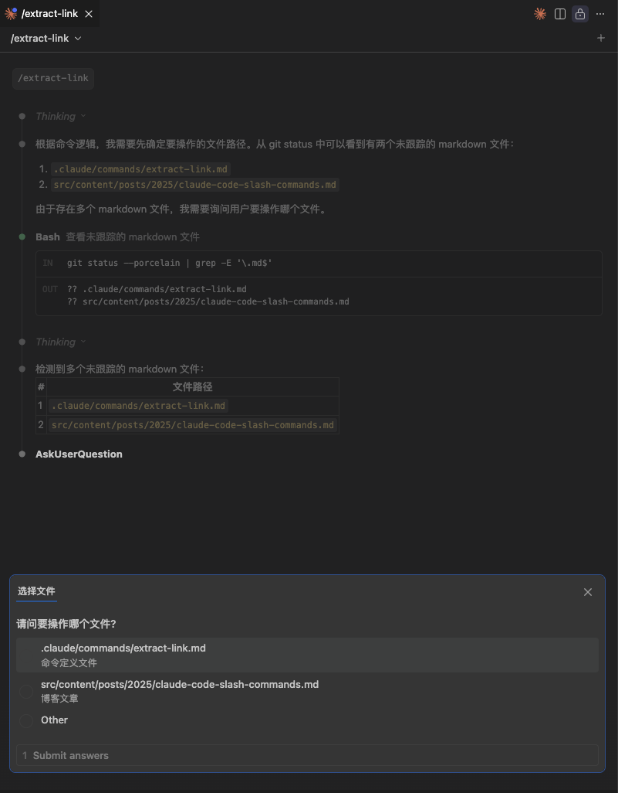
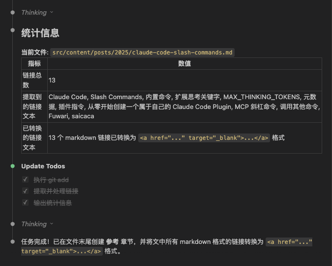

> [!TIP]
> 如果想要获得性价比最高的 `Vibe Coding` 体验, 推荐购买 <a href="https://www.bigmodel.cn/claude-code?cc=fission_glmcode_sub_v1&ic=Q2N8XA4W77&n=a****3" target="_blank">🔗 GLM Coding Lite</a> 服务, `Lite` 版本的按 `Prompt` 计费, 每 `5` 小时最多约 `120` 次 `prompts`

本文将创建一个简单的斜杠命令, 用于提取 `markdown` 文件中的链接

## 概述
在使用 <a href="https://code.claude.com/docs/zh-CN/overview" target="_blank">Claude Code</a> 编码时, 斜杠命令(<a href="https://code.claude.com/docs/zh-CN/slash-commands" target="_blank">Slash Commands</a>) 是一个非常高效简洁可扩展的交互方式, **类似于一个命令行工具, 他可以对对重复性的提示词进行封装, 或者基于输入完成特定的任务**

> [!TIP]
> 本质上 `Slash Commands` 是一个 `markdown` 文件, 可以在 `claude code` 中通过 `/<command-file-name>` 的方式调用

## 内置命令
Claude Code 默认提供了一些 <a href="https://code.claude.com/docs/zh-CN/slash-commands#%E5%86%85%E7%BD%AE%E6%96%9C%E6%9D%A0%E5%91%BD%E4%BB%A4" target="_blank">内置命令</a>, 例如:

- `/init`: 使用 `CLAUDE.md` 指南初始化项目
- `/help`: 显示帮助信息
- `/clear`: 清空当前会话
- `/config`: 打开设置界面（配置选项卡）
- `/mcp`: 管理 MCP 服务器连接和 OAuth 身份验证
- `...`

## 用法
`Claude Code` 的用法跟普通的命令行程序一样, 在调用时先输入 **命令名称**, 然后是命令接收的 **参数**

```bash
/<command-name> [arguments]
```

以我们每个项目都要使用的 `/init` 命令为例, 由于它默认生成的是英文, 我们为了可读性, 希望生成中文, 所以输入如下命令:

```bash
/init 使用中文
```

这样就生成了一个中文的 `CLAUDE.md` 文件, 默认生成在项目根目录下

## 命令生效范围
| 范围 | 文件存储位置        | 描述           |
| ---- | ------------------- | -------------- |
| 项目 | `.claude/commands`  | 项目级别的命令 |
| 全局 | `~/claude/commands` | 全局命令       |

## 核心功能

### 参数
跟普通的命令行程序一样, 斜杠命令 可以接受参数:

- `$ARGUMENTS`: 所有参数
- `$1`: 第一个参数
- `$2`: 第二个参数
- `$3`: 第三个参数

### 执行 bash 命令

```markdown
---
allowed-tools: Bash(git add:*), Bash(git status:*), Bash(git commit:*)
description: Create a git commit
---

## Context

- Current git status: !`git status`
- Current git diff (staged and unstaged changes): !`git diff HEAD`
- Current branch: !`git branch --show-current`
- Recent commits: !`git log --oneline -10`

## Your task

Based on the above changes, create a single git commit.
```

在以上示例中, 我们在顶部元信息中声明了当前命令运行使用的 `bash` 命令, 然后在内容中使用 `!` 来执行 `bash` 命令, 并将执行的输出添加到内容中

### 文件引用
可以通过 `@/path/to/file` 的方式来引用文件

### 启用思考
`Claude Code` 默认不启用思考, 但可以通过 <a href="https://code.claude.com/docs/zh-CN/common-workflows#%E4%BD%BF%E7%94%A8%E6%89%A9%E5%B1%95%E6%80%9D%E8%80%83" target="_blank">扩展思考关键字</a> 来触发思考

> [!TIP]
> 启用思考有多种方式, 最直接的方式就是在 `claude code` 交互式命令行中按 `Tab` 键切换思考, 或者在环境变量中设置 <a href="https://code.claude.com/docs/zh-CN/settings#environment-variables:~:text=%E9%BB%98%E8%AE%A4%E5%80%BC%EF%BC%9A25000%EF%BC%89-,MAX_THINKING_TOKENS,-%E5%90%AF%E7%94%A8%E6%89%A9%E5%B1%95%E6%80%9D%E8%80%83" target="_blank">MAX_THINKING_TOKENS</a>

### 元数据

<a href="https://code.claude.com/docs/zh-CN/slash-commands#%E5%89%8D%E7%BD%AE%E4%BA%8B%E9%A1%B9" target="_blank">元数据</a> 指的是 `Slash Commands` 的元信息, 用于描述和指定 `Slash Commands` 的功能和用法

| 前置事项                   | 用途                                                                                                                         | 默认值             |
| -------------------------- | ---------------------------------------------------------------------------------------------------------------------------- | ------------------ |
| `allowed-tools`            | 命令可以使用的工具列表                                                                                                       | 从对话继承         |
| `argument-hint`            | 斜杠命令期望的参数。示例: <br>`argument-hint: add [tagId] \| remove [tagId] \| list`。此提示在自动完成斜杠命令时显示给用户。 | 无                 |
| `description`              | 命令的简要描述                                                                                                               | 使用提示中的第一行 |
| `model`                    | 特定模型字符串（查看模型概览）                                                                                               | 从对话继承         |
| `disable-model-invocation` | 是否防止 `SlashCommand` 工具调用此命令                                                                                       | `false`            |

### 其他
- <a href="https://code.claude.com/docs/zh-CN/slash-commands#%E6%8F%92%E4%BB%B6%E5%91%BD%E4%BB%A4" target="_blank">插件指令</a>: 可以通过插件来共享和分发 `Slash Commands`, 可以参考我的另一篇文章: <a href="/posts/2025/claude-code-plugin/" target="_blank">从零开始创建一个属于自己的 Claude Code Plugin</a>
- <a href="https://code.claude.com/docs/zh-CN/slash-commands#mcp-%E6%96%9C%E6%9D%A0%E5%91%BD%E4%BB%A4" target="_blank">MCP 斜杠命令</a>: 执行 `MCP` 服务提供的斜杠命令: `/mcp__<server-name>__<prompt-name> [arguments]`
- <a href="https://code.claude.com/docs/zh-CN/slash-commands#slashcommand-%E5%B7%A5%E5%85%B7%E6%94%AF%E6%8C%81%E7%9A%84%E5%91%BD%E4%BB%A4" target="_blank">调用其他命令</a>

## 创建一个提取链接的命令
在博客中经常需要增加各种链接, 例如本文中出现了非常多的 `Claude Code` 官网的链接, 我希望将链接进行提取, 并添加到文末的 参考 章节中, 为此我们来创建一个用于提取链接的 `Slash Command`

这个命令的调用方式为:

- `/extract-link [filePath]`: 提取文中的所有链接并将链接转换为 `<a href="${linkUrl}">${linkText}</a>` 的形式, 然后添加到文末的 参考 章节中

> [!TIP]
> 由于 `Slash Command` **不支持命名参数, 只支持位置参数**, 也就是说并不能直接使用 `$1` / `$2` 这样的位置参数, 但是我们依然可以 **让 AI 先进行解析参数, 再做出正确的处理**

### 创建命令
```markdown
---
allowed-tools: Bash(git add:*), Bash(git status)
argument-hint: [filePath]
description: 提取并处理(提取 / 转为新窗口打开)文中的链接到 参考 章节
---

## 参数
### 文件路径
1. 首先从命令参数中提取文件路径: 当前操作的 **文件路径**: `$1`, 如果有值则使用此文件路径
2. 如果当前上下文中存在唯一的 `markdown` 文件, 则直接使用此文件路径
3. 执行 `git status` 查看当前未跟踪的 `markdown` 文件, 如果只存在一个 `markdown` 文件, 则使用此文件路径

**如果没有获取到文件路径, 则停止执行任何操作, 并提示用户输入文件路径**

### 参数验证
- 文件必须是 `markdown` 文件

## 任务
1. 执行 `git add $1`
2. 提取文中的所有链接并将链接转换为 `<a href="${linkUrl}">${linkText}</a>` 的形式, 然后添加到文末的 参考 章节中, 参考章节的格式参考 [参考章节格式](#参考章节格式)
3. 将文中所有的 `markdown` 格式的链接转换为 `<a href="${linkUrl}" target="_blank">${linkText}</a>` 格式的链接
4. 输出任务统计, 格式参考 [统计信息](#统计信息)

注意:
- 链接可以是 `markdown` 形式的, 也可以是 `a` 标签形式的
- 如果文末没有名为 **参考** 的章节, 则创建一个名为 **参考** 的章节
- **参考** 章节中禁止存在重复的链接

### 参考章节格式
\`\`\`markdown
## 参考
- [${linkText}](${linkUrl})
\`\`\`

### 统计信息
格式如下:

\`\`\`markdown
当前文件: ${filePath}

- 链接总数: ${linkCount}
- 提取到的链接文本: ${linkTexts}
- 已转换的链接文本: ${convertedLinkTexts}
\`\`\`

```

### 执行命令

这里我们限定了如果用户没有输入文件路径, 则会读取上下文和 `git` 修改的文件, 然后我们直接执行一下:

```bash
> /extract-link
```



由于我们修改了两个文件, 所以触发了 `claude code` 的选择界面, 我们选择当前文章对于的 `markdown` 文件, 等待片刻后大功告成



> [!TIP]
> 这里我是用的是 `GLM 4.7` 模型, **在国内无法直接购买和使用 `Claude` 系列模型**, 目前国内对于 `Claude Code` **支持度最好的是智谱的 <a href="https://www.bigmodel.cn/claude-code?cc=fission_glmcode_sub_v1&ic=Q2N8XA4W77&n=a****3" target="_blank">🔗 GLM Coding Plan</a> 服务**, 性价比最高, 可以直接作为平替使用

## 参考

- <a href="https://code.claude.com/docs/zh-CN/overview" target="_blank">Claude Code</a>
- <a href="https://code.claude.com/docs/zh-CN/slash-commands" target="_blank">Slash Commands</a>
- <a href="https://code.claude.com/docs/zh-CN/slash-commands#%E5%86%85%E7%BD%AE%E6%96%9C%E6%9D%A0%E5%91%BD%E4%BB%A4" target="_blank">内置命令</a>
- <a href="https://code.claude.com/docs/zh-CN/common-workflows#%E4%BD%BF%E7%94%A8%E6%89%A9%E5%B1%95%E6%80%9D%E8%80%83" target="_blank">扩展思考关键字</a>
- <a href="https://code.claude.com/docs/zh-CN/settings#environment-variables:~:text=%E9%BB%98%E8%AE%A4%E5%80%BC%EF%BC%9A25000%EF%BC%89-,MAX_THINKING_TOKENS,-%E5%90%AF%E7%94%A8%E6%89%A9%E5%B1%95%E6%80%9D%E8%80%83" target="_blank">MAX_THINKING_TOKENS</a>
- <a href="https://code.claude.com/docs/zh-CN/slash-commands#%E5%89%8D%E7%BD%AE%E4%BA%8B%E9%A1%B9" target="_blank">元数据</a>
- <a href="https://code.claude.com/docs/zh-CN/slash-commands#%E6%8F%92%E4%BB%B6%E5%91%BD%E4%BB%A4" target="_blank">插件指令</a>
- <a href="/posts/2025/claude-code-plugin/" target="_blank">从零开始创建一个属于自己的 Claude Code Plugin</a>
- <a href="https://code.claude.com/docs/zh-CN/slash-commands#mcp-%E6%96%9C%E6%9D%A0%E5%91%BD%E4%BB%A4" target="_blank">MCP 斜杠命令</a>
- <a href="https://code.claude.com/docs/zh-CN/slash-commands#slashcommand-%E5%B7%A5%E5%85%B7%E6%94%AF%E6%8C%81%E7%9A%84%E5%91%BD%E4%BB%A4" target="_blank">调用其他命令</a>
- <a href="https://github.com/saicaca/fuwari" target="_blank">Fuwari</a>
- <a href="https://github.com/saicaca" target="_blank">saicaca</a>