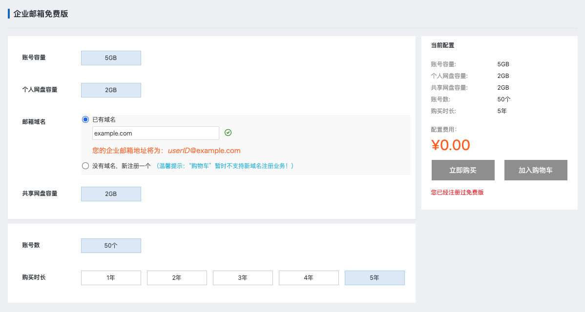
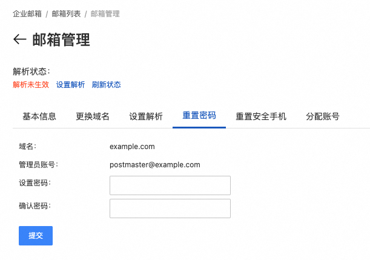
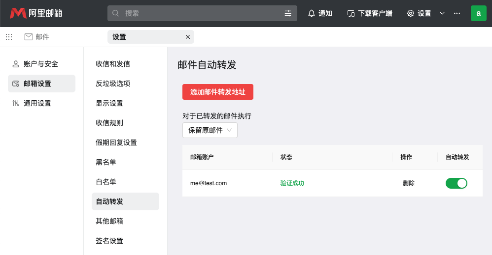
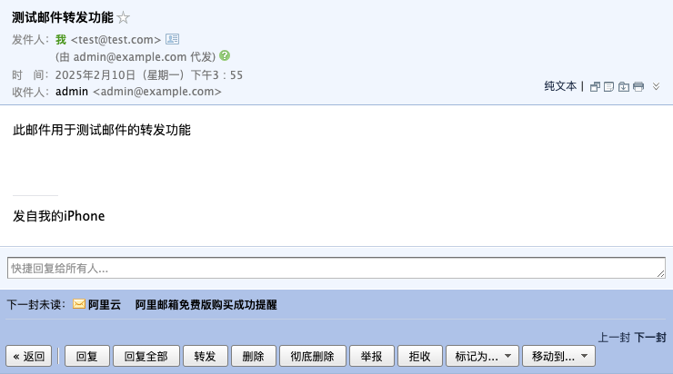
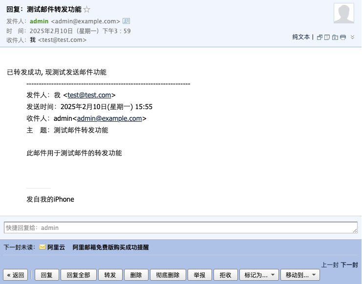

当拥有自己的域名之后, 就可以使用 **阿里邮箱(免费版)** 配置自己的 **域名邮箱** 了, 例如域名是 `example.com`, 就可以创建例如 `xxx@example.com` 的邮箱, 并直接通过 阿里邮箱 进行邮件收发, 不需要自己搭建邮件系统

:::tip
通过服务器直接发送邮件可以参考 [通过服务器发送邮件](/posts/2025/server-mail/)
:::

## 1. 购买阿里邮箱(免费版)

1. 进入阿里邮箱文档 [阿里邮箱 - 版本介绍](https://help.aliyun.com/document_detail/437165.html)
2. 找到免费版, 点击 **开通免费邮箱**
3. 在邮箱域名中选择已有域名, 输入自己的域名, 购买时长选择 `5` 年
4. 点击立即购买(*我这里已经购买过了*)

## 2. 配置邮箱账号

1. 进入 [阿里邮箱 - 开通指南](https://help.aliyun.com/document_detail/36698.html) 文档页面
2. 按照 *一、设置邮箱管理员密码* 先设置好邮箱密码, 这里可以看到 **管理员账号** 为 `postmaster@example.com`
3. 按照 *二、分配员工账号* 操作, 进入 [阿里邮箱网页端](https://qiye.aliyun.com/?spm=a2c4g.11186623.0.0.67282e6a1kYYTI) 并登录 **管理员账号**
4. 参照文档创建新账号

## 3. 配置域名解析
直接参照 [四、添加解析](https://help.aliyun.com/document_detail/36698.html?spm=a2c4g.11186623.help-menu-35466.d_4_1.190266f8DIfE4a&scm=20140722.H_36698._.OR_help-T_cn~zh-V_1#:~:text=%E8%BF%87%E6%AD%A4%E6%AD%A5%E9%AA%A4%E3%80%82-,%E5%9B%9B%E3%80%81%E6%B7%BB%E5%8A%A0%E8%A7%A3%E6%9E%90,-%E6%B8%A9%E9%A6%A8%E6%8F%90%E7%A4%BA%EF%BC%9A%E6%8C%89) 进行操作, **如果是在阿里云购买的域名, 就可以直接 一键添加邮箱解析**, 配置好域名解析后可能需要等几分钟才会生效

:::warning
需要特别注意的是, 如果已经配置了根域名的解析(即主机记录为 `@`, 记录类型为 `A` 的解析规则), 在使用 **一键添加邮箱解析** 时可能会提示冲突(“A”记录和“CNAME”记录有冲突，请暂停或删除现有的“CNAME”记录后重试), 但其实解析规则已添加, 可以正常收发邮件, 详见 [解析记录冲突的解决办法](https://help.aliyun.com/zh/dns/dns-record-conflict-rules?spm=a2c4g.11186623.0.0.ea9c60b4rqeNNs)
:::

## 4. 测试邮箱
当配置好域名解析后, 就可以使用自己创建的账号登录 [阿里邮箱网页端](https://qiye.aliyun.com/?spm=a2c4g.11186623.0.0.67282e6a1kYYTI) 进行收发邮件了

### 4.1 配置邮件自动转发
如果你没有在手机上安装 阿里邮箱 app, 可能不会及时收到邮件, 可以在邮箱中配置邮件转发, 将收到的邮件邮件转发到自己的常用邮箱上:

1. 进入 阿里邮箱 网页端
2. 点击 **设置 - 查看更多设置 - 邮件设置 - 自动转发**
3. 点击 **添加邮件转发地址** 添加自己的常用邮箱
4. 添加好后会收到一封 *请验证自动转发的邮件地址* 的邮件, 点击链接进行验证
5. 验证成功后, 就可以 **测试一下转发功能** 了(`test@test.com` 向 `admin@example.com` 发送邮件, 将会转发到我的常用邮箱中)

6. 然后再 **测试一下发送功能**(`admin@example.com` 向 `test@test.com` 发送邮件)

## 参考
- [阿里邮箱 - 版本介绍](https://help.aliyun.com/document_detail/437165.html)
- [阿里邮箱 - 开通指南](https://help.aliyun.com/document_detail/36698.html)
- [阿里邮箱网页端](https://qiye.aliyun.com)
