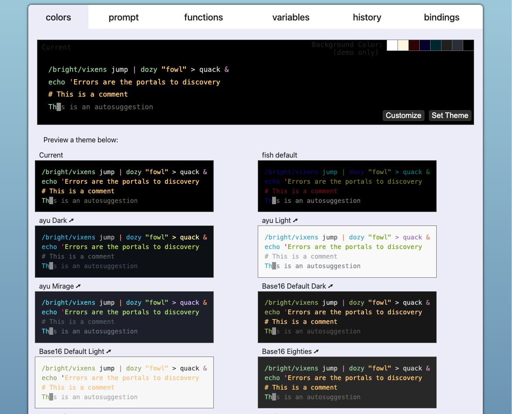
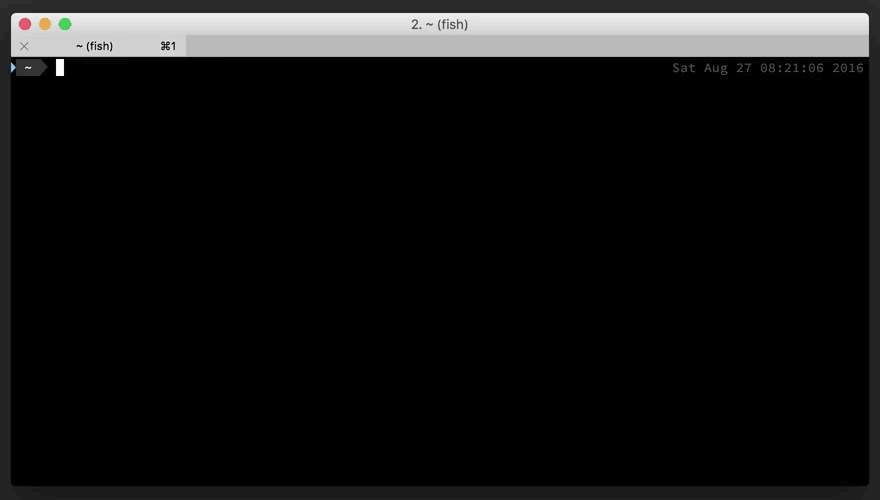
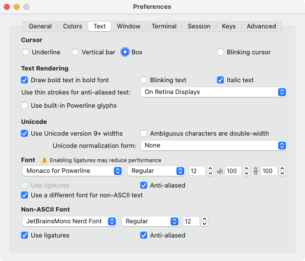

## 介绍

::github{repo="fish-shell/fish-shell"}

[fish shell](https://fishshell.com/)(`the friendly interactive shell`) 是一个开源的终端命令行工具, 它具有许多功能, 如 **自动补全 / 语法高亮 / 命令历史记录** 等

### 兼容性
:::warning
`fish shell` 与 `macOS` 自带的 `zsh` 最大的不同就是, **`fish shell` 不完全兼容 `bash` `POSIX shell`, 这会导致在 `fish` 中执行一些 `shell` 脚本时会报错**
:::

## 安装
### MacOS
```bash
brew install fish
```

### Linux
```bash
sudo apt-add-repository ppa:fish-shell/release-3
sudo apt update
sudo apt install fish
```

### windows
在 windows 上, [fish shell](https://fishshell.com/) 可以在 [Windows Subsystem for Linux](https://docs.microsoft.com/zh-cn/windows/wsl/install) 上安装, 其他终端环境的兼容性不详, 更多信息可以参考 [windows - fish shell](https://github.com/fish-shell/fish-shell?tab=readme-ov-file#windows)

## 设置为 默认 shell
**以 `macOS` 为例**:

1. 查看 fish 路径

```bash
wihch fish
/opt/homebrew/bin/fish
```

2. 尝试使用 chsh 命令设置 fish 为默认 shell
```bash
chsh -s /opt/homebrew/bin/fish
```

3. 退出终端并打开新终端测试

```bash
exit # 退出当前终端
```

打开新终端:
```bash
# 如果未进入 fish shell, 则需要在 /etc/shells 文件末尾增加 fish shell 的路径, 然后再次进入新终端测试
echo "/opt/homebrew/bin/fish" | sudo tee -a /etc/shells > /dev/null
```

:::warning
至此 `fish shell` 已经安装并设置为默认 shell, 但在某些 `Linux` 系统上, 可能会遇到各种报错, 若无法解决, 也可以在每次进入终端后执行 `fish` 进入 `fish shell`
:::

## 配置
**[fish shell](https://fishshell.com/) 的配置文件在 `~/.config/fish/config.fish`**

### 配置文件
在 [fish shell](https://fishshell.com/) 的配置文件中一般会设置一些 **环境变量 / function / fish 配置** 等, 以下是一些示例:

#### 环境变量
将 `~/.cargo/bin` 加入系统环境变量 `PATH` 中:
```bash
# rust
set -Ux CARGO_HOME $HOME/.cargo
set -Ux PATH $CARGO_HOME/bin $PATH
```

#### function
增加用于设置代理的 `proxy function`:
```bash
# proxy [Address of proxy]
function proxy
    set -Ux all_proxy http://127.0.0.1:7890
    set -Ux http_proxy http://127.0.0.1:7890
    set -Ux https_proxy http://127.0.0.1:7890
    echo all_proxy=$all_proxy
    echo http_proxy=$http_proxy
    echo https_proxy=$https_proxy
end

function noproxy
    set -e all_proxy
    set -e http_proxy
    set -e https_proxy
end
```

设置成功后可直接执行 `proxy` / `noproxy` 来启用和关闭代理
```bash
proxy # 开启代理
noproxy # 关闭代理
```

#### fish 配置
[fish shell](https://fishshell.com/) 也提供了一些配置项, 我这里只设置了 `vi key bindings`:

`~/.config/fish/config.fish`:
```bash
fish_vi_key_bindings
```

```bash
source ~/.config/fish/config.fish
```

此时 **在终端命令行中就可以使用 `vim` 的常用操作了**, 对于 `vim` 党非常友好, 例如:

- 模式:
  - `Insert Mode`
  - `Command Mode`
  - `Visual Mode`

- 光标移动: `hjkl` / `0` / `$` / `w` / `b` / `e` / `...`
- 编辑: `dd` / `D` / `u` / `C-r` / `...`
- 其他: `/` 搜索历史记录

### fish_config
`fish_config` 是一个图形化配置工具, 可以通过它来配置 `fish shell` 的 `colors` / `prompt` / `functions` / ...

```bash
fish_config # 执行后会打开一个网页
```



:::tip
在选择好 colors / prompt 后, 需要点击 `Set Theme` / `Set Prompt` 才会生效, 已有的终端也需要 `source ~/.config/fish/config.fish` 才会生效
:::

## oh-my-fish
::github{repo="oh-my-fish/oh-my-fish"}

**`oh-my-fish` 是一个开源的 `fish shell` 的插件管理器**, 类似于 `zsh` 的 `oh-my-zsh`, 可以通过它来安装一些常用的 插件 / 主题

### 安装主题
在开源社区有非常多有意思的主题, 查看所有主题: [Themes](https://github.com/oh-my-fish/oh-my-fish/blob/master/docs/Themes.md)

例如安装 [bobthefish theme](https://github.com/oh-my-fish/oh-my-fish/blob/master/docs/Themes.md#bobthefish)
```bash
omf install bobthefish
```

示例:



### 安装字体

:::tip
由于 [bobthefish theme](https://github.com/oh-my-fish/oh-my-fish/blob/master/docs/Themes.md#bobthefish) 使用了一些特殊符号, **我们电脑中的默认字体中并没有这些符号, 所以需要安装 patched-fonts 来支持这些特殊符号**, 详见 [patched-fonts](https://powerline.readthedocs.io/en/master/installation.html#patched-fonts)
:::

这里推荐从 [ryanoasis/nerd-fonts](https://github.com/ryanoasis/nerd-fonts?tab=readme-ov-file#patched-fonts) 找到自己喜欢的字体, 并在 [releases](https://github.com/ryanoasis/nerd-fonts/releases) 中下载对应的字体文件并在系统上安装, 字体文件比较多, 并不需要都安装, 选择一个系列的全选右键打开安装即可

安装完字体后, 还需要在自己的终端软件中设置字体, 例如在 `iTerm2` 中:
1. 在终端中右键, 点击 `Edit Session...`
2. 进入 `Text > Font`, 选择 `Use a different font for non-ASCII text` 并选择 `Non-ASCII Font` 字体, 或直接在 `Font` 中选择安装的字体



## 参考
- [fish shell](https://fishshell.com/)
- [oh-my-fish](https://github.com/oh-my-fish/oh-my-fish)
