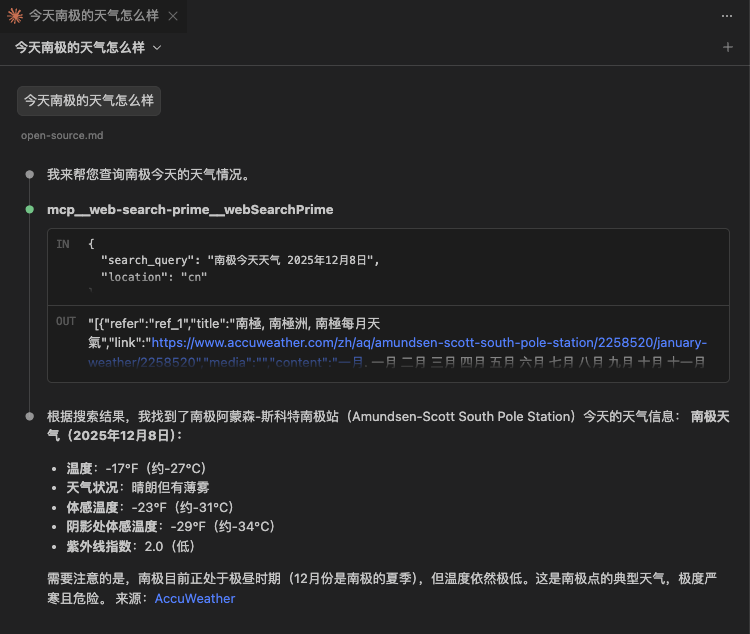

## 免费额度

<a href="https://www.bigmodel.cn/claude-code?cc=fission_glmcode_sub_v1&ic=Q2N8XA4W77&n=a****3" target="_blank">🔗 GLM Coding Plan</a> 默认是没有 联网搜索 / 视觉理解 / 网页读取 能力的, 但 **套餐内是有免费使用额度的**:

- Lite 套餐：**联网搜索 MCP 和网页读取 MCP** 每月合计 **1 百次**，达到上限后当月无法调用；**视觉理解 MCP** 共享套餐的 **5 小时最大 prompt 资源池**，达到上限后会在 5 小时周期后恢复额度
- Pro 套餐：**联网搜索 MCP 和网页读取 MCP** 每月合计 **1 千次**，达到上限后当月无法调用；**视觉理解 MCP** 共享套餐的 **5 小时最大 prompt 资源池**，达到上限后会在 5 小时周期后恢复额度
- Max 套餐：**联网搜索 MCP 和网页读取 MCP** 每月合计 **4 千次**，达到上限后当月无法调用；**视觉理解 MCP** 共享套餐的 **5 小时最大 prompt 资源池**，达到上限后会在 5 小时周期后恢复额度

## 视觉理解
```bash
claude mcp add -s user zai-mcp-server --env Z_AI_API_KEY=your_api_key -- npx -y "@z_ai/mcp-server"
```

打开 `claude code`, 输入以下命令, 直接输入 `@` 选择一个图片文件:

```bash
分析一下 @src/content/posts/2025/assets/images/jining-kongzi-stone.jpg
```


## 联网搜索
```bash
claude mcp add -s user -t http web-search-prime https://open.bigmodel.cn/api/mcp/web_search_prime/mcp --header "Authorization: Bearer your_api_key"
```

测试一下:



## 网页读取
```bash
claude mcp add -s user -t http web-reader https://open.bigmodel.cn/api/mcp/web_reader/mcp --header "Authorization: Bearer your_api_key"
```


## 参考
- <a href="https://www.bigmodel.cn/claude-code?cc=fission_glmcode_sub_v1&ic=Q2N8XA4W77&n=a****3" target="_blank">GLM Coding Plan</a>
- <a href="https://docs.bigmodel.cn/cn/coding-plan/mcp/vision-mcp-server" target="_blank">视觉理解 MCP</a>
- <a href="https://docs.bigmodel.cn/cn/coding-plan/mcp/search-mcp-server" target="_blank">联网搜索 MCP</a>
- <a href="https://docs.bigmodel.cn/cn/coding-plan/mcp/reader-mcp-server" target="_blank">网页读取 MCP</a>