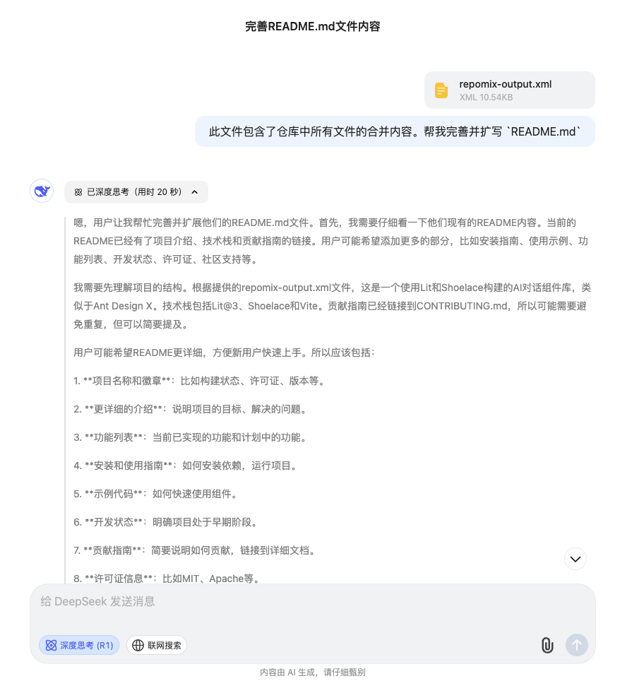

本文将深入探讨如何通过结构化提示工程(`Prompt Engineering`) 帮助 `AI` 深度理解项目上下文, 从而提升编码辅助效率

## 目录
1. [使用 Lit 创建一个 AI 对话组件库 01 搭建篇](../hyosan-chat-01-create/)
2. [使用 Lit 创建一个 AI 对话组件库 02 Prompts 篇](../hyosan-chat-02-prompts/)
3. [使用 Lit 创建一个 AI 对话组件库 03 可行性验证 篇](../hyosan-chat-03-feasibility/)
4. [使用 Lit 创建一个 AI 对话组件库 04 国际化 篇](../hyosan-chat-04-i18n/)

## 前言
随着 `LLM` 技术的发展, `AI` 的编码能力和代码阅读能力越来越强, 要实现真正的 `AGI`, 也就是 `AI` 替代人类(当然也包括程序员), 似乎最大的障碍只剩下了人类参差不齐的迷惑的表达能力, 也就是讲清楚自己要做什么, 并且让 AI 能够准确理解自己的需求; *听起来怎么这么像产品经理给程序员讲需求, 只是这次程序员变成了产品经理 😅*

## AI 取代论
最近爆火的 [Deepseek](https://www.deepseek.com/) 让我们感受到了 `AI` 进化的速度似乎比我们想象的更快, 那 `AI` 能够在何种程度上取代程序员呢? 让我们思考一下软件开发流程:

1. 产品经理提出需求
2. 评估需求可行性
3. 理解需求并编写设计文档
4. 编码
5. 测试
6. 修复 `bug`
7. 上线

通过梳理开发流程可以看到, 真正用来编码的时间估计只有 `30% ~ 50%`

- 在 `1` `2` 中, 产品经理是真正的人类思维, 并且 **人类的表达能力并不能保证其他人能够完全准确的理解需求**, 也并不懂某个需求在编码时能否实现, 更无法预知编码时需要考虑的东西, 所以就需要 **需求评审** 会, 作为程序员经常要跟产品经理 `battle`
- `3` 系统设计, 程序员要 **将人类语言拆解为可以用程序实现的具体的任务**, 把看起来笼统的需求具象化
- 然后才开始第 `4` 步编码, 除了实现需求外, 还要让编码 **符合项目规范**, **保持良好的代码风格**
- 随后测试环节更不能掉以轻心, 因为测试是项目上线前的最后一环, 测试人员需要 **将笼统的需求转换为可实际操作的测试用例**
- 然后开始 `bug` 消除环节, `bug` 消灭之后上线

由此我们发现, 软件开发流程中真正的复杂性在于:
- 需求的整理和表达能力
- 将人类语言转化为 软件系统设计文档
- 将人类语言转化为 测试用例

这也正是现阶段 `AI` 与屏幕前的用户之间的无形障碍, 就是人类需要 **信息表达能力** 和 **信息转换的能力**; 想象一下身边的大佬同事, 我们对他的评价时常是 **他理解能力很强** / **他表达能力很强, 让他给我们讲讲**

## 解药
> `Prompts` 是 `AGI` 时代的 编程语言

作为程序员如何能够更好的使用 `AI` 呢? 在我看来就是编写 **尽可能准确和详细的各种文档**, 在整个项目的视角上, 具体而言就是:

- `README.md`: 描述整个项目
- `CHANGELOGS.md`: 描述版本更新信息
- `CONTRIBUTING.md`: 描述如何参与项目

接下来我们创建这些文件

## Prompts
| 关键字 | 构成说明                                                                                                                       |
| ------ | ------------------------------------------------------------------------------------------------------------------------------ |
| 角色   | 给 AI 定义一个最匹配任务的角色，比如：「你是一位软件工程师」「你是一位小学老师」                                               |
| 指示   | 对任务进行描述                                                                                                                 |
| 上下文 | 给出与任务相关的其它背景信息（尤其在多轮交互中）                                                                               |
| 例子   | 必要时给出举例, 学术中称为 `one-shot learning`, `few-shot learning` 或 `in-context learning`; 实践证明其对输出正确性有很大帮助 |
| 输入   | 任务的输入信息；在提示词中明确的标识出输入                                                                                     |
| 输出   | 输出的格式描述, 以便后继模块自动解析模型的                                                                                     |
| 输出   | 结果, 比如(`JSON / XML`)                                                                                                       |

## 使用 repomix 提取项目代码
```bash
pnpm i -g repomix
repomix --init
```

`repomix` 会生成以下几个文件:

- `repomix.config.json`: 配置文件
- `.repomixignore`: 在提取代码时忽略的文件, 类似于 `.gitignore`

我们在 `.repomixignore` 中加入以下不适合提供给 `AI` 的文件:

```bash
public/*
src/assets/*
commitlint.config.ts
LICENSE
```

然后我们尝试一下将文件上传至 [deepseek](https://chat.deepseek.com):



## 参考
- [repomix](https://repomix.com/zh-cn/)
- [二、人工智能之提示工程(Prompt Engineering)](https://juejin.cn/post/7329785321626664970)
