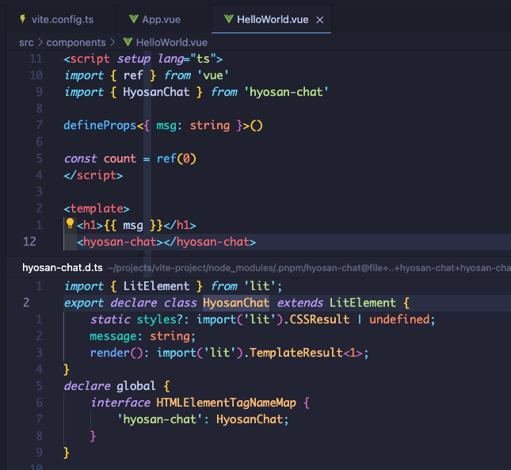
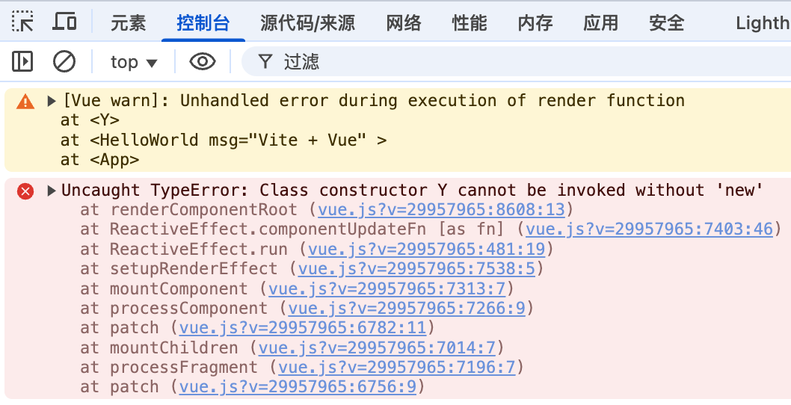
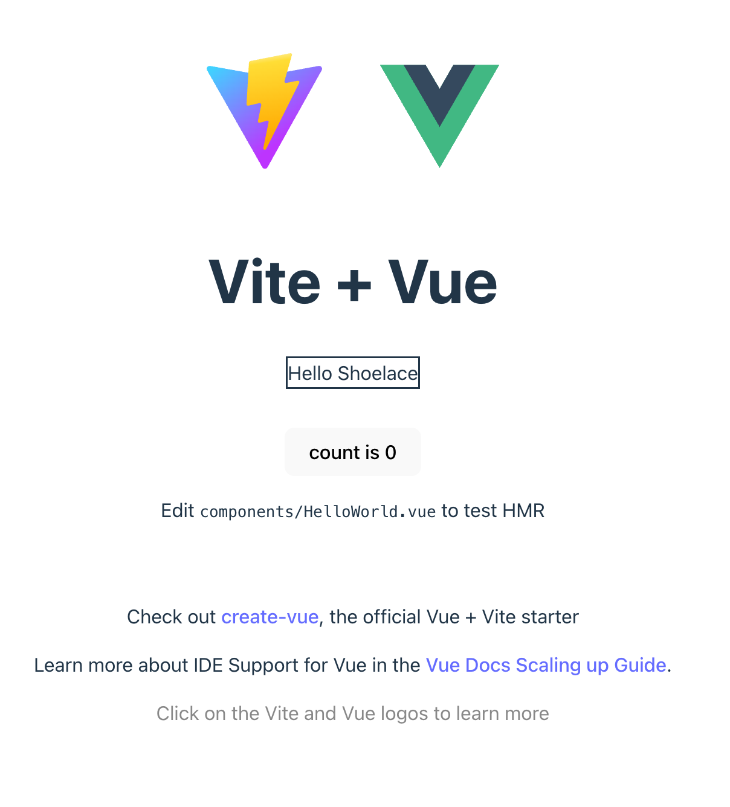
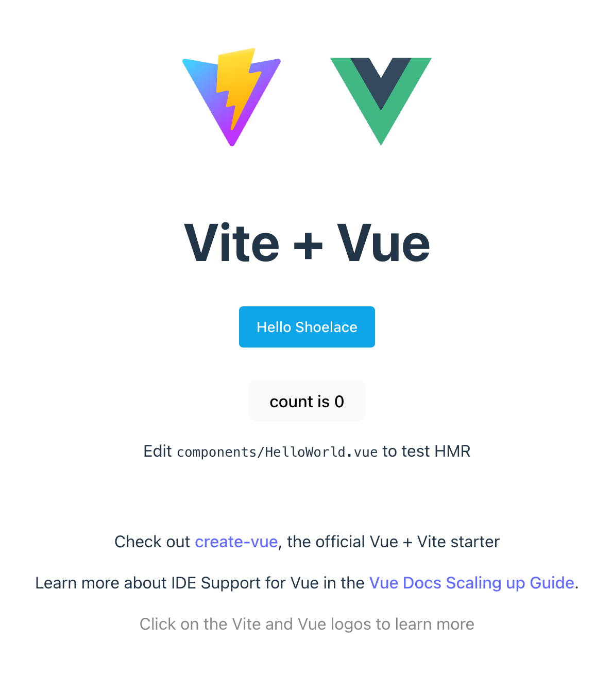

本文将介绍组件库在打包发布后, 在实际的项目中使用是否可行，以及如何进行验证

## 为什么要验证可行性
当我们打算使用一项新技术或新的库时, **最先要做的就是验证可行性**; 因为对于新的外部依赖, 我们无法确定是否符合预期, 以及是否会带来新的问题, 进行一次最小规模的验证, 可以 **尽早的暴露问题**

## 打包
我们的项目是使用 [vite](https://cn.vitejs.dev/guide/) 进行搭建的, `vite` 提供了 [library mode](https://cn.vitejs.dev/guide/build.html#library-mode) 以支持将项目中的部分文件进行单独打包, 并构建为库以供其他项目使用

### TypeScript 配置
```bash
# 引入生成 .d.ts 文件的插件
pnpm i -D vite-plugin-dts
```

`tsconfig.json`:
```diff
{
	"compilerOptions": {
    // ...
+		"declaration": true,
+		"outDir": "dist",
  }
}
```

创建 `src/lib.ts` 作为组件库的入口文件:
```typescript
export * from './components'
```

我们的项目是使用 `ts` 编写的, 为了让我们的组件库可以支持 `ts` 项目, 我们需要使用 [vite-plugin-dts](https://github.com/qmhc/vite-plugin-dts/blob/HEAD/README.zh-CN.md) 将 `.d.ts` 文件生成到 `dist` 目录下

`vite.config.ts`:
```diff
+ import dts from 'vite-plugin-dts'

export default defineConfig({
  // ...
+ 	plugins: [
+ 		// 用于生成 `d.ts` 文件, refer https://github.com/qmhc/vite-plugin-dts/blob/HEAD/README.zh-CN.md
+ 		dts({ tsconfigPath: './tsconfig.lib.json' })
+ 	],
+ 	build: {
+ 		lib: {
+ 			name: 'hyosan-chat',
+ 			entry: ['src/lib.ts'],
+ 			fileName: 'hyosan-chat',
+ 		},
+ 	},
})
```

创建 `tsconfig.lib.json`:
```json5
{
  "extends": "./tsconfig.json", // 继承已有的 tsconfig.json
  "include": [ // 添加需要在打包时生产 .d.ts 文件的文件
    "./src/lib.ts",
    "./src/components/**/*.ts",
  ]
}
```

:::tip
为什么要额外创建一个 `tsconfig.json`?

在打包时, **`vite-plugin-dts` 会将 `tsconfig.json` 中的 `include` 中的文件进行打包(这里指生成 `dts`)**, 但 `tsconfig.json` 中 `include` 包含了项目中的所有文件, 也包括了不应该出现在 `dist` 目录中的文件, **但我们不能修改 `tsconfig.json`, 因为它适用于整个项目的开发环境**, 所以我们需要创建单独的 `tsconfig.lib.json` 用于生成 `d.ts`

也就是说, **`tsconfig.json` 用于开发环境, `tsconfig.lib.json` 用于打包时生成 `d.ts`**
:::

**我们将 `src/lib.ts` 中导出的组件作为整个组件库对外提供的组件**, 并通过 [vite-plugin-dts](https://github.com/qmhc/vite-plugin-dts/blob/HEAD/README.zh-CN.md) 生成了类型描述文件

### package.json 配置

当我们的项目作为组件库供外部使用时, 需要在 `package.json` 中声明 **组件库的基本信息和对外提供的文件**:
```diff
{
+	 "description": "A library of web components for AI conversations based on lit and shoelace",
+	 "keywords": ["hyosan-chat", "Lit", "Shoelace", "AI", "chat", "Web Components", "web chat"],
+	 "author": {
+	  	"name": "Ryan"
+	 },
+	 "license": "MIT",
-	 "version": "0.0.0",
+	 "version": "0.0.1",
-  "private": true,
+ 	"files": [
+ 		"dist"
+ 	],
+ 	"main": "./dist/hyosan-chat.umd.cjs",
+ 	"module": "./dist/hyosan-chat.js",
+ 	"exports": {
+ 		".": {
+ 			"import": "./dist/hyosan-chat.js",
+ 			"require": "./dist/hyosan-chat.umd.cjs"
+ 		}
+ 	},
	"scripts": {
+		"build:pack": "pnpm run build && pnpm pack",
  },
}
```

### build & pack

修改完打包所需的配置后, 我们就可以使用 `pnpm run build` 进行打包了:
```bash
# 打包
pnpm run build

# 打包并生成 .tgz 文件
pnpm run build:pack
```

```bash
lsd --tree dist/
 dist
├──  components
│   ├──  hyosan-chat.d.ts
│   └──  index.d.ts
├──  hyosan-chat.js
├──  hyosan-chat.umd.cjs
├──  lib.d.ts
└──  vite.svg
```

我们观察一下打包后的产物:
| 文件                          | 说明                         |
| ----------------------------- | ---------------------------- |
| `components/hyosan-chat.d.ts` | 对话组件                     |
| `components/index.d.ts`       | 组件库中包含的组件的入口文件 |
| `hyosan-chat.js`              | `es` 打包格式产物            |
| `hyosan-chat.umd.cjs`         | `umd` 打包格式产物           |
| `lib.d.ts`                    | 组件库的入口文件             |
| `vite.svg`                    | `vite logo`                  |

- 其中 `vite.svg` 不应该出现在 `dist` 目录中, 因为我们将其删除
```bash
rm public/vite.svg
```

- `lib.d.ts` 是组件库的入口文件的类型描述文件, 我们需要在 `package.json` 中声明:
```diff
{
+  "types": "./dist/lib.d.ts"
	"exports": {
		".": {
+ 			"types": "./dist/lib.d.ts",
			"import": "./dist/hyosan-chat.js",
			"require": "./dist/hyosan-chat.umd.cjs"
		}
	},
}
```

`dist` / `hyosan-chat-0.0.1.tgz` 文件作为打包后的产物, 不应该提交到仓库中, 我们将其添加到 `.gitignore` 中:
```diff
+dist
+hyosan-chat-*.tgz
```

## 验证
打包完成后, 我们需要创建一个新的 `vue` 项目来引入组件库进行测试:

```bash
pnpm create vite
.../1954f95e4b3-1078                     |   +1 +
.../1954f95e4b3-1078                     | Progress: resolved 1, reused 0, downloaded 1, added 1, done
│
◇  Project name:
│  vite-project
│
◇  Select a framework:
│  Vue
│
◇  Select a variant:
│  TypeScript
│
◇  Scaffolding project in /Users/xxx/projects/vite-project...
│
└  Done. Now run:

  cd vite-project
  pnpm install
  pnpm run dev
```

```bash
cd vite-project
pnpm i && pnpm i ./hyosan-chat/hyosan-chat-0.0.1.tgz
code .
```

我们使用 `vscode` 打开项目, 检查有无 报错 / 引入失败 / 类型缺失 等问题:



在 `vscode` 中打开 `HelloWorrld.vue` 尝试引入组件库并添加 `<hyosan-chat>` 组件, 发现组件可以成功引入, 也有正确的类型定义

下面我们启动项目查看页面显示是否正常:
```bash
pnpm run dev
```



页面没有显示出组件, 这里的报错(`Class constructor Y cannot be invoked without 'new'`)是因为 `vue` 把它当做了 `vue` 组件进行了渲染, 但其实它应该被当做 **自定义元素**, 通过查看 [在 vue 中使用自定义元素](https://cn.vuejs.org/guide/extras/web-components.html#using-custom-elements-in-vue), 发现应该在 `vite.config.ts` 中添加 `isCustomElement`:

```typescript
import { defineConfig } from 'vite'
import vue from '@vitejs/plugin-vue'

// https://vite.dev/config/
export default defineConfig({
  plugins: [
    vue({
      template: {
        compilerOptions: {
          isCustomElement: tag => tag.includes('hyosan-')
        }
      }
    })
  ],
  server: {
    port: 35195,
  }
})
```



添加 `isCustomElement` 后, 组件渲染出来了, 但是样式没有, 这是因为我们在搭建项目引入 `shoelace` 时, 使用最简单的 `<link>` `cdn URL` 的方式引入了 `shoelace` 的样式, 在新创建的项目中并没有这个 `<link>`, 我们为了进行验证, 先引入 `<link>`, 在后文我们会优化引入方式

`index.html`:
```diff
+    <link
+      rel="stylesheet"
+      media="(prefers-color-scheme:light)"
+      href="https://cdn.jsdelivr.net/npm/@shoelace-style/shoelace@2.20.0/cdn/themes/light.css"
+    />
+    <link
+      rel="stylesheet"
+      media="(prefers-color-scheme:dark)"
+      href="https://cdn.jsdelivr.net/npm/@shoelace-style/shoelace@2.20.0/cdn/themes/dark.css"
+      onload="document.documentElement.classList.add('sl-theme-dark');"
+    />
```



再次查看页面, 组件正常渲染, 但在我们现在依然有几个需要解决的问题:

- 组件的样式现在依然使用的是 `<link>` `cdn` 的方式实现, 但我们的用户使用环境可能是内网, 无法访问 `cdn` 的资源, 因此我们需要优化引入方式, 改为 **在组件库中 `export` `shoelace` 的样式**
- `vscode` 中的 `HelloWorld.vue` 中编写 `<hyosan-chat>` 时, 没有关于 `hyosan-chat` 组件的类型提示(`props` / `events`), 也就是 `vscode` 无法识别 `hyosan-chat` 组件的类型; 得益于 `vue` 对自定义组件的重视, 我们可以 **生成类型定义文件对 `vue GlobalComponents` 进行扩展**, 这里我们可以使用一些第三方库([custom-element-vuejs-integration](https://www.npmjs.com/package/custom-element-vuejs-integration)) 来实现, 详见 [非 Vue Web Components 和 TypeScript](https://cn.vuejs.org/guide/extras/web-components.html#non-vue-web-components-and-typescript)
- 组件库没有 **提供多语言支持**, 虽然 `shoelace` 提供了 [本地化](https://shoelace.style/getting-started/localization) 和 [语言包文件](https://github.com/shoelace-style/shoelace/tree/current/src/translations)

这些问题我们将在后续章节中一一解决

## 参考
- [库模式 - vite](https://cn.vitejs.dev/guide/build.html#library-mode)
- [vite-plugin-dts](https://github.com/qmhc/vite-plugin-dts/blob/HEAD/README.zh-CN.md)
- [在 vue 中使用自定义元素](https://cn.vuejs.org/guide/extras/web-components.html#using-custom-elements-in-vue)
- [非 Vue Web Components 和 TypeScript](https://cn.vuejs.org/guide/extras/web-components.html#non-vue-web-components-and-typescript)
- [custom-element-vuejs-integration](https://www.npmjs.com/package/custom-element-vuejs-integration)
