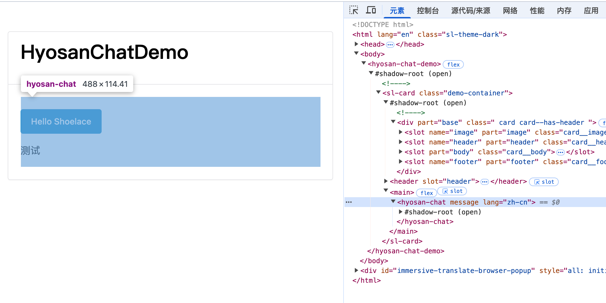
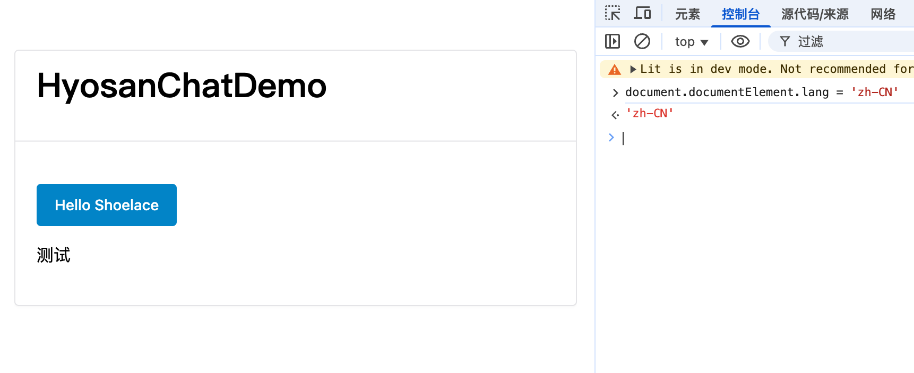

当我们将组件库公开发布后, 可以被任何国家任何人使用, 我们除了要有完善可靠的功能, 还要考虑诸如 国际化 / `ts` 类型定义 / 主题 等可以提升用户体验的东西

## 目录
1. [使用 Lit 创建一个 AI 对话组件库 01 搭建篇](../hyosan-chat-01-create/)
2. [使用 Lit 创建一个 AI 对话组件库 02 Prompts 篇](../hyosan-chat-02-prompts/)
3. [使用 Lit 创建一个 AI 对话组件库 03 可行性验证 篇](../hyosan-chat-03-feasibility/)
4. [使用 Lit 创建一个 AI 对话组件库 04 组件库探索完善 篇](../hyosan-chat-04-lib/)

## 前言
在 [使用 Lit 创建一个 AI 对话组件库 03 可行性验证 篇](../hyosan-chat-03-feasibility/) 中我们发现了组件库存在以下问题:

- 缺少 **国际化** 功能
- 在 vue 中缺少 **类型定义**
- 缺少 **主题** 功能

对于一个组件库来说, 我们的组件可能会被不同的项目使用, 如果我们不考虑多语言, 那就极大地限制了不同语言环境下的用户的使用, 所以我们需要考虑国际化; 对于类型定义和主题切换来说也是同样的道理

## 国际化
[shoelace](https://shoelace.style/) 本身提供了 [国际化支持](https://shoelace.style/getting-started/localization), `shoelace` 是一个基于 [Lit](https://lit.dev) 的优秀的 UI 组件库, 我们阅读一下 shoelace 的源码, 借鉴一下 shoelace 的国际化实现:

我们从语言文件开始, 例如 [src/translations/zh-cn.ts](https://github.com/shoelace-style/shoelace/blob/next/src/translations/zh-cn.ts), 文件中使用了 [src/utilities/localize.ts](https://github.com/shoelace-style/shoelace/blob/next/src/utilities/localize.ts) 中导出的 `registerTranslation`, `registerTranslation` 实际上来自于 [@shoelace-style/localize](https://www.npmjs.com/package/@shoelace-style/localize) 包, 原来 shoelace 将本地化功能拆分为了一个单独的包, 而且可以与 `lit` 完美结合, 零依赖! 

`@shoelace-style/localize` 的示例:

```typescript
import { LocalizeController, registerTranslation } from '@shoelace-style/localize';

// Note: translations can also be lazy loaded (see "Registering Translations" below)
import en from '../translations/en';
import es from '../translations/es';

registerTranslation(en, es);

@customElement('my-element')
export class MyElement extends LitElement {
  private localize = new LocalizeController(this);

  @property() lang: string;

  render() {
    return html`
      <h1>${this.localize.term('hello_world')}</h1>
    `;
  }
}
```

这里我们引入了 `@shoelace-style/localize` 并注册了多语言文案 `en` / `es`, 接着我们在组件中声明了 `localize = new LocalizeController(this)` 和 `@property() lang: string`, 最后在 render 中使用 `this.localize.term('hello_world')` 来获取文案, 他会在 `lang` 属性变化的时候自动更新多语言文案内容

这是一个优秀的设计, 我们仅需要修改 `html[lang]` 或 组件的 `lang` 属性, 组件就能根据新的语言进行渲染; 我们来猜一下 `@shoelace-style/localize` 是如何实现的, 首先 `new LocalizeController(this)` 时将当前组件类的示例传入了 `LocalizeController`, 并在 `LocalizeController` 内部监听 `lang` 属性的变化, 并且调用组件示例的用于渲染 `DOM` 的方法...

接下来让我们阅读 `@shoelace-style/localize` 源码, 查看具体是如何实现的:

[localize/src/index.ts](https://github.com/shoelace-style/localize/blob/04e58c3687c1cd67fd4aba423ce4ad60b6b2c215/src/index.ts#L100C14-L100C32):
```typescript
export class LocalizeController<UserTranslation extends Translation = DefaultTranslation>
  implements ReactiveController
{
  constructor(host: ReactiveControllerHost & HTMLElement) {
    this.host = host;
    this.host.addController(this);
  }
  // ...
}
```

首先在 `constructor` 中调用了组件的 [addController](https://lit.dev/docs/components/lifecycle/#addController), 这是一个用于向 `LitElement` 添加响应式控制器的方法, 它允许外部代码与 `Lit` 的响应式生命周期集成, 简而言之 **`LocalizeController` 可以直接调用组件的生命周期 hooks, 也就可以直接更新组件**, 详见 [Reactive Controllers](https://lit.dev/docs/composition/controllers/)

```typescript
const connectedElements = new Set<HTMLElement>();
if (isClient) {
  const documentElementObserver = new MutationObserver(update);
  documentDirection = document.documentElement.dir || 'ltr';
  documentLanguage = document.documentElement.lang || navigator.language;

  // Watch for changes on <html lang>
  documentElementObserver.observe(document.documentElement, {
    attributes: true,
    attributeFilter: ['dir', 'lang']
  });
}
/** Updates all localized elements that are currently connected */
export function update() {
  if (isClient) {
    documentDirection = document.documentElement.dir || 'ltr';
    documentLanguage = document.documentElement.lang || navigator.language;
  }

  [...connectedElements.keys()].map((el: LitElement) => {
    if (typeof el.requestUpdate === 'function') {
      el.requestUpdate();
    }
  });
}
// ...

export class LocalizeController<UserTranslation extends Translation = DefaultTranslation>
  implements ReactiveController
{
  hostConnected() {
    connectedElements.add(this.host);
  }

  hostDisconnected() {
    connectedElements.delete(this.host);
  }
  /**
   * Gets the host element's language as determined by the `lang` attribute. The return value is transformed to
   * lowercase.
   */
  lang() {
    return `${this.host.lang || documentLanguage}`.toLowerCase();
  }
  /** Outputs a translated term. */
  term<K extends keyof UserTranslation>(key: K, ...args: FunctionParams<UserTranslation[K]>): string {
    const { primary, secondary } = this.getTranslationData(this.lang());
    // ...
  }
  // ...
}
```

在这里先把组件存到了 `connectedElements` 中, 然后在外部通过 `MutationObserver` 监听了 `HTML` 标签的 `lang` 属性变化, 并同步调用 `update` 调用组件的 `requestUpdate()` 来更新组件; 除此之外, 在组件内部的 `lang` 属性变化时, 也会调用 `render`, 并调用 `term` 来根据最新的 `lang` 更新组件

至此 `@shoelace-style/localize` 的示例的具体实现我们就分析完了, 接下来我们看一下 `shoelace` 是如何使用 `@shoelace-style/localize` 的:

[src/internal/shoelace-element.ts](https://github.com/shoelace-style/shoelace/blob/6f09a7556731107e027b8afade0ad1e28d77c710/src/internal/shoelace-element.ts#L65):
```typescript

export default class ShoelaceElement extends LitElement {
  // Make localization attributes reactive
  @property() dir: string;
  @property() lang: string;
  // ...
}
```

这里 `shoelace` 并没有在每个组件上都声明 `lang` / `dir`, 而是创建了一个基类 `ShoelaceElement`, 并在所有组件上继承了它, 这样 `shoelace` 就可以统一处理 `lang` / `dir` 了, 不得不说这是一个很优秀的设计

:::tip
实际上 `ShoelaceElement` 类中还有很多值得学习的地方:
- 类型安全的 `emit` 方法, 通过 **函数重载** 实现了 `emit` 方法的三种不同参数类型, 并实现了很好的类型约束
- 组件的动态注册, `define` 方法实现了 **动态注册** 和 **重复注册检查**
- **动态依赖加载**, 在 `constructor` 中动态注册组件声明的 `dependencies`, 详见 [Cherry Pick - Shoelace](https://shoelace.style/getting-started/installation#cherry-picking) 
:::

## 国际化实现与组件基类
回到我们的组件库项目中, 我们来基于 `@shoelace-style/localize` 一步步实现本地化功能, 并且借鉴 `ShoelaceElement` 的设计:

```bash
code src/internal/shoelace-element.ts
```

```typescript
import { LitElement } from "lit";
import { property } from "lit/decorators.js";

export default class ShoelaceElement extends LitElement {
  // Make localization attributes reactive
  @property() dir = 'ltr';
  @property() lang = '';
}
```

`tsconfig.json`:
```diff
{
+		"baseUrl": "./",
+		"paths": {
+			"@/*": ["src/*"]
+		},
}
```

`src/translations/zh-cn.ts`:
```typescript
import { registerTranslation, type Translation } from '@/translations/translation';

const translation: Translation = {
  $code: 'zh-cn',
  $name: '简体中文',
  $dir: 'ltr',

  test: '测试',
};

registerTranslation(translation);

export default translation;
```

`src/translations/en.ts`:
```typescript
import { registerTranslation, type Translation } from '@/translations/translation';

const translation: Translation = {
  $code: 'en',
  $name: 'English',
  $dir: 'ltr',

  test: 'test',
};

registerTranslation(translation);

export default translation;
```

`src/translations/translation.ts`:
```typescript
import type { Translation as DefaultTranslation } from '@shoelace-style/localize';

// Export functions from the localize lib so we have one central place to import them from
export { registerTranslation } from '@shoelace-style/localize';

export interface Translation extends DefaultTranslation {
  $code: string; // e.g. en, en-GB
  $name: string; // e.g. English, Español
  $dir: 'ltr' | 'rtl';

  test: string;
}
```

`src/utils/localize.ts`:
```typescript
import { LocalizeController as DefaultLocalizationController, registerTranslation } from '@shoelace-style/localize';
import type { Translation } from '@/translations/translation';
import en from '.@/translations/en'; // Register English as the default/fallback language
import zhCn from '@/translations/zh-cn'; // Register English as the default/fallback language

/**
 * Extend the controller and apply our own translation interface for better typings
 * @see https://github.com/shoelace-style/shoelace/blob/next/src/utilities/localize.ts
 */
export class LocalizeController extends DefaultLocalizationController<Translation> {
  // Technicallly '../translations/en.js' is supposed to work via side-effects. However, by some mystery sometimes the
  // translations don't get bundled as expected resulting in `no translation found` errors.
  // This is basically some extra assurance that our translations get registered prior to our localizer connecting in a component
  // and we don't rely on implicit import ordering.
  static {
    registerTranslation(en);
    registerTranslation(zhCn);
  }
}
```

`src/components/hyosan-chat.ts`:
```diff
+ import ShoelaceElement from '@/internal/shoelace-element'
+ import { LocalizeController } from '@/utils/localize'
- export class HyosanChat extends LitElement {
+ export class HyosanChat extends ShoelaceElement {
+   private _locailze = new LocalizeController(this)
	render() {
		return html`
			<h2>${this.message}</h2>
			<sl-button variant="primary">Hello Shoelace</sl-button>
+			<p>${this._locailze.term('test')}</p>
    `
	}
}
```

这里我们创建了一些本地化相关的类和函数, 并在组件中通过 `LocalizeController` 来实现本地化功能, 我们来测试一下

- 修改组件的 `lang` 属性:



- 修改 `<html>` 的 `lang` 属性:



## 参考
- [shoelace](https://shoelace.style/)
- [Localization - shoelace](https://shoelace.style/getting-started/localization)
- [Reactive Controllers](https://lit.dev/docs/composition/controllers/)
- [Cherry Pick - Shoelace](https://shoelace.style/getting-started/installation#cherry-picking)