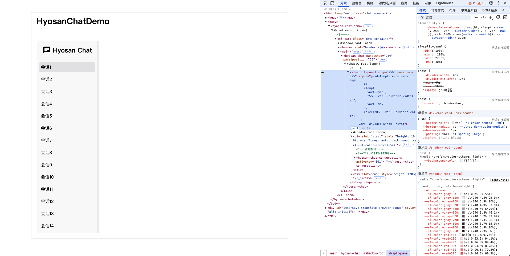

前面我们从 [Web Components](../web-compnoents/) 开始看起, 接着学习了 [Lit](https://lit.dev), 然后开始搭建项目, 引入各种工程化依赖, 增加打包配置并进行了可行性测试, 始终没有涉及实际的功能, 是因为我希望能更全面的学习 `Web Components`, 组件库只是我们学习的最终成果, 成果固然重要, 但 学习不同的技术 / 翻阅文档 / 阅读源码 的经历更加宝贵

## 前言
阅读本章内容需要你熟悉 [Lit](https://lit.dev) / [Web Components](../web-compnoents/) / [Shoelace](https://shoelace.style)

- 如果你对只对组件库感兴趣, 可以直接查看本项目源码: [hyosan-chat](https://github.com/SublimeCT/hyosan-chat)
- 如果你对组件库搭建或项目工程化感兴趣, 可以查看前面几章的内容:
  - [搭建篇](../hyosan-chat-01-create)
  - [可行性验证](/hyosan-chat-03-feasibility)
  - [国际化](../hyosan-chat-04-i18n)

## 创建一个对话列表

[ant-design-x](https://x.ant.design/index-cn) 是一个优秀的 AI 对话组件库, 我们的组件库将参考 [ant-design-x](https://x.ant.design/index-cn) 的 `UI` 设计 / `API` 设计, 并实现部分基础的功能

<iframe width="100%" height="732px" src="https://x.ant.design/~demos/docs-playground-independent-demo-independent"></iframe>

以上是 [ant-design-x](https://x.ant.design/index-cn) 的 `UI`, 我们要做的组件最终效果也是这样的, `ant-design-x` 做的足够好, 但它对组件进行了非常细致的拆分, 导致在使用时虽然能做到足够的灵活可扩展性, 但也增加了 `API` 复杂度, 我们将在实现部分功能的基础上, 简化 `API`, 本章先从 `conversations` 组件开始, 参考 [Conversations 管理对话](https://x.ant.design/components/conversations-cn?theme=dark)

## ant-design-x API
通过阅读源码, 找到了 `Conversations` 组件的 `API`: [interface.ts](https://github.com/ant-design/x/blob/bc9224a44629ee991c57d27303a403553620570c/components/conversations/interface.ts#L11), 我们将其复制到 `src/types/conversations.ts`:

```typescript
import type { AnyObject } from './helpers'

type GroupType = string

/**
 * @desc 会话数据
 * @descEN Conversation data
 */
export interface Conversation extends AnyObject {
	/**
	 * @desc 唯一标识
	 * @descEN Unique identifier
	 */
	key: string

	/**
	 * @desc 会话名称
	 * @descEN Conversation name
	 */
	label: string

	/**
	 * @desc 会话时间戳
	 * @descEN Conversation timestamp
	 */
	timestamp?: number

	/**
	 * @desc 会话分组类型，与 {@link ConversationsProps.groupable} 联动
	 * @descEN Conversation type
	 */
	group?: GroupType

	/**
	 * @desc 会话图标
	 * @descEN conversation icon
	 */
	icon?: string

	/**
	 * @desc 是否禁用
	 * @descEN Whether to disable
	 */
	disabled?: boolean
}

export type GroupSorter = Parameters<GroupType[]['sort']>[0]

export interface Groupable {
	/**
	 * @desc 分组排序函数
	 * @descEN Group sorter
	 */
	sort?: GroupSorter
	/**
	 * @desc 自定义分组标签渲染
	 * @descEN Semantic custom rendering
	 */
	title?: string
}

```

## controllers
在之前阅读 [shoelace](https://shoelace.style) 源码的时候, 发现在 [src/internal](https://github.com/shoelace-style/shoelace/blob/next/src/internal) 中有许多 `controllers`, 而且只依赖 `Lit`, **`Controller` 可以直接调用组件的生命周期 hooks, 也就可以直接更新组件**, 详见 [Reactive Controllers](https://lit.dev/docs/composition/controllers/)

我们将目前用到的 `slot.ts` 复制到项目中(`src/internal/slot.ts`), 并且在 `hyosan-chat.ts` 中引入:
```diff
+ import { HasSlotController } from '@/internal/slot'
export class HyosanChat extends ShoelaceElement {
+	private readonly hasSlotController = new HasSlotController(
+		this,
+		'conversations',
+		'conversations-header',
+		'conversations-footer',
+	)
}
```

`HasSlotController` 实现了对于 `slot` 的检测, 我们可以在 render 中判断 `slot` 是否存在, 并以此实现没有传 `slot` 时使用默认的元素渲染:

```diff
	render() {
+		const hasConversationsSlot = this.hasSlotController.test('conversations')
+		const hasConversationsHeaderSlot = this.hasSlotController.test(
+			'conversations-header',
+		)
+		/** 会话列表 header */
+		const conversationsHeader = hasConversationsHeaderSlot
+			? html`<slot name="conversations-header"></slot>`
+			: html`<hyosan-chat-conversations-header slot="conversations-header"></hyosan-chat-conversations-header>`
+		/** 会话列表 */
+		const conversations = hasConversationsSlot
+			? html`<slot name="conversations">${conversationsHeader}<slot name="conversations-footer"></slot></slot>`
+			: html`<hyosan-chat-conversations .items=${this.items}>${conversationsHeader}<slot name="conversations-footer"></slot></hyosan-chat-conversations>`
    // ...
	}
```

这里的渲染逻辑是:
- 如果传入了名为 `conversations` 的 `slot`, 则使用 `slot` 中的内容, 否则使用默认的 `hyosan-chat-conversations` 组件渲染
- 如果传入了名为 `conversations-header` 的 `slot`, 则使用 `slot` 中的内容, 否则使用默认的 `hyosan-chat-conversations-header` 组件渲染

## 分割面板
组件整体的布局是左侧会话列表, 右侧消息列表, 下面我们使用 [sl-split-panel](http://shoelace.style/components/split-panel#snapping) 来实现左右布局:

`src/components/hyosan-chat.ts`:
```diff
    return html`
- 	  <h2>${this.message}</h2>
-		  <sl-button variant="primary">Hello Shoelace</sl-button>
-		  <p>${this._locailze.term('test')}</p>
+			<sl-split-panel snap="${this.panelSnap}" position="${this.panelPosition}">
+				<div
+					slot="start"
+					style="height: 100%; overflow-y: auto; background: var(--sl-color-neutral-50);"
+				>
+					<!-- 管理会话 -->
+					${conversations}
+				</div>
+				<div
+					slot="end"
+					style="height: 100%;"
+				>
+					<!-- 对话气泡 -->
+					<hyosan-chat-bubble></hyosan-chat-bubble>
+				</div>
+			</sl-split-panel>
    `
```

- 我们将 `snap` / `position` 作为参数作为组件的属性, 接受这两个属性并传入 `sl-split-panel`
- `conversations` 组件是左侧的会话列表, 我们将在本章实现这个组件

```diff
+	/**
+	 * 分割面板的可捕捉位置
+	 * @example '25% 50%'
+	 * @see https://shoelace.style/components/split-panel#snapping
+	 */
+	@property({ reflect: true })
+	panelSnap = '25%'
+
+	/**
+	 * 分隔线与主面板边缘的当前位置(百分比, 0-100), 默认为容器初始大小的 `50%`
+	 * @example 25
+	 * @see https://shoelace.style/components/split-panel#initial-position
+	 */
+	@property({ reflect: true, type: Number })
+	panelPosition = 25
```

## vscode snippets
在创建 `Lit Components` 的时候, 我们总是将每个组件都有的代码复制到新组件中, 如果能直接生成模板代码让我们使用就好了; 实际上 `vscode` 已经提供了 `snippets` 功能, 我们可以创建一个 `snippets` 模板, 然后在 `vscode` 中使用 `snippets` 快速创建组件:

`.vscode/hy.code-snippets`
```json
{
	// Place your hyosan-chat 工作区 snippets here. Each snippet is defined under a snippet name and has a scope, prefix, body and 
	// description. Add comma separated ids of the languages where the snippet is applicable in the scope field. If scope 
	// is left empty or omitted, the snippet gets applied to all languages. The prefix is what is 
	// used to trigger the snippet and the body will be expanded and inserted. Possible variables are: 
	// $1, $2 for tab stops, $0 for the final cursor position, and ${1:label}, ${2:another} for placeholders. 
	// Placeholders with the same ids are connected.
	// Example:
	// "Print to console": {
	// 	"scope": "javascript,typescript",
	// 	"prefix": "log",
	// 	"body": [
	// 		"console.log('$1');",
	// 		"$2"
	// 	],
	// 	"description": "Log output to console"
	// }
	"Hyosan Component": {
		"prefix": "hy-component",
		"body": [
      "import ShoelaceElement from '@/internal/shoelace-element'",
      "// import { LocalizeController } from '@shoelace-style/localize'",
      "import { css, html } from 'lit'",
      "import { customElement, property } from 'lit/decorators.js'",
      "",
      "/** $0 组件 */",
      "@customElement('${TM_FILENAME_BASE}')",
      "export class ${TM_FILENAME_BASE/(^|\\-)(\\w)/${2:/upcase}/g} extends ShoelaceElement {",
      "  static styles? = css``",
      "",
      "  // /** 本地化控制器 */",
      "  // private _localize = new LocalizeController(this)",
      "",
      "  @property({ reflect: true })",
      "  message = ''",
      "  render() {",
      "    return html`",
      "      <div>${this.message}</div>",
      "    `",
      "  }",
      "}",
      "",
      "declare global {",
      "  interface HTMLElementTagNameMap {",
      "    '${TM_FILENAME_BASE}': ${TM_FILENAME_BASE/(^|\\-)(\\w)/${2:/upcase}/g}",
      "  }",
      "}",
      ""
		],
		"description": "Generate a Hyosan component based on the filename"
	},
	"Hyosan Component Property": {
		"prefix": "hy-component-property",
		"body": [
			"/** $2 */",
			"@property({ reflect: true })",
			"$1 = ''"
		]
	}
}
```

## 创建组件
`src/components/hyosan-chat-conversations-header.ts`:
```typescript
import ShoelaceElement from '@/internal/shoelace-element'
// import { LocalizeController } from '@shoelace-style/localize'
import { css, html } from 'lit'
import { customElement, property } from 'lit/decorators.js'

/** 会话列表头部 组件 */
@customElement('hyosan-chat-conversations-header')
export class HyosanChatConversationsHeader extends ShoelaceElement {
	static styles? = css`
		h2 {
			padding: 0 1rem;
			display: flex;
			align-items: center;
			justify-content: center;
			svg {
				margin-right: 0.5rem;
			}
		}
	`

	// /** 本地化控制器 */
	// private _localize = new LocalizeController(this)

	@property()
	title = 'Hyosan Chat'
	render() {
		return html`
      <header>
        <h2>
					<svg t="1740983223876" class="icon" viewBox="0 0 1024 1024" version="1.1" xmlns="http://www.w3.org/2000/svg" p-id="3643" width="2rem" height="2rem"><path d="M853.333333 85.333333H170.666667C123.52 85.333333 85.76 123.52 85.76 170.666667L85.333333 938.666667l170.666667-170.666667h597.333333c47.146667 0 85.333333-38.186667 85.333334-85.333333V170.666667c0-47.146667-38.186667-85.333333-85.333334-85.333334zM256 384h512v85.333333H256v-85.333333z m341.333333 213.333333H256v-85.333333h341.333333v85.333333z m170.666667-256H256v-85.333333h512v85.333333z" p-id="3644"></path></svg>
					<span>
						${this.title}
					</span>
				</h2>
      </header>
    `
	}
}

declare global {
	interface HTMLElementTagNameMap {
		'hyosan-chat-conversations-header': HyosanChatConversationsHeader
	}
}
```

`src/components/hyosan-chat-conversations-item.ts`:
```typescript
import ShoelaceElement from '@/internal/shoelace-element'
import type { Conversation } from '@/types/conversations'
// import { LocalizeController } from '@shoelace-style/localize'
import { css, html } from 'lit'
import { customElement, property } from 'lit/decorators.js'

/** 会话列表项 组件 */
@customElement('hyosan-chat-conversations-item')
export class HyosanChatConversationsItem extends ShoelaceElement {
	static styles? = css`
    .item-row { padding: 0.5rem; margin: 0.5rem; border-radius: 0.5rem; cursor: pointer; }
		:host([actived]) .item-row, .item-row:hover { background-color: var(--sl-color-neutral-200); }
  `

	// /** 本地化控制器 */
	// private _localize = new LocalizeController(this)

	/** 是否选中 */
	@property({ type: Boolean })
	actived = false

	/** 会话列表数据源 */
	@property({ attribute: false, type: Object })
	item!: Conversation

	render() {
		return html`
      <div class="item-row" @click=${() => this.emit('click-conversation', { detail: { item: this.item } })}>
        <span>${this.item.label}</span>
      </div>
    `
	}
}

declare global {
	interface HTMLElementTagNameMap {
		'hyosan-chat-conversations-item': HyosanChatConversationsItem
	}
	interface GlobalEventHandlersEventMap {
		'click-conversation': CustomEvent<{ item: Conversation }>
	}
}
```

`src/components/hyosan-chat-conversations.ts`:
```typescript
import ShoelaceElement from '@/internal/shoelace-element'
import { HasSlotController } from '@/internal/slot'
import type { Conversation } from '@/types/conversations'
// import { LocalizeController } from '@shoelace-style/localize'
import { css, html } from 'lit'
import { customElement, property } from 'lit/decorators.js'

/** 管理会话 组件 */
@customElement('hyosan-chat-conversations')
export class HyosanChatConversations extends ShoelaceElement {
	static styles? = css`
		:host { height: 100%; display: block; }
		.aside {
			display: flex;
			flex-direction: column;
			height: 100%;
			main {
				flex: 1;
				overflow-y: auto;
			}
		}
	`

	// /** 本地化控制器 */
	// private _localize = new LocalizeController(this)
	private readonly hasSlotController = new HasSlotController(
		this,
		'conversations-header',
		'conversations-footer',
	)

	/** 当前选中的值 */
	@property({ reflect: true })
	activeKey = ''

	/** 会话列表数据源 */
	@property({ attribute: false, type: Array })
	items: Conversation[] = []

	private _handleClickConversation(
		event: GlobalEventHandlersEventMap['click-conversation'],
	) {
		this.activeKey = event.detail.item.key
		this.requestUpdate()
	}

	render() {
		return html`
			<div class="aside">
				<header>
					<slot name="conversations-header"></slot>
				</header>
				<main>
					${this.items.map(
						(item) => html`
						<hyosan-chat-conversations-item
							.item=${item} ?actived=${this.activeKey === item.key}
							@click-conversation=${this._handleClickConversation}
						>
						</hyosan-chat-conversations-item>
						`,
					)}
				</main>
				<footer>
					<slot name="conversations-footer"></slot>
				</footer>
			</div>
		`
	}
}

declare global {
	interface HTMLElementTagNameMap {
		'hyosan-chat-conversations': HyosanChatConversations
	}
}
```

`src/components/index.ts`:
```typescript
export { HyosanChat } from './hyosan-chat'
export { HyosanChatConversations } from './hyosan-chat-conversations'
export { HyosanChatConversationsItem } from './hyosan-chat-conversations-item'
export { HyosanChatConversationsHeader } from './hyosan-chat-conversations-header'
```

## 事件
由于 `Lit` 的事件就是原生 `HTML` 事件, 没有任何类型约束, 所以在 `hyosan-chat-conversations-item` 组件中, 添加了 `click-conversation` 事件, 用于通知父组件选中的会话; 其中 `this.emit` 是在 `ShoelaceElement` 中定义的, 我们将 `shoelace` 中的相关代码复制到 `src/internal/shoelace-element.ts` 中:

```typescript
import { LitElement } from 'lit'
import { property } from 'lit/decorators.js'

/**
 * 组件基础类, 参考自 shoelace
 * @see https://github.com/shoelace-style/shoelace/blob/6f09a7556731107e027b8afade0ad1e28d77c710/src/internal/shoelace-element.ts#L65
 */
export default class ShoelaceElement extends LitElement {
	// Make localization attributes reactive
	@property() dir = 'ltr'
	@property() lang = ''

	/** Emits a custom event with more convenient defaults. */
	emit<T extends string & keyof EventTypesWithoutRequiredDetail>(
		name: EventTypeDoesNotRequireDetail<T>,
		options?: SlEventInit<T> | undefined,
	): GetCustomEventType<T>
	emit<T extends string & keyof EventTypesWithRequiredDetail>(
		name: EventTypeRequiresDetail<T>,
		options: SlEventInit<T>,
	): GetCustomEventType<T>
	emit<T extends string & keyof ValidEventTypeMap>(
		name: T,
		options?: SlEventInit<T> | undefined,
	): GetCustomEventType<T> {
		const event = new CustomEvent(name, {
			bubbles: true,
			cancelable: false,
			composed: true,
			detail: {},
			...options,
		})

		this.dispatchEvent(event)

		return event as GetCustomEventType<T>
	}
}

/** Match event type name strings that are registered on GlobalEventHandlersEventMap... */
type EventTypeRequiresDetail<T> = T extends keyof GlobalEventHandlersEventMap
	? // ...where the event detail is an object...
		GlobalEventHandlersEventMap[T] extends CustomEvent<
			Record<PropertyKey, unknown>
		>
		? // ...that is non-empty...
			GlobalEventHandlersEventMap[T] extends CustomEvent<
				Record<PropertyKey, never>
			>
			? never
			: // ...and has at least one non-optional property
				Partial<
						GlobalEventHandlersEventMap[T]['detail']
					> extends GlobalEventHandlersEventMap[T]['detail']
				? never
				: T
		: never
	: never

/** The inverse of the above (match any type that doesn't match EventTypeRequiresDetail) */
type EventTypeDoesNotRequireDetail<T> =
	T extends keyof GlobalEventHandlersEventMap
		? GlobalEventHandlersEventMap[T] extends CustomEvent<
				Record<PropertyKey, unknown>
			>
			? GlobalEventHandlersEventMap[T] extends CustomEvent<
					Record<PropertyKey, never>
				>
				? T
				: Partial<
							GlobalEventHandlersEventMap[T]['detail']
						> extends GlobalEventHandlersEventMap[T]['detail']
					? T
					: never
			: T
		: T

/** `keyof EventTypesWithRequiredDetail` lists all registered event types that require detail */
type EventTypesWithRequiredDetail = {
	[EventType in keyof GlobalEventHandlersEventMap as EventTypeRequiresDetail<EventType>]: true
}

/** `keyof EventTypesWithoutRequiredDetail` lists all registered event types that do NOT require detail */
type EventTypesWithoutRequiredDetail = {
	[EventType in keyof GlobalEventHandlersEventMap as EventTypeDoesNotRequireDetail<EventType>]: true
}

/** Helper to make a specific property of an object non-optional  */
type WithRequired<T, K extends keyof T> = T & { [P in K]-?: T[P] }

/**
 * Given an event name string, get a valid type for the options to initialize the event that is more restrictive than
 * just CustomEventInit when appropriate (validate the type of the event detail, and require it to be provided if the
 * event requires it)
 */
type SlEventInit<T> = T extends keyof GlobalEventHandlersEventMap
	? GlobalEventHandlersEventMap[T] extends CustomEvent<
			Record<PropertyKey, unknown>
		>
		? GlobalEventHandlersEventMap[T] extends CustomEvent<
				Record<PropertyKey, never>
			>
			? CustomEventInit<GlobalEventHandlersEventMap[T]['detail']>
			: Partial<
						GlobalEventHandlersEventMap[T]['detail']
					> extends GlobalEventHandlersEventMap[T]['detail']
				? CustomEventInit<GlobalEventHandlersEventMap[T]['detail']>
				: WithRequired<
						CustomEventInit<GlobalEventHandlersEventMap[T]['detail']>,
						'detail'
					>
		: CustomEventInit
	: CustomEventInit

/** Given an event name string, get the type of the event */
type GetCustomEventType<T> = T extends keyof GlobalEventHandlersEventMap
	? GlobalEventHandlersEventMap[T] extends CustomEvent<unknown>
		? GlobalEventHandlersEventMap[T]
		: CustomEvent<unknown>
	: CustomEvent<unknown>

/** `keyof ValidEventTypeMap` is equivalent to `keyof GlobalEventHandlersEventMap` but gives a nicer error message */
type ValidEventTypeMap =
	| EventTypesWithRequiredDetail
	| EventTypesWithoutRequiredDetail
```

这里的 `emit` 和类型体操完美实现了事件的类型声明和类型约束, 我们只需通过扩展 `GlobalEventHandlersEventMap` 类型即可实现类型声明:
```typescript
declare global {
	interface GlobalEventHandlersEventMap {
		'click-conversation': CustomEvent<{ item: Conversation }>
	}
}
```

## 完整改动
文中可能有遗漏的代码, 可直接参考:

[#47b3a](https://github.com/SublimeCT/hyosan-chat/commit/47b3acd5864b0186111f5162c3e303a695460c4f)

最后让我们看一下效果:



## 参考
- [ant-design-x](https://x.ant.design/index-cn)
- [Reactive Controllers](https://lit.dev/docs/composition/controllers/)