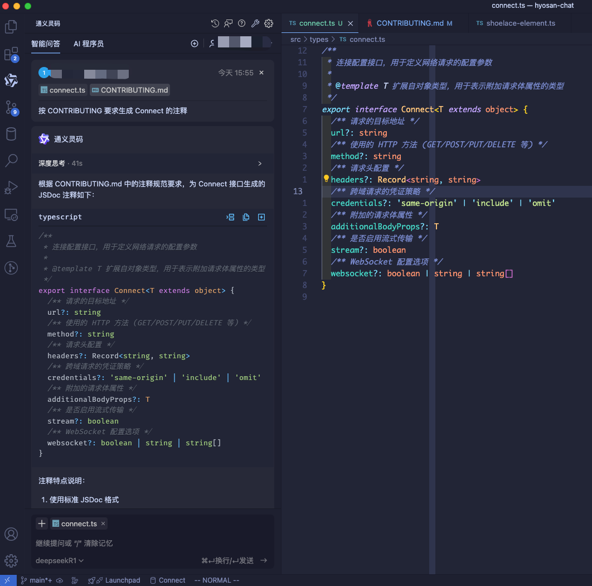

本章将参考 `ant-design-x` 的 [Bubble](https://x.ant.design/components/bubble-cn#bubble) / [Bubble.List](https://x.ant.design/components/bubble-cn#bubblelist) 组件的 UI 和 API, 以及 [DeepChat 的 API](https://deepchat.dev/docs/connect), 实现简单的 `Bubble` 组件

## 前言
阅读本章内容需要你熟悉 [Lit](https://lit.dev) / [Web Components](../web-compnoents/) / [Shoelace](https://shoelace.style)

- 如果你对只对组件库感兴趣, 可以直接查看本项目源码: [hyosan-chat](https://github.com/SublimeCT/hyosan-chat)
- 如果你对组件库搭建或项目工程化感兴趣, 可以查看前面几章的内容:
  - [搭建篇](../hyosan-chat-01-create)
  - [可行性验证](/hyosan-chat-03-feasibility)
  - [国际化](../hyosan-chat-04-i18n)

## 请求
### connect 参数
[deepchat](https://deepchat.dev/docs/connect) 是一个优秀的对话组件, 它足够简单成熟, 我们将从 [deepchat 源码](https://github.com/OvidijusParsiunas/deep-chat) 复制一部分代码到我们的项目中

```bash
# 将项目仓库 clone 到本地
git clone git@github.com:OvidijusParsiunas/deep-chat.git

# 安装依赖
cd component && pnpm i
```

直接进入 `component` 目录, 这里才是组件的源码, 首先来看 `package.json`:
```json5
{
  // ...
  "dependencies": {
    "@microsoft/fetch-event-source": "^2.0.1",
    "remarkable": "^2.0.1",
    "speech-to-element": "^0.1.66"
  }
}
```

- `@microsoft/fetch-event-source`: 用于发起 `SSE` 请求
- `remarkable`: 用于解析 `Markdown` 文本
- `speech-to-element`: 用于语音转文字

这里的第一个库就是我们要找的流式请求相关的库, 我们来看一下引入这个库的文件:

它在 [src/utils/HTTP/stream.ts](https://github.com/OvidijusParsiunas/deep-chat/blob/main/component/src/utils/HTTP/stream.ts) 文件中被引入:
```typescript
import {EventSourceMessage, fetchEventSource} from '@microsoft/fetch-event-source';
// ...
export class Stream {
  // prettier-ignore
  public static async request(io: ServiceIO, body: object, messages: Messages, stringifyBody = true, canBeEmpty = false) {
    // ...
    fetchEventSource(io.connectSettings?.url || io.url || '', {
      // ...
    })
  }
  // ...
}
```

- 翻阅 [@microsoft/fetch-event-source](https://www.npmjs.com/package/@microsoft/fetch-event-source#usage) 的文档, 我们发现 `fetchEventSource` 是核心 `API`, 用于发起会话请求
- 这里的 `io.connectSettings?.url` 应该是会话请求的 URL, 从内部的参数也可以看出它是用来发起会话请求的

找到了发起流式请求的地方, 我们再来找调用此方法的地方, 这次我们从发送按钮开始, 发送按钮有 `class` `'input-button'`, 我们在项目中搜索 `input-button`, 定位到 `src/views/chat/input/buttons/submit/submitButton.ts`:

搜索 `click`, 定位到 `changeToSubmitIcon`:

```typescript
// ...
export class SubmitButton extends InputButton<Styles> {
  // ...
  public changeToSubmitIcon() {
    this.elementRef.onclick = () => {
      this.submitFromInput();
      if (this._microphoneButton?.isActive) {
        SpeechToText.toggleSpeechAfterSubmit(this._microphoneButton.elementRef, !!this._stopSTTAfterSubmit);
      }
    };
  }
}
```

进入 `submitFromInput`:
```ts
export class SubmitButton extends InputButton<Styles> {
  public async submitFromInput() {
    await this._fileAttachments.completePlaceholders();
    const uploadedFilesData = this._fileAttachments.getAllFileData();
    if (this._textInput.isTextInputEmpty()) {
      this.attemptSubmit({text: '', files: uploadedFilesData});
    } else {
      // not using textContent as it ignores new line spaces
      const inputText = this._textInput.inputElementRef.innerText.trim() as string;
      this.attemptSubmit({text: inputText, files: uploadedFilesData});
    }
  }
  public async attemptSubmit(content: UserContentI, isProgrammatic = false) {
    // 验证提交的内容
    if ((await this._validationHandler?.(isProgrammatic ? content : undefined)) === false) return;
    this.changeToLoadingIcon();
    this._textInput.clear();
    if (typeof this._messages.focusMode !== 'boolean' && this._messages.focusMode?.fade) {
      await FocusModeUtils.fadeAnimation(this._messages.elementRef, this._messages.focusMode.fade);
    }
    // 添加新消息
    await this.addNewMessage(content);
    // 如果不是 Web 模型，添加加载消息
    if (!this._serviceIO.isWebModel()) this._messages.addLoadingMessage();
    const filesData = content.files?.map((fileData) => fileData.file);
    const requestContents = {text: content.text === '' ? undefined : content.text, files: filesData};
    await this._serviceIO.callAPI(requestContents, this._messages);
    this._fileAttachments?.removeAllFiles();
  }
}
```

这里 `submitFromInput` 最终会调用 `attemptSubmit`, 并执行 `this._serviceIO.callAPI(requestContents, this._messages);`, 这里的 `_serviceIO` 对应的是当前的大模型服务(`src/services/*`), `deepchat` 对不同的服务提供商接口进行了封装, 并抽象为统一的 `ServiceIO`

经过搜索 `callAPI`, 发现其在 `src/services/utils/baseServiceIO.ts` 中:

```ts
export class BaseServiceIO implements ServiceIO {
  // 1️⃣
  // prettier-ignore
  async callAPI(requestContents: RequestContents, messages: Messages) {
    if (!this.connectSettings) throw new Error('Request settings have not been set up');
    const processedMessages = MessageLimitUtils.processMessages(
      messages.messageToElements.map(([msg]) => msg), this.maxMessages, this.totalMessagesMaxCharLength);
    if (this.connectSettings.websocket) {
      const body = {messages: processedMessages, ...this.rawBody};
      Websocket.sendWebsocket(this, body, messages, false);
    } else {
      this.callServiceAPI(messages, processedMessages, requestContents.files);
    }
  }
  // 2️⃣

  async callServiceAPI(messages: Messages, pMessages: MessageContentI[], files?: File[]) {
    if (files) {
      this.callApiWithFiles(messages, pMessages, files);
    } else {
      this.callAPIWithText(messages, pMessages);
    }
  }

  // 3️⃣
  private async callAPIWithText(messages: Messages, pMessages: MessageContentI[]) {
    const body = {messages: pMessages, ...this.rawBody};
    let tempHeaderSet = false; // if the user has not set a header - we need to temporarily set it
    if (!this.connectSettings.headers?.['Content-Type']) {
      this.connectSettings.headers ??= {};
      this.connectSettings.headers['Content-Type'] ??= 'application/json';
      tempHeaderSet = true;
    }
    await this.request(body, messages);
    if (tempHeaderSet) delete this.connectSettings.headers?.['Content-Type'];
  }

  // 4️⃣
  private async request(body: any, messages: Messages, stringifyBody = true) {
    if (this.stream && !Stream.isSimulation(this.stream)) {
      return Stream.request(this, body, messages, stringifyBody);
    }
    return HTTPRequest.request(this, body, messages, stringifyBody);
  }
}
```

在代码中用 `1234` 表示调用顺序, 最终到达 `request()`, 并调用 `Stream.request`, 也就是上文找到的发起流式请求的地方

### 创建 connect 参数

通过阅读源码也能够发现, deepchat 的文件非常多, 代码逻辑复杂, 本来想直接复制代码的, 但是它太复杂了... 😭, 所以我们转变思路, 从我们需要的部分开始, 先来查看组件接收的会话请求相关的参数 [connect](https://deepchat.dev/docs/connect#connect-1)

源码中缺少注释, 这次我们使用 `deekseek` 来增加注释:



1. 添加 [CONTRIBUTING.md](https://github.com/SublimeCT/hyosan-chat/blob/main/CONTRIBUTING.md) 和 `src/types/connect.ts`
2. 让 AI 按 CONTRIBUTING 要求生成 Connect 的注释
3. 将生成的内容粘贴到 `src/types/connect.ts`

接着我们在根组件(`hyosan-chat`) 中添加 `connect` 参数:
```diff
+	/** 连接参数 */
+	@property({ attribute: false, reflect: true })
+	connect!: Connect<object>
```

然后我们再修改一下 `Connect`, 增加模型名称 `model`, 并将其修改为 `class` 以便增加默认值:
```typescript
/**
 * 连接配置接口，用于定义网络请求的配置参数
 *
 * @template T 扩展自对象类型，用于表示附加请求体属性的类型
 */
export class Connect<T extends object> {
	/** 请求的目标地址 */
	url = import.meta.env.VITE_CONNECT_URL
	/** 模型名称 */
	model = import.meta.env.VITE_CONNECT_MODEL
	/** 使用的 HTTP 方法 (GET/POST/PUT/DELETE 等) */
	method = 'POST'
	/** 请求头配置 */
	headers?: Record<string, string>
	/** 跨域请求的凭证策略 */
	credentials?: 'same-origin' | 'include' | 'omit'
	/** 附加的请求体属性 */
	additionalBodyProps?: T
	/** 是否启用流式传输 */
	stream?: boolean
}
```

然后我们创建新聊天按钮, 并将部分样式分离:
`src/components/hyosan-chat-conversations-header.ts`:
```diff
 import ShoelaceElement from '@/internal/shoelace-element'
-// import { LocalizeController } from '@shoelace-style/localize'
+import { LocalizeController } from '@shoelace-style/localize'
 import { css, html } from 'lit'
 import { customElement, property } from 'lit/decorators.js'

@@ -7,19 +7,26 @@ import { customElement, property } from 'lit/decorators.js'
 @customElement('hyosan-chat-conversations-header')
 export class HyosanChatConversationsHeader extends ShoelaceElement {
        static styles? = css`
+               header {
+                       margin: 1rem 0;
+               }
                h2 {
+                       margin: 0;
                        padding: 0 1rem;
                        display: flex;
                        align-items: center;
                        justify-content: center;
                        svg {
-                               margin-right: 0.5rem;
+                               margin-right: var(--hy-container-padding);
                        }
                }
+               section {
+                       padding: var(--hy-container-padding);
+               }
        `

-       // /** 本地化控制器 */
-       // private _localize = new LocalizeController(this)
+       /** 本地化控制器 */
+       private _localize = new LocalizeController(this)

        @property()
        title = 'Hyosan Chat'
@@ -33,6 +40,12 @@ export class HyosanChatConversationsHeader extends ShoelaceElement {
                                        </span>
                                </h2>
       </header>
+                       <section>
+                               <sl-button variant="primary" @click=${() => this.emit('start-new-chat')}>
+                                       <span class="plus">+</span>
+                                       <span>${this._localize.term('startANewChat')}</span>
+                               </sl-button>
+                       </section>
     `
        }
 }
@@ -41,4 +54,7 @@ declare global {
        interface HTMLElementTagNameMap {
                'hyosan-chat-conversations-header': HyosanChatConversationsHeader
        }
+       interface GlobalEventHandlersEventMap {
+               'start-new-chat': CustomEvent<object>
+       }
 }
```

`src/translations/translation.ts`:
```diff
+       startANewChat: string
```

`src/translations/zh-ch.ts`:
```diff
+       startANewChat: '开始新聊天',
```

`src/translations/en.ts`:
```diff
+       startANewChat: 'Start a new chat',
```

`src/lib.ts`:
```diff
+// 引入全局样式(css 变量)
+import '@/sheets/global-styles.css'
```

`src/sheets/global-styles.css`:
```diff
+:root {
+  /* chat 容器中的边距 */
+  --hy-container-padding: 0.5rem;
+}
```

- 这里的边距实际上会在多个组件中用到, 我们将其分离到 `global-styles.css` 文件中, 作为 `css` 变量
- 然后增加了一个按钮, 并为其增加了多语言文案, 声明了事件类型

然后我们 `url` / `model` / `API Key` 放到环境变量文件中:
`.env`:
```bash
# 如需修改请创建 .env.local 文件
# 详见 https://cn.vitejs.dev/guide/env-and-mode.html#env-files

# 请求地址
VITE_CONNECT_URL=https://api.openai.com/v1

# 模型名称
VITE_CONNECT_MODEL=gpt-4o-mini

# API Key
VITE_API_KEY=sk-1234567890
```

`src/env.d.ts`:
```ts
/// <reference types="vite/client" />

interface ImportMetaEnv {
	/** 请求地址 */
	readonly VITE_CONNECT_URL: string
	/** 模型名称 */
	readonly VITE_CONNECT_MODEL: string
	/** API Key (⚠️ 仅用于测试) */
	readonly VITE_API_KEY: string
}

interface ImportMeta {
	readonly env: ImportMetaEnv
}
```

`src/types/connect.ts`:
```ts
/**
 * 连接配置接口，用于定义网络请求的配置参数
 *
 * @template T 扩展自对象类型，用于表示附加请求体属性的类型
 */
export class Connect<T extends object> {
	/** 请求的目标地址 */
	url = import.meta.env.VITE_CONNECT_URL
	/** 模型名称 */
	model = import.meta.env.VITE_CONNECT_MODEL
	/** 使用的 HTTP 方法 (GET/POST/PUT/DELETE 等) */
	method = 'POST'
	/** 请求头配置 */
	headers?: Record<string, string>
	/** 跨域请求的凭证策略 */
	credentials?: 'same-origin' | 'include' | 'omit'
	/** 附加的请求体属性 */
	additionalBodyProps?: T
	/** 是否启用流式传输 */
	stream?: boolean
}

```


## 参考
- [deepchat](https://deepchat.dev/docs/connect)
- [Create chat completionsa - Chat](httpshttps://platform.openai.com/docs/api-reference/chat/create)