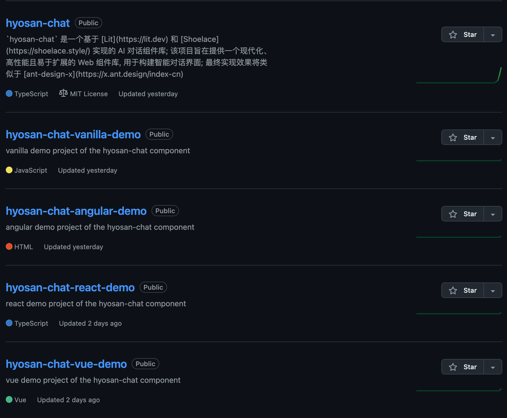

:::WARNING
本文是断档式记录, 不记录所有改动, 只作为总结, 具体更新可参考 [源码](https://github.com/SublimeCT/hyosan-chat)
:::

举例上一章发布过去了半个月, 没错, 这期间实在是太忙了, 所以这半个月的开发过程并没有做记录 😭, 不过好消息是这个项目顺利发布, 可以在 [hyosan-chat - npm](https://www.npmjs.com/package/hyosan-chat) 查看这个 `package`, 或直接前往 `github` 阅读 [源码](https://github.com/SublimeCT/hyosan-chat)

## 前言
阅读本章内容需要你熟悉 [Lit](https://lit.dev) / [Web Components](../web-compnoents/) / [Shoelace](https://shoelace.style)

- 如果你对只对组件库感兴趣, 可以直接查看本项目源码: [hyosan-chat](https://github.com/SublimeCT/hyosan-chat)
- 如果你对组件库搭建或项目工程化感兴趣, 可以查看前面几章的内容:
  - [搭建篇](../hyosan-chat-01-create)
  - [可行性验证](/hyosan-chat-03-feasibility)
  - [国际化](../hyosan-chat-04-i18n)

## demo
组件使用了 `netlify` 部署 demo 页面, [点击查看](snazzy-khapse-06e16b.netlify.app/)

## 夜间模式
在 `shoelace` 的 [文档](https://shoelace.style/getting-started/installation#light-and-dark-theme) 中, 建议使用 `link` 标签的形式实现 `light` / `dark` 样式的引入和切换, 但作为一个组件库, 我们并不能要求所有项目都通过这种方式引入主题样式, 原因是这种方式太过原始, 我们并没有直接提供一种切换主题的方式, 而是让用户直接引入主题的 `css`, 既没有做到灵活简单, 也没有扩展性和响应式;

因此组件内部实现了动态切换主题样式的功能, 在 `hyosan-chat` 组件上提供一个主题名称参数 `shoelaceTheme`, 并通过 [HyosanChatTheme class](https://github.com/SublimeCT/hyosan-chat/blob/main/src/utils/HyosanChatTheme.ts) 来实现切换不同的主题

`src/utils/HyosanChatTheme.ts`:
```typescript
import shoelaceDarkCss from '@shoelace-style/shoelace/dist/themes/dark.css?inline'
import shoelaceLightCss from '@shoelace-style/shoelace/dist/themes/light.css?inline'

/** shoelace 组件库的主题属性 */
export enum HyosanChatShoelaceTheme {
  shoelaceLight = 'sl-theme-light',
  shoelaceDark = 'sl-theme-dark',
}

/** shoelace 组件库的主题 css 内容 */
export const HyosanChatShoelaceThemes = {
  /** light theme */
  [HyosanChatShoelaceTheme.shoelaceLight]: shoelaceLightCss,
  /** dark theme */
  [HyosanChatShoelaceTheme.shoelaceDark]: shoelaceDarkCss,
}

/**
 * 设置 hyosan-chat 主题
 * @description 用于切换底层组件库 `shoelace` 的主题, `<hyosan-chat>` 组件会根据 `shoelaceTheme` 的值自动切换主题
 */
export class HyosanChatTheme {
  static TAG_ATTRIBUTE = 'data-hyosan-chat-theme'
  static getStyleElement() {
    return document.querySelector(`style[${HyosanChatTheme.TAG_ATTRIBUTE}]`)
  }
  static setStyleElement(theme: HyosanChatShoelaceTheme) {
    const styleElement = HyosanChatTheme.getStyleElement()
    const cssText = HyosanChatShoelaceThemes[theme]
    const cssNode = document.createTextNode(cssText)
    if (styleElement) {
      styleElement.innerHTML = ''
      styleElement.appendChild(cssNode)
    } else {
      const style = document.createElement('style')
      style.setAttribute(HyosanChatTheme.TAG_ATTRIBUTE, theme)
      style.setAttribute('type', 'text/css')
      style.appendChild(cssNode)
      document.head.appendChild(style) // 将包含 shoelace 主题样式的标签插入到 head 中
    }
    HyosanChatTheme._updateThemeClass(theme)
  }
  /** 在根元素上切换 shoelace 主题类 */
  private static _updateThemeClass(theme: HyosanChatShoelaceTheme) {
    document.documentElement.classList.add(theme)
    Object.values(HyosanChatShoelaceTheme).forEach((c) => {
      console.log(c)
      if (c !== theme) {
        document.documentElement.classList.remove(c)
      }
    })
  }
}
```

`src/components/HyosanChat.ts`:
```typescript
import {
  HyosanChatShoelaceTheme,
  HyosanChatTheme,
} from '@/utils/HyosanChatTheme'

@customElement('hyosan-chat')
export class HyosanChat extends ShoelaceElement {
  // ...
  /** shoelace 主题, 可用于切换夜间模式 */
  @property({ reflect: true })
  shoelaceTheme: HyosanChatShoelaceTheme = HyosanChatShoelaceTheme.shoelaceLight 
}
```

相关改动可参考: [feat: 增加切换主题功能](https://github.com/SublimeCT/hyosan-chat/commit/f12f97ff972875adf1c305c2695d36d6c8737c72)

## 框架适配
最初在做调研时, 发现 `web components` 是一个 **原生技术**, 这就代表了它适用于所有框架, 包括 `vue` / `react` / `angular` / `...`, 现在组件的基础功能开发完成, 是不是就意味着可以直接在使用这些框架的项目中使用呢? 是也不是

- 自定义标签没有声明属性和事件
- IDE 无法识别自定义标签
- 各个框架的模板语法不同

一方面 `web components` 的确是原生技术, 它使用的技术 **不依赖于任何框架**, 可以直接使用; 但另一方面, 在一个现代化的前端开发环境中, **`TypeScript` 是必不可少的一环**, `web components` 并 **没有提供定义自定义标签类型的功能**, 编辑器更不会知道当前项目有哪些自定义标签, 以及标签上有哪些属性, 而且更加复杂的是, 在不同的框架中 `HTML` 的语法都不一样, 例如 `vue` 的模板语法与 `jsx` 的模板语法不同, `angular` 的模板语法与前两者也有差别 ...

<svg xmlns="http://www.w3.org/2000/svg" xmlns:xlink="http://www.w3.org/1999/xlink" viewBox="0 0 244 244" version="1.1" alt="open-wc" class="logo"><defs><linearGradient x1="50%" y1="0%" x2="50%" y2="100%" id="linearGradient-1"><stop stop-color="#9B00FF" offset="0%"/><stop stop-color="#0077FF" offset="100%"/></linearGradient><g stroke="none" stroke-width="1" fill="none" fill-rule="evenodd" id="logo"><path d="M205.639259,176.936244 C207.430887,174.217233 209.093339,171.405629 210.617884,168.510161 M215.112174,158.724316 C216.385153,155.50304 217.495621,152.199852 218.433474,148.824851 M220.655293,138.874185 C221.231935,135.482212 221.637704,132.03207 221.863435,128.532919 M222,118.131039 C221.860539,114.466419 221.523806,110.85231 221.000113,107.299021 M218.885321,96.8583653 C218.001583,93.4468963 216.942225,90.1061026 215.717466,86.8461994 M211.549484,77.3039459 C209.957339,74.1238901 208.200597,71.0404957 206.290425,68.0649233 M200.180513,59.5598295 C181.848457,36.6639805 153.655709,22 122.036748,22 C66.7879774,22 22,66.771525 22,122 C22,177.228475 66.7879774,222 122.036748,222 C152.914668,222 180.52509,208.015313 198.875424,186.036326" stroke="url(#linearGradient-1)" stroke-width="42.0804674"/></g></defs><use xlink:href="#logo"/></svg>

为此社区出现了一个 [custom-elements-manifest](https://custom-elements-manifest.open-wc.org/) 的库, 用于为不同的框架提供 `manifest` 信息, 简而言之它可以 **让编辑器和不同的框架准确的识别自定义标签**

- 对于自定义标签的类型定义, 通过在代码中添加 [jsdoc](https://jsdoc.app/) 注释, 并通过 [custom-elements-manifest](https://custom-elements-manifest.open-wc.org/) 生成 `vscode.html-custom-data.json`(用于 `vscode`) / `web-types.json`(用于 `JetBrains IDE`) 文件来实现
- 对于每个框架:
  - vue: 通过 [custom-element-vuejs-integration](https://www.npmjs.com/package/custom-element-vuejs-integration) 生成组件的类型定义
  - react: 通过 [custom-element-react-wrappers](https://www.npmjs.com/package/custom-element-react-wrappers) 生成组件包装器
  - angular: 无需生成文件

具体配置可参考: [custom-elements-manifest.config.mjs](https://github.com/SublimeCT/hyosan-chat/blob/main/custom-elements-manifest.config.mjs)

## 示例项目
配置好不同框架的适配之后, 我们直接创建 demo 项目:



- [hyosan-chat-vue-demo](https://github.com/SublimeCT/hyosan-chat-vue-demo)
- [hyosan-chat-react-demo](https://github.com/SublimeCT/hyosan-chat-react-demo)
- [hyosan-chat-angular-demo](https://github.com/SublimeCT/hyosan-chat-angular-demo)
- [hyosan-chat-vanilla-demo](https://github.com/SublimeCT/hyosan-chat-vanilla-demo)

## 发布
`package.json`:
```diff
{
  "scripts": {
+    "npm:login": "pnpm login --registry=https://registry.npmjs.org",
+    "npm:publish": "pnpm run build:lib && pnpm publish --registry=https://registry.npmjs.org",
  }
}
```

这里为什么要指定 `registry` 呢? 因为在国内的网络环境下, 一般会设置淘宝的 npm 镜像, 或内部私有镜像, 但在发布时是需要连接到官方源的

```bash
# 只需执行一次, 之后可以直接执行 pnpm run npm:publish
pnpm run npm:login

# 发布新版本包
pnpm run npm:publish
```

## 参考
- [源码](https://github.com/SublimeCT/hyosan-chat)
