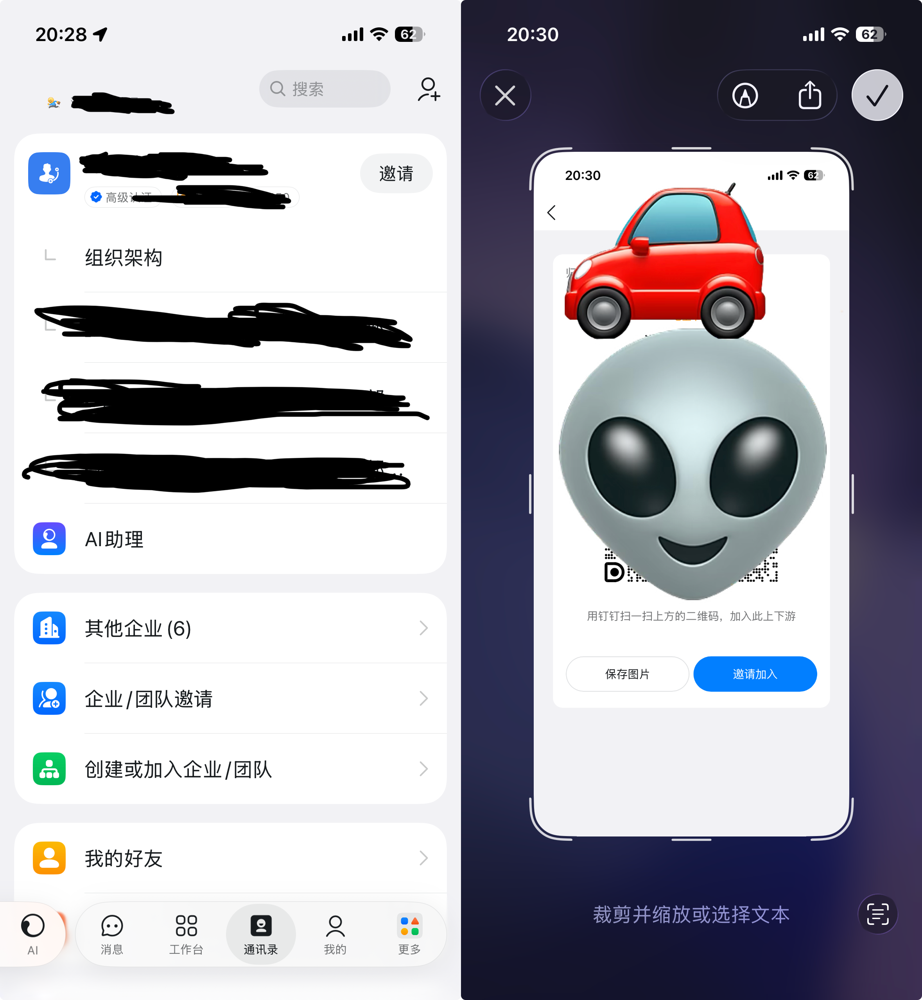

> [!TIP]
友情提示: 本文中的 **快捷指令** 指的是 IOS 的系统应用, 只能在苹果设备上使用, 安卓各大厂的系统也有类似的功能

## 快捷指令有什么用

作为一个牛马打工人, 一定有过 **忘记打卡** 的经历, 搬了一天砖, 发现居然忘记打卡了 😡, 补卡却要领导层层审批, 还要解释加证明自己真的来板砖了...

还有就是节假日的 **补班日直接睡过头了**, 平时订的闹钟都是周一到周五, 到补班那天闹钟没响, 等起床了发现根本来不及了, 我就想问是谁发明了补班这么个玩意儿, 我真想一🧱拍死他

自动化的快捷指令就可以解决这两个问题, 让我们 **在工作日执行一些自动化的工作流**

## 今天是不是工作日


那么如何判断是否为工作日呢? 在 `IOS` 的 📅 日历 APP 中, 点击底部的 **日历** 按钮, 再点击 **添加日历**, 搜索 **中国(中文)**, 就可以订阅 **中国大陆节假日**, 然后在日历中就会 **显示节假日相关的日程**:


我们就可以实现通过读取当前日程, 判断今天是否是工作日

## 工作日闹钟

> [!TIP]
可以直接 <a href="https://www.icloud.com/shortcuts/85a171d7627748fbbb6975cf6acdffcd" target="_blank">🔗 点击这里</a> 获取 工作日闹钟 快捷指令, **⚠️ 需要把闹钟替换成自己的 ⏰ 起床闹钟**

创建一个快捷指令, 从日历中读取 包含 `（班）` `（休）` 的日程, 就可以判断补班和节假日, 然后再判断是否是周末, 如果是工作日, 就开启闹钟, 否则关闭闹钟


注意这里选择的 ⏰ 闹钟 是自己的起床时间的闹钟


然后我们点击底部的 **自动化**, 选择 **特定时间运行**, 然后再添加创建好的 **工作日闹钟 v1** 快捷指令, 然后设置为 **立即运行**

> [!WARNING]
> - 快捷指令在创建好之后, **必须手动执行一次** 才会生效
> - **自动化任务首次执行也需要手动确认**, 之后才会自动运行

## 钉钉打卡

虽然钉钉提供了打卡的快捷指令, 但如果你加入了多个公司, 那么在打卡时就需要选择在那个公司打卡, 这太蠢了, 好在我们可以使用 `URL Scheme` 直接调起钉钉的打卡入口, 在 `URL` 中可以通过 `corpId` 参数指定公司:



点击底部的 **通讯录** - **邀请**, 然后截屏, 在点击右下角的扫描按钮, 将 `URL` 复制出来, 其中的 `ecoCorpId` 就是 `URL Scheme` 中需要替换的 `corpId` 参数:

- 邀请链接:

```bash
https://n.dingtalk.com/dingding/ecological_org/invite/index.html?dtaction=os&dd_darkmode=true&unionOrgId=257q04350302&ecoCorpId=dingaoefjoaiOIfoejaiojfOIDSJI&inviterUid=&inviteCode=asoiejfOSJfiea&deptId=-1#/inviteJoin
```

- `ecoCorpId`: `dingaoefjoaiOIfoejaiojfOIDSJI`

最终的 `URL Scheme`: `dingtalk://dingtalkclient/page/link?url=https://attend.dingtalk.com/attend/index.html?corpId=dingaoefjoaiOIfoejaiojfOIDSJI`

然后我们创建一个快捷指令, 直接打开这个 `URL`:


这里我先打开了蜂窝数据, 然后震动三下, 播放了一段声音, 然后判断当前是上班还是下班, 最后打开这个 `URL`


最后我们依然是像添加工作日闹钟一样, 创建一个指定时间的自动化任务, 然后添加这个快捷指令

> [!WARNING]
> - 快捷指令在创建好之后, **必须手动执行一次** 才会生效
> - 钉钉打卡 **需要解锁手机才能执行**

## 驾车通勤

由于每天开车通勤, 所以打卡的最佳时间点应该是 上车 / 下车 时(连接 `carplay` 或连接车载蓝牙)打卡, 当然也可以是到达指定位置或者连接指定 `WIFI` 时打卡, 这些快捷指令都支持!


我目前 上车 / 下车 时都会执行快捷指令:
- 上车: 如果是工作日, 就判断时间
  - 上班时间: 打开蜂窝网络, 播放歌曲, 导航到公司
  - 下班时间: 钉钉打卡, 播放音乐, 导航到家
- 下车: 如果是工作日, 就判断时间
  - 上班时间: 钉钉打卡
  - 下班时间: *暂无*


