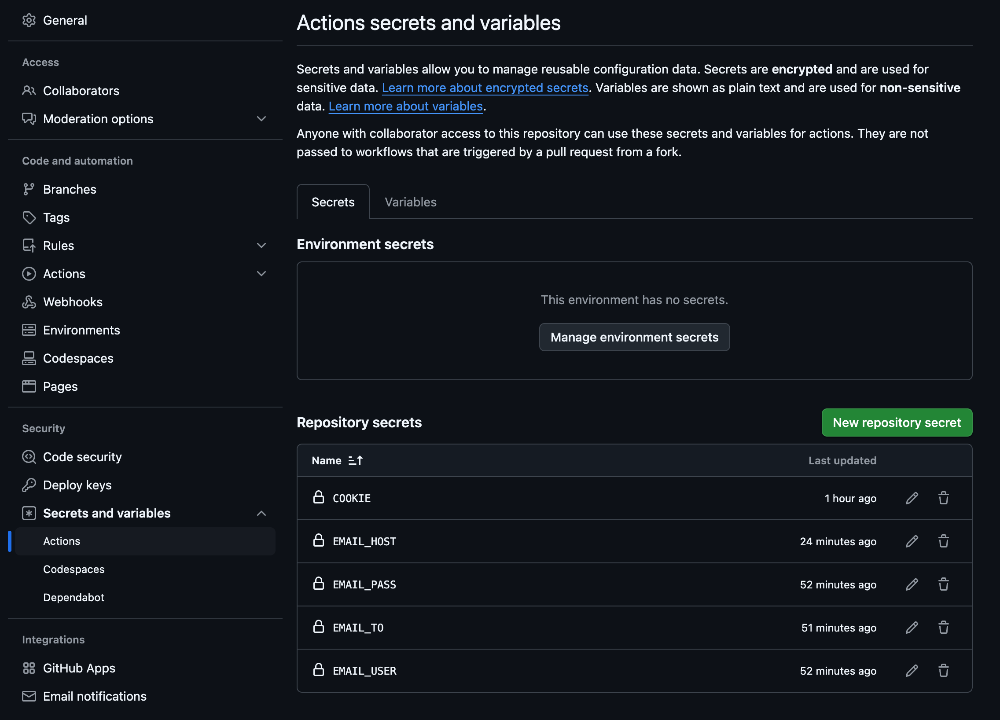
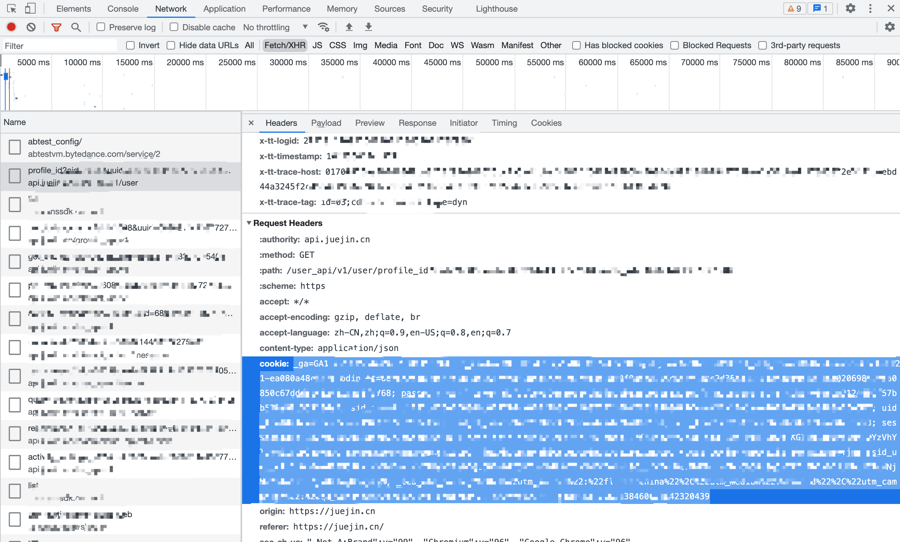
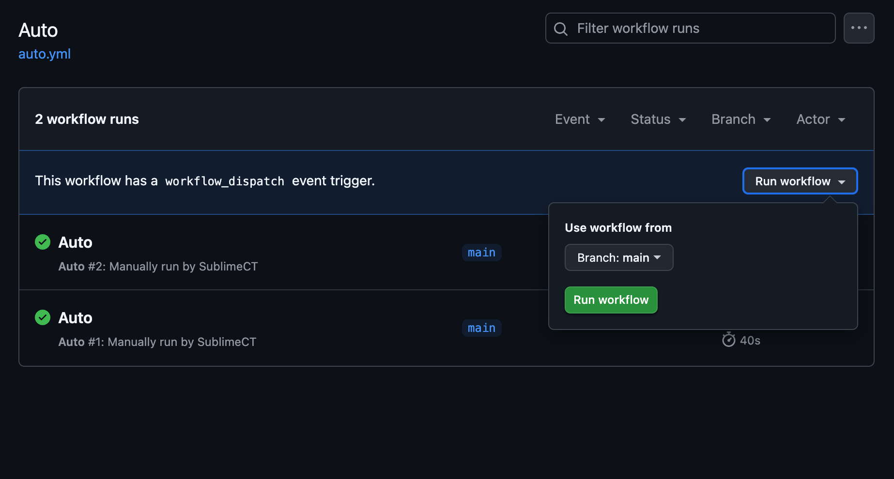
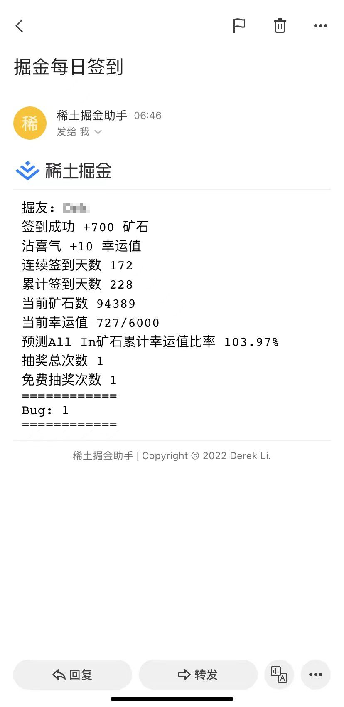

本文介绍如何使用 juejin-helper Github Actions 实现掘金自动签到

## juejin-helper

::github{repo="iDerekLi/juejin-helper"}

[juejin-helper](https://github.com/iDerekLi/juejin-helper) 是一个掘金自动化 **签到** / **抽奖** / **沾喜气** / **消除 bug** 的自动化工作流, 通过 `Github Actions` 来实现定时执行, 因此 **不需要部署到自己的服务器上**

## 使用
1. 直接 [fork juejin-helper 仓库](https://github.com/iDerekLi/juejin-helper/fork), 或者 [fork 我修改过的仓库](https://github.com/SublimeCT/juejin-helper/fork)
2. 仓库 -> `Settings` -> `Secrets` -> `Secrets and variables` -> `New repository secret`, 添加Secrets变量如下:

| Name             | Value                                                                                           | Required |
| ---------------- | ----------------------------------------------------------------------------------------------- | -------- |
| COOKIE           | 掘金网站 `Cookie`, 参考 [获取 cookies](#如何获取cookie)                                         | 是       |
| COOKIE_2         | 多用户, 当需要同时运行多个掘金用户时所需, 支持最多 **5** 名用户(即COOKIE + COOKIE_2 - COOKIE_5) | 否       |
| EMAIL_USER       | 发件人邮箱地址(需要开启 SMTP)                                                                   | 否       |
| EMAIL_PASS       | 发件人邮箱密码(SMTP密码)                                                                        | 否       |
| 💡 EMAIL_HOST     | SMTP 服务器地址                                                                                 | 否       |
| EMAIL_TO         | 订阅人邮箱地址(收件人). 如需多人订阅使用 `, ` 分割, 例如: `a@163.com, b@qq.com`                 | 否       |
| DINGDING_WEBHOOK | 钉钉机器人WEBHOOK                                                                               | 否       |
| PUSHPLUS_TOKEN   | [Pushplus](http://www.pushplus.plus/) 官网申请，支持微信消息推送                                | 否       |
| SERVERPUSHKEY    | [Server酱](https://sct.ftqq.com//) 官网申请，支持微信消息推送                                   | 否       |
| WEIXIN_WEBHOOK   | 企业微信机器人WEBHOOK                                                                           | 否       |
| FEISHU_WEBHOOK   | 飞书机器人WEBHOOK                                                                               | 否       |



这里我们使用邮件通知, 所以只配置了邮箱相关的参数

:::TIP
其中 `EMAIL_HOST` 是我增加的邮箱 SMTP 服务器地址参数, 在原仓库中是直接从邮箱字符串中截取的, 因为我用的是 [阿里邮箱网页端](https://qiye.aliyun.com), 所以 SMTP 服务器地址为 `smtp.qiye.aliyun.com`, 需要手动修改, 关于 **免费域名邮箱** / **使用阿里邮箱发送文件** 可参考我的这些文章:

- [服务器请求阿里邮箱服务器发送邮件](../server-mail/)
- [阿里云配置域名邮箱](../configure-domain-name-mailbox/)
:::

3. 仓库 -> `Actions` -> `Auto`, 检查 `Workflows` 并启用。

## 如何获取Cookie

掘金网站Cookie, 打开浏览器，登录 [掘金](https://juejin.cn/), 打开控制台DevTools(快捷键F12) -> Network，复制 cookie, **掘金Cookie有效期约1个月需定期更新.**

DevTools截图:



## 修改执行时间
在原仓库中, 每天 `6:30` 执行, 可以在 `.github/workflows/auto.yml` 文件中修改 `cron` 表达式, 我改成了每天 `8:00` 执行:

```yml
on:
  schedule:
    - cron: "0 0 * * *" # 北京时间上午 08:00
# ...
```

## 执行
我们可以等待每天到 `8:00` 时自动执行, 也可以通过点击 `Run workflow` 来立即执行这个 `Action`:



在执行完毕后, 我们将收到一封通知邮件:



## 部署到服务器
```bash
# 使用 rsync 将源码上传到服务器
# 由于阿里云服务器拉取不了 github 仓库代码, 所以只能本地上传
rsync -avz juejin-helper admin@47.69.204.83:/home/admin/projects/
```

```bash
cd projects/juejin-helper && pnpm i
cd workflows && pnpm i
cd ../packages/juejin-helper && pnpm i
```

这里我们修改一下环境变量名, 增加 `JUEJIN_` 前缀:

```javascript
const env = process.env || {};

module.exports = {
  /* 掘金Cookie */
  COOKIE: env.JUEJIN_COOKIE || env.COOKIE,
  /* 多用户掘金Cookie, 当有1名以上用户时填写, 支持同时最多可配置5名用户 */
  COOKIE_2: env.COOKIE_2,
  COOKIE_3: env.COOKIE_3,
  COOKIE_4: env.COOKIE_4,
  COOKIE_5: env.COOKIE_5,
  /**
   * 邮箱配置
   * user 发件人邮箱, pass, 发件人密码, to收件人
   */
  EMAIL_USER: env.JUEJIN_EMAIL_USER || env.EMAIL_USER,
  EMAIL_PASS: env.JUEJIN_EMAIL_PASS || env.EMAIL_PASS,
  EMAIL_TO: env.JUEJIN_EMAIL_TO || env.EMAIL_TO,
  EMAIL_HOST: env.JUEJIN_EMAIL_HOST || env.EMAIL_HOST,
  /**
   * 钉钉配置
   * https://open.dingtalk.com/document/robots/custom-robot-access
   */
  DINGDING_WEBHOOK: env.DINGDING_WEBHOOK,
  /**
   * PushPlus配置
   * http://www.pushplus.plus/doc/guide/openApi.html
   */
  PUSHPLUS_TOKEN: env.PUSHPLUS_TOKEN,
  /**
   * 企业微信机器人配置
   * https://developer.work.weixin.qq.com/document/path/91770
   */
  WEIXIN_WEBHOOK: env.WEIXIN_WEBHOOK,
  /**
   * server酱推送key
   * https://sct.ftqq.com/sendkey
   */
  SERVERPUSHKEY: env.SERVERPUSHKEY,
  /**
   * 飞书配置
   */
  FEISHU_WEBHOOK: env.FEISHU_WEBHOOK
};
```

然后设置环境变量:
```bash
vim ~/.profile

# juejin-helper
export JUEJIN_COOKIE="your-cookie"
export JUEJIN_EMAIL_USER="no-reply@example.com"
export JUEJIN_EMAIL_PASS="your-email-password"
export JUEJIN_EMAIL_TO="your-email@qq.com"
export JUEJIN_EMAIL_HOST="smtp.qiye.aliyun.com"
```

最后我们通过 `crontab -e` 添加一下这个定时任务:

```bash
crontab -e

# juejin-helper task
15 8 * * * bash -l -c 'source /home/admin/.profile && cd /home/admin/projects/juejin-helper/workflow && pnpm run checkin'
```

这会在每天 `08:15` 执行签到任务

```bash
# 手动执行测试一下
cd /home/admin/projects/juejin-helper/workflow && pnpm run checkin
```

## 参考
- [juejin-helper](https://github.com/iDerekLi/juejin-helper)
