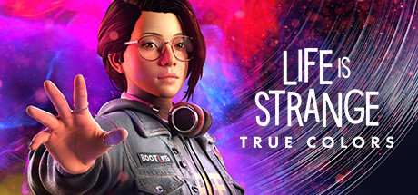

最近通关了 [奇异人生: 双重曝光(`Life is Strange: Double Exposure`)](https://store.steampowered.com/app/1874000/Life_is_Strange_Double_Exposure/), 这是我非常喜欢的 [奇异人生](https://store.steampowered.com/curator/36149206) 系列的最新作品

## 互动电影类游戏

[奇异人生 系列](https://store.steampowered.com/curator/36149206) 是我玩过的非常棒的 **互动电影类的游戏**, 游玩过程就像完整的 ~~👁 观看~~ 🎮 参与 一部美剧, 为什么说是参与呢?

- 因为 **对于电影来说你只能是观众, 但在游戏里你是主角**
- 互动电影类游戏令人着迷的是, **你可以控制主角的每个选择, 不同的选择将决定剧情的走向, 甚至影响最终的结局**

听起来是不是很不错, 但却想不到这个类型的游戏? 下面列举几个优秀的游戏作品:

- <a href="https://store.steampowered.com/app/1222140/_/" target="_blank">底特律：化身为人</a>: 游戏背景是人类与机器人的共处的未来, 你将扮演三个人形仿生机器人与人类相处, 站在机器人的角度思考和处理与人类的关系, **这个游戏让我感觉人类是自私和愚蠢的, 机器人也许会替代人类完成人类的使命**
- <a href="https://store.steampowered.com/app/939400/LoveChoice/?l=schinese" target="_blank">拣爱</a>: *这其实不算电影类游戏*, 拣爱是一款深受日式AVG游戏启发的剧情导向游戏, **它强调玩家的每一个选择，每个场景都充满了深意和目的性**。这款游戏以探讨爱为主题，旨在通过其丰富的故事和情感体验，引导玩家理解爱的真谛，并学习如何在人际关系中表达和接受爱。通过《拣爱》，玩家将踏上一段关于情感、选择与爱的旅程。
- <a href="https://store.steampowered.com/app/2322560/_/" target="_blank">完蛋! 我被美女包围了!</a>: 无需多言, 它完全没有故事情节, 但它有足够漂亮主动的女生, 和爽文男主般的初始设定, **顶级的男主, 一流的女演员, 蹩脚的台词, 和敷衍的剧情**
- <a href="https://store.steampowered.com/app/1341820/As_Dusk_Falls/" target="_blank">日落黄昏时(As Dusk Falls)</a>: 这是我玩过的第一个互动电影类游戏, 我至今无法忘记那个一口气通关的下午, 它与其他同类型游戏的不同之处在于, 它的沉浸感非常强, **它让你感觉到就像一个专业的电影团队做起了游戏, 它有着成熟的剧本, 成熟的配音, 成熟的画面, 一切都是专业级的**
- <a href="https://store.steampowered.com/app/1577120/_/" target="_blank">采石场惊魂</a>: 这是我玩过的唯一一个恐怖类型的互动电影类游戏, **它对于恐怖元素的尺度把握的刚刚好**, 喜欢恐怖游戏的朋友会感觉很过瘾

## 奇异人生系列
[奇异人生 系列](https://store.steampowered.com/curator/36149206) 没有宏大的世界观, 也没有炫酷刺激的剧情, 它用 缓慢 / 克制 / 细腻 的节奏, 层层递进地展开剧情, 并通过不同的选择

### 奇异人生本色

<iframe width="100%" height="460" src="https://video.fastly.steamstatic.com/store_trailers/256850740/movie480_vp9.webm"></iframe>

[奇异人生: 本色](https://store.steampowered.com/app/936790/Life_is_Strange_True_Colors) 是我玩过的奇异人生系列的第一款游戏, 从此我就喜欢上了这个系列, *但本作出现了政治不正确的元素, 因此收获了很多差评, 官方修改后重新上架才平息*

<!--  -->

女主是亚裔女生 艾黎克丝·陈(`Alex Chen`), 这是我最喜欢的女主之一, 游戏中的动作神态特别是面部表情极为细腻, 非常符合我们亚裔人的审美, 她有一种特殊的能力: **感受别人情绪的能力, 类似于捕获放大并进入别人的情绪, 所以也会被强烈的情绪波动影响**, 其实就是强烈的共情能力, 在游戏中 `Alex` 使用这个能力破解了一个又一个谜团

### 奇异人生1
毋庸置疑, [奇异人生1](https://store.steampowered.com/app/1265920/?snr=1_5_9__205) 是本系列的第一步作品, 也是最成功的作品, 后续的几部作品都没能超越本作;
