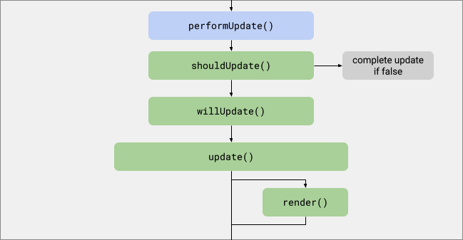

<details>
<summary>背景篇(点击展开)</summary>

## 缘起

最近接到了一个新需求, 要开发一个与 `AI` 进行对话的 `demo`(组件), 类似于 [chatgpt 网页版](https://chat.openai.com), 需要满足以下条件:
- 要 **在现有框架(`vue3` / `ant-design-vue@3`)中使用**
- 既要可以单独部署(**单页面**), 又要能作为 **组件** 集成到现有项目
- 因为要在现有项目中引入(嵌入), 所以尽量不引入过大的依赖, 保持 **轻量**
- 需求还未确定, 要有 **良好的扩展性**
- 未来可能在使用其他技术栈(例如 `vue2` / `react` / `angular`)的项目中使用, 需要有 **良好的兼容性**

其实在开源社区已经有非常多的 [chat ui](https://github.com/search?q=chat+ui&ref=opensearch&type=repositories), 但基本都是单独的项目, **无法作为组件引入**, *似乎每个项目都立志的成为独具一格的产品*

阿里的 [ant-design-x](https://x.ant.design/index-cn) 有 `vue` 版本 [ant-design-vue-x](https://github.com/wzc520pyfm/ant-design-x-vue), 它是一个成熟的组件库, 看起来满足我们的要求, 但它依赖于 `ant-design-vue@4`, 我们的项目中使用的是 `ant-design-vue@3`, 所以引入就报错了, 只能通过 `iframe` 的方式引入 😭

::github{repo="wzc520pyfm/ant-design-x-vue"}

## 前言
经过一番苦寻, 终于找到了一个名为 [deepchat](https://deepchat.dev/) 的项目, 它基于 **web components** 创建, 所以与前端基础框架无关, 更与组件库无关, 你甚至可以在纯 `html+css+js` 项目中使用它

::github{repo="OvidijusParsiunas/deep-chat"}

将其引入到 `vue` 项目中, 发现可以正常使用, 非常 `nice` 😎, 关于 `vue` 的 [web components](https://developer.mozilla.org/zh-CN/docs/Web/API/Web_components) 兼容性, 可参考我的另一篇文章 [vue & web components](../web-components/#vue--web-components)

---


久闻 [web components](https://developer.mozilla.org/zh-CN/docs/Web/API/Web_components) 大名, 之前工作中并未接触到它, 如今看到它无敌的兼容性, 留下了激动地泪水 😭; 在各种框架与库中兜兜转转, 最终回到了前端原生技术

前端技术更新迭代这么多年, 新技术和新框架层出不穷, 生态割裂严重:
- 基础组件的开发者有时不得不为每个 **前端框架** 都做一个 `adapter`(`@xxx/vue` / `@xxx/react`  / `@xxx/angular`)
- 甚至为每个 **框架的不同版本** 做兼容性处理(`vue2` 和 `vue3`)
- 像 [ant-design-vue-x](https://github.com/wzc520pyfm/ant-design-x-vue) 这样与组件库绑定的组件库, 甚至无法为 **组件库的其他版本** 提供支持

</details>

## 什么是 Lit
> Lit is a simple library for building fast, lightweight web components.
>
> At Lit's core is a boilerplate-killing component base class that provides reactive state, scoped styles, and a declarative template system that's tiny, fast and expressive.

引用官网的介绍:

[Lit](https://lit.dev) 是一个用于构建 **快速** / **轻量级** `web components` 的简单库

[Lit](https://lit.dev) 的核心是一个 **能够消除样板代码的组件基类**, 它提供了 **响应式状态** / **作用域样式** 以及一个 **声明式的模板系统**; 这个系统 小巧 / 快速 且 富有表现力

:::tip
关于 [web components](https://developer.mozilla.org/zh-CN/docs/Web/API/Web_components) 相关技术可以参考我的另一篇文章 [🔗 web components 原生 js 实现自定义组件](./web-components.md)
:::

## 教程

### 交互式教程
直接从 <a href="https://lit.dev/learn/#filter=tutorial" target="_blank">🔗 交互式教程</a> 开始看起, 这是一个 **交互式** / **带有 `playground`** 的学习教程, 涵盖了 [Lit](https://lit.dev) 的所有特性

### 示例
如果要 **快速入门** [Lit](https://lit.dev), <a href="https://lit.dev/playground/#sample=examples/hello-world" target="_blank">🔗 examples</a> 是一个更好的选择

:::tip
从官方的教程搭配 `ChatGPT` 入门是最好的选择, 这可以确保你快速找到问题的答案
:::

首先使用 `vite` 创建一个 `Lit` 项目:

```bash
pnpm create vite
✔ Project name: … lit-demo
✔ Select a framework: › Lit
✔ Select a variant: › TypeScript

Scaffolding project in /Users/xxx/projects/lit-demo...

Done. Now run:

  cd hyosan-chat
  pnpm install
  pnpm run dev

```

```typescript
import { css, html, LitElement } from "lit";
import { customElement, property, state } from "lit/decorators.js";

@customElement('count-button')
export class CountButton extends LitElement {
  @property()
  message = 'Count is '

  @state()
  count = 0
  handleClick() {
    this.count++
  }

  static styles = css`
    button {
      padding: 10px;
      font-size: 18px;
      border-radius: 10px;
      border-color: transparent;
    }
  `
  render() {
    return html`
      <button @click=${this.handleClick}>${this.message} ${this.count}</button>
    `
  }
}

declare global {
  interface HTMLElementTagNameMap {
    'count-button': CountButton
  }
}
```

:::tip
组件声明的标签名必须包含 `-`(连字符), 这确保了与浏览器内置标签不会重复
:::

## 核心特性

### 生命周期
`Lit` 扩展了 [`Web Components` 的生命周期](https://developer.mozilla.org/zh-CN/docs/Web/API/Web_components/Using_custom_elements#%E8%87%AA%E5%AE%9A%E4%B9%89%E5%85%83%E7%B4%A0%E7%94%9F%E5%91%BD%E5%91%A8%E6%9C%9F%E5%9B%9E%E8%B0%83), 分为以下三个阶段, 详见 [lifecycle](https://lit.dev/docs/components/lifecycle/)

1. 触发更新

当 **响应式属性值更新** / **调用 `requestUpdate()`** 时触发, `Lit` 会触发异步更新, 即 **捕获多个属性更改并体现到一个 `update` 中**


2. 执行更新

此时可以更新属性值, 更新后并不会触发重新 `update`


3. 完成更新


| 生命周期函数                                                                | 继承自 `HTMLElement` | 描述                                                                                                                                                     | 执行方式 | 常用                                         |
| --------------------------------------------------------------------------- | -------------------- | -------------------------------------------------------------------------------------------------------------------------------------------------------- | -------- | -------------------------------------------- |
| `connectedCallback`                                                         | ✅                    | 当元素被添加到文档中时调用                                                                                                                               | 声明     | ✅                                            |
| `disconnectedCallback`                                                      | ✅                    | 当元素从文档中移除时调用                                                                                                                                 | 声明     | ✅                                            |
| `adoptedCallback`                                                           | ✅                    | 当元素被移动到新的文档时调用                                                                                                                             | 声明     |                                              |
| `attributeChangedCallback`                                                  | ✅                    | 当元素上的属性值发生变化时调用                                                                                                                           | 声明     |                                              |
| [hasChanged](https://lit.dev/docs/components/properties/#haschanged)        |                      | 在设置响应式属性时隐式调用(或 `@property` 中声明)，用于 **检查并决定是否触发更新**                                                                       | 声明     |
| [requestUpdate](https://lit.dev/docs/components/lifecycle/#requestUpdate)   |                      | 调用 `requestUpdate()` 来安排显式更新。一般 **用于与属性无关的内容发生更改时更新和呈现元素**                                                             | **调用** | ✅                                            |
| [shouldUpdate](https://lit.dev/docs/components/lifecycle/#shouldupdate)     |                      | 在更新开始前调用，用于 **决定是否需要执行更新**                                                                                                          | 声明     | [✅](https://lit.dev/tutorials/reactivity/#4) |
| [willUpdate](https://lit.dev/docs/components/lifecycle/#willupdate)         |                      | 在 `update()` 之前调用以 **计算 / 修改 更新期间所需的值**                                                                                                | 声明     | [✅](https://lit.dev/tutorials/reactivity/#5) |
| [update](https://lit.dev/docs/components/lifecycle/#update)                 |                      | 调用以更新组件的 `DOM`                                                                                                                                   | 声明     |                                              |
| [render](https://lit.dev/docs/components/lifecycle/#render)                 |                      | **由 `update()` 调用**                                                                                                                                   | 声明     |                                              |
| [firstUpdated](https://lit.dev/docs/components/lifecycle/#firstupdated)     |                      | 在组件的 `DOM` **第一次更新后调用**                                                                                                                      | 声明     |                                              |
| [updated](https://lit.dev/docs/components/lifecycle/#updated)               |                      | 每当组件的更新完成并且元素的 `DOM` 已更新和呈现时调用                                                                                                    | 声明     | [✅](https://lit.dev/tutorials/reactivity/#6) |
| [updateComplete](https://lit.dev/docs/components/lifecycle/#updatecomplete) |                      | 值为 `Promise<boolean>`, 表示组件是否完成更新, 可通过定义 [getUpdateComplete()](https://lit.dev/docs/components/lifecycle/#getUpdateComplete) 修改其行为 | **调用** |                                              |

### attribute & property
在 [Lit](https://lit.dev) 中有两个很容易混淆的概念: `attribute` 和 `property`:

- `attribute`: 指的是元素标签上的属性, 例如 `<my-element foo="bar" />` 中的 `foo`
- `property`: 指的是元素对象上的属性, 例如 `document.querySelector('my-element').foo` 中的 `foo`

:::tip
相比于 `attribute`, `property` 可以接受任意类型的值, 而 `attribute` 只能接受字符串类型
:::

## 常用特性
### classMap
```typescript
import { css, html, LitElement } from 'lit';
import { customElement, property, state } from 'lit/decorators.js';
import { classMap } from 'lit/directives/class-map.js';

@customElement('my-component')
export class MyComponent extends LitElements {
  // ...
  @state() private playDirection: -1 | 1 = 1;
  render() {
    return html`<div class="${classMap({ backwards: this.playDirection === -1 })}"></div>`
  }
}
```

### repeat
参考教程 [working with lists](https://lit.dev/tutorials/working-with-lists/#6)

## 参考
- [Lit](https://lit.dev)
- [web components](https://developer.mozilla.org/zh-CN/docs/Web/API/Web_components)
- [caniuse Custom Elements](https://caniuse.com/?search=web%20components)
- [Web Components-LitElement实践](https://juejin.cn/post/7104055306396631076)