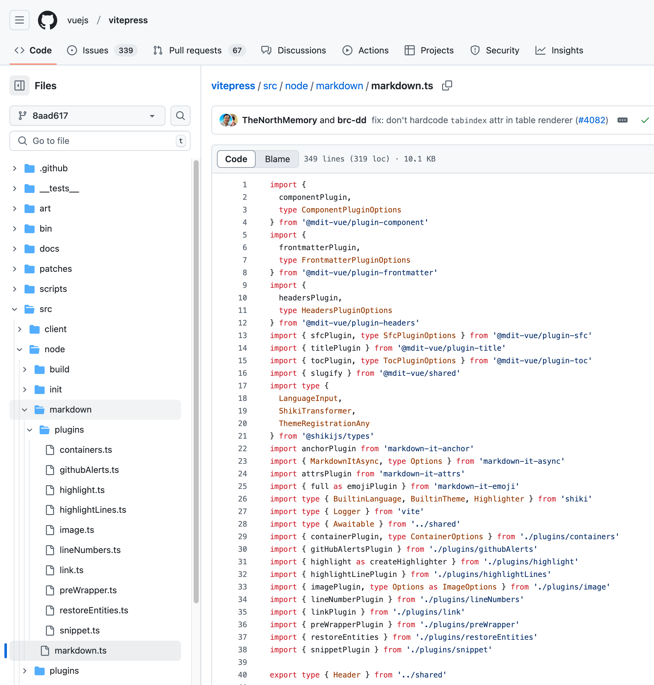
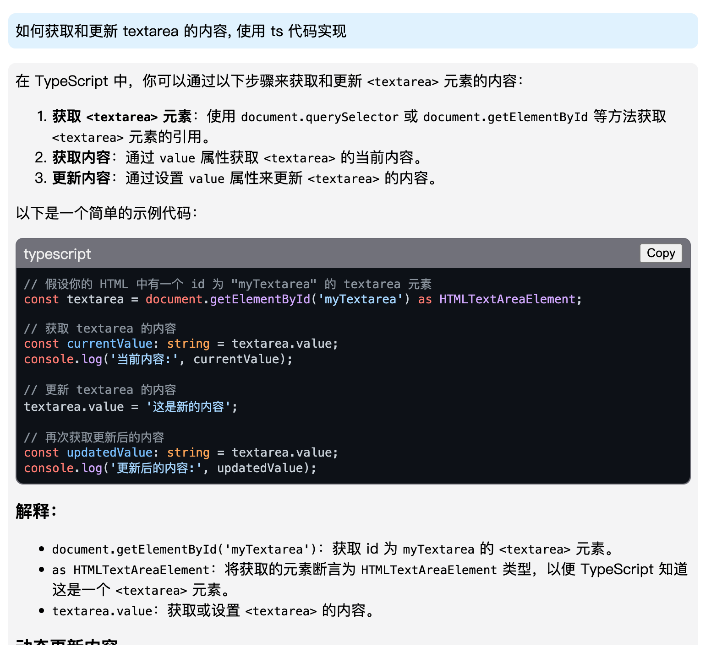

最近在做一个 `AI` 对话组件, 当收到消息时需要对 `markdown` 内容进行实时渲染, 所以需要配置 [markdown-it](https://www.npmjs.com/package/markdown-it) 解析,  我们将参考 `vitepress` 的 `markdown-it` 配置

## 前言
由于对 markdown 渲染比较陌生, 所以直接使用了 [marked](https://www.npmjs.com/package/marked) 进行了渲染, 但是发现 `marked` 的生态及互联网上可参考的配置并不多, 倒是 [markdown-it](https://www.npmjs.com/package/markdown-it) 有比较丰富的生态及配置, [vitepress](https://vitepress.dev/) 就是使用 [markdown-it](https://www.npmjs.com/package/markdown-it) 进行渲染的, 我们将参考 `vitepress` 的 `markdown-it` 配置

## 封装 API
由于我们是在自己的项目里使用, 对我来说, 我是在组件库中使用的, 所以我们将 `markdown` 渲染功能封装成一个 API, 然后在组件中使用, 代码如下:

```typescript
import MarkdownIt from 'markdown-it-async'

const md = MarkdownIt()

// ...

/**
 * 将 markdown 字符串通过 markdown-it 渲染为 html 字符串
 * @param content markdown 字符串
 * @returns html 字符串
 */
export async function renderMarkdown(content: string) {
	const htmlContent = await md.render(content)
	return htmlContent
}
```

我们对外提供一个 `renderMarkdown` 方法, 接收 `content` 参数, 返回 `html` 内容

:::tip
这里我们使用了异步方法, 在实际使用中, 当我们需要渲染大量的 `markdown` 时, 可以使用异步方法, 可以避免阻塞主线程
:::

## 安装 markdown-it
```bash
pnpm i markdown-it-async
pnpm i -D @types/markdown-it
```

## 参考 vitepress 源码
1. 首先我们找到 [vitepress 仓库](https://github.com/vuejs/vitepress), 然后直接查看 `packages.json`, 发现 `vitepress` 使用了 `markdown-it` 进行了渲染
2. 搜索 `markdown-it`, 在 [搜索结果](https://github.com/search?q=repo%3Avuejs%2Fvitepress%20markdown-it&type=code) 我们可以看到所有包含 `markdown-it` 的源码文件, 但这里面包含了大量 `md` 文件, 实际上我们只需要看 `ts` 文件, 所以我们将搜索框内容改为 `repo:vuejs/vitepress path:*.ts markdown-it`, 这样就可以只搜索 `ts` 文件了
3. 在 [搜索结果](https://github.com/search?q=repo%3Avuejs%2Fvitepress+path%3A*.ts+markdown-it&type=code) 中, 可以看到 `vitepress` 将关于 `markdown` 渲染的功能都放到了 [src/node/markdown](https://github.com/vuejs/vitepress/tree/8aad617446c03d39a65a0b21e9fce43bc484af1e/src/node/markdown) 文件中, 入口文件就是 [src/mode/markdown/markdown.ts](https://github.com/vuejs/vitepress/blob/8aad617446c03d39a65a0b21e9fce43bc484af1e/src/node/markdown/markdown.ts)



代码中包含一些 `@mdit-vue/*` 包, 这些是将 `markdown` 转换为 `vue` 代码的包, 由于 `vitepress` 的渲染产物是 vue 代码, 所以我们并不能直接使用, 但我们可以挑选用得到的相关的插件或依赖, 并加入到我们的项目中:

```bash
pnpm i markdown-it-async markdown-it-highlightjs markdown-it-link-attributes markdown-it-mathjax3
pnpm i -D @types/markdown-it-link-attributes
```

```typescript
import { MarkdownItAsync } from 'markdown-it-async'
import highlight from 'markdown-it-highlightjs'
import CodeBlockWrapper from './CodeBlockWrapper'
import linkAttr from 'markdown-it-link-attributes'
import mathjax3 from 'markdown-it-mathjax3'

/** markdown-it 实例 */
let _md: MarkdownItAsync

/** 获取并初始化 markdown-it 实例 */
export async function getMarkdownItInstance(): Promise<MarkdownItAsync> {
  if (_md) return _md
  _md = new MarkdownItAsync()
  // 代码高亮
  _md.use(highlight)
  // 代码块使用自定义组件包裹
  _md.use(CodeBlockWrapper)
  // 链接在新窗口打开
  _md.use(linkAttr, { attrs: { target: '_blank', rel: 'noopener'} })
  // 渲染数学公式
  _md.use(mathjax3, {
    tex: {
      tags: 'ams',
      inlineMath: [
        // start/end delimiter pairs for in-line math
        ["$", "$"],
        ["\\(", "\\)"]
      ],
      displayMath: [
        // start/end delimiter pairs for display math
        ["$$", "$$"],
        ["\\[", "\\]"]
      ],
    }
  })
  return _md
}

/**
 * 将 markdown 字符串通过 markdown-it 渲染为 html 字符串
 * @param content markdown 字符串
 * @returns html 字符串
 */
export async function renderMarkdown(content: string) {
  const processedContent = getProcessedContent(content)
  const md = await getMarkdownItInstance()
	const htmlContent = await md.renderAsync(processedContent)
	return htmlContent
}

/**
 * 将 markdown 字符串进行预处理, 将 `\\[` 和 `\\]` 替换为 `$$`
 * @param content markdown 字符串
 */
export function getProcessedContent(content: string) {
  return content.replace(/\\\[|\\\]/g, '$$')
}
```

实际上 `markdown-it` 还有很多插件, 可以通过在 `npmjs.com` 搜索 `markdown-it` [查看](https://www.npmjs.com/search?q=markdown-it)

让我们看一下所有的依赖:
- `markdown-it-highlightjs`: 用于语法高亮, 直接将样式内联, 省去了引入 `css` 的步骤, *但是主题样式还是需要引入的, 例如 `import 'highlight.js/styles/github-dark.min.css'`*
- `markdown-it-link-attributes`: 用于添加链接的属性, 例如 `target="_blank"`, 这个对于对话组件是必须的, 因为我们希望用户点击链接后, 会在新窗口中打开
- `markdown-it-mathjax3`: 用于渲染数学公式, *注意, 这里需要对一些特殊的语法进行替换, 例如 `\\[ ... \\]`, 在代码中的 `getProcessedContent` 中进行了替换处理*

## 代码块自定义元素
在以上代码中我们还写了一个自定义插件 `CodeBlockWrapper`, 用于将代码块包裹成一个自定义元素, 这样我们就可以对每个代码块进行处理, 比如: **添加复制按钮** / **美化样式**

```typescript
import type { MarkdownItAsync } from "markdown-it-async";
import hljs from "highlight.js";

/**
 * 自定义插件: 添加复制按钮
 * @param md markdown-it 实例
 */
export default function CodeBlockWrapper(md: MarkdownItAsync) {
  const defaultRenderer = md.renderer.rules.fence || ((tokens, idx, options, env, self) => self.renderToken(tokens, idx, options));

  md.renderer.rules.fence = (tokens, idx, options, env, self) => {
    const token = tokens[idx];
    const code = token.content.trim();
    const lang = token.info.trim();

    let highlightedCode = '';
    if (lang && hljs.getLanguage(lang)) {
      highlightedCode = hljs.highlight(code, { language: lang }).value;
    } else {
      highlightedCode = md.utils.escapeHtml(code);
    }

    // const copyButtonHtml = '<button class="copy-button" title="Copy to clipboard">Copy</button>';
    const preHtml = `<pre class="hljs"><code>${highlightedCode}</code></pre>`;
    // const html = `<div class="code-block">${copyButtonHtml}${preHtml}</div>`;
    const html = `<hyosan-chat-code-block-wrapper language="${lang}">${preHtml}</hyosan-chat-code-block-wrapper>`

    return html;
  };
}
```

这里我们将代码包裹在 `<hyosan-chat-code-block-wrapper>` 中, 然后传入 `language` 参数

接着创建自定义组件(这里使用了 [Lit](https://lit.dev) 来编写自定义组件), 创建 `src/components/hyosan-chat-code-block-wrapper`:
```typescript
import ShoelaceElement from '@/internal/shoelace-element'
import { LocalizeController } from '@/utils/localize'
import { css, html } from 'lit'
import { customElement, property, state } from 'lit/decorators.js'

/** 发送 组件 */
@customElement('hyosan-chat-code-block-wrapper')
export class HyosanChatCodeBlockWrapper extends ShoelaceElement {
	static styles? = css`
		:host {
			display: block;
			margin: 1rem 0;
		}
		.code-block-container {
			display: block;
			border-radius: var(--hy-container-radius);
			border: 1px solid rgba(60, 60, 60, 0.1);
			background-color: var(--sl-color-neutral-500);
			header {
				margin: 0.3rem 0.5rem;
				color: #EEE;
				display: flex;
				justify-content: space-between;
				button {
					display: block;
					cursor: pointer;
				}
			}
		}
		::slotted(pre) {
			padding: var(--hy-container-padding);
			margin: 0;
			border-bottom-left-radius: var(--hy-container-radius);
			border-bottom-right-radius: var(--hy-container-radius);
		}
  `

	@property({ type: String })
	language = 'javascript'

	@state()
	private _copyButtonContent = ''

	/** 本地化控制器 */
	private _localize = new LocalizeController(this)

	private _handleCopy() {
		const pre = this.querySelector('pre')
		if (pre) {
			const text = pre.textContent
			if (text) {
				navigator.clipboard.writeText(text)
				this._copyButtonContent = this._localize.term('copySuccessfully')
				setTimeout(() => {
					this._copyButtonContent = this._localize.term('copy')
					this.requestUpdate()
				}, 2000)
			}
		}
	}

	render() {
		const copyButtonContent = this._copyButtonContent || this._localize.term('copy')
		return html`
      <div class="code-block-container">
				<header>
					<div class="lang">${this.language}</div>
					<div class="button-group">
						<button @click=${this._handleCopy}>${copyButtonContent}</button>
					</div>
				</header>
				<main>
					<slot></slot>
				</main>
      </div>
    `
	}
}

declare global {
	interface HTMLElementTagNameMap {
    'hyosan-chat-code-block-wrapper': HyosanChatCodeBlockWrapper
	}
}

```

最终效果:



## 参考
- [markdown-it](https://www.npmjs.com/package/markdown-it)
- [vitepress](https://vitepress.dev/)
- [shiki](https://shiki.tmrs.site/)
