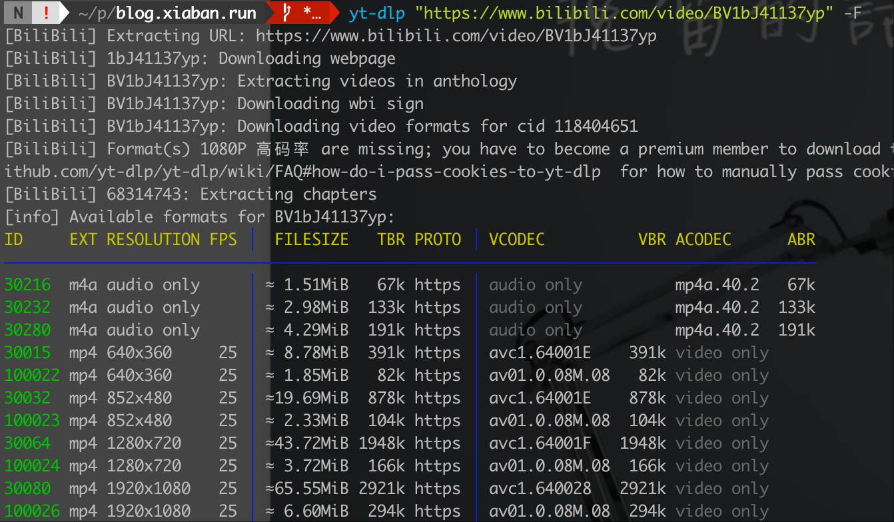
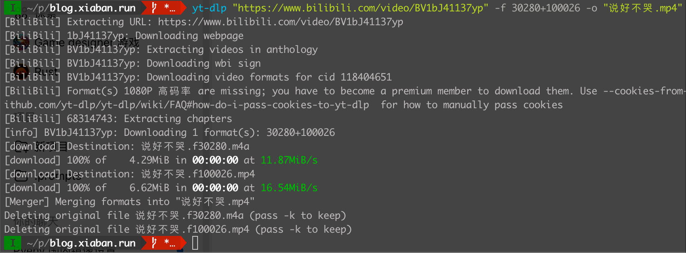
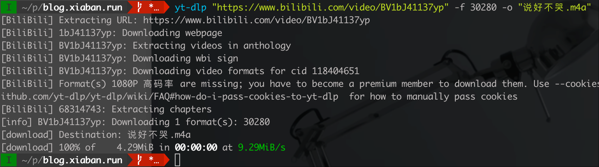
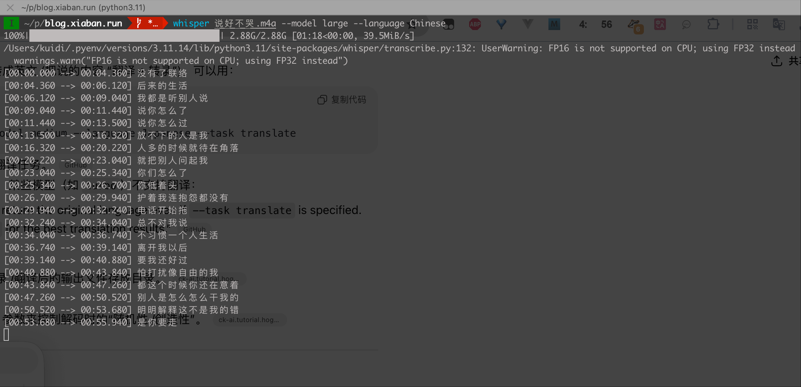
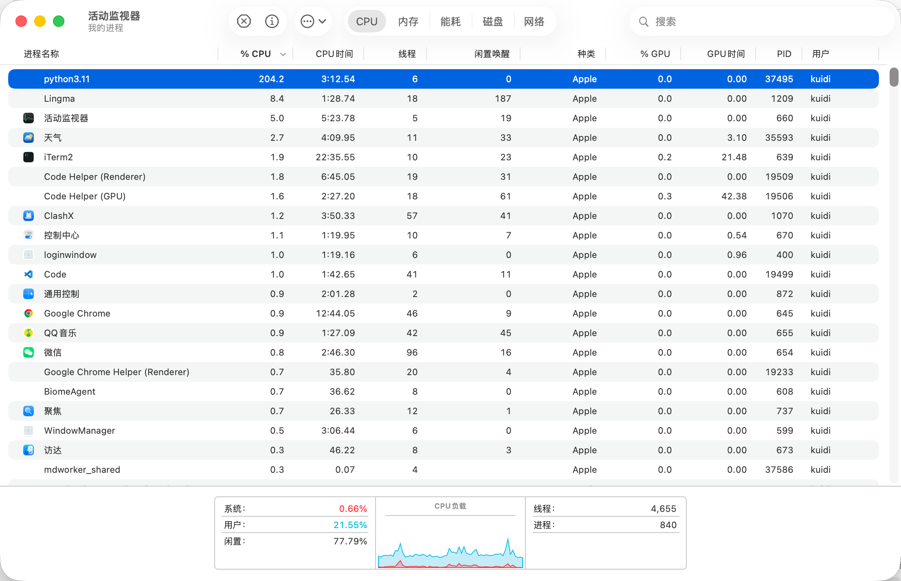
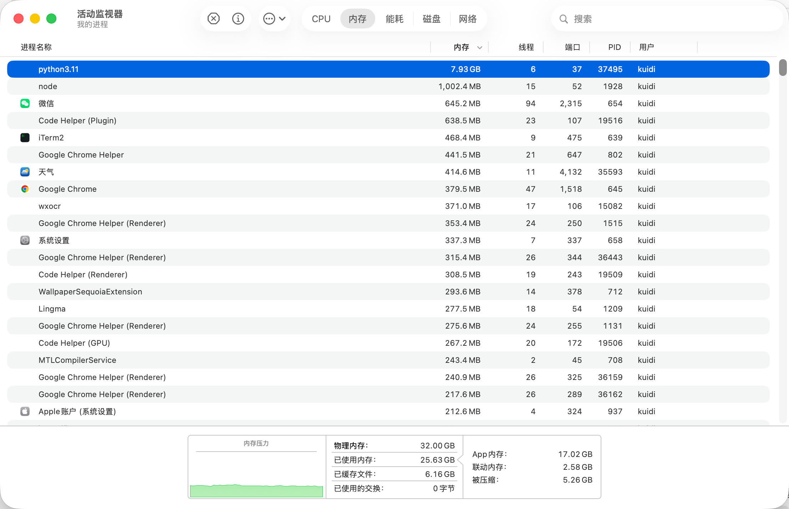

## 安装
首先需要确保已经安装了 <a href="https://www.python.org/downloads/" target="_blank">python</a> **3.11 版本**, 如果本地的 `python` 版本不在 `3.8 ~ 3.11` 范围内, 可以使用 `pyenv` 来安装 `python`, 详见 [pyenv](#pyenv) 章节

```bash
pip install -U openai-whisper
```

### pyenv
> [!TIP]
> 对于安装 `openai-whisper` 来说, `pyenv` 是可选的, **只有在本地 `python` 版本不是 `3.8 ~ 3.11` 才需要安装**

1. `whisper` 需要的 `python` 版本是 `3.8 ~ 3.11`, 所以需要安装 `pyenv` 来 **管理和切换 `python` 版本**, 以 `MacOS` 环境为例, 我们可以直接使用 `brew` 安装

```bash
brew update
brew install pyenv
```
2. 配置环境变量, 这里我是用的是 `fish shell`:

```bash
set -Ux PYENV_ROOT $HOME/.pyenv
test -d $PYENV_ROOT/bin; and fish_add_path $PYENV_ROOT/bin

pyenv init - fish | source
```

3. 切换 `python` 版本, 这里我选择的是 `3.11.x`
```bash
# 1. 首先查看 3.11.x 的所有版本(可选)
pyenv install -l | grep 3.11

  3.11.0
  3.11-dev
  3.11.1
  3.11.2
  3.11.3
  3.11.4
  3.11.5
  3.11.6
  3.11.7
  3.11.8
  3.11.9
  3.11.10
  3.11.11
  3.11.12
  3.11.13
  3.11.14
  ...
```

```bash
# 2. 设置下载镜像(可选, 这是 fish shell 的设置命令, 其他 shell 请自行修改)
set -Ux PYTHON_BUILD_MIRROR_URL https://mirrors.tuna.tsinghua.edu.cn/python

# 3. 安装 3.11.14
pyenv install 3.11.14

# 4. 切换到 3.11.14, 这里我们选择只在当前 shell 中切换
pyenv shell 3.11.14 # ✅ 只在当前 shell 生效, 不会影响全局的 python 环境
# pyenv local 3.11.14 # 位于当前目录下时自动选择此版本
# pyenv global 3.11.14 # 全局切换版本
```

> [!NOTE]
> 如果切换时提示 `pyenv: shell integration not enabled. Run 'pyenv init' for instructions.`, 则需要 执行 `pyenv init` 命令, 并且按照输出的提示进行操作, 例如在 `fish shell` 下是需要执行 `pyenv init - fish | source`

```bash
# 5. 查看 python 版本
python --version
```

> [!TIP]
其他系统的安装方式参考 <a href="https://github.com/pyenv/pyenv?tab=readme-ov-file#installation" target="_blank">pyenv - Installation</a>, `pyenv` 并不支持 `windows`, 可使用 <a href="https://github.com/pyenv-win/pyenv-win?tab=readme-ov-file#quick-start" target="_blank">pyenv-win</a>

## ffmpeg
whisper 需要 `ffmpeg` 来处理音频文件, 所以需要安装 `ffmpeg`

你可以直接下载: <a href="https://ffmpeg.org/download.html" target="_blank">ffmpeg - Download</a>

或者通过命令行工具安装:
```bash
# on Ubuntu or Debian
sudo apt update && sudo apt install ffmpeg

# on Arch Linux
sudo pacman -S ffmpeg

# on MacOS using Homebrew (https://brew.sh/)
brew install ffmpeg

# on Windows using Chocolatey (https://chocolatey.org/)
choco install ffmpeg

# on Windows using Scoop (https://scoop.sh/)
scoop install ffmpeg
```

## 选择模型和语言
有 <a href="https://github.com/openai/whisper?tab=readme-ov-file#available-models-and-languages" target="_blank">以下模型</a> 可选择:

|  Size  | Parameters | English-only model | Multilingual model | Required VRAM | Relative speed |
| :----: | :--------: | :----------------: | :----------------: | :-----------: | :------------: |
|  tiny  |    39 M    |     `tiny.en`      |       `tiny`       |     ~1 GB     |      ~10x      |
|  base  |    74 M    |     `base.en`      |       `base`       |     ~1 GB     |      ~7x       |
| small  |   244 M    |     `small.en`     |      `small`       |     ~2 GB     |      ~4x       |
| medium |   769 M    |    `medium.en`     |      `medium`      |     ~5 GB     |      ~2x       |
| large  |   1550 M   |       `N/A`        |      `large`       |    ~10 GB     |       1x       |
| turbo  |   809 M    |       `N/A`        |      `turbo`       |     ~6 GB     |      ~8x       |

由于我们需要识别的是中文普通话, 所以只能选择 `Multilingual model`, 然后我们安装本地的内存大小选择适合的模型, 这里我选择 `large`

## 使用
接下来我们尝试使用 <a href="https://github.com/yt-dlp/yt-dlp" target="_blank">yd-dlp</a> 从 `bilibili` 获取视频, 然后使用 `ffmpeg` 提取其中的音频, 再交给 `whisper` 进行语音识别, 最终提取视频中的语音文本:

<iframe width="100%" height="468" src="//player.bilibili.com/player.html?isOutside=true&aid=68314743&bvid=BV1bJ41137yp&cid=118404651&p=1" scrolling="no" border="0" frameborder="no" framespacing="0" allowfullscreen="true"></iframe>

### yt-dlp
> [!TIP]
> 💡 实际上可以直接使用 `yt-dlp` 提取音频, **这里为了演示增加了 `ffmpeg` 提取的操作, 详见 [直接下载音频](#直接下载音频) 章节**

我们随便找一个自己喜欢的视频, 这里为了直观的感受语音识别的准确率, 我们找一个翻唱视频:

#### 下载视频
由于 B 站是视频和音频分离的, 所以我们可以直接下载音频文件
```bash
# 查看可以下载的视频资源格式
yt-dlp "https://www.bilibili.com/video/BV1bJ41137yp" -F
```


然后我们按照 id 来下载视频和音频文件, 最终下载的是 `.mp4` 格式的音频文件:
```bash
yt-dlp "https://www.bilibili.com/video/BV1bJ41137yp" -f 30280+100026 -o "说好不哭.mp4"
```



#### 提取音频
我们使用 `ffmpeg` 提取音频文件:

```bash
ffmpeg -i 说好不哭.mp4 -vn -c:a copy 说好不哭-audio.m4a
```

#### 直接下载音频
或者我们选择 `audio only` 中质量最高的音频文件进行下载

```bash
yt-dlp "https://www.bilibili.com/video/BV1bJ41137yp" -f 30280 -o "说好不哭.m4a"
```



### 使用 whisper 识别语音
最终, 我们得到了此视频的音频文件 `说好不哭.m4a`, 我们使用 `whisper` 识别:

```bash
whisper 说好不哭.m4a --model large --language Chinese
```


> [!TIP]
首次执行需要下载对应的模型



这里不知道为什么, 识别过程非常慢, 总共花了 `8.1m`, 查看 `CPU` 及 内存使用情况也没有发现问题:




这是输出的语音文本:
```bash
[00:00.000 --> 00:04.360] 没有了联络
[00:04.360 --> 00:06.120] 后来的生活
[00:06.120 --> 00:09.040] 我都是听别人说
[00:09.040 --> 00:11.440] 说你怎么了
[00:11.440 --> 00:13.500] 说你怎么过
[00:13.500 --> 00:16.320] 放不下的人是我
[00:16.320 --> 00:20.220] 人多的时候就待在角落
[00:20.220 --> 00:23.040] 就把别人问起我
[00:23.040 --> 00:25.340] 你们怎么了
[00:25.340 --> 00:26.700] 你低着头
[00:26.700 --> 00:29.940] 护着我连抱怨都没有
[00:29.940 --> 00:32.240] 电话开始拖
[00:32.240 --> 00:34.040] 总不对我说
[00:34.040 --> 00:36.740] 不习惯一个人生活
[00:36.740 --> 00:39.140] 离开我以后
[00:39.140 --> 00:40.880] 要我还好过
[00:40.880 --> 00:43.840] 怕打扰像自由的我
[00:43.840 --> 00:47.260] 都这个时候你还在意着
[00:47.260 --> 00:50.520] 别人是怎么怎么干我的
[00:50.520 --> 00:53.680] 明明解释这不是我的错
[00:53.680 --> 00:55.940] 是你要走
[00:55.940 --> 01:01.600] 掩盖着你难过
[01:01.600 --> 01:08.000] 挽留的话却没有说
[01:08.000 --> 01:14.980] 你会微笑放手
[01:14.980 --> 01:21.640] 说好无辜让我走
[01:24.880 --> 01:25.040] Zither Harp
[01:25.040 --> 01:25.920] 电话开始拖
[01:25.940 --> 01:26.940] 总不对我说
[01:26.940 --> 01:27.940] 不习惯一个人生活
[01:27.940 --> 01:28.940] 离开我以后
[01:28.940 --> 01:29.940] 要我还好过
[01:29.940 --> 01:30.940] 怕打扰像自由的我
[01:30.940 --> 01:31.940] 都这个时候你还在意着
[01:31.940 --> 01:32.940] 别人是怎么怎么干我的
[01:32.940 --> 01:33.940] 明明解释这不是我的错
[01:33.940 --> 01:34.940] 是你要走
[01:34.940 --> 01:35.940] 掩盖着你难过
[01:35.940 --> 01:36.940] 都这个时候你还在意着
[01:36.940 --> 01:37.940] 别人是怎么怎么干我的
[01:37.940 --> 01:38.940] 明明解释这不是我的错
[01:38.940 --> 01:39.940] 是你要走
[01:39.940 --> 01:40.940] 掩盖着你难过
[01:40.940 --> 01:41.940] 掩盖着你难过
[01:41.940 --> 01:42.940] 掩盖着你难过
[01:42.940 --> 01:43.940] 掩盖着你难过
[01:43.940 --> 01:44.940] 走
[01:44.940 --> 01:45.940] 走
[01:45.940 --> 01:46.940] 走
[01:46.940 --> 01:47.940] 走
[01:47.940 --> 01:48.940] 走
[01:48.940 --> 01:49.940] 走
[01:49.940 --> 01:50.940] 走
[01:50.940 --> 01:51.940] 走
[01:51.940 --> 01:52.940] 走
[01:52.940 --> 01:53.940] 走
[01:53.940 --> 01:54.940] 走
[01:54.940 --> 01:55.940] 走
[01:55.940 --> 01:56.940] 走
[01:56.940 --> 01:57.940] 走
[01:57.940 --> 01:58.940] 走
[01:58.940 --> 01:59.940] 走
[01:59.940 --> 02:00.940] 走
[02:00.940 --> 02:01.940] 走
[02:01.940 --> 02:02.940] 走
[02:02.940 --> 02:03.940] 走
[02:03.940 --> 02:04.940] 走
[02:04.940 --> 02:05.940] 走
[02:05.940 --> 02:06.940] 走
[02:06.940 --> 02:07.940] 走
[02:07.940 --> 02:08.940] 走
[02:08.940 --> 02:09.940] 走
[02:09.940 --> 02:10.940] 走
[02:10.940 --> 02:11.940] 走
[02:11.940 --> 02:12.940] 走
[02:12.940 --> 02:13.940] 走
[02:13.940 --> 02:14.940] 走
[02:14.940 --> 02:15.940] 走
[02:15.940 --> 02:16.940] 走
[02:16.940 --> 02:17.940] 走
[02:17.940 --> 02:18.940] 走
[02:18.940 --> 02:19.940] 走
[02:19.940 --> 02:20.940] 走
[02:20.940 --> 02:21.940] 走
[02:21.940 --> 02:22.940] 走
[02:22.940 --> 02:23.940] 走
[02:23.940 --> 02:24.940] 走
[02:24.940 --> 02:25.940] 走
[02:25.940 --> 02:32.260] 还在为我梦加油
[02:32.260 --> 02:39.340] 心疼过了多久
[02:39.340 --> 02:45.340] 还在找理由等我
[02:55.940 --> 03:25.920] 由 Amara.org 社群提供的字幕
```

这个执行速度实在太慢, 识别准确率不忍直视(可能是因为是唱歌的原因?), 我们尝试使用小一点的模型来执行:

```bash
whisper 说好不哭.m4a --model medium --language Chinese
```

最终花费 `1.4m`, 识别结果如下:
```bash
[00:00.000 --> 00:06.600] 沒有了電絡 後來的生活
[00:06.600 --> 00:10.100] 我都是聽別人說
[00:10.100 --> 00:13.800] 說你怎麼了 說你怎麼過
[00:13.800 --> 00:17.300] 放不下的人是我
[00:17.300 --> 00:20.700] 人多的時候就待在角落
[00:20.700 --> 00:24.100] 就怕別人問起我
[00:24.100 --> 00:26.700] 你們怎麼了 你低著頭
[00:26.700 --> 00:30.900] 扶著我 連抱怨都沒有
[00:30.900 --> 00:34.300] 電話開始偷 總不對我說
[00:34.300 --> 00:37.700] 不習慣一個人生活
[00:37.700 --> 00:41.100] 離開我以後 要我好過
[00:41.100 --> 00:44.500] 怕它繞向自由的我
[00:44.500 --> 00:47.800] 都這個時候 你還在意著
[00:47.800 --> 00:51.200] 別人是怎麼 怎麼幹我的
[00:51.200 --> 00:53.700] 拼命解釋這不是我的錯
[00:53.700 --> 00:56.300] 是你要走
[00:56.300 --> 01:01.800] 眼看著你 難過
[01:03.800 --> 01:08.300] 溫柔的話卻沒有說
[01:10.300 --> 01:15.300] 你會怪笑 放手
[01:17.300 --> 01:22.300] 說好不顧 讓我走
[01:23.300 --> 01:28.300] 電話開始偷 總不對我說
[01:28.300 --> 01:31.300] 不習慣一個人生活
[01:31.300 --> 01:35.300] 離開我以後 要我好過
[01:35.300 --> 01:38.300] 怕它繞向自由的我
[01:38.300 --> 01:42.300] 都這個時候 你還在意著
[01:42.300 --> 01:45.300] 別人是怎麼 怎麼幹我的
[01:45.300 --> 01:48.300] 拼命解釋這不是我的錯
[01:48.300 --> 01:51.300] 是你要走
[01:51.300 --> 01:56.300] 眼看著你 難過
[01:58.300 --> 02:03.300] 溫柔的話卻沒有說
[02:05.300 --> 02:10.300] 你會怪笑 放手
[02:12.300 --> 02:16.300] 說好不顧 讓我走
[02:18.300 --> 02:22.300] 沒什麼都沒有
[02:25.300 --> 02:30.300] 卻還在為我夢加油
[02:32.300 --> 02:37.300] 想等過了多久
[02:39.300 --> 02:44.300] 還在找理由等我
[02:48.300 --> 02:53.300] 詞曲 李宗盛
```

输出的竟然是繁体字... 看来用来训练的语料基本都来自 `TW` 😭, `anyway`, 我们在尝试一下使用比特率最低的音频文件来进行识别:

```bash
yt-dlp "https://www.bilibili.com/video/BV1bJ41137yp" -f 30216 -o "说好不哭-30216.m4a"

[BiliBili] Extracting URL: https://www.bilibili.com/video/BV1bJ41137yp
[BiliBili] 1bJ41137yp: Downloading webpage
[BiliBili] BV1bJ41137yp: Extracting videos in anthology
[BiliBili] BV1bJ41137yp: Downloading wbi sign
[BiliBili] BV1bJ41137yp: Downloading video formats for cid 118404651
[BiliBili] Format(s) 1080P 高码率 are missing; you have to become a premium member to download them. Use --cookies-from-browser or --cookies for the authentication. See  https://github.com/yt-dlp/yt-dlp/wiki/FAQ#how-do-i-pass-cookies-to-yt-dlp  for how to manually pass cookies
[BiliBili] 68314743: Extracting chapters
[info] BV1bJ41137yp: Downloading 1 format(s): 30216
[download] Destination: 说好不哭-30216.m4a
[download] 100% of    1.51MiB in 00:00:00 at 4.86MiB/s
```

```bash
whisper 说好不哭-30216.m4a --model medium --language Chinese
[00:00.000 --> 00:10.000] 沒有了聯絡 後來的生活 我都是聽別人說
[00:10.000 --> 00:17.000] 說你怎麼了 說你怎麼過 放不下的人是我
[00:17.000 --> 00:24.000] 人多的時候就待在角落 就怕別人問起我
[00:24.000 --> 00:31.000] 你們怎麼了 你低著頭 捕捉我 連抱怨都沒有
[00:31.000 --> 00:38.000] 電話開始偷 總不對我說 不習慣一個人生活
[00:38.000 --> 00:44.000] 離開我以後 要我好好過 怕它擾向自由的我
[00:44.000 --> 00:51.000] 都這個時候 你還在意著 別人是怎麼 怎麼幹我的
[00:51.000 --> 00:56.000] 拼命解釋這不是我的錯 是你要走
[00:56.000 --> 01:03.000] 眼看著你難過
[01:03.000 --> 01:10.000] 忘了的話卻沒有說
[01:10.000 --> 01:17.000] 你會怪笑放手
[01:17.000 --> 01:25.000] 說好不顧讓我走
[01:25.000 --> 01:32.000] 電話開始偷 總不對我說 不習慣一個人生活
[01:32.000 --> 01:38.000] 離開我以後 要我好好過 怕它擾向自由的我
[01:38.000 --> 01:45.000] 都這個時候 你還在意著 別人是怎麼 怎麼幹我的
[01:45.000 --> 01:51.000] 拼命解釋這不是我的錯 是你要走
[01:51.000 --> 01:58.000] 眼看著你難過
[01:58.000 --> 02:05.000] 忘了的話卻沒有說
[02:05.000 --> 02:12.000] 你會怪笑放手
[02:12.000 --> 02:18.000] 說好不顧讓我走
[02:18.000 --> 02:25.000] 你什麼都沒有
[02:25.000 --> 02:32.000] 卻還在為我夢加油
[02:32.000 --> 02:39.000] 想藏過了多久
[02:39.000 --> 02:44.000] 還在找理由等我
```

最终耗时 `1.2m` 完成, 看来使用 `medium` 模型识别比特率较低的音频文件是最合适的方式, 虽然识别准确率很一般

最后附上小姐姐的翻唱视频链接: <a href="https://www.bilibili.com/video/BV1bJ41137yp/?vd_source=19e09fa462750e58610f95b1a63dbfe7" target="_blank">🎬 说好不哭 女正版 cover by 刘蕴晴 Rachel</a> 

## 参考来源
- <a href="https://github.com/yt-dlp/yt-dlp" target="_blank">yd-dlp</a>
- <a href="https://github.com/pyenv/pyenv?tab=readme-ov-file#installation" target="_blank">pyenv - Installation</a>
- 封面图素材来自: <a href="https://www.flaticon.com/free-icons/whisper" title="whisper icons">Whisper icons created by Freepik - Flaticon</a>