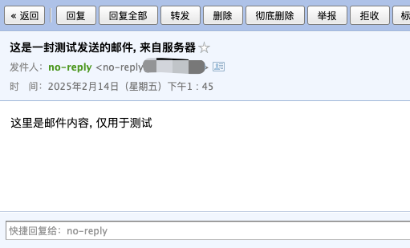

有时在服务器上触发某些事件时, 需要向用户(主要是我自己)发送邮件, 使用 `msmtp` 实现发送邮件, 如果已经开通了阿里邮箱, 就 **无需自己搭建邮件服务器**

:::tip
之前我已经配置好了 [阿里邮箱 - 免费版](https://help.aliyun.com/document_detail/437165.html)(参考 [📚 阿里云配置域名邮箱](/posts/2025/configure-domain-name-mailbox/)), 但是阿里邮箱的 **[API 开放平台](https://help.aliyun.com/document_detail/2852847.html) 免费版并不支持**, 所以无法通过 `API` 实现发送邮件的功能, 但好在 阿里邮箱 **允许第三方客户端收发邮件**, 所以只要 **配置好阿里邮箱, 并通过 [msmtp](https://wiki.archlinux.org/title/Msmtp) 发送邮件即可**
:::

<!-- ## 域名解析
1. ~~`@ MX mail.example.com | 1`~~

这条 `MX` 记录是表示 **指定接收邮件的服务器**

:::tip
由于我 **没有接收邮件的需求**(已经有 阿里邮箱 了), 所以忽略 `@ MX mail.example.com | 1` 解析(与阿里邮箱的解析冲突)
:::

2. `@ A mail.example.com`

这条记录用来解析 `mail` 子域名到自己的服务器

3. `@ TXT v=spf1 mx:mail.example.com -all`

这条记录用来 **指定发送邮件的服务器**

:::warning
如果你像我一样在 `1` 中没有配置 `MX` 记录, 则此处的 `mx:mail.example.com` 应该替换为 `a:mail.example.com`(即 `2` 中配置的 `A` 记录)
:::

`SPF(Sender Policy Framework)`是一种 `DNS TXT` 记录，它用于指定哪些服务器有权代表你的域名发送邮件, 以减少垃圾邮件和邮件欺诈的风险, 格式为:

```
v=spf1 [mechanisms] [modifiers]
```

- `v=spf1`: SPF 版本
- `mechanisms`: 表示允许的邮件服务器来源, 比如 `ip4` / `mx` / `include` 等
- `modifiers`: `-all` 拒绝不匹配邮件 / `~all` 软失败 / `+all` 允许所有

:::warning
如果配置了阿里邮箱:

注意: 阿里邮箱已经有一条 `SPF` 记录了(`@ TXT v=spf1 include:spf.qiye.aliyun.com -all`), 这里只需要将加入 `mail.example.com`:

```
@ TXT v=spf1 include:spf.qiye.aliyun.com a:mail.example.com -all
```
:::

### 我的最终配置

1. `@ A mail.example.com`
2. `@ TXT v=spf1 include:spf.qiye.aliyun.com a:mail.example.com -all` -->

## msmtp
配置好解析规则后, 就需要在服务器上安装并配置 [msmtp](https://wiki.archlinux.org/title/Msmtp)

`msmtp` 是一个轻量级的 `msmtp` 客户端(命令行工具), 适用于 **只需要发送邮件的场景**

### 安装 msmtp

```bash
sudo apt update && sudo apt install msmtp msmtp-mta -y
# 安装时会提示是否启用 AppArmor, 直接选择 No
```

### 配置 msmtp
```bash
vim /etc/msmtprc
```

```ini
# 设置默认账户
account default
# 启用 STARTTLS
tls on
tls_trust_file /etc/ssl/certs/ca-certificates.crt
# 465 端口使用的是 SSL/TLS, 而不是 STARTTLS
tls_starttls off
# 你的 SMTP 服务器
host smtp.qiye.aliyun.com
# 端口号（465 是 SMTPS，587 是 STARTTLS）
port 465
# 你的邮件账户
auth on
user no-reply@example.com
password your-password
# 发送者邮箱
from no-reply@example.com
```

这里需要注意:
- 阿里邮箱只开放 `465` 端口, 所以需要将 `tls_starttls` 设置为 `off`
- 将 `example.com` 替换为你的域名

这里创建了 `msmtp` 的配置文件, 配置文件也可以放到 `~/.msmtprc`, 配置好后最好设置一下权限为 `600`

## 配置阿里邮箱
我们 **不在服务器自己搭建邮件服务, 直接通过阿里邮箱实现发送邮件**, 所以此场景下, 服务器需要安装用户发送邮件的客户端(`msmtp`), 阿里邮箱需要创建账号并开启 `SMTP`

### 创建 no-reply 账号
创建一个用于发送邮件的账号

1. 进入 [阿里邮箱网页端](https://qiye.aliyun.com)
2. 进入 组织与用户 - 员工账号管理 - 新建账号(`no-reply@example.com`), **必须勾选 开启 IMAP/SMPT 服务**

### 配置安全策略
阿里邮箱默认不允许第三方客户端登录, 需要在 **安全管理 - 账号安全策略** 中进行配置

1. 进入 安全管理 - 账号安全策略
2. (可选) **自由端双重认证 > 启用范围 中排除 `no-reply@example.com`**, 此时可以通过邮件客户端登录 `no-reply@example`
3. **三方客户端安全**, 开启 **允许使用第三方客户端**, 启用范围根据需要修改, 必须包含 `no-reply@example.com`
4. **定期修改密码提醒 > 例外账号**, 添加 `no-reply@example.com`

## 发送邮件
由于是在命令行中调用 `msmtp` 发送邮件, 所以需要注意一下邮件内容的格式:

```
Subject: 邮件标题
From: 邮件发送者 <no-reply@example.com>
To: 邮件接收者 <no-reply@example.com>

邮件内容
```

```bash
echo -e "Subject: 这是一封测试发送的邮件, 来自服务器\n\n这里是邮件内容, 仅用于测试" | msmtp me@test.com
```



:::warning
如果内容过于简单, 可能会直接进入邮件接受者的垃圾箱
:::

## 参考
- [msmtp](https://wiki.archlinux.org/title/Msmtp)
- [Ubuntu Linux 搭建邮件服务器（postfix + dovecot）](https://www.cnblogs.com/007sx/p/18347813)
- [阿里邮箱网页端](https://qiye.aliyun.com)
- [阿里邮箱 - 客户端配置](https://help.aliyun.com/document_detail/36576.html?spm=5176.21213303.J_v8LsmxMG6alneH-O7TCPa.7.7e842f3dt7Ez4P&scm=20140722.S_help@@%E6%96%87%E6%A1%A3@@36576._.ID_help@@%E6%96%87%E6%A1%A3@@36576-RL_465%E7%AB%AF%E5%8F%A3-LOC_llm-OR_ser-PAR1_2150440e17395222609746582e4052-V_4-RE_new5-P0_1-P1_0#:~:text=25-,465,-%E6%B3%A8%EF%BC%9A%E4%BB%A5%E4%B8%8B%E8%80%81)
