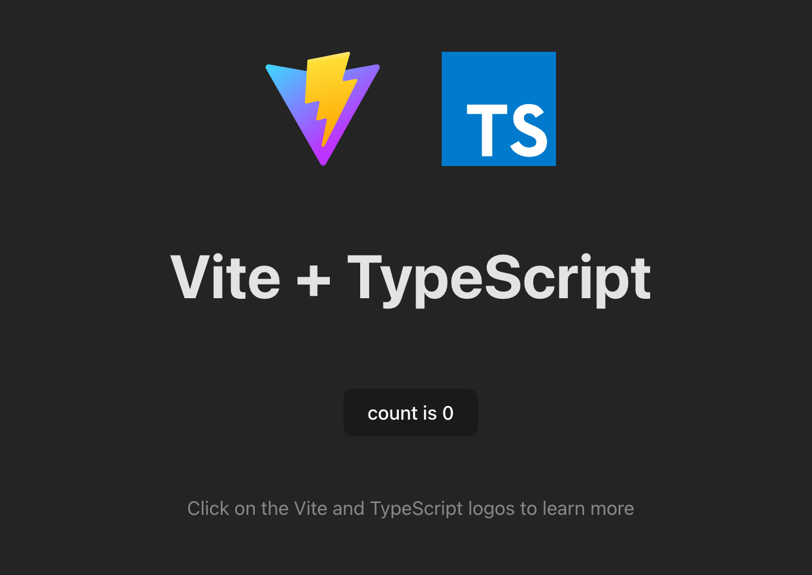
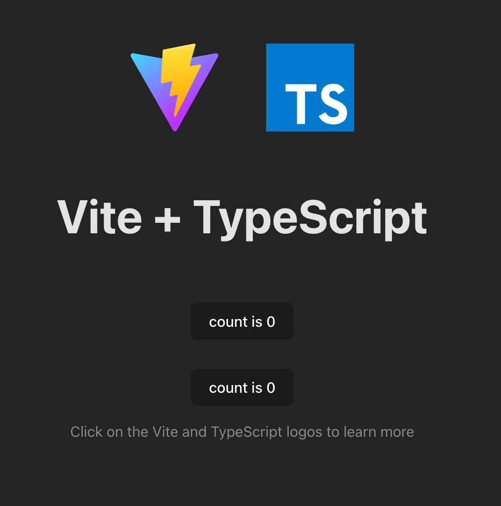
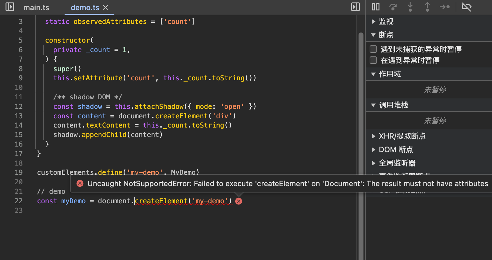
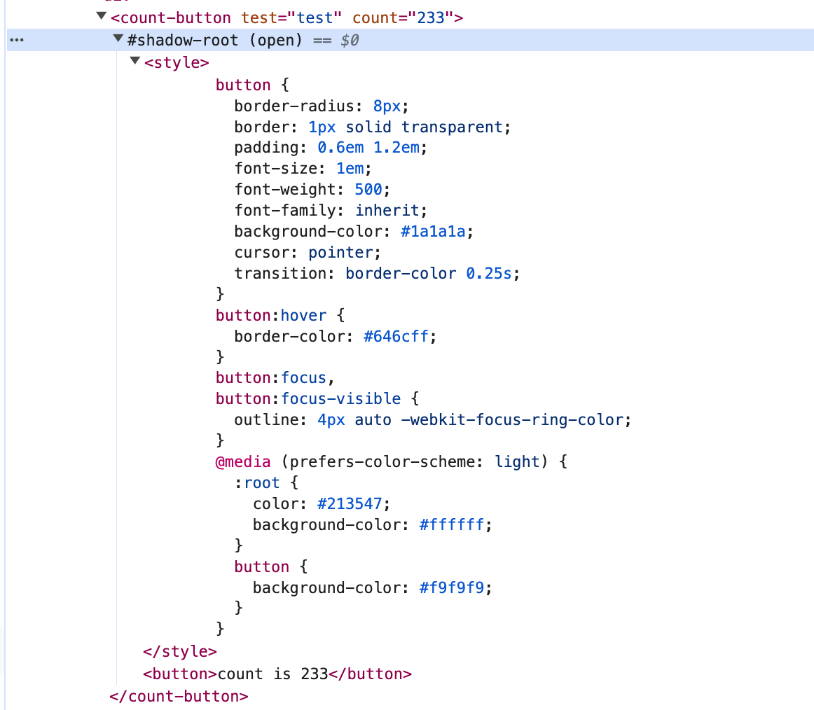
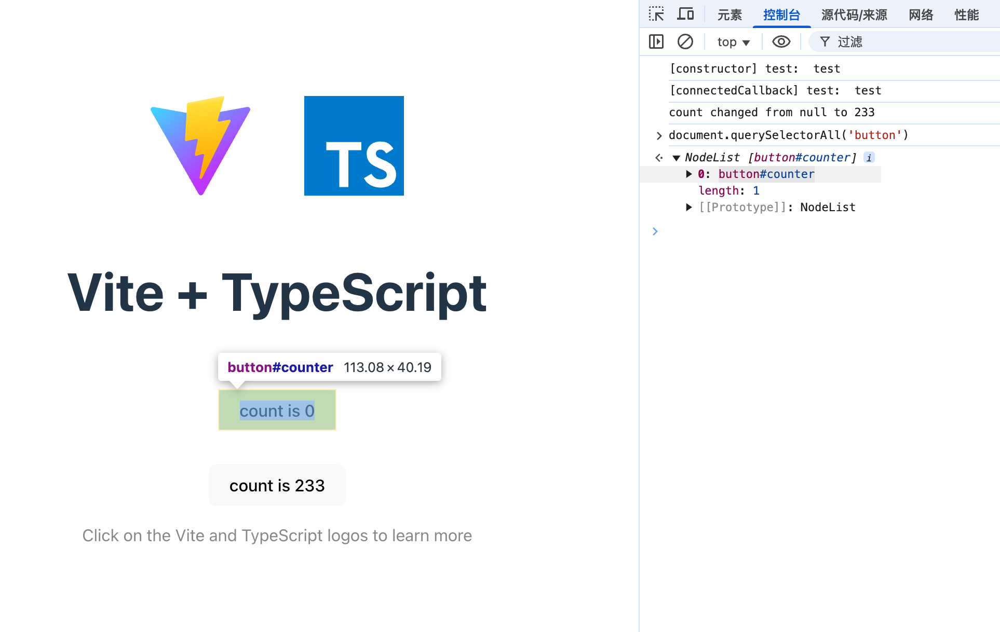
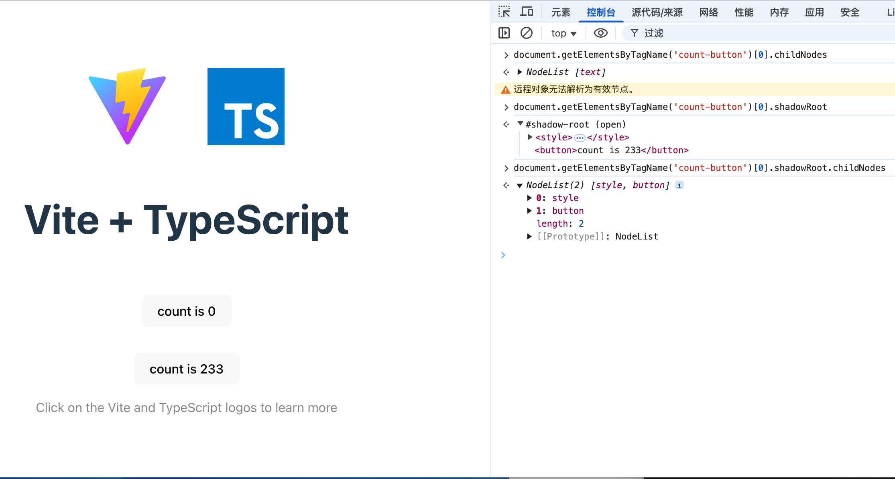
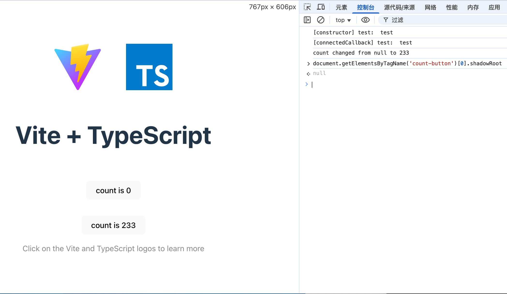

## 什么是 web components
[Lit](https://lit.dev) 是对 [web components](https://developer.mozilla.org/zh-CN/docs/Web/API/Web_components) 的封装与抽象, **其最核心的价值是让 [web components](https://developer.mozilla.org/zh-CN/docs/Web/API/Web_components) 更加适应现代化的前端开发工作流**; 所以让我们 **从 [web components](https://developer.mozilla.org/zh-CN/docs/Web/API/Web_components)** 开始讲起

[web components](https://developer.mozilla.org/zh-CN/docs/Web/API/Web_components) 想要实现的是让我们 **用原生 js 编写一个组件**, 其核心概念由以下技术组成:

- `Custom Element`: 自定义元素
- `Shadow DOM`: 影子 `DOM`
- `HTML template`:
  - `<template>` 可重用元素
  - `slot` 插槽

下面我们从零开始, 一步一步实现一个 `web components`:

```bash
# 创建一个 vite 项目, framework 选择 Vanilla, variant 选择 TypeScript
pnpm create vite

# 使用 vscode 打开这个项目
cd web-components-demo && code .

# 安装依赖并启动项目, 然后在浏览器打开 http://localhost:5173/
pnpm i && pnpm run dev
```

:::tip
你可能会好奇为什么要使用 `vite` 来创建项目, `web components` 明明不依赖于任何技术或库, **这里使用 `vite` 是为了热刷新和 `ts` 支持**, 如果你不想使用 `vite`, 可以直接创建一个 `html` 文件, 或直接在 [🔗 官方模板项目](https://vite.new/vanilla-ts) 中操作
:::

:::tip
这里直接在命令行中使用 `code` 打开了这个项目, 如果你没有这个命令, 需要在 `vscode` 中按下 `ctrl + shift + p`, 输入 `Shell Command: Install 'code' command in PATH` 来启用
:::



这是 `vite` 项目的默认页面, 接下来我们将完全使用 `web components` 来实现页面中的 `count` 按钮:

```bash
code src/lib.ts
```

`src/main.ts` 中添加:
```typescript
import './lib.ts'
```

### Custom Elements
下面我们在 `src/lib.ts` 文件中编写代码:

```typescript
/** 0️⃣ 自定义元素 - 计数按钮 */
class CountButton extends HTMLElement {
  private _count = 0

  /** 1️⃣ 元素被添加到页面中时执行 */ 
  constructor() {
    super()

    /** 2️⃣ shadow DOM */
    const shadow = this.attachShadow({ mode: 'open' })

    /** 计数按钮 */
    const button = document.createElement('button')
    button.textContent = `count is ${this._count}` // 绑定元素内容
    button.addEventListener('click', () => button.textContent = `count is ${++this._count}`) // 绑定点击事件

    /** 3️⃣ 样式元素 */
    const style = document.createElement('style')
    style.textContent = `
      button {
        border-radius: 8px;
        border: 1px solid transparent;
        padding: 0.6em 1.2em;
        font-size: 1em;
        font-weight: 500;
        font-family: inherit;
        background-color: #1a1a1a;
        cursor: pointer;
        transition: border-color 0.25s;
      }
      button:hover {
        border-color: #646cff;
      }
      button:focus,
      button:focus-visible {
        outline: 4px auto -webkit-focus-ring-color;
      }
    `

    shadow.appendChild(style) // 插入样式
    shadow.appendChild(button) // 插入元素
  }
}

// 4️⃣ 注册自定义元素
customElements.define('count-button', CountButton)
```

然后我们将 `<count-button>` 加入 `HTML` 中, 修改 `src/main.ts`, 在原有按钮下方加入:
```diff
    <div class="card">
      <button id="counter" type="button"></button>
    </div>
+    <div>
+      <count-button></count-button>
+    </div>
```



点击下方的计数按钮, 你会发现 `count` 数增加了, 下面我们逐一说明代码中用到的技术

- 0️⃣: 自定义元素, 官方提到了两种实现方式:
  - `class CountButton extends HTMLElement`: ✅ 常用方式
  - `class CountButton extends HTMLButtonElement`: ⚠️ 通过查看 [caniuse Custom Elements](https://caniuse.com/?search=web%20components) 发现, **`is` 属性在 `Safari` 上有兼容问题**, 为避免不必要的麻烦, 不推荐此实现方式
- 1️⃣: 生命周期回调函数, 一共有 `4` 个 `API`:
  - `connectedCallback()`: 元素已添加到页面中, **对应 `vue` 的 `mounted`**
  - `disconnectedCallback()`: 元素已从页面中移除, **对应 `vue` 的 `unMounted`**
  - `adoptedCallback()`: 从一个文档进入另一个文档, 例如移动至 `iframe` 中, 较少使用
  - `attributeChangedCallback(name, oldValue, newValue)`: 在属性 更改 / 添加 / 移除 / 替换 时调用, **用于监听组件属性变化**
- 2️⃣: `const shadow = this.attachShadow({ mode: 'open' })`, 创建了一个 **可以被外部访问的节点**, 详见 [attchShadow API](https://developer.mozilla.org/zh-CN/docs/Web/API/Element/attachShadow)
- 3️⃣: 这里直接复制了 `src/styles.css` 中的按钮的样式, 因为 **`Shadow DOM` 中的元素无法继承文档中的已有的样式**, 内部样式与外部样式严格隔离, *虽然可以 [像这样](https://mdn.github.io/web-components-examples/popup-info-box-external-stylesheet/) 使用 `<link rel="stylesheet" href="style.css">` 实现*
- 4️⃣: 需要注册才能在文档中使用, **对应 `vue` 的 `app.component('MyComponent', MyComponent)`**

如果你是一个已经熟悉 `TypeScript` 和前端生态的 ~~老油条~~ 开发者, 此时你应该已经发现, 这样的写法存在诸多问题:
- 1️⃣ 组件缺少状态管理, 状态改变时无法自动更新 `DOM`, 需要手动监听并更新
- 在 2️⃣ 3️⃣ 中编写的 `HTML` / `CSS` 太过于原始, 没有任何代码提示或者说类型约束

### 响应式实现
在 `connectedCallback` 中我们创建了按钮并绑定了点击事件, 点击后 `_count` 自增, 但它是一个只能在组件内部使用的值, 我们将其改为 **可以在外部定义和修改的值**

```typescript
class CountButton extends HTMLElement {
  /** 需要监听的属性 */
  static observedAttributes = ['count']
  /** 数量 */
  private _count = 233

  /** 按钮元素 */
  private _button = document.createElement('button')
  /**
   * 更新按钮元素的内容
   * @param count 数量
   */
  private _updateButtonContent(count = this._count) {
    this._button.textContent = `count is ${count}`
  }

  attributeChangedCallback(name: string, oldValue: string, newValue: string) {
    console.log(`${name} changed from ${oldValue} to ${newValue}`) // 属性变化时触发
    if (name === 'count') {
      this._count = Number(newValue)
      this._updateButtonContent()
    }
  }

  constructor() {
    super()

    /** shadow DOM */
    const shadow = this.attachShadow({ mode: 'open' })

    /** 计数按钮 */
    this._updateButtonContent()
    this._button.addEventListener('click', () => this._updateButtonContent(++this._count)) // 绑定点击事件

    /** 样式元素 */
    const style = document.createElement('style')
    style.textContent = `
      button {
        border-radius: 8px;
        border: 1px solid transparent;
        padding: 0.6em 1.2em;
        font-size: 1em;
        font-weight: 500;
        font-family: inherit;
        background-color: #1a1a1a;
        cursor: pointer;
        transition: border-color 0.25s;
      }
      button:hover {
        border-color: #646cff;
      }
      button:focus,
      button:focus-visible {
        outline: 4px auto -webkit-focus-ring-color;
      }
      @media (prefers-color-scheme: light) {
        :root {
          color: #213547;
          background-color: #ffffff;
        }
        button {
          background-color: #f9f9f9;
        }
      }
    `

    shadow.appendChild(style) // 插入样式
    shadow.appendChild(this._button) // 插入元素
  }

  /** 元素被添加到页面中时执行 */
  connectedCallback() {
    // 如果元素未添加 count 属性, 那么就添加并设置为默认值
    if (!this.hasAttribute('count')) this.setAttribute('count', this._count.toString())
  }
}

// 注册自定义元素
customElements.define('count-button', CountButton)
```

我们增加了内部状态 `_count`, 增加了监听函数 `attributeChangedCallback`, 并对按钮的内容渲染逻辑和点击事件进行了分离, 实现了:
- 点击按钮时 `count + 1`
- 当没有为元素添加 `count` 属性时, 自动为其添加 `count` 属性
- 当元素的 `count` 属性更新时, 同步更新内部的状态值 `_count`

**至此就实现了 `vue` 中的双向数据绑定的效果**

### Custom Elements 常见错误
#### 在 constructor 中设置属性值
```typescript
class MyDemo extends HTMLElement {
  /** 需要监听的属性 */
  static observedAttributes = ['count']

  constructor(
    private _count = 1,
  ) {
    super()
    this.setAttribute('count', this._count.toString())

    /** shadow DOM */
    const shadow = this.attachShadow({ mode: 'open' })
    const content = document.createElement('div')
    content.textContent = this._count.toString()
    shadow.appendChild(content)
  }
}

customElements.define('my-demo', MyDemo)

// demo
const myDemo = document.createElement('my-demo')
```

注意最后一行, 如果我们通过 createElement 的方式创建自定义元素, 并且在 constructor 中设置了属性值, 浏览器会报错:



:::tip
这是因为违反了 `createElement` 调用者的期望, 即调用 `createElement` 时, 可以理解为调用者预期的元素是无属性的空元素, 详见 [Requirements for custom element constructors and reactions - HTML Standard](https://html.spec.whatwg.org/multipage/custom-elements.html#custom-element-conformance)
:::

#### 在 constructor 中获取外部传入的属性值
有时我们希望在自定义组件初始化时根据外部传入的属性值处理组件的状态, 但在 **使用 `createElement` 时获取到的属性值是空的**:

```typescript
class CountButton extends HTMLElement {
  constructor() {
    console.log('[constructor] test: ', this.getAttribute('test'))
  }
  connectedCallback() {
    console.log('[connectedCallback] test: ', this.getAttribute('test'))
  }
}
```

- 在 `HTML` 中直接写入元素:
```html
<div>
  <count-button test="test" />
</div>
```

output:
```
[constructor] test:  test
[connectedCallback] test:  test
```

- 通过 `createElement` 创建元素:

```typescript
const cb = document.createElement('count-button')
cb.setAttribute('test', 'test')
document.body.appendChild(cb)
```

output:
```
[constructor] test:  null
[connectedCallback] test:  test
```

:::warning
由此可见, 如果希望获取或设置元素的属性值, 应该在 `connectedCallback` 中
:::

### Shadow DOM


也许你已经发现, 在浏览器的 `Elements` 中出现了一个 `#shadow-root` 的节点, 它与其他普通的 `DOM` 节点有明显的不同: **`#shadow-root` 内部的节点不受外部样式和 js 的影响**



也无法通过 `querySelectorAll` 在文档中查找到此 `#shadow-root` 内部的元素, **`shadow DOM` 提供了一道与外部文档隔离的屏障**



但如果 `shadow DOM` 声明为 `{ mode: 'open' }`, 则可以通过 `shadowRoot` 属性访问内部的节点; 如果我们的组件不想被外部文档访问, 则可以改为 `{ mode: 'closed' }`, 此时自定义元素的 `shadow DOM` 对外部文档来说就是 **完全不可见** 的:



#### 使用 CSSStyleSheet 构造样式

<iframe width="100%" height="200" src="/static-demos/web-components-shadow-dom-css.html" title="web-components-shadow-dom-css" frameborder="0"></iframe>

```js {8,11}
class MyComponent extends HTMLElement {
  constructor() {
    super()
    /** shadow DOM */
    const shadow = this.attachShadow({ mode: 'open' })
    const content = document.createElement('div')
    content.textContent = 'CSSStyleSheet Demo'

    const sheet = new CSSStyleSheet()
    sheet.replaceSync('div { color: red; font-size: 20px; }')

    shadow.adoptedStyleSheets.push(sheet)
    shadow.appendChild(content)
  }
}
customElements.define('my-component', MyComponent)
```

这里我们单独声明了一个 `CSSStyleSheet`, 并在 `shadown` 的 `adopetdStyleSheets` 中加入了该样式, `CSSStyleSheet` 的意义在于:

- **管理样式更加灵活**, 允许向 `shadow DOM` 或其子元素添加多个 `sheet` 模块, 并且可以动态修改样式
- **便于共享样式**, 如果样式要被多个元素共同使用, 可以将 `sheet` 提取到外部实现共享

#### 使用 template

<iframe width="100%" height="200" src="/static-demos/web-components-shadow-dom-template.html" title="web-components-shadow-dom-css" frameborder="0"></iframe>

```html
<div>
  <h1>H1 Title</h1>
</div>
<template id="my-template">
  <style>
    div {
      color: red;
      font-size: 20px;
    }
  </style>
  <div>Template Demo</div>
</template>
<my-component></my-component>
<my-component></my-component>
```

```javascript
class MyComponent extends HTMLElement {
  constructor() {
    super()
    /** shadow DOM */
    const shadow = this.attachShadow({ mode: 'open' })

    const myTemplate = document.getElementById('my-template')

    shadow.appendChild(myTemplate.content.cloneNode(true))
  }
}
customElements.define('my-component', MyComponent)
```

`<template>` 提供了一种声明式的写法, 并且像 `Shadow DOM` 一样具有样式和 `js` 隔离, 让我们可以实现样式及元素的复用(`cloneNode`), 相比于最初的 [编程式](http://localhost:4321/posts/2025/web-components/#custom-elements) 更加直观, 也更贴近现代化的前端开发体验

### template & slot
如果你熟悉 `vue`, 那应该会对 `<template>` 感到非常亲切, 在 `vue` 中我们可以写 `<slot>`, 在 `<template>` 中同样可以!

<iframe width="100%" height="200" src="/static-demos/web-components-shadow-dom-slot.html" title="web-components-shadow-dom-css" frameborder="0"></iframe>

```html
<style>
  h2 {
    text-decoration-line: overline;
  }
</style>
<template id="my-title">
  <style>
    header {
      color: red;
    }
  </style>
  <header>
    <slot name="title">NEED TITLE</slot>
  </header>
</template>
<script src="./web-components-shadow-dom-slot.js"></script>
<my-title>
</my-title>
<my-title>
  <h2 slot="title">title</h2>
</my-title>
```

```javascript
class MyTitle extends HTMLElement {
  constructor() {
    super()
    /** shadow DOM */
    const shadow = this.attachShadow({ mode: 'open' })

    const myTemplate = document.getElementById('my-title')

    shadow.appendChild(myTemplate.content.cloneNode(true))
  }
}
customElements.define('my-title', MyTitle)
```

:::tip
这里的 `<h2 slot="title">` 即带有组件内的红色样式, 也有组件外部的下划线样式, 可见 `slot` 元素与 `Shadow DOM` 内部元素的不同点: **`slot` 元素(插槽) 是可以继承外部样式的**
:::

## 局限性
- **生态孱弱, 发展缓慢**, 相比 vue / react, `web components` 显然在生态上更加落后
- **缺乏响应式系统**, Vue 和 React 的核心优势之一是其响应式数据绑定系统, 可以让 UI 随着数据的变化自动更新, 而 `web components` 需要手动实现
- **样式封闭**, 无法像 vue / react 一样灵活的继承与覆盖样式
- **开发效率低下**, `web components` 更加贴近底层, 无法像 `vue` / `react` 一样提供抽象能力

### web components 的兼容性
:::warning
根据 [caniuse web components](https://caniuse.com/?search=web%20components):

`web components` 在 `Safari` 上不支持 `is` 属性, 故不支持扩展内置元素
:::

## 生态

### 基础框架
- [Lit](https://lit.dev)
- [Omi](https://omi.cdn-go.cn/home/latest/zh/)

### UI 组件库
- [💻 shoelace](https://shoelace.style/)
- [📱 quark-design](https://github.com/hellof2e/quark-design)

## vue & web components
根据 [vue 官方文档](https://cn.vuejs.org/guide/extras/web-components.html#web-components-and-typescript) 对于 `web components` 的描述:

> 我们认为 `Vue` 和 `Web Components` 是互补的技术。`Vue` 为使用和创建自定义元素提供了出色的支持。无论你是将自定义元素集成到现有的 `Vue` 应用中，还是使用 `Vue` 来构建和分发自定义元素都很方便

`vue` 似乎有意依托成熟的功能和抽象能力, 成为支持 `web components` 的框架, 将 `web components` 融入自己

## 常见问题
### Custom Elements 的初始化逻辑应该写到 constructor 还是 connectedCallback?
- `constructor`:
  - 初始化自定义元素类的内部状态
  - 初始化 `shadow DOM`
- `connectedCallback`:
  - 设置或读取外部设置的元素属性

## 参考
- [Lit](https://lit.dev)
- [web components](https://developer.mozilla.org/zh-CN/docs/Web/API/Web_components)
- [caniuse Custom Elements](https://caniuse.com/?search=web%20components)
