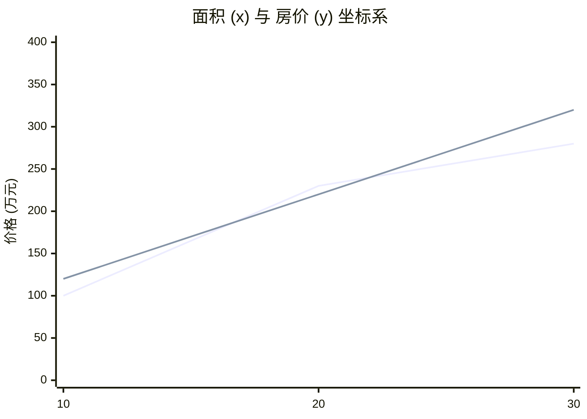
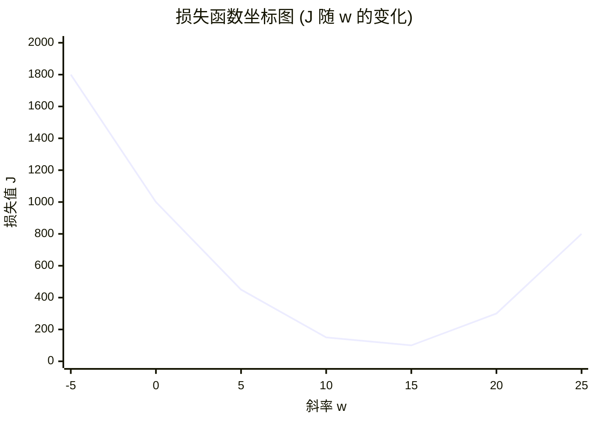
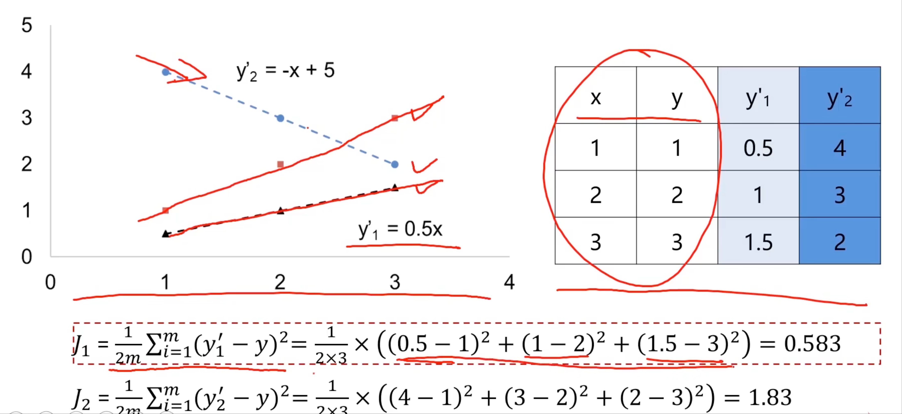
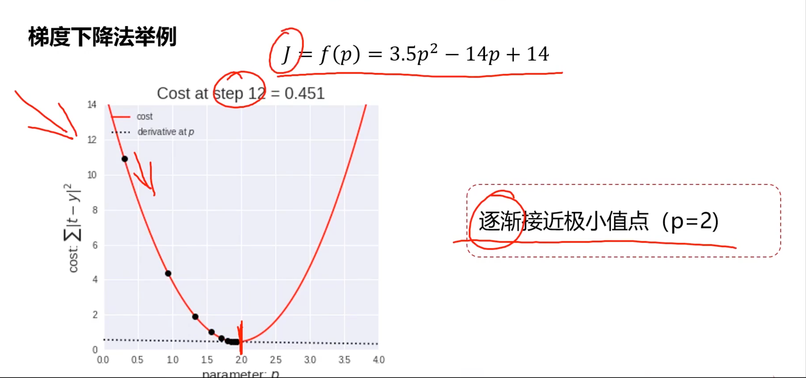
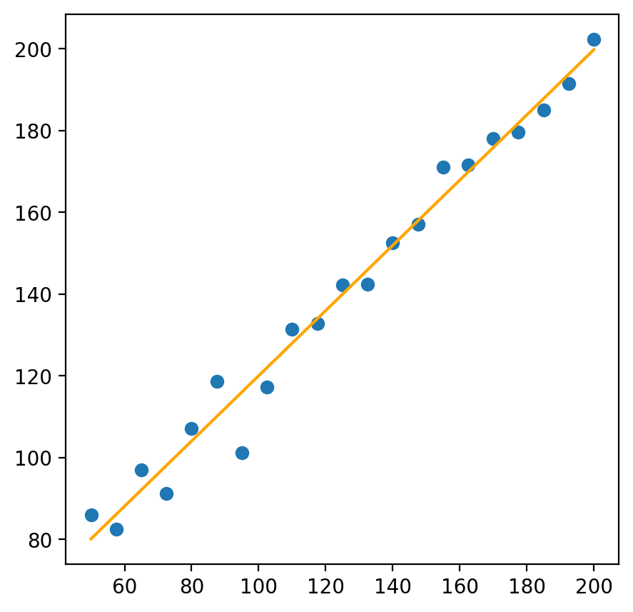
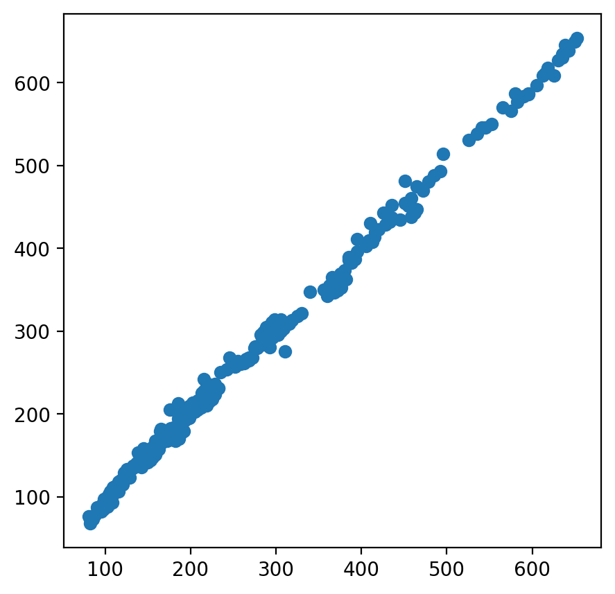

:::important[声明]
- 本文属于 [🎬 系列课程](https://www.bilibili.com/video/BV1nHK5e2Emc) 的学习笔记
- **仅作为个人学习记录, 只适用于 `MacOS`, 遵循现代化和性能最优的原则**, 全程无废话
- 关于环境配置可参考 [✍🏻 MacOS 下的人工智能开发环境及工具包安装指南](../ai-python-env-macos/)
:::

## 介绍
### 什么是机器学习
机器学习是一种实现人工智能的方法:
- **从数据中寻找规律, 建立关系, 根据建立的关系去解决问题**
- **计算机从训练数据中自动求解数据关系, 并在新的数据上做出预测**
- **从数据中学习, 从而实现自我优化与升级**

传统算法:
- 输入: 数据 & 函数
- 输出: 结果

机器学习:
- 输入: 数据 ~~& 函数~~
- 计算: `F(x)`
- 输出: 结果

## 应用场景
- 数据挖掘
- 计算机视觉
- 自然语言处理
- ...

## 类别


- 监督学习: 训练数据 **包含正确的结果(标签 - `label`)**; 可应用于 *人脸识别* / *语音翻译* / *医学诊断*
  - [线性回归](#线性回归)
  - 逻辑回归
  - 决策树
  - 神经网络
- 无监督学习: 训练数据 **不包含正确的结果**, 计算机需要自己发现数据中的规律; 可应用于 *新闻聚类*
  - 聚类算法
- 半监督学习: 训练数据包含 **少量正确的结果**
- 强化学习: 训练数据包含 **奖励** 和 **惩罚** 信号, 计算机需要通过 **试错** 来学习最优策略; 可应用于 *AlphaGo*

## 线性回归
### 回归分析
根据 **数据**, 确定两种或两种以上 **变量间相互依赖的定量关系**

$y=f(x1, x2, ..., xn)$

- 根据变量数分类:
  - 一元回归: $y=f(x)$
  - 多元回归: $y=f(x1, x2, ..., xn)$
- 根据函数关系分类:
  - **线性回归**: $y=ax+b$
  - 非线性回归: $y=ax^2+bx+c$

```mermaid
xychart-beta
    title "销售数据图"
    x-axis "数量" [0, 1, 2, 3, 4, 5]
    y-axis "售价" 0 --> 50
    line [0, 10, 20, 30, 40, 50]
```

### 损失函数

均方误差(`MSE`):

$$MSE = \frac{1}{2n} \sum_{i=1}^{n} (y_i - \hat{y}_i)^2$$





示例:



### 决定系数($R^2$)

决定系数($R^2$) 是用来评估 **线性回归模型** 拟合数据的优度 **goodness of fit** 的指标

$$R^2 = 1 - \frac{SS_{res}}{SS_{tot}}$$

- $SS_{res}$: 残差平方和(Residual Sum of Squares), 指的是预测值与真实值之间的误差平方和
- $SS_{tot}$: 总平方和(Total Sum of Squares), 指的是不使用模型的预测值, 直接使用平均值产生的误差平方和

> [!TIP]
> **$R^2$ 的值越接近 `1`, 说明模型的拟合度越好**

### 梯度下降



## 单因子线性回归 Demo

```python
import numpy
import polars

# numpy.random.seed(42) # 设置随机种子
area = numpy.linspace(60, 200, 21) # 生成 从 50 ~ 200 的 20 个线性值插值
nonce = numpy.random.normal(10, 6, 21) # 生成 20 个服从正态分布的随机数, 均值为 10, 标准差为 6
price = 0.8 * area + 30 + nonce # 房屋价格 = 面积 * 0.8 + 30 + 随机数

data = polars.DataFrame({
  "area": area,
  "price": price,
}).with_columns(
  polars.col("area").round(2), # 保留 2 位小数
  polars.col("price").round(2),
)

data.head()
```

| area  | price  |
| ----- | ------ |
| 50    | 78.68  |
| 57.89 | 88.46  |
| 65.79 | 101.5  |
| 73.68 | 95.84  |
| 81.58 | 100.41 |


```python
from sklearn.linear_model import LinearRegression
x = data.select(polars.col("area"))
y = data.select(polars.col("price"))

model = LinearRegression()
model.fit(x, y) # 拟合模型

new_area = polars.DataFrame({ "area": [60] }) # 房屋面积为 60m^2
predicted_price = model.predict(new_area) # 预测房屋价格
print(predicted_price) # 输出预测结果
```

```bash title="output"
[[125.]]
```

```python
import matplotlib.pyplot as plt

y_predict = model.predict(x)

plt.figure(figsize=(5, 5))
plt.scatter(x, y)
plt.plot(x, y_predict, color="orange")
plt.show()
```




```python
print(model.coef_)
print(model.intercept_)
```

```bash title="output"
[[0.79754459]]
[40.23121212]
```

## 多因子线性回归 Demo

```python
import polars as pl
import numpy as np

data = pl.read_csv("../../srv/china_housing_price.csv")
data.head()
```

| Avg.Area Income | Avg.Area House Age | Avg.Area Number of Rooms | Avg.Area Population | size  | Price  |
| --------------- | ------------------ | ------------------------ | ------------------- | ----- | ------ |
| 185432.5        | 4.2                | 3                        | 25400               | 110.5 | 195.45 |
| 210560.8        | 1.5                | 4                        | 32100               | 142.3 | 310.2  |
| 156780.2        | 8.9                | 2                        | 15600               | 85.6  | 128.5  |
| 192340.6        | 12.4               | 3                        | 41200               | 105.2 | 175.8  |
| 178900.3        | 5.6                | 3                        | 28900               | 98.5  | 168.9  |

```python
import matplotlib.pyplot as plt

# income = data.select(pl.col("Avg.Area Income"))
# house_age = data.select(pl.col("Avg.Area House Age"))
# rooms = data.select(pl.col("Avg.Area Number of Rooms"))
# population = data.select(pl.col("Avg.Area Population"))
size = data.select(pl.col("size"))
price = data.select(pl.col("Price"))

plt.figure(figsize=(5, 5))
plt.scatter(size, price, color="blue")
plt.title("Size vs Price")
plt.show()
```

```python
# 训练多因子线性回归模型

x = data.select(
  pl.col("Avg.Area Income"),
  pl.col("Avg.Area House Age"),
  pl.col("Avg.Area Number of Rooms"),
  pl.col("Avg.Area Population"),
  pl.col("size"),
)

multiple_model = LinearRegression()
multiple_model.fit(x, price)

multiple_predict = multiple_model.predict(x)

plt.figure(figsize=(5, 5))
plt.scatter(price, multiple_predict)
plt.show()
```



```python
# 计算 均方误差 和 R2分数
# from sklearn.metrics import mean_squared_error, r2_score
mean_squared_error_multiple = mean_squared_error(price, multiple_predict)
r2_score_multiple = r2_score(price, multiple_predict)
print(mean_squared_error_multiple)
print(r2_score_multiple)
```

```bash title="output"
90.94828854645041
0.9959162488939052
```