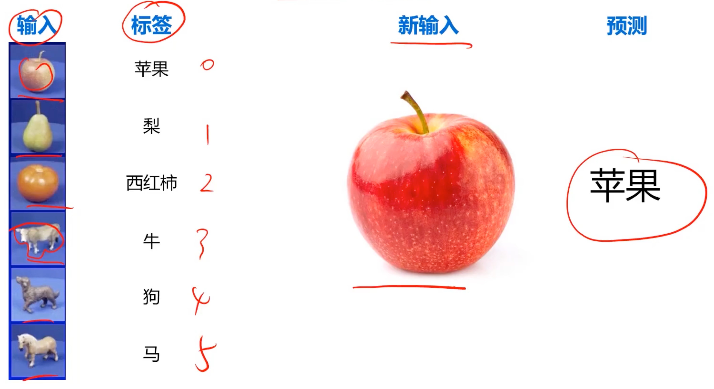
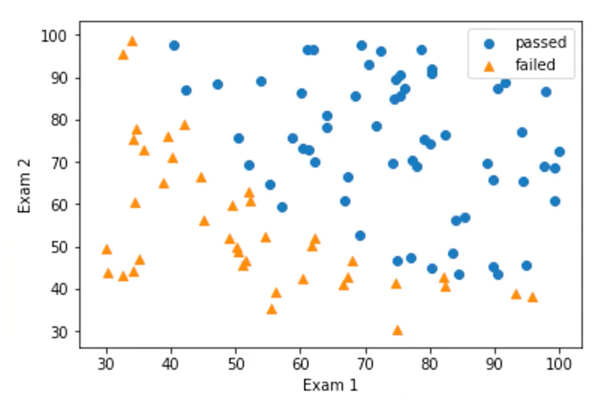
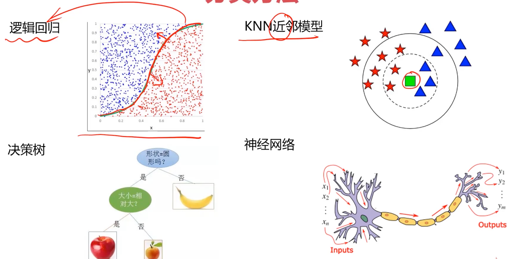
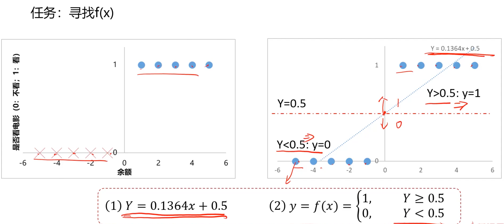
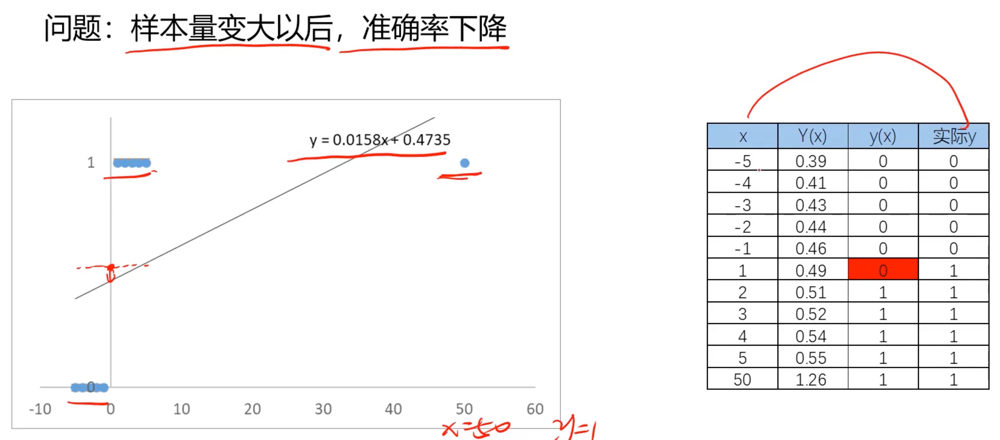

:::important[声明]
- 本文属于 [🎬 系列课程](https://www.bilibili.com/video/BV1nHK5e2Emc) 的学习笔记
- **仅作为个人学习记录, 只适用于 `MacOS`, 遵循现代化和性能最优的原则**, 全程无废话
- 关于环境配置可参考 [✍🏻 MacOS 下的人工智能开发环境及工具包安装指南](../ai-python-env-macos/)
:::

## 分类问题
根据已知样本的某些特征, 判断一个新样本属于哪种已知的样本类

添加 `tag`:

预测第三门考试是否通过:

### 分类方法

## 逻辑回归

### 分类任务

线性回归模型在分类任务中的局限性: **当样本量变大以后, 准确率下降**

## Demo
