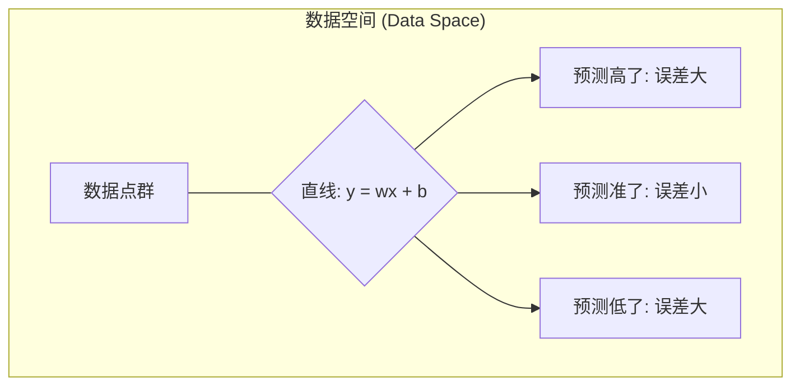
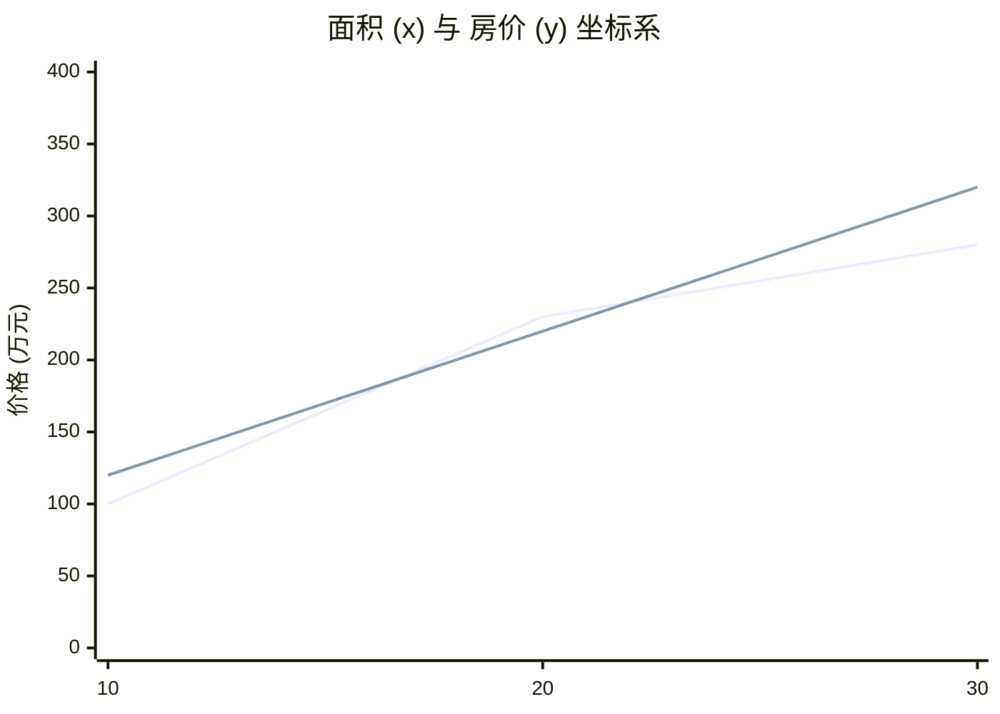
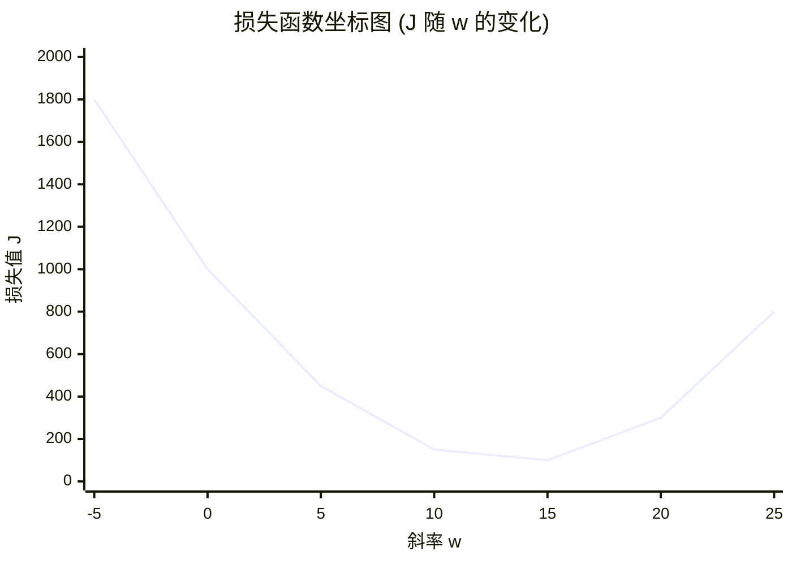
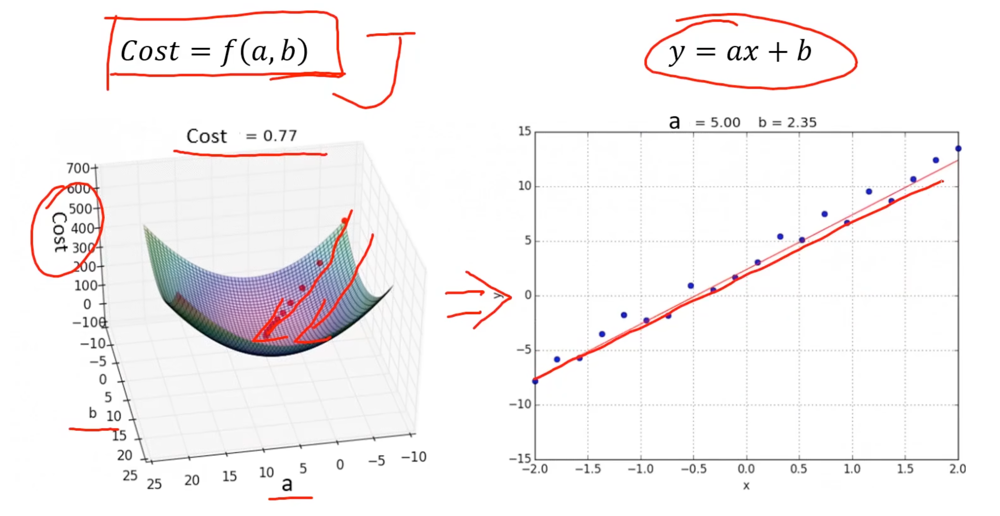

:::important[声明]
- 本文属于 [🎬 系列课程](https://www.bilibili.com/video/BV1nHK5e2Emc) 的学习笔记
- **仅作为个人学习记录, 只适用于 `MacOS`, 遵循现代化和性能最优的原则**, 全程无废话
- 关于环境配置可参考 [✍🏻 MacOS 下的人工智能开发环境及工具包安装指南](../ai-python-env-macos/)
:::

## 介绍
### 什么是机器学习
机器学习是一种实现人工智能的方法:
- **从数据中寻找规律, 建立关系, 根据建立的关系去解决问题**
- **计算机从训练数据中自动求解数据关系, 并在新的数据上做出预测**
- **从数据中学习, 从而实现自我优化与升级**

传统算法:
- 输入: 数据 & 函数
- 输出: 结果

机器学习:
- 输入: 数据 ~~& 函数~~
- 计算: `F(x)`
- 输出: 结果

## 应用场景
- 数据挖掘
- 计算机视觉
- 自然语言处理
- ...

## 类别


- 监督学习: 训练数据 **包含正确的结果(标签 - `label`)**; 可应用于 *人脸识别* / *语音翻译* / *医学诊断*
  - [线性回归](#线性回归)
  - 逻辑回归
  - 决策树
  - 神经网络
- 无监督学习: 训练数据 **不包含正确的结果**, 计算机需要自己发现数据中的规律; 可应用于 *新闻聚类*
  - 聚类算法
- 半监督学习: 训练数据包含 **少量正确的结果**
- 强化学习: 训练数据包含 **奖励** 和 **惩罚** 信号, 计算机需要通过 **试错** 来学习最优策略; 可应用于 *AlphaGo*

## 线性回归
### 回归分析
根据 **数据**, 确定两种或两种以上 **变量间相互依赖的定量关系**

$y=f(x1, x2, ..., xn)$

- 根据变量数分类:
  - 一元回归: $y=f(x)$
  - 多元回归: $y=f(x1, x2, ..., xn)$
- 根据函数关系分类:
  - **线性回归**: $y=ax+b$
  - 非线性回归: $y=ax^2+bx+c$

```mermaid
xychart-beta
    title "销售数据图"
    x-axis "数量" [0, 1, 2, 3, 4, 5]
    y-axis "售价" 0 --> 50
    line [0, 10, 20, 30, 40, 50]
```

### 损失函数

$$MSE = \frac{1}{2n} \sum_{i=1}^{n} (y_i - \hat{y}_i)^2$$







示例:


### 梯度下降

