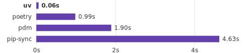
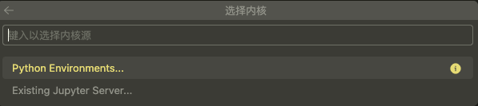
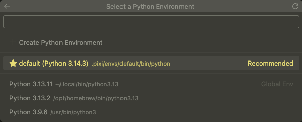
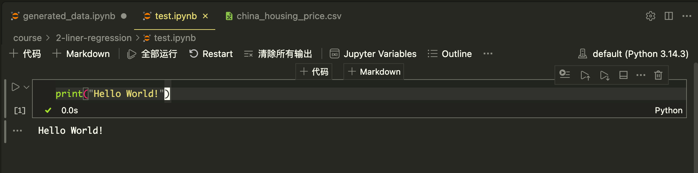
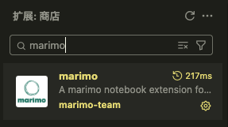
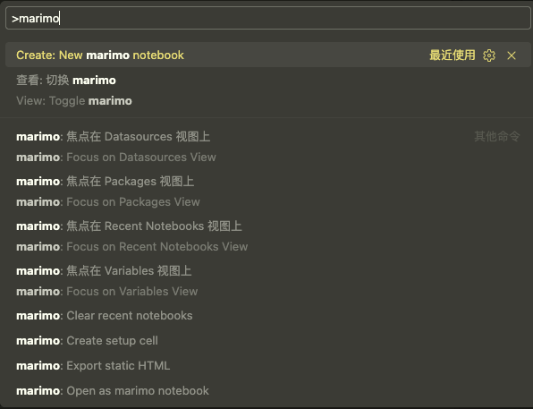
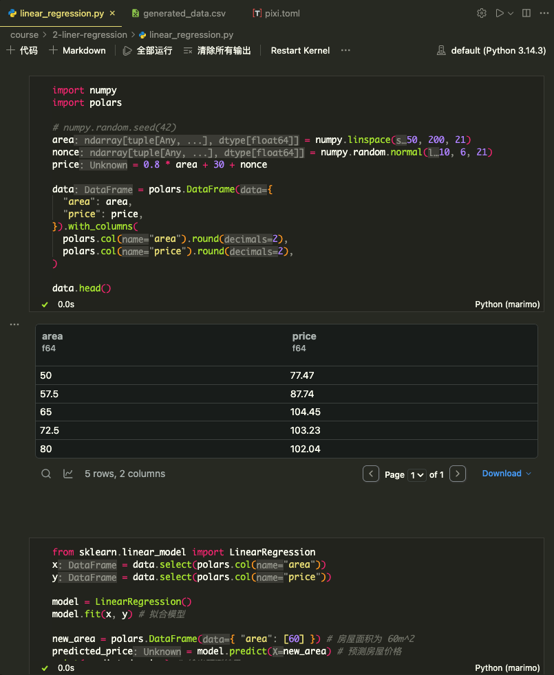

此文 **仅作为个人学习记录, 只适用于 `MacOS`(`fish shell`)**, 遵循 **现代化** 和 **性能最优** 的原则, 全程无废话, 只记录安装过程, 不展开介绍任何原理或概念

## 原则
- 现代化
- 性能最优
- 最少安装

## Python
在 `MacOS` 下已经可以直接执行 `python` / `python3` 命令, 也有 `pip`(包管理器), 但从 **现代化** 和 **性能最优** 的原则出发, 我们还需要做以下准备

### 安装清单
✅ 需要安装的:
- `uv`: 高性能现代化的 `Python` 包管理器, 可完全取代 `pip`
- `jupyterlab`(`vscode`): 包含 `Jupyter notebook`, 可直接[使用 `vscode` 编辑 `ipynb` 文件](#使用-vscode-编辑-ipynb-文件)
- `Pixi`: 替代 `conda`
- `Scikit-learn`: 机器学习库

:::tip[关于 Jupyter]
`Jupyter` 已经有了更加现代化的替代品 [Marimo](https://marimo.io/), 应该完全替代 `Jupyter`, 但它的生态还不够完善, 所以建议 **优先使用 [Marimo](https://marimo.io/), 保留 `Jupyter`**, 详见 [#Marimo](#marimo)
:::

<span style="color: red;">🚫 不需要安装/使用的:</span>
- `pip`
- `pyenv`
- `jupyter notebook`
- `Anaconda`

### python 和 python3
- `python` 是 `python2`, 🚫 禁止使用
- `python3` 是 `python3`, 根据项目需求 [安装 python](#) 和 切换 python 版本

#### 配置 pip 镜像
受限于国内的网络环境, 配置国内的镜像是刚需

**我们不使用 `pip`**, 但 [uv](https://docs.astral.sh/uv/) 会读取 `~/.config/pip/pip.conf` 中的配置, 所以我们需要修改 `pip` 的配置文件

```bash {1,5,9}
pip config set global.index-url https://pypi.tuna.tsinghua.edu.cn/simple

Writing to /Users/xxx/.config/pip/pip.conf

pip config list

global.index-url='https://pypi.tuna.tsinghua.edu.cn/simple'

cat ~/.config/pip/pip.conf

[global]
index-url = https://pypi.tuna.tsinghua.edu.cn/simple
```

> [!TIP]
> [pixi](https://pixi.prefix.dev/latest/installation/) 配置镜像参考 [pixi 镜像配置](#pixi-镜像配置)

### uv
`uv` 是一个使用 `rust` 编写的现代化的 **`Python` 包管理器**, **可完全取代 `pip`**


::github{repo="astral-sh/uv"}

#### 安装 uv

[安装方式](https://docs.astral.sh/uv/#installation):
```bash
curl -LsSf https://astral.sh/uv/install.sh | sh

# 或者通过 cargo 安装(需要兼容的 rust 工具链)
# cargo install --locked uv
```

#### 配置 uv
[配置 (fish) shell 自动补全](https://docs.astral.sh/uv/getting-started/installation/#shell-autocompletion):
```bash
echo 'uv generate-shell-completion fish | source' > ~/.config/fish/completions/uv.fish

# 如果没有 ~/.config/fish/completions 需要先创建目录
mkdir -p ~/.config/fish/completions
```

#### 安装 python 版本
[安装/切换 Python 版本](https://docs.astral.sh/uv/concepts/python-versions/):
```bash {1}
uv python install 3.13.11

Installed Python 3.13.11 in 2.76s
 + cpython-3.13.11-macos-aarch64-none (python3.13)
```

> [!WARNING]
> 在安装最新发布的 python 时, 可能会出现 `error: No download found for request: cpython-x.x.x-macos-aarch64-none` 的错误, 这是因为 `uv` 捆绑了 `python` 版本, 所以应该先更新 `uv` 到最新版本:
> ```bash {1}
> uv self update
>
> info: Checking for updates...
> success: Upgraded uv from v0.7.2 to v0.9.28! https://github.com/astral-sh/uv/releases/tag/0.9.28
> ```

> [!TIP]
> 如果之前没有安装过其他版本的 `python`, 建议切换到一个高版本的 `python`, 因为默认的 `python` 版本很低 `3.9.6`(已经停止维护, 参考 [downloads](https://www.python.org/downloads/))

> [!TIP]
> 如果想要查看并清理当前系统安装的 `python`, 参考 [附1 清理多余的 python](#附1-清理多余的-python)

```bash {1}
python3.13 --version

Python 3.13.2
```

#### 运行脚本
```bash
uv run example.py

uv run example.py arg1 arg2 # 传递参数

echo 'print("Hello World")' | uv run - # 从标准输入读取脚本并运行
```

#### 初始化项目
```bash {4}
mkdir my-project
cd my-project

uv init
```

#### venv
[venv](https://docs.python.org/zh-cn/3.14/library/venv.html) 是 `python` 标准库提供的 **虚拟环境** 工具, 可以为每个项目创建一个独立的 `python` 环境, 避免不同项目之间的 `python` 版本冲突

```bash {1} {3}
uv python pin 3.13 # 指定 python 版本为 3.13

uv venv # 创建虚拟环境

Using CPython 3.13.11
Creating virtual environment at: .venv
Activate with: source .venv/bin/activate.fish
```

激活虚拟环境(**非必须**):
```bash {1}
source .venv/bin/activate.fish
```

#### 安装依赖包
```bash
# 现代化的做法, 会更新 pyproject.toml, 类似于 pnpm install xxx
uv add numpy

# pip 方式, 不会修改 pyproject.toml
# uv pip install numpy
```

```bash
uv sync # 读取 pyproject.toml 和 uv.lock 文件, 并安装依赖包
```

#### 删除依赖包
```bash
uv remove numpy
```

#### 管理全局依赖包
```bash
uv tool install jupyter # 安装 jupyter 到全局环境
uv tool install jupyter --python 3.13 # python 3.13 环境下安装 jupyter 到全局环境
```

### 管理 python 版本
首先可以查看当前系统安装的所有 `python` 版本:
```bash {1}
uv python list
```

[uv](https://docs.astral.sh/uv/) 本质上是 **查找并使用** 系统上已经安装的某个版本的 `python`

可能有多个安装来源, 例如 `brew` / `pyenv` / `uv` / 系统自带, 这就导致 `python` 不仅仅是多版本共存, 还有多个安装来源对应的版本共存, 显得极其混乱

> [!TIP]
> 我们应该 **维持现状, 保证多版本共存**, 并且 **完全使用 [uv](https://docs.astral.sh/uv/) 替代 `python3` 命令来控制版本**, 因为:
> - 系统自带的 `python3` 可能已经有其他软件依赖它, 不建议直接删除
> - `brew` 安装的 `python3` 可能已经有其他软件包依赖它了, 不能删除
> - 使用 `uv` 命令可以完全忽略到底应该调用哪个版本的 `python`, 并且可以为每个项目指定不同的 `python` 版本, 参考 [配置全局的 python 版本](#配置全局的-python-版本) 和 [配置项目的 python 版本](#配置项目的-python-版本)

#### 配置全局的 python 版本
```bash {1}
uv python pin 3.14

Pinned `.python-version` to `3.14`
```

此时会生成 `~/.config/uv/.python-version` 文件, 文件内容为 `3.14`

#### 配置项目的 python 版本
```bash {1}
uv python pin --global 3.14

Pinned `/Users/xxx/.config/uv/.python-version` to `3.14`
```

此时会生成 `.python-version` 文件, 文件内容为 `3.14`

### Jupyter
```bash
# 方式1: 使用 uv 安装 jupyterlab(位于全局隔离的虚拟环境, 对应的 python 版本为 `~/.config/uv/.python-version`)
uv tool install jupyterlab

# 方式2: 使用 brew 安装 jupyterlab(会跟使用 brew 安装的 python 版本关联)
# brew install jupyterlab
```

启动 Jupyterlab:
```bash
jupyter-lab
```

#### 使用 vscode 编辑 ipynb 文件
1. 安装 `vscode` 插件 `Jupyter`, 直接在扩展中心搜索 `Jupyter` 并安装
2. 创建/打开一个 `.ipynb` 文件
3. 点击 **选择内核**

4. 选择 `Python` 版本

5. 点击 ▶️ 按钮执行


### Marimo
[Marimo](https://marimo.io/) 是一个开源的响应式的 `Python notebook`, 可用于替代 `Jupyter`

```bash title="uv" {1}
uv add marimo && uv run marimo tutorial intro
```

```bash title="pixi" {1}
pixi add marimo && pixi run marimo tutorial intro

        Edit intro.py in your browser 📝

        ➜  URL: http://localhost:2718?access_token=lcJJegOCz7BbcHKX6DHsSQ

```

随后会打开一个网页, 显示 `Marimo` 的介绍, **但我们并不在网页中编辑, 而是在 `vscode` 中编辑:**



然后按 `command + shift + p`, 执行 `Create: New marimo notebook` 创建一个文件


然后就可以像 `Jupyter notebook` 一样使用了:


#### 将 marimo note 文件转为 ipynb 文件
```bash
# 确保已经安装了 nbformat 库
pixi add nbformat
```

将 `linear_regression.py` 文件转为 `linear_regression.ipynb` 文件

```bash {1}
pixi run marimo export ipynb course/2-liner-regression/linear_regression.py -o course/2-liner-regression/linear_regression.ipynb
```

### Pixi
[Pixi](https://pixi.prefix.dev/latest/installation/) 主要用于涉及到 C++ 库的编译 / R 环境配置 等场景, 并且内部调用的是 `uv`

```bash {2}
# 安装 pixi
curl -fsSL https://pixi.sh/install.sh | sh

This script will automatically download and install Pixi (latest) for you.
Getting it from this url: https://github.com/prefix-dev/pixi/releases/latest/download/pixi-aarch64-apple-darwin.tar.gz
  % Total    % Received % Xferd  Average Speed   Time    Time     Time  Current
                                 Dload  Upload   Total   Spent    Left  Speed
  0     0    0     0    0     0      0      0 --:--:-- --:--:-- --:--:--     0
  0     0    0     0    0     0      0      0 --:--:--  0:00:01 --:--:--     0
100 22.7M  100 22.7M    0     0   748k      0  0:00:31  0:00:31 --:--:--  538k
The 'pixi' binary is installed into '/Users/xxx/.pixi/bin'
Updating '/Users/xxx/.config/fish/config.fish'
Please restart or source your shell.
```

更新到最新版本:
```bash
pixi self-update
```

配置自动补全, 在 `~/.config/fish/config.fish` 末尾添加:
```bash title="~/.config/fish/config.fish"
pixi completion --shell fish | source
```

> [!TIP]
> 对于需要 **跨语言依赖或系统级库** 时特别是 `AI` 相关的项目应该优先使用 [Pixi](https://pixi.prefix.dev/latest/installation/) 来管理环境, 而对于普通的 `python` 项目, 应该使用 [uv](https://docs.astral.sh/uv/)
> 例如项目需要 `python` / `node` / `CMake` / `Rust`:
> ```bash
> pixi add python nodejs cmake rust
> ```

## 创建一个人工智能相关的项目
> 对于 AI 项目, 我们必须使用 `pixi` 来管理环境, 因为 `pixi` 是面向跨语言环境的

```bash {1,5}
pixi init ai-demo

✔ Created /Users/xxx/projects/ai-demo/pixi.toml

cd ai-demo && lsd -la

drwxr-xr-x xxx staff 160 B Sat Feb  7 10:20:21 2026  .
drwxr-xr-x xxx staff 768 B Sat Feb  7 10:20:21 2026  ..
.rw-r--r-- xxx staff 128 B Sat Feb  7 10:20:21 2026  .gitattributes
.rw-r--r-- xxx staff  47 B Sat Feb  7 10:20:21 2026  .gitignore
.rw-r--r-- xxx staff 161 B Sat Feb  7 10:20:21 2026  pixi.toml
```

添加依赖:
```bash
pixi add python httpx
```

> [!TIP]
> - 此处的依赖默认是从 `conda-forge` 渠道安装的, 可以通过 `--channel` 参数指定其他渠道
> - 这里也需要安装 `python`, 因为 `pixi` 与 `conda` 类似, 是面向跨语言环境的, 是用来管理完全 **跨平台** / **依赖隔离** 的项目环境的
> - 也可以指定依赖版本: `pixi add python@3.14`
> - 也可以指定从 `PyPI` 安装依赖: `pixi add --pypi httpx`

更新依赖:
```bash
pixi update httpx
```

定义和执行任务:
```bash {1,5,21}
pixi task add hello "echo \"Hello World\""

✔ Added task `hello`: echo "Hello World"

cat pixi.toml

[workspace]
authors = ["Ryan <hellosc@qq.com>"]
channels = ["conda-forge"]
name = "ai-demo"
platforms = ["osx-arm64"]
version = "0.1.0"

[tasks]
hello = 'echo "Hello World"'

[dependencies]
httpx = ">=0.28.1,<0.29"
python = ">=3.14.3,<3.15"

pixi run hello

✨ Pixi task (hello): echo "Hello World"
Hello World
```

删除当前环境(`.pixi`):
```bash
pixi clean
```

### pixi cli
更多使用实例参考 [Basic Usage of Pixi](https://pixi.prefix.dev/latest/getting_started/#basic-usage-of-pixi)

### pixi 镜像配置
鉴于国内的网络环境, 推荐配置 `pixi` 镜像:

```bash {title="$HOME/.pixi/config.toml"}
[pypi-config]
extra-index-urls = [
  "https://pypi.tuna.tsinghua.edu.cn/simple",
  "https://pypi.org/simple",
]
index-url = "https://mirrors.aliyun.com/pypi/simple"

[mirrors]
"https://conda.anaconda.org/bioconda" = [
  "https://mirrors.ustc.edu.cn/anaconda/cloud/bioconda",
]
"https://conda.anaconda.org/conda-forge" = [
  "https://mirrors.ustc.edu.cn/anaconda/cloud/conda-forge",
]
"https://conda.anaconda.org/pytorch" = [
  "https://mirrors.ustc.edu.cn/anaconda/cloud/pytorch",
]
"https://repo.anaconda.com/pkgs/main" = [
  "https://mirrors.ustc.edu.cn/anaconda/pkgs/main",
]
"https://repo.anaconda.com/pkgs/msys2" = [
  "https://mirrors.ustc.edu.cn/anaconda/pkgs/msys2",
]
"https://repo.anaconda.com/pkgs/r" = [
  "https://mirrors.ustc.edu.cn/anaconda/pkgs/r",
]
```

## 附1 清理多余的 python

```bash {1}
uv python list

cpython-3.15.0a5-macos-aarch64-none                 <download available>
cpython-3.15.0a5+freethreaded-macos-aarch64-none    <download available>
cpython-3.14.2-macos-aarch64-none                   <download available>
cpython-3.14.2+freethreaded-macos-aarch64-none      <download available>
cpython-3.13.11-macos-aarch64-none                  /Users/xxx/.local/bin/python3.13 -> /Users/xxx/.local/share/uv/python/cpython-3.13.11-macos-aarch64-none/bin/python3.13
cpython-3.13.11-macos-aarch64-none                  /Users/xxx/.local/share/uv/python/cpython-3.13.11-macos-aarch64-none/bin/python3.13
cpython-3.13.11+freethreaded-macos-aarch64-none     <download available>
cpython-3.13.2-macos-aarch64-none                   /opt/homebrew/bin/python3.13 -> ../Cellar/python@3.13/3.13.2/bin/python3.13
cpython-3.12.12-macos-aarch64-none                  <download available>
cpython-3.11.14-macos-aarch64-none                  <download available>
cpython-3.10.19-macos-aarch64-none                  <download available>
cpython-3.9.25-macos-aarch64-none                   <download available>
cpython-3.9.6-macos-aarch64-none                    /usr/bin/python3
```

由于我之前使用 `brew` 安装了 `3.13.2`, **这并不是多余的**, 如果你尝试卸载它, 会提示依赖错误:

```bash {1}
berw uninstall python@3.13

Error: Refusing to uninstall /opt/homebrew/Cellar/python@3.13/3.13.2
because it is required by lld, llvm and pgcli, which are currently installed.
You can override this and force removal with:
  brew uninstall --ignore-dependencies python@3.13
```

这里的报错是因为其他的 brew 安装的软件包依赖了 `3.13`, 我们先查看哪些软件包依赖了 `3.13`:

```bash {1}
brew uses --installed python@3.13

lld llvm pgcli
```

> [!WARNING]
> **`brew` 有自己的依赖管理机制, 不应该卸载 `brew` 安装的 `python` 版本**

但如果你是通过 `pyenv` 安装的, 可以直接执行 `pyenv uninstall <version>` 来卸载, 并 [卸载 pyenv](#附2-卸载-pyenv)

## 附2 卸载 pyenv
> 我是通过 `brew` 安装的 `pyenv`

1. 卸载 `pyenv`
```bash
brew uninstall pyenv
```

2. 删除配置的环境变量: 从 `~/.bashrc` / `~/.zshrc` / `~/.config/fish/config.fish` 中删除相关配置
3. 删除 `~/.pyenv` 目录
4. 重新加载 shell 配置文件: `source ~/.bashrc` / `source ~/.zshrc` / `source ~/.config/fish/config.fish`
