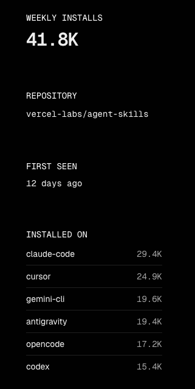
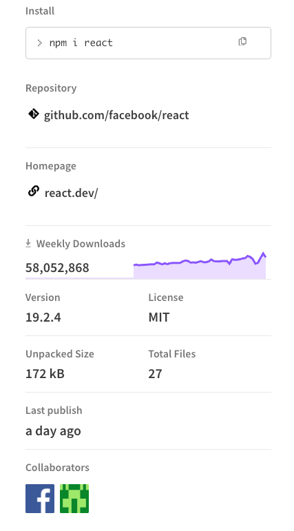

## 什么是 SKILLS

<a href="https://platform.claude.com/docs/zh-CN/agents-and-tools/agent-skills/overview" target="_blank">Agent Skills</a> 最初由 `Anthropic` 提出, 简单来说, <a href="https://platform.claude.com/docs/zh-CN/agents-and-tools/agent-skills/overview" target="_blank">Agent Skills</a> 就是让你的 `Claude Code` 的 **拥有特定领域的专业知识或技能**

如今 `LLM` 就像一个通才, `LLM` 已经在所有行业都能独当一面, 但我们在实际工程落地时, 往往需要的是 **专业性**, 而不是 **通用性**, 换句话说, 我们需要的是针对于我们的使用场景进行优化过的 `LLM`

> [!TIP]
> 就像我们去医院看牙, 我们需要找的是专业的牙科医生, 而不是全科医生


<a href="https://platform.claude.com/docs/zh-CN/agents-and-tools/agent-skills/overview" target="_blank">Skills</a> 恰好补齐了这个短板, 它允许你 **对某个特定领域的 知识 / 技能 / 规则 进行封装, 让 `LLM` 具有这一领域的专业性**

### 为什么我们需要它

为什么 `LLM` 在实际工程落地时总感觉 **差点意思**? 很大程度上是因为 **上下文的缺失** 和 **工具的匮乏**.

- **上下文**: `Claude Code` 不知道你们团队的代码规范, 不知道你们的部署流程
- **工具**: `Claude Code` 默认只能读写文件, 运行终端命令, 并没有适用于特定场景的工具

`SKILLS` 完美地解决了这个问题, 它允许我们将 **最佳实践(`Best Practices`)** 固化下来. 以前我们需要在 Prompt 里反复强调 "请使用 BEM 命名规范", 现在只需要安装一个 `css-best-practice` 的 Skill, `Claude Code` 就懂了

## 什么是 skills.sh

<a href="https://skills.sh" target="_blank">skills.sh</a> 是一个由 `vercel` 开发的 **`Skills` 分发平台**, 它提供了 `skills CLI` 工具来安装和查找 `SKILLS`, 在官网也会列出所有流行的 `SKILLS`

<a href="https://skills.sh" target="_blank">skills.sh</a> 的排名算法是根据 `skills add` 命令的安装数量来排序的, 也就是说安装量越大, 排名越靠前, 在 `Skills` 详情页也会显示不同的 `AI Coding Agent` 工具的安装量



图为目前最流行的 `SKILLS` <a href="https://skills.sh/vercel-labs/agent-skills/vercel-react-best-practices" target="_blank">vercel-react-best-practices</a> 的详情页右侧部分内容, 可以看到安装次数最多的是 `Claude Code`, 总共 `29.4k`

是不是很像 `npmjs.com` 中的详情页?



> [!TIP]
> <a href="https://skills.sh" target="_blank">skills.sh</a> 做的正是成为 `Skills` 界的 `npm`

## 如何使用 skills.sh

### 搜索 Skills

可以直接使用 `npx` 调用 `skills` 命令, 本质上是先下载 `skills CLI` 到本地, 然后再执行 `skills` 命令:

```bash {1} title="npx"
npx skills find vue

Packages: +1
+
Progress: resolved 1, reused 0, downloaded 1, added 1, done

███████╗██╗  ██╗██╗██╗     ██╗     ███████╗
██╔════╝██║ ██╔╝██║██║     ██║     ██╔════╝
███████╗█████╔╝ ██║██║     ██║     ███████╗
╚════██║██╔═██╗ ██║██║     ██║     ╚════██║
███████║██║  ██╗██║███████╗███████╗███████║
╚══════╝╚═╝  ╚═╝╚═╝╚══════╝╚══════╝╚══════╝

Install with npx skills add <owner/repo@skill>

hyf0/vue-skills@vue-best-practices
└ https://skills.sh/hyf0/vue-skills/vue-best-practices

onmax/nuxt-skills@vue
└ https://skills.sh/onmax/nuxt-skills/vue

onmax/nuxt-skills@vueuse
└ https://skills.sh/onmax/nuxt-skills/vueuse

hyf0/vue-skills@pinia-best-practices
└ https://skills.sh/hyf0/vue-skills/pinia-best-practices

hyf0/vue-skills@vueuse-best-practices
└ https://skills.sh/hyf0/vue-skills/vueuse-best-practices

vueuse/skills@vueuse-functions
└ https://skills.sh/vueuse/skills/vueuse-functions
```

或者使用 `pnpm dlx`:

```bash title="pnpm"
pnpm dlx skills find vue
```

### 安装 Skills

```bash {1}
pnpm dlx skills add hyf0/vue-skills@vue-best-practices

███████╗██╗  ██╗██╗██╗     ██╗     ███████╗
██╔════╝██║ ██╔╝██║██║     ██║     ██╔════╝
███████╗█████╔╝ ██║██║     ██║     ███████╗
╚════██║██╔═██╗ ██║██║     ██║     ╚════██║
███████║██║  ██╗██║███████╗███████╗███████║
╚══════╝╚═╝  ╚═╝╚═╝╚══════╝╚══════╝╚══════╝

┌   skills
│
◇  Source: https://github.com/hyf0/vue-skills.git @vue-best-practices
│
◇  Repository cloned
│
◇  Found 1 skill
│
●  Selected 1 skill: vue-best-practices
│
◇  Detected 4 agents
│
◆  Install to
│  ● All detected agents (Recommended) (Install to all 4 detected agents)
│  ○ Select specific agents
└
```

此时 `skills CLI` 会自动检测当前的 `AI Coding Agents`, 这里检测到了 `4` 个, 默认 `All detected agents (Recommended)`, 也就是全部安装, 这里我们可以选择只安装到部分 `AI Coding Agents`:

```bash
◆  Select agents to install skills to (space to toggle)
│  ◻ Claude Code (.claude/skills)
│  ◻ GitHub Copilot
│  ◻ OpenCode
│  ◻ Trae
└
```

然后我们选择安装到 `Claude Code`, 并且只安装到当前项目中:

```bash
◇  Select agents to install skills to (space to toggle)
│  Claude Code
│
◆  Installation scope
│  ● Project (Install in current directory (committed with your project))
│  ○ Global
└
```

然后我们选择符号链接的形式, 这样会节省磁盘空间:

```bash
◆  Installation method
│  ● Symlink (Recommended) (Single source of truth, easy updates)
│  ○ Copy to all agents
└
```

最后会推荐我们安装官方的 `find-skills`, 这里我们先不安装

```bash
◇  Installed 1 skill to 1 agent ───────────────────────────────────╮
│                                                                  │
│  ✓ ~/projects/blog.xiaban.run/.agents/skills/vue-best-practices  │
│    symlink → Claude Code                                         │
│                                                                  │
├──────────────────────────────────────────────────────────────────╯

│
└  Done!


│
│  One-time prompt - you won't be asked again if you dismiss.
│
◆  Install the find-skills skill? It helps your agent discover and suggest skills.
│  ○ Yes / ● No
└
```

:::tip
安装位置选择, 以 `Claude Code` 为例:
- **Project (推荐)**: 安装到当前项目的 `.claude/skills` 目录, 适合项目特定的规范 (如 `Lint` 规则、代码风格)
- **Global**: 安装到 `~/.claude/skills` 目录, 适合通用的工具 (如 `git` 操作 / `pdf` 读取)
:::

### 3. 验证与更新 (Check & Update)

安装完成后, `Skills` 会以文件夹的形式存在于你的 `.claude/skills` (或 `~/.claude/skills`) 目录下.

你可以随时检查更新:

```bash
npx skills check
```

或者一键更新所有 Skills:

```bash
npx skills update
```

### 4. 实际使用 (Usage)

安装好 `react-best-practices` 后, 当你在 `Claude Code` 中让它写 React 组件时, 它会自动参考这些最佳实践.

比如你可以直接说:

> "请帮我重构这个组件, 优化一下性能"

`Claude Code` 会自动加载 `react-best-practices` 中的规则 (如使用 `Server Components`, 优化 `useEffect` 等) 来指导重构

## 对比 Prompts
`Skills` 本质上就是 <a href="https://code.claude.com/docs/zh-CN/slash-commands" target="_blank">Slash Commands</a>, 相比于普通的 `prompts`, 它有以下优势:

- 由 `AI Coding Agent` 决定是否调用
- 按需加载(默认只读取 `SKILLS.md` 中的 meta 部分), 不会对性能造成影响
- 可以包含(引用)资源和脚本

## 趋势


对于开源项目来说, 特别是成熟的工具库或框架, 肯定会有自己的文档, 如果让开发者来通过阅读文档来学习, 是非常耗时的, 现在有了 `Skills`, 可以专门为这些项目编写 `Skills`, 直接让 `AI Coding Agent` 来加载 `skills`(阅读文档), 直接省去了开发者自己去阅读文档的时间, 从这个角度来看, `Skills` 是非常有价值的

> [!TIP]
> 现在已经有非常多的开源项目推出了自己的 `Skills`, 按照这个趋势, 未来 **开发者就不需要阅读文档了, 而是直接通过加载 `Skills` 的方式让 `AI Coding Agent` 来加载技能**, 换句话说, 未来开发者只需要稍微了解一下某个领域, 就可以接入此领域的 `Skills` 来完成任务

## 总结

`SKILLS` 是将 **"隐性知识"** (经验/规范) 转化为 **"显性能力"** (工具/Prompt) 的最佳载体; 通过 `skills.sh`, 我们可以像搭积木一样, 为我们的 `Claude` 组装最强的大脑.

强烈建议大家去 <a href="https://skills.sh" target="_blank">skills.sh</a> 逛逛, 把你的最佳实践也分享出来!

## 参考

- [Agent Skills - Claude API Docs](https://platform.claude.com/docs/zh-CN/agents-and-tools/agent-skills/overview)
- [The Agent Skills Directory - skills.sh](https://skills.sh/docs)
- [skills.sh CLI Reference](https://skills.sh/docs/cli)
- [AI Skills：前端新的效率神器！](https://juejin.cn/post/7598807837868539930)
- [anthropics/skills - GitHub](https://github.com/anthropics/skills)
- [skills.sh](https://skills.sh)
- [vercel-react-best-practices](https://skills.sh/vercel-labs/agent-skills/vercel-react-best-practices)
- [Slash Commands](https://code.claude.com/docs/zh-CN/slash-commands)
