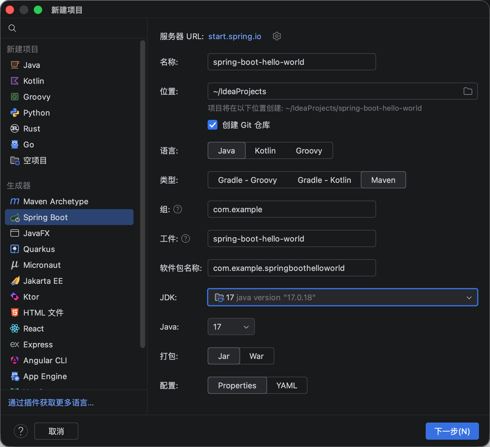
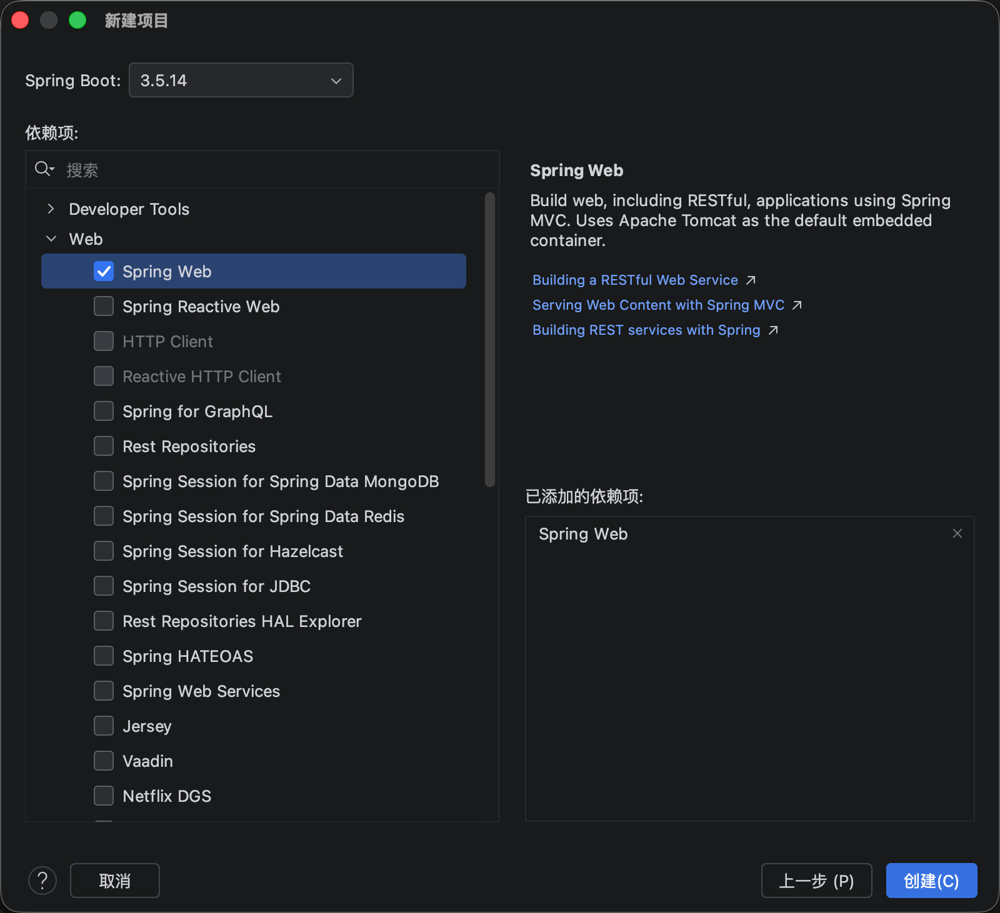
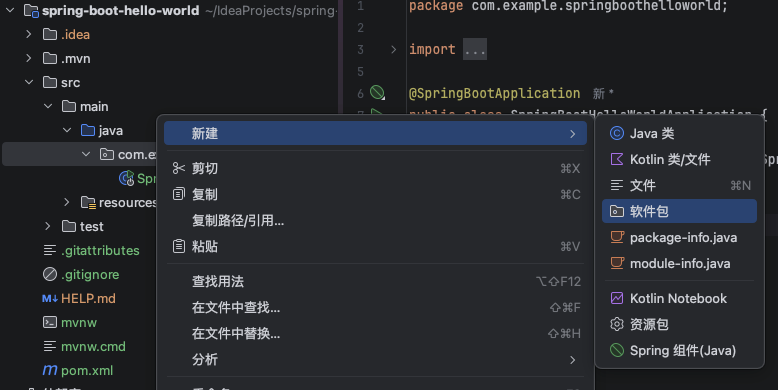
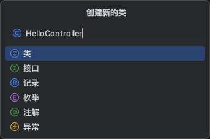
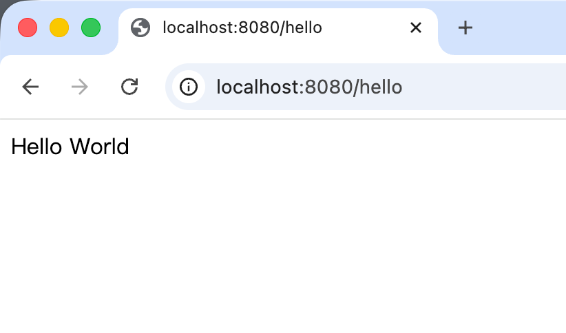

本文选择的版本或工具都遵循现代化和 LTS 原则, 不使用旧的工具或版本

## java 版本

目前的 `LTS` 版本:

- `java 8`: 旧项目使用, 支持日期 `2021-2030`
- `java 17`: 支持日期 `2021-2029`
- `java 21`: ✅

## 版本管理
- [asdf](https://asdf-vm.com/zh-hans/guide/getting-started.html): ✅
- `sdkman`: ❌ 不兼容 fish shell, 似乎只能在 `bash / zsh` 中使用

```bash {1}
brew install asdf

✔︎ JSON API formula.jws.json                                                                                                                              Downloaded   32.0MB/ 32.0MB
✔︎ JSON API cask.jws.json                                                                                                                                 Downloaded   15.4MB/ 15.4MB
==> Fetching downloads for: asdf
✔︎ Bottle asdf (0.18.1)                                                                                                                                   Downloaded    1.7MB/  1.7MB
==> Pouring asdf-0.18.1.arm64_tahoe.bottle.tar.gz
🍺  /opt/homebrew/Cellar/asdf/0.18.1: 15 files, 4.4MB
==> Running `brew cleanup asdf`...
Disable this behaviour by setting `HOMEBREW_NO_INSTALL_CLEANUP=1`.
Hide these hints with `HOMEBREW_NO_ENV_HINTS=1` (see `man brew`).
==> Caveats
fish completions have been installed to:
  /opt/homebrew/share/fish/vendor_completions.d
```

安装成功后配置 `shims` 和 `shell` 补全:

`~/.config/fish/config.fish`:
```bash
# ASDF configuration code
if test -z $ASDF_DATA_DIR
    set _asdf_shims "$HOME/.asdf/shims"
else
    set _asdf_shims "$ASDF_DATA_DIR/shims"
end

# Do not use fish_add_path (added in Fish 3.2) because it
# potentially changes the order of items in PATH
if not contains $_asdf_shims $PATH
    set -gx --prepend PATH $_asdf_shims
end
set --erase _asdf_shims
```

```bash
asdf completion fish > ~/.config/fish/completions/asdf.fish
source ~/.config/fish/config.fish
```

```bash {1}
asdf --version

asdf version 0.18.1 (revision unknown)
```

```bash
asdf plugin add java # 安装 java 插件
asdf list all java temurin # 查看 temurin 渠道的所有版本
```

这里我们选择最新的 LTS 版本 `21.0.10`
```bash {1,7}
asdf install java temurin-21.0.10+7.0.LTS

######################################################################## 100.0%
OpenJDK21U-jdk_aarch64_mac_hotspot_21.0.10_7.tar.gz
OpenJDK21U-jdk_aarch64_mac_hotspot_21.0.10_7.tar.gz: OK

java -version

No version is set for command java
Consider adding one of the following versions in your config file at /Users/xxx/projects/xxx/.tool-versions
java temurin-21.0.10+7.0.LTS
```

## 构建工具
- `gradle`
- `maven`: ✅

```bash
brew install maven
```

然后配置 `maven` 为使用 [阿里云镜像](https://maven.aliyun.com/mvn/guide)

## Hello World

```bash
mkdir java-plain && cd java-plain

vim Hello
```

## IDE
- `idea`: ✅

破解参考 [idea 2026.1 破解](https://tech.souyunku.com/idea-po-jie-20261.html), `idea` 基础操作和配置参考 [视频](https://www.bilibili.com/video/BV1sCARzpEwt)

我选择了从 `vscode` 同步配置, 当然不可能完全同步过来, 根据我的习惯增加了以下配置:

修改 `idea` 的 `vim` 配置文件 `~/.ideavimrc`, 增加:
```bash
" Highlight copied text
Plug 'machakann/vim-highlightedyank'
" Commentary plugin
Plug 'tpope/vim-commentary'
" Plug 'easymotion/vim-easymotion'
Plug 'justinmk/vim-sneak'

set clipboard+=unnamed      " 共享系统剪贴板

" ===================== 模式切换优化 =====================
inoremap <C-]> <Esc>        " Ctrl+] 退出插入模式（解决第一个问题）
```

## 技术栈
- `SSM`
- [Spring Boot](https://springdoc.cn/spring-boot/getting-started.html#getting-started.introducing-spring-boot): 单体项目 ✅
- [Spring Cloud](https://spring.io/projects/spring-cloud): 微服务项目 ✅

## Hello World
`src/Main.java`:
```java
public class Main {
  public static void main(String[] args) {
    System.out.println("Hello World!");
  }
}
```

```bash
java src/Main.java # Java 11+ 支持
java -cp src Main # 所有版本都支持
```


## Hello World(Spring Boot 版)

1. 进入 `idea`, 点击 新建项目 - `Spring Boot`, 选择 `Java` `Maven` `jar`, 选择 `3.5.14`



2. 创建 `HelloController.java`



3. 实现 `HelloController` 中的 `hello` 方法
```java
package com.example.springboothelloworld.controller;

import org.springframework.web.bind.annotation.GetMapping;
import org.springframework.web.bind.annotation.RestController;

@RestController
public class HelloController {
    @GetMapping("/hello")
    public String sayHello() {
        return "Hello World";
    }
}
```
5. 启动项目(在 `idea` 中点击 `Run` 即可)


或者通过命令行方式启动:
```bash
./mvnw spring-boot:run
```
