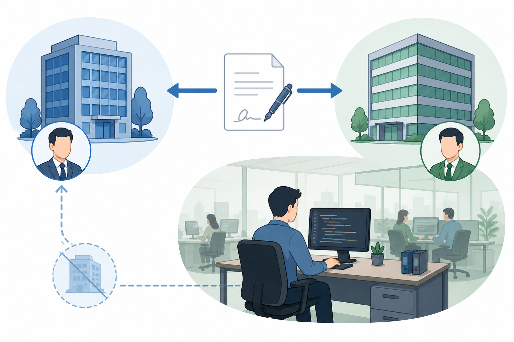

## 前言

**作为一名码农, 从业九年基本没有间断过, 马上要失业了**, 然而整个行业相比于我刚入行时已经发生了很大的变化, `IT` 行业正在发生深刻变化, 感觉十分迷茫, **一时间分不清是自己倦怠了, 还是传统软件行业要缓缓落幕了**

回顾我的职业生涯, 从刚入行时的一片蓝海, 疫情以后行情急转直下, 再后来 AI 浪潮席卷整个行业, 到现在一片死寂, 再回过头来看恍如隔世, 实际上不过十年而已, 我从五年前开始进入某国企从事软件开发(外包)工作, 一直持续到现在, 也算是进入舒适区了, 就在今年甲方在合同中增加了一些硬性要求, 并缩减预算, 我这个临时工的身份也将彻底终结; 都说每个公司都是一座围城, 总有人想进去, 也总会有人出来, 现在我正坐在围墙之上, 眼前是一片荒芜, 围墙内人心惶惶, **时代裹挟着每个人前行, 却鲜有时间沉下心来记录和思考, 也许现在正是最合适的时间点**

我的职业生涯可以分为两段, 前半段在小公司积累经验, 后半段在国企软件外包岗搬砖, 本文只写后者

## 软件外包

软件外包指的是 `A`公司(乙方, 也可能是丙方) 为 `B`公司(甲方) 提供软件开发服务, 外包员工与 `A` 公司签订劳动合同, 但在 `B` 公司工作, 员工可能自始至终都没去过 `A` 公司

### 归属感问题
**如果正式员工是牛马, 那么外包员工就是黑牛马**, 首先就是权限问题, 凡事都要申请权限, 要申请门禁权限 / 网络权限 / 数据权限 / 各系统权限, 还要开通一系列系统的账号, 有的甚至还要提供无犯罪记录证明, 感觉就像打黑工一样

