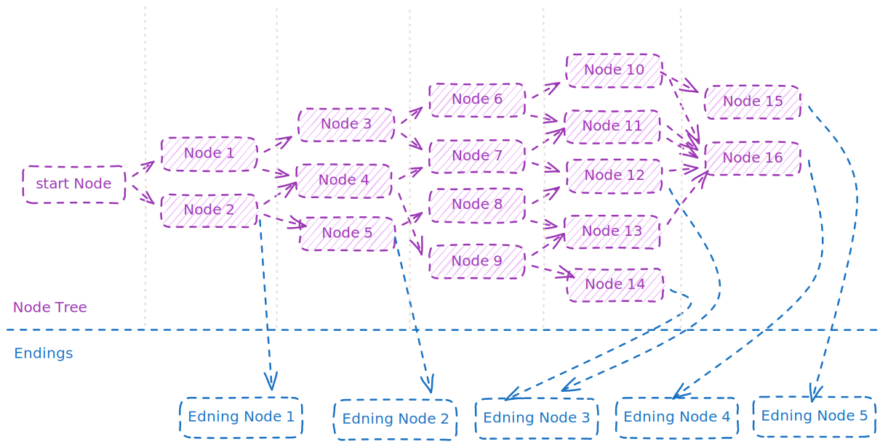

在 <a href="/movie-games-record" target="_blank">上一篇文章</a> 中, 介绍了一下我要做的互动剧情类游戏生成器, 然后分析了目前面临的严重影响使用的问题, 现在我们来通过构建工作流的方式来解决这些问题

## 失败的设计
在现有的设计方案中, **我把一切都交给了 LLM**, 并且在 `propmpt` 中精心编写了各种限制, 我本以为它会生成符合所有要求的 `JSON`, 但是总是出现各种问题

倘若这是一个没有与 LLM 交互的项目, 那总会找到解决方案, 因为 **程序输出的结果是确定的, 而 LLM 输出的结构是不确定的**

### 超长的上下文

现有的提示词(**已省略部分内容**)如下:
```markdown
# 角色定义
你是一位享誉全球的互动电影游戏编剧和总导演。你擅长创作引人入胜、逻辑严密且充满情感冲击力的多分支剧情。 你的任务是根据用户提供的主题，创作一个完整的互动电影剧本，并将其直接输出为符合 TypeScript 接口定义的 JSON 格式。

# 用户输入主题
{}
# 一、核心叙事与风格要求
- 第一人称沉浸式叙事：所有的 `node.content` 必须使用 **第一人称 ("我")** 进行叙述。玩家就是主角，代入感必须极强。
- 剧情深度与质量：
    - 拒绝流水账、拒绝平铺直叙、拒绝假大空。
    - 必须具备电影剧本般的 **真实感、细腻度与情感张力**。
    - 严禁任何无意义的故事情节或重复啰嗦的废话。
- 语言指定：所有剧情内容必须使用 **{}** 撰写。

# 二、基础结构与格式约束
- JSON 结构规范：
  - 严格遵循下方的 `TypeScript` 类型定义。
  - 禁止返回 `meta` / `projectId` / `nodes[].id` / `version` / `owner` / `provenance` 等字段。
  - 结局分离：所有的结局节点必须定义在顶层的 `endings` 字段中。
  - ID 格式：
    - `nodes` 的 Key 必须是 **纯数字字符串** (例如 "1", "2", "3"...)。
    - **绝对禁止** 使用 `n_` 前缀 (如 `n_1`, `n_start` 等都是错误的)。
    - 唯一例外：起始节点的 Key 必须固定为 **"start"**。
  - 结局引用：`StoryNode` 中的 `choices` 若指向结局，必须引用 `endings` 中的 key。

# 三、数值硬性约束 (校验失败将视为错误)
- 节点总数：`nodes` 的数量必须在 **45 到 85** 之间。
- 结局数量：`endings` 的数量必须在 **4 到 6** 之间。
- 单节点字数：每个节点的 `content` (AI 智能扩写) 字数必须严格控制在 **45 到 65 字** 之间。
- 节点内容：每个节点的 `content` 禁止出现任何中文或者英文的双引号, 双引号必须使用单引号代替
- 路径深度：必须保证绝大多数的故事线都经过 **至少 12 个节点**。

...
# 六、结局触发机制
- 灵活结局：`endings` 的 Key 不再固定，可以根据剧情自由命名 (如 `ending_hero`, `ending_regret` 等)。
- 结局描述：每个结局的 `description` 长度不能超过 **40 个字**。
- 快速通道：**必须包含一个可以快速到达的结局路径**。
  - 例如：从 Start -> 节点 3 -> 节点 5 -> (选择某选项) -> 直接到达结局。
  - 也就是说，在较早的层级 (如 Level 3-5) 就允许通过特定选项直接进入结局。
- 互斥规则：
  - `nodes` 中的节点 **不允许** 包含 `endingKey` 属性。
  - 结局只能通过 `choices.nextNodeId` 指向 `endings` 的 Key 来触发。

# 用户提供的角色清单 (JSON)
{}
# TypeScript 类型定义 (Schema)
typescript {}
# 输出规则
- 输出必须是 **纯 JSON** 文本。
- **不要** 包含 markdown 代码块标记。
- `nodes` 数量：**45~85**。
- `endings` 数量：**3~6**。
- 必须包含 `start` 节点。
- 禁止出现任何游离节点(从 start 节点开始到达不了的节点)
- **每层节点数量不能超过 5 个, 在每次输出节点时都要检查是否超过这个数量值**
- **必须从最开始就要规划节点数量, 任何节点的选项引用的节点 id 都不允许超过这个数量值**
开始创作！
```

其中的 `{}` 是用户的输入(标题 / 简介 / 角色列表) 还有 `ts` 类型定义

此时 LLM 同时承担了:
- 🎨 高质量文学创作（电影级叙事）
- 🧠 全局规划（45–85 节点、12–15 层、选项比例、收束率）
- 🧮 严格数学约束满足（DAG、ID 递增、层级宽度、百分比）
- 🧾 精确 JSON Schema 输出

最终造成了 LLM 在 **长上下文生成** 时出现了 遗忘 / 幻觉 / 格式约束失败 的问题

> [!TIP]
> 出现问题的原因并不是因为 `prompt` 写的不够详细, 而是因为
> - **超长的内容已经超过了 `LLM` 输出稳定性的边界**
> - **`LLM` 并不会对剧情内容进行反复打磨, 而是一次性生成**
> - **约束越多, 输出越趋同和保守**
> - **模型并不会 记住整部故事，它只是在概率上 看过**

### 剧情树设计存在的问题



以上是现有的剧情树设计, 上方是剧情树中的节点, 下方是结局节点, 从 `Start Node` 节点开始, 每个节点都指向下一个层级(`level`)的某个节点(或者结局节点), 最终到达 `Endings` 节点结束, 通过设计图很容易发现一些问题:

- 生成了 `21` 个节点, 最终玩家游玩一次只经过 `3 ~ 7` 个节点, 实际节点利用率只有 `14%` ~ `33%`, **大部分节点是玩家必须多次游玩才能到达, 但实际上很少会有玩家会玩第二次**
- 上一篇文章介绍的 <a href="../movie-games-record/#剧情状态丢失" target="_blank">剧情状态丢失</a> 问题

### Layered Directed Acyclic Graph
在上图中我们发现这已经不是一个树结构了, 我们需要一个准确的结构定义, 那就是 **分层有向无环图 (`Layered Directed Acyclic Graph`)**, 并在此基础上增加了额外的数学约束:

- 层级单调约束 (Strict Monotonicity)：对于任意边 $(u, v)$，必须满足 $Level(v) > Level(u)$。严禁 $Level(v) \le Level(u)$
- 宽度约束 (Layer Breadth)：对于任意 $i \in [1, 25]$，属于层级 $L_i$ 的节点数 $|V_i| \le 3$
- 连通性约束 (Reachability)：从起始节点 start 出发，通过有向边必须能够到达至少一个结局节点（Leaf Node），且图中不存在入度为 0 的非起始节点（游离节点）
- 状态原子性 (State Atomicity)：逻辑门判定（Check）所使用的 flag 必须预先定义在全局状态池中，禁止生成未定义的状态位
- 收束汇聚 (Convergence)：允许多个不同节点的 Link 指向同一个后继节点 $v$
- 在收束节点 $v$，其剧情文本必须具备通用性，或通过 CONDITIONAL 逻辑门对不同路径的状态进行适配。
- ...


## 解决方案


我把问题分别发送给了 `ChatGPT` / `Gemini` / `DeepSeek`, 有趣的是, 它们的给出的方案既有重叠的部分, 也有自己独到的一面

为了解决在长上下文场景下大模型输出的不确定性问题, 我们可以将 prompt 拆解为多个 promot, 这样做就能做到:

- 每个 prompt 只完成一件事
- 减少每个 prompt 的长度
- 缩短整个剧情生成的时间

### 共同点
`ChatGPT` / `Gemini` / `DeepSeek` 给出的方案共同之处在于:

1. 结构生成 与 内容生成 分离
2. 剧情节点并发生成
3. 引入剧情状态配置

不同之处在于:
- 剧情状态设计
- 剧情节点的并发生成方式

可以点击查看所有模型的对话:
- <a href="https://chatgpt.com/share/6964a414-ade4-800b-b839-5b53fd8a1ce4" target="_blank">ChatGPT</a>
- <a href="https://gemini.google.com/share/3359fe7f9880" target="_blank">Gemini</a>
- <a href="https://chat.deepseek.com/share/pysplefy24u9rk71gc" target="_blank">DeepSeek</a>

### ChatGPT 激进的拆解派
<a href="https://chatgpt.com/share/6964a414-ade4-800b-b839-5b53fd8a1ce4" target="_blank">点击这里</a> 查看完整对话

#### Prompt A 节点规划
这个 Prompt 只做一件事: **不关注具体的剧情内容, 只生成剧情数的结构**, 具体职责为:

- 确定 `Level` 层数
- 每个 `Level` 的节点数
- 哪些 `Level` 是收束点
- 哪些节点是复用节点
- 哪些节点允许直达结局
- 每个节点的 **简短摘要**

#### Prompt B 生成起始节点和结局节点
由于起始节点和结局节点的特殊性, 需要先进行生成

#### Prompt C 好感度数据
好感度系统是基于角色的 **剧情状态** 设计方式, 在众多游戏中, 都或多或少的存在好感度系统, 例如:

- 玩家选择了某个支线任务, 与某个角色共同完成了某段剧情, 在后续的主线中就会再次遇到这个角色, 而如果不做这个支线任务, 就不会遇到他
- 需要做出一系列偏向与某个角色的选择, 后续才能进入此角色的故事线

#### Prompt D 节点内容生成
这个 Prompt 只做一件事: **生成单个节点内容**, 具体实现为:

在 prompt 中加入 `Prompt A` 生成的某个节点的信息(**只包含此节点的信息, 不包含其他节点的信息**), 包含:
- 故事的基本信息
- 有几个选项
- 起始节点和结局节点
- 节点简短摘要

#### 本地化数据校验
生成完节点树数据后, 通过程序校验数据

#### 缺点

`ChatGPT` 使用了先生成(包含节点 **简短摘要** 的)节点树结构, 然后再每个节点单独生成具体的内容和选项的方式, 这种方式虽然对长上下文进行了合理的拆解, 但考虑的过于简单

- 在生成剧情树结构时生成 简短摘要, **依然存在 长上下文场景下 LLM 输出不稳定的问题**
- 每个节点单独生成时, LLM 会忽视大量的细节, 而且完全 **没有解决 剧情状态 丢失的问题**
- **本地化校验 在本项目中不应该存在**, 因为一旦校验失败就会重新生成, 耗时进一步增加

因此这个方案是失败的

### DeepSeek 分层生成策略
<a href="https://chat.deepseek.com/share/pysplefy24u9rk71gc" target="_blank">点击这里</a> 查看完整对话

DeepSeek 的方案基本与 ChatGPT 方案一致, 唯一的不同点在于: 使用了

- **生成故事大纲, 而非节点树结构**
- **分层生成策略**

#### 故事大纲
```rust
fn phase1_prompt(theme: &str, characters: &[Character]) -> String {
    format!(
        r#"作为顶级互动电影编剧，请设计一个故事大纲：

主题：{}
角色：{}

请设计：
1. 核心冲突（50字以内）
2. 4-6个可能的结局方向（每个1句话）
3. 关键剧情转折点（3-5个）
4. 角色关系图谱

返回JSON格式：{{
    "conflict": "核心冲突描述",
    "endings": ["结局1", "结局2"...],
    "turning_points": ["转折1", "转折2"...],
    "character_relations": {{"角色1": ["与角色2的关系", ...]}}
}}
"#,
        theme, characters_json
    )
}
```

从返回的 JSON 数据结构来看, 故事大纲并没有解决节点树的数据结构上存在的任何问题, 返回增加了不确定性

#### 分层生成策略

```rust
fn phase2_prompt(
    layer: usize,
    previous_layer: &[StoryNode],
    story_state: &StoryState,
    outline: &Outline,
) -> String {
    format!(
        r#"## 上下文
当前生成第{}层节点，前一层的节点：
{}

当前剧情状态：
- 角色好感度：{}
- 已触发的关键事件：{}

## 任务
生成本层（第{}层）的节点：
- 本层最多生成{}个节点（根据剧情复杂度决定）
- 每个节点必须继承前一层的剧情状态
- 节点ID范围：{}-{}
- 设计时考虑：{}
  * 剧情收束点（多个前驱指向同一个节点）
  * 分支扩展点（创造新的分支）
  * 快速结局路径（可选直接结局）

## 特别要求
1. 状态继承：必须包含前驱节点的关键状态
2. 冲突升级：比前一层增加紧张度
3. 角色互动：至少2个角色互动
4. 选项设计：大多数节点2个选项，10%以下1个选项

## 输出格式
{{
    "layer": {},
    "nodes": [
        {{
            "id": "字符串数字",
            "content": "45-65字第一人称叙述",
            "characters": ["角色1", "角色2"],
            "choices": [
                {{
                    "text": "选项文本",
                    "nextNodeId": "下一节点ID或结局key",
                    "affinityEffect": {{"character": "角色", "delta": 数字}} // 可选
                }}
            ],
            "inherited_states": ["之前的关键状态"],
            "new_states": ["本节点新增的状态"]
        }}
    ]
}}
"#,
        layer,
        format_previous_layer(previous_layer),
        format_affinities(story_state),
        format_story_flags(story_state),
        layer,
        calculate_max_nodes(layer),
        calculate_id_range(layer).0,
        calculate_id_range(layer).1,
        get_layer_design_notes(layer),
        layer
    )
}
```

#### DeepSeek 方案的缺点

此方案实际上与 ChatGPT 基本方案一致, 但实际不如 ChatGPT 方案, 因为

- 剧情大纲完全没有解决节点树结构存在的任何问题
- 分层生成实际与每个节点单独生成没有区别, 并没有解决实际问题

所以是个方案依然是失败的

### Gemini 有节奏感的剧情树设计
<a href="https://gemini.google.com/share/3359fe7f9880" target="_blank">点击这里</a> 查看完整对话

#### 生成纯逻辑的节点树骨架
跟 ChatGPT 方案相似, 先生成节点树结构, 每个节点只生成:

- `nodeId`
- `level`
- `choices` (仅包含 `text` 的简写和 `nextNodeId`)
- 剧情摘要 (`Summary`): 用一句话描述这个节点发生了什么（例如：“主角潜入实验室被发现”）。

这里不仅生成了 剧情摘要, 还生成了 每个选项的 内容 / nextNodeId

#### 剧本节拍
在提示词中加入电影编剧常用的 “三段式结构” 或 “英雄之旅” 约束。

```bash
"将 15 个层级划分为：开端 (1-3层)、上升 (4-9层)、高潮 (10-13层)、结局 (14-15层)。每一阶段必须有明确的情感曲线波动。"
```

具体来说, 先对剧情进行拆解, 确定在那一层会出现重要的剧情转折或变化, 再据此进行拆分, 对于一个阶段的节点进行生成

### 总结
有了 ChatGPT / DeepSeek / Gemini 的解决方案, 我们从中提取真正适合的优化方案, 并整理一个合适的优化策略:

- 前期准备: 毋庸置疑, 我们必须采用 **先规划, 后生成节点** 的方式, 这也是 LLM 的一致共识, 也就是先生成剧情节点树结构, 再生成节点内容, 这里的难点在于应该生成哪些内容? 首先生成全局的剧本结构, 然后开始和结局节点, 然后生成节点树, 但节点树中的每个节点应该生成摘要吗? 在选项中应该包含状态判断逻辑吗? 然后是剧情状态应该使用什么样的数据结构?
- 节点生成: 将与当前节点有关的所有信息作为输入, 输出节点内容, 这里我们需要进一步分析到底应该是 单个节点单独生成, 还是分层生成, 或者分阶段生成
- 剧情状态设计: 毫无疑问, 没有剧情状态是不行的, 剧情状态贯穿始终, LLM 没有一致的合适的解决方案, 我们还需要进一步思考剧情状态应该如何设计

## 优化策略
### 剧情状态设计
经过深思熟虑, 我放弃了复杂的基于剧情内容的状态设计, 转而使用一种状态:

- ~~角色好感度: 每个角色都有一个好感度(`0 ~ 100`), 表示角色与玩家的关系, 初始值为 `30`, 玩家选择一个选项, 角色的好感度会发生变化, 例如玩家选择喜欢角色, 角色的好感度会增加, 玩家选择讨厌角色, 角色的好感度会减少~~
- `flags`: 记录玩家已经触发的关键事件(`boolean` 值), 也就是基于玩家的选择, 例如玩家选择了某个关键选项, 事件会被记录下来, **后续节点中的选项可以根据事件是否触发来判断指向哪个节点**

> [!TIP]
> 我放弃了角色好感度的设计, 在这里角色好感度其实并不影响剧情, 而是只作为统计值, 其实在真正的电影中, 角色好感度也至关重要, 但是由于它是数值, 在多层级的节点树中的某个中无法根据数值来确切地判断好感度到底是高还是低, 除非把前面所有与此状态相关的节点内容都作为输入

#### flags
为什么我使用 `flags` 来描述关键选择或者关键事件呢? 因为 flags 表示的是状态的转折, 而非关键选择本身, 例如对于一个关键选择: *我得到了监狱的钥匙并逃离了监狱*, `flags` 指的是 *已经越狱* 这个状态, 而不是 *我得到了监狱的钥匙* 这个事件, 非常重要的一点是, `flags` 只描述状态, 不描述具体内容或者说上下文

#### 蝴蝶效应


图为 奇异人生1 中的 max, 在游戏中出现的蝴蝶

在现实生活中, 蝴蝶效应往往不是 **立竿见影** 的, 而是 **草蛇灰线, 伏脉千里**. 🦋

你今天救了一只受伤的流浪猫, 可能在三年后它为你挡下了一次致命的攻击 (有点玄幻了, 但在游戏里很常见).

在 `LLM` 生成剧情的上下文中, 实现 **蝴蝶效应** 的核心在于 **延迟反馈 (Delayed Feedback)**.

通常的 `LLM` 对话是线性的, 它很难 "记住" 10 轮对话前的一个微小细节. 为了模拟这种效果, 我需要将 `flags` 分为两类:

1.  **Immediate Flags (即时标记)**: 影响下一章的剧情走向.
2.  **Dormant Flags (休眠标记)**: 像一颗种子埋在 `Context` 里, 直到特定的 `Level` 或触发条件满足时才 **被唤醒**.

### 优化节点
- 减少节点数量, 增加 level 数量以增加剧情深度
- 并发生成节点

### 增加 acts
我们引入 `act`(幕/阶段) 的概念, 可以理解为小说的每个大章节, 并且在每个 `act` 中的第一层中都只允许存在一个节点, 这也就意味着我们对节点进行了多次强制收束, 并且我们也会在后面生成节点的时候, **并发生成每个幕**, 这样做看似会导致剧情中的每个章节相互隔离, 但是我们通过通过 先规划剧本 和 引入并规划剧情状态 的方式规避了这个问题

## 实现
### 1. 生成剧本
由于我们生成的剧情节点树非常复杂, 为了提供尽可能确定的信息, 我们需要首先规划全局的剧本结构, 就像我们从北京出发前往纽约, 我们需要指定至少一条路线, 然后再规划好在哪里换乘, 在什么时间休息, 如果遇到可能出现的问题应该如何应对, 这些前期准备是非常重要的

#### Prompts
```markdown
# 角色定义
你是一位互动电影游戏编剧和总导演, 你擅长创作 引人入胜 / 逻辑严密 / 充满情感冲击力 的多分支剧情

## 主题
{}

## 剧情简稿
{}

## 角色
{}

# 输出
以下是类型定义, 你需要返回的是一个JSON 数据, 具体要求:
- JSON 数据的类型为 `BluePrint`
- **不允许出现任何 `BluePrint` 的类型定义中没有的字段, 绝对不允许出现 nodes**
- **必须认真阅读注释内容, 并严格遵守注释中的要求, 特别是字数或者数量限制**
- 禁止包含 `\n`
- 至少有一个结局节点可以从非最后一个 act 到达
```

```typescript
/** 剧本 */
export interface BluePrint {
  /** 层数, 值为 25-30 */
  levelCount: number
  /** 幕数, 值为 2-3 */
  actCount: number
  /** 起始节点 */
  startNode: StartNode
  /**
   * 关键标记, 数量控制在 1-4 个
   * - key 为标记的名称, 例如 越狱成功, 获得道具等, 必须是确切具体的内容, 不超过 10 个字;
   * - value 为标记的数据
   * @description 这是会影响剧情走向或结局的重要剧情状态, 也是可能造成重要转折, 必须精心设计
   */
  flags: {
    [flagName: string]: {
      /** 标记的详细描述, 必须是确切具体的内容, 不超过 25 字 */
      content: string
      /** 触发/获得 该标记的 level 索引, 值为 2-{@link levelCount}, 必须根据实际剧情({@link acts}) 生成 */
      triggerLevel: number
      /** 此 flag 产生副作用的 level 索引, 值为 {@link triggerLevel}-{@link levelCount}, 必须根据实际剧情({@link acts}) 生成 */
      effectAct: number
    }
  }
  /** 结局节点, 数量控制在 3-5 个, key 为结局的名称, 例如 成功, 失败等; value 为结局信息 */
  endings: {
    [endingName: string]: {
      /** 结局的详细描述, 不超过 35 字 */
      content: string
      /** 触发 该结局的 level 索引, 值为 2-{@link levelCount}, 必须根据实际剧情({@link acts}) 生成 */
      triggerLevel: number
    }
  }
  /**
   * 幕(阶段), 表示相对独立的剧情阶段, 例如 1-5 层为第一阶段, 6-13 层为第二阶段等
   * @description 阶段数量为 {@link actCount} 个
   */
  acts: Array<BluePrintAct>
}

/**
 * 节点 ID, 格式为 `$level-$index`, 例如 `L1N1` 表示第一层中的第一个节点
 * @example L1N1
 */
type NodeId = string

/** 起始节点 */
interface StartNode {
  /** 节点 ID, 值为 L1N1 */
  id: 'L1N1'
  /** 节点内容, 必须以第一个主角的第一人称视角编写, 不超过 60 字 */
  content: string
  /** 该节点的角色 name, 数量控制在 1-3 个 */
  characters: Array<string>
  /** 选项列表, 数量为 2 */
  choices: [StartNodeChoice, StartNodeChoice]
}

/** 起始节点的选项 */
interface StartNodeChoice {
  /** 该选项的内容, 必须以第一个主角的第一人称视角编写, 不超过 35 字 */
  content: string
  /** 该选项指向的下一个节点 ID */
  nextNodeId: NodeId
}

/** 剧本中的幕(阶段) */
interface BluePrintAct {
  /**
   * 该阶段的 level 范围(总层数为 {@link levelCount})
   * 例如 [1, 5] 表示此幕为 第 1 到第 5 层, 也就是说包含 1-5 层的所有节点; [6, 12] 表示此幕为 第 6 到第 12 层
   */
  levelRange: [number, number]
  /** 该阶段的名称, 不能超过 10 个字 */
  name: string
  /**
   * 该阶段剧情的完整具体的描述, ⚠️ **必须是确切具体的内容, 禁止任何 可能/模糊/模糊描述/猜测/假设/推测 等内容**, 200-240 字
   * @description 必须 **概括可能出现的所有剧情分支**, 确保不遗漏任何重要信息
   */
  description: string
}
```

```markdown
---

根据用户提供的 主题 / 剧情简稿 / 角色, 发挥你的才华 **反复打磨剧情** 并创作一个完整的互动电影剧本, 并根据 [输出](#输出) 中的要求返回 `BluePrint` 类型的 JSON 数据, **禁止在任何内容的首尾出现中文的双引号**
```

#### 剧情信息 Output
最终 LLM 输出示例:
```json
{
  "levelCount": 28,
  "actCount": 3,
  "startNode": {
    "id": "L1N1",
    "content": "后脑勺火辣辣的疼！我茫然抬头，口水浸湿了数学卷子。等等……2014年？黑板上那个数字像一道闪电劈中了我。",
    "characters": ["林小北", "张老师"],
    "choices": [
      {
        "content": "震惊地瞪大眼睛，脱口而出：“现在是2014年？”",
        "nextNodeId": "L2N1"
      },
      {
        "content": "强压住翻涌的回忆，低头认错：“对不起张老师，我昨晚复习太晚。”",
        "nextNodeId": "L2N2"
      }
    ]
  },
  "flags": {
    "数学天才觉醒": {
      "content": "林小北凭借未来记忆展现超常数学能力",
      "triggerLevel": 4,
      "effectAct": 12
    },
    "与小美约定未来": {
      "content": "林小北与苏小美约定考同一所大学",
      "triggerLevel": 9,
      "effectAct": 18
    },
    "拯救大伟危机": {
      "content": "林小北提前干预了大伟家庭的财务危机",
      "triggerLevel": 16,
      "effectAct": 23
    },
    "张老师的怀疑": {
      "content": "张老师察觉林小北行为异常并展开调查",
      "triggerLevel": 20,
      "effectAct": 26
    }
  },
  "endings": {
    "重写辉煌": {
      "content": "林小北不仅考取顶尖大学，更帮助朋友实现梦想，与苏小美并肩走向未来。",
      "triggerLevel": 28
    },
    "遗憾的守护者": {
      "content": "林小北过度干涉他人命运导致关系破裂，虽然成绩优异却孤独一人。",
      "triggerLevel": 24
    },
    "真相的代价": {
      "content": "林小北重生秘密被揭穿，被迫接受心理观察，与理想未来失之交臂。",
      "triggerLevel": 22
    },
    "平凡的圆满": {
      "content": "林小北放下执念，专注于自身提升，收获了一段充实平和的高三时光。",
      "triggerLevel": 26
    }
  },
  "acts": [
    {
      "levelRange": [1, 9],
      "name": "觉醒与试探",
      "description": "林小北确认自己重生回到2014年高三。他首先需要适应年轻的身体和校园环境，面对严厉却年轻的班主任张老师。他用成年人的思维应对课堂提问，意外展现出超前的数学知识，这引起了张老师的注意和怀疑。同时，他重新见到了暗恋的苏小美和死党大伟。林小北决定利用未来记忆帮助苏小美提升数学成绩，并试图接近她。他还要应对大伟拉他逃课去网吧的诱惑。在第一次月考中，林小北故意控分，既展示了进步又不过分引人注目。他开始收集信息，确认关键的未来事件节点。本阶段可能出现分支：选择全力学习还是兼顾社交；选择直接追求苏小美还是先提升自己；选择向张老师坦白异常还是隐藏秘密。"
    },
    {
      "levelRange": [10, 19],
      "name": "改变与代价",
      "description": "林小北开始主动改变命运轨迹。他系统地帮助苏小美复习，两人关系升温，并约定共同的目标大学。同时，他利用未来记忆，通过看似偶然的方式提醒大伟关注其父亲公司的财务风险，试图避免其家庭破产。然而，他的行为开始产生蝴蝶效应：一次提前泄露的考题方向引起了张老师的深度怀疑；他对苏小美过于“了解”的关心让她感到困惑；大伟父亲的公司危机虽然被预警，但处理过程引发了新的问题。林小北必须在学业、友情、萌芽的爱情以及隐藏秘密之间寻找平衡。期中考试成为关键节点，他的成绩将直接影响张老师的下一步行动以及苏小美的态度。本阶段可能出现分支：选择优先处理大伟的危机还是专注自己的学业；选择向苏小美部分坦白还是继续伪装；选择应对张老师的调查时是编造理由还是寻求信任。"
    },
    {
      "levelRange": [20, 28],
      "name": "抉择与终局",
      "description": "张老师正式与林小北谈话，指出他行为模式与知识储备的异常，逼近真相。大伟家的危机因干预出现新的变数，需要林小北再次介入。苏小美感受到了林小北的压力和秘密，关系出现裂痕或需要更深的信任。高考百日冲刺开始，林小北必须做出最终抉择：是继续利用未来信息获取最大优势，承担秘密暴露的风险；还是回归一个普通高三生的本分，接受命运的不确定性。他的每一个选择都将导向不同结局：可能成功改变所有人的命运，登上巅峰；也可能因过度干预而失去重要的人和事；或者秘密曝光，面临无法预料的后果；亦或在平凡中寻得内心的平静与圆满。最终，在高考考场或毕业时刻，所有的伏笔收束，林小北的重生之旅迎来终局。"
    }
  ]
}
```

#### 附 对应的真实输入
```markdown
# 角色定义
你是一位互动电影游戏编剧和总导演, 你擅长创作 引人入胜 / 逻辑严密 / 充满情感冲击力 的多分支剧情

## 主题
重生之被班主任拍醒

## 剧情简稿
数学课，我趴在课桌上流口水。突然，后脑勺挨了一巴掌："又睡觉！"猛一抬头，我惊恐地发现——黑板上写着"2014年"，眼前是年轻十岁的班主任老张。我竟然重生了！带着30岁社畜的记忆回到高三，我发誓要改变高考失利的命运，重新追回错过的暗恋，但事情真的会如我所愿吗？

## 角色
\`\`\`json
[
  {
    "name": "林小北",
    "description": "18岁，高三学生（内心30岁）。带着未来的记忆重生，决心改变命运，但成人思维与少年身份格格不入。",
    "gender": "男",
    "isMain": true
  },
  {
    "name": "张老师",
    "description": "40岁，数学老师兼班主任。严厉古板，口头禅\"你们是我带过最差的一届\"，其实关心学生。",
    "gender": "男",
    "isMain": false
  },
  {
    "name": "苏小美",
    "description": "18岁，同桌。当年的暗恋对象，活泼可爱，数学很差但很努力，不知道自己已被\"预支\"了未来。",
    "gender": "女",
    "isMain": false
  },
  {
    "name": "胖子大伟",
    "description": "18岁，死党。讲义气但成绩烂，未来会出国发展，现在是需要帮助的好兄弟。",
    "gender": "男",
    "isMain": false
  }
]
\`\`\`

# 输出
以下是类型定义, 你需要返回的是一个JSON 数据, 具体要求:
- JSON 数据的类型为 `BluePrint`
- **不允许出现任何 `BluePrint` 的类型定义中没有的字段, 绝对不允许出现 nodes**
- **必须认真阅读注释内容, 并严格遵守注释中的要求, 特别是字数或者数量限制**
- 禁止包含 `\n`
- 至少有一个结局节点可以从非最后一个 act 到达

\`\`\`typescript
/** 剧本 */
export interface BluePrint {
  /** 层数, 值为 25-30 */
  levelCount: number
  /** 幕数, 值为 2-3 */
  actCount: number
  /** 起始节点 */
  startNode: StartNode
  /**
   * 关键标记, 数量控制在 1-4 个
   * - key 为标记的名称, 例如 越狱成功, 获得道具等, 必须是确切具体的内容, 不超过 10 个字;
   * - value 为标记的数据
   * @description 这是会影响剧情走向或结局的重要剧情状态, 也是可能造成重要转折, 必须精心设计
   */
  flags: {
    [flagName: string]: {
      /** 标记的详细描述, 必须是确切具体的内容, 不超过 25 字 */
      content: string
      /** 触发/获得 该标记的 level 索引, 值为 2-{@link levelCount}, 必须根据实际剧情({@link acts}) 生成 */
      triggerLevel: number
      /** 此 flag 产生副作用的 level 索引, 值为 {@link triggerLevel}-{@link levelCount}, 必须根据实际剧情({@link acts}) 生成 */
      effectAct: number
    }
  }
  /** 结局节点, 数量控制在 3-5 个, key 为结局的名称, 例如 成功, 失败等; value 为结局信息 */
  endings: {
    [endingName: string]: {
      /** 结局的详细描述, 不超过 35 字 */
      content: string
      /** 触发 该结局的 level 索引, 值为 2-{@link levelCount}, 必须根据实际剧情({@link acts}) 生成 */
      triggerLevel: number
    }
  }
  /**
   * 幕(阶段), 表示相对独立的剧情阶段, 例如 1-5 层为第一阶段, 6-13 层为第二阶段等
   * @description 阶段数量为 {@link actCount} 个
   */
  acts: Array<BluePrintAct>
}

/**
 * 节点 ID, 格式为 `$level-$index`, 例如 `L1N1` 表示第一层中的第一个节点
 * @example L1N1
 */
type NodeId = string

/** 起始节点 */
interface StartNode {
  /** 节点 ID, 值为 L1N1 */
  id: 'L1N1'
  /** 节点内容, 必须以第一个主角的第一人称视角编写, 不超过 60 字 */
  content: string
  /** 该节点的角色 name, 数量控制在 1-3 个 */
  characters: Array<string>
  /** 选项列表, 数量为 2 */
  choices: [StartNodeChoice, StartNodeChoice]
}

/** 起始节点的选项 */
interface StartNodeChoice {
  /** 该选项的内容, 必须以第一个主角的第一人称视角编写, 不超过 35 字 */
  content: string
  /** 该选项指向的下一个节点 ID */
  nextNodeId: NodeId
}

/** 剧本中的幕(阶段) */
interface BluePrintAct {
  /**
   * 该阶段的 level 范围(总层数为 {@link levelCount})
   * 例如 [1, 5] 表示此幕为 第 1 到第 5 层, 也就是说包含 1-5 层的所有节点; [6, 12] 表示此幕为 第 6 到第 12 层
   */
  levelRange: [number, number]
  /** 该阶段的名称, 不能超过 10 个字 */
  name: string
  /**
   * 该阶段剧情的完整具体的描述, ⚠️ **必须是确切具体的内容, 禁止任何 可能/模糊/模糊描述/猜测/假设/推测 等内容**, 200-240 字
   * @description 必须 **概括可能出现的所有剧情分支**, 确保不遗漏任何重要信息
   */
  description: string
}
\`\`\`
---

根据用户提供的 主题 / 剧情简稿 / 角色, 发挥你的才华 **反复打磨剧情** 并创作一个完整的互动电影剧本, 并根据 [输出](#输出) 中的要求返回 `BluePrint` 类型的 JSON 数据, **禁止在任何内容的首尾出现中文的双引号**
```

### 2. 生成逻辑拓扑

接下来我们要构建具体的 剧情树结构, 在 <a href="/movie-games-record" target="_blank">上篇文章</a> 中我们介绍了剧情树接口的要求, 以及因 `LLM` 输出的不稳定性可能导致的诸多问题, 因此我们尝试单独生成剧情树, 也就是逻辑拓扑结构, 我们有两个选择:

1. 让 LLM 使用只专注于生成剧情树结构, 尽可能少的关注剧情内容
  - 优势:
    - 可以根据实际的剧情信息生成更符合剧情的逻辑拓扑
  - 劣势:
    - 输出不稳定, 可能会生成不符合要求的逻辑拓扑
    - 更长的耗时
    - 消耗更多的 token
2. 直接通过程序生成剧情树结构
  - 优势:
    - 可以生成绝对稳定的逻辑拓扑
    - 生成速度非常快
    - 不消耗 token
  - 劣势:
    - 不能根据实际的剧情信息生成更符合剧情的逻辑拓扑

#### 2.1 LLM 生成逻辑拓扑

在这个阶段, 只生成剧情树的 **骨架 (Skeleton)**, 也就是 `Topology` (拓扑结构). 它不需要包含具体的对话内容, 只需要包含:

- `id`: 节点 ID
- `summary`: 一句话剧情梗概 (One-sentence Summary)
- `choices`: 选项结构 (仅包含跳转逻辑 `nextNodeId`)
- `required_flags`: 进入该节点需要的条件

```typescript
// 剧情树骨架节点定义
interface StoryNodeSkeleton {
  id: string;
  beatType: 'Setup' | 'Conflict' | 'Climax' | 'Resolution';
  summary: string; // 例如: "主角在废弃仓库发现了一张旧照片"
  choices: {
    label: string; // 简短的选项标签, 如 "捡起来"
    nextNodeId: string;
  }[];
  // ... 其他元数据
}
```

:::tip
**为什么要这么做?**
因为 `LLM` 的注意力是有限的. 如果让它同时思考 "这句话该怎么写才优美" 和 "这个选项该跳到第几层才不会死循环", 它往往两头都顾不好.
通过剥离 **文学创作** 任务, 让它专注于 **逻辑构建**, 我们可以得到一个结构非常严谨、甚至带有精妙 **收束点 (Convergence Point)** 的剧情树. 🌳
:::

在这个阶段, 我会强制要求 `LLM` 检查每一层的 **节点数量** 和 **收束率**. 如果发现某一层节点爆炸 (Node Explosion), 或者某条线断了 (Dead End), 直接在代码层面这就给它 `Reject` 掉, 根本不需要等到生成正文.

##### 确定结构要求

首先我们需要明确节点树的具体要求, 这样才能让 LLM 发挥作用

```markdown
你是一位严谨的游戏逻辑架构师, 你的任务是根据提供的[剧情介绍](#剧情介绍), 为互动游戏生成纯逻辑的拓扑结构（DAG）

**你需要认真阅读 [介绍](#介绍) 和 [具体要求](#具体要求) 中的内容, 并根据内容生成符合要求的剧情树 JSON**
---
## 主题
{}

## 剧情介绍
{}

## 基本概念
### level
节点的层级, 层级表示节点在剧情树中的深度, 例如 `level` 为 1 表示第一层, 第一层只有一个开始节点, 开始节点中的选项(`choices`)指向下一个层级的节点(或者结局节点)

### node
节点, 分为剧情节点和结局节点

### act
幕(阶段), 表示相对独立的剧情阶段, 例如 `1-5` 层为第一阶段, `6-13` 层为第二阶段等; 用于控制节点的数量和收束率

### flag
关键标记, 意为选择某个选项之后触发的 **影响当前或后续剧情走向** 的事件, 数量在 `1-4` 个

#### 剧情节点
剧情节点, 表示剧情的发展过程, 类型定义如下:

\`\`\`typescript
type StoryNodeList = [StoryNode]
interface StoryNode {
  /** 节点 ID, 从第二层(L2)开始 */
  id: NodeId;
  /** 节点的剧情梗概, 不超过 20 字 */
  summary: string
  /** 选项列表, 数量 */
  choices: [Choice, Choice]
}
/**
 * 节点 ID, 格式为 `$level-$index`, 例如 `L1N1` 表示第一层中的第一个节点
 * @example L1N1
 */
type NodeId = string
/**
 * 结局节点名称, 例如 '完美人生' 对应 `endings` 中的 '完美人生' 结局
 */
type EndNodeId = string
interface Choice {
  /** 该选项的内容, 先不生成内容 */
  content: ''
  /** 该选项指向的下一个节点 ID(或结局节点 ID) */
  nextNodeId: NodeId | EndNodeId
  /**
   * 当获得指定的(一个或两个) flag 时, 需要跳转的下一个节点 ID(或结局节点 ID)
   * @description `key` 为下一个节点 ID(或结局节点 ID), `value` 为触发跳转需要的全部 flag; **`key` 不能与 `nextNodeId` 相同**
   * @example `{ "L10N2": ["学业觉醒"] }` - 当获得 `学业觉醒` 这个 flag 时, 跳转至 `L10N2` 节点
   * @example `{ "L10N3": ["青春悸动"] }` - 当获得 `青春悸动` 这个 flag 时, 跳转至 `L10N3` 节点
   * @example `{ "不幸遇难": ["命悬一线", "迷失方向"] }` - 当获得 `命悬一线` 和 `迷失方向` 这个 flag 时, 跳转至 `不幸遇难` 结局节点
   */
  plotBranching?: {
    [nextNodeId: NodeId | EndNodeId]: [string] | [string, string]
  }
  /** 选择当前节点之后获取到的 flag */
  flag?: string
}
\`\`\`

#### 结局节点
现有的结局节点为:
{}

## 具体要求
- 每层节点数量控制在 `1-3` 个, 至少 `70%` 的 level 层节点数量为 `2` 个
- 必须是 DAG（有向无环图）
- 所有选项都必须指向下一个层级的节点(或者结局节点)
- 所有的 `flag` 必须有触发节点和应用节点
```

##### 最终输出结果
我测试了一下 <a href="https://chat.deepseek.com/share/nbodpwrki54a5coulb" target="_blank">deepseek 的输出</a>, 发现 LLM 根本无法生成结构严谨的逻辑拓扑, 出现了 <a href="/movie-games-record" target="_blank">上篇文章</a> 一样的问题

#### 2.2 通过程序生成逻辑拓扑
下面我们来通过程序实现一个简单的逻辑拓扑生成方法, 对应的输入就是 [剧情信息 Output](#剧情信息-output), 输出就是一个不包含实际内容的逻辑拓扑 JSON 字符串

##### 逻辑拓扑数据类型
```typescript
/** 至少包含一个元素的数组（非空数组） */
type NonEmptyArray<T> = readonly [T, ...T[]]

/**
 * 第一行只能有一个元素，后续每一行至少一个元素的二维数组
 */
type RestrictedTwoDimensionalArray<T> = readonly [
  readonly [T],
  ...NonEmptyArray<T>[]
]

/**
 * 包含全部剧情节点的 分层有向无环图 (`Layered Directed Acyclic Graph`)
 * @description 具有严格详细数学约束的 **分层有向无环图** 剧情节点图
 */
export type LDAGActs = NonEmptyArray<LDAGNodes>

/**
 * 每一幕的剧情节点图
 */
export type LDAGNodes = RestrictedTwoDimensionalArray<LDAGNode>

/**
 * 结局节点集合
 * @description endingName 为结局节点名称, EndingNode 为结局节点信息
 */
export type EndingNodes = {
  [endingName: `ENDING_${string}`]: EndingNode
}

/** 结局节点 */
interface EndingNode {
  /** 结局的详细描述, 不超过 35 字 */
  content: string
  /** 触发 该结局的 level 索引 */
  triggerLevel: number
}

/**
 * 节点 ID, 格式为 `$level-$index`, 例如 `L1N1` 表示第一层中的第一个节点
 * @description level 表示第几层, index 表示该层中的第几个节点(从 1 开始索引)
 * @example L1N1
 */
type NodeId = `L${number}N${number}`

/** 结局节点 ID */
type EndingNodeId = `ENDING_${string}`

/**
 * LDAG 分层有向无环图节点
 */
interface LDAGNode {
  /**
   * 节点 ID, 格式为 `$level-$index`, 例如 `L1N1` 表示第一层中的第一个节点
   * @example L1N1 起始节点
   * @example L2N2 位于第二层的第二个节点(索引为 2 的节点)
   */
  id: NodeId
  /** 节点内容, 不超过 50 字 */
  content: string
  /** 该节点包含或关联的角色 name, 数量控制在 1-3 个 */
  characters: Array<string>
  /**
   * 选项列表, 数量为 1-3
   * ## 允许节点收束
   * 允许选项指向相同的节点
   */
  choices: [LDAGNodeChoice] | [LDAGNodeChoice, LDAGNodeChoice] | [LDAGNodeChoice, LDAGNodeChoice, LDAGNodeChoice]
}

/** 节点的选项 */
interface LDAGNodeChoice {
  /** 该选项的内容, 不超过 25 字 */
  content: string
  /** 
   * 触发(设置)的 flag 名称 
   * @description 对应 BluePrint 中的 flags[flagName].triggerLevel
   */
  triggerFlag?: string
  /** 
   * 该选项指向的下一个节点 ID 
   * @description 如果是 string, 表示无条件跳转; 如果是对象, 表示根据 checkFlag 的值跳转(对应 BluePrint 中的 flags[flagName].effectLevel)
   */
  nextNodeId: NodeId | EndingNodeId | ConditionalNextNodeId
}

/** 条件跳转节点 ID */
interface ConditionalNextNodeId {
  /** 需要检查的 flag 名称 */
  checkFlag: string
  /** flag 为 true 时的下一个节点 ID */
  trueId: NodeId | EndingNodeId
  /** flag 为 false 时的下一个节点 ID */
  falseId: NodeId | EndingNodeId
}
```

##### 完整的数学约束

```markdown
# 剧情节点图的数据结构

以下是该分层有向无环图（Layered Directed Acyclic Graph, **LDAG**）剧情结构的严谨数学约束定义：

### 剧情系统 LDAG 数学约束模型

设剧情图为 $G = (V_P, V_E, E)$，其中 $V_P$ 为剧情节点集，$V_E$ 为结局节点集，$E$ 为有向边集。

#### 1. 集合定义与层级分区

* **幕与层级分区**：剧情图 $G$ 由 $m$ 个有序的幕（Act）组成：$G = \{A_1, A_2, \dots, A_m\}$，其中 $3 \le m \le 4$。
* **节点分区**：每一幕 $A_i$ 的节点集 $V_{P_i}$ 被划分为 $k_i$ 个不相交的子集（层）：$V_{P_i} = L_{i,1} \cup L_{i,2} \cup \dots \cup L_{i,k_i}$，其中 $8 \le k_i \le 15$。总层数 $k = \sum k_i$ 满足 $35 \le k \le 45$。
* **幕起始节点**：每一幕的第一层 $L_{i,1}$ 必须且只能包含一个节点 $\{v_{start_i}\}$。即 $|L_{i,1}| = 1$。
* **结局隔离**：结局节点集 $V_E$ 与剧情节点集 $V_P$ 互斥，$V_P \cap V_E = \emptyset$。且结局节点入度 $d^-(v) > 0$，出度 $d^+(v) = 0$（仅作为叶子节点）。

#### 2. 拓扑分布约束 (Density Control)

* **层宽约束**：对于任意层 $L_i \in V_P$，其基数满足 $1 \le |L_i| \le 3$。
* **比例分布**：满足条件 $|L_i| = 2$ 的层数占比 $P(|L_i|=2) \ge 70\%$。

#### 3. 边的单调性与跨度约束 (Edge Monotonicity)

对于任意有向边 $e = (u, v) \in E$：

* **严格递增**：若 $u \in L_i$ 且 $v \in L_j$（或 $v \in V_E$），则必须满足 $j > i$。
* **禁止环路**：由于 $j > i$，图 $G$ 物理上不存在环路（Acyclic）。
* **邻层倾向**：设 $E_{adj}$ 为满足 $j = i+1$ 的边集，则要求其在剧情节点间的边占比满足 $\frac{|E_{adj} \cap (V_P \times V_P)|}{|E \cap (V_P \times V_P)|} \ge 90\%$。

#### 4. 强连通性约束 (Connectivity)

* **全可达性**：对于任意节点 $v \in V_P \cup V_E$，必存在至少一条路径 $Path(v_{start} \to v)$。即 $G$ 中不存在孤立点或入度为 0 的非起始节点。
* **结局可达性**：对于任意结局 $v_e \in V_E$，必存在路径 $Path(u \to v_e)$，其中 $u \in V_P$。
* **禁止初级终结**：不存在边 $(v_{start}, v_e)$，其中 $v_{start} \in L_1, v_e \in V_E$。

#### 5. 状态机闭环约束 (Flag Logic)

设全局布尔标记集为 $F = \{f_1, f_2, \dots, f_m\}$，其中 $3 \le m \le 6$。
对于任意 $f \in F$：

* **定义域闭环**：标记 $f$ 必须在边集 $E$ 的属性中至少被执行一次 $Set(f)$ 操作和一次 $Check(f)$ 操作。
* **因果序约束**：设 $SetNodes(f) = \{u \in V_P \mid \exists (u, v) \text{ s.t. } Set(f)\}$，设 $CheckNodes(f) = \{u \in V_P \mid \exists (u, v) \text{ s.t. } Check(f)\}$。则必须满足：$$\min_{u \in SetNodes(f)} (Level(u)) < \min_{w \in CheckNodes(f)} (Level(w))$$


* **判定完备性**：所有 $Check(f)$ 操作必须提供完备的二元输出路径 $\{if\_true, if\_false\}$，且两个出口指向的节点 $v$ 必须满足层级约束。
```

##### 输出

最终的输出不包含剧情节点的内容, 仅包含节点 ID, 角色, 选项, 跳转目标等信息

### 3 生成节点内容

有了前面生成的 剧本 和 逻辑拓扑, 我们就可以填充每个节点的剧情了, 这里我们选择每个 `act`(幕) 单独生成, 也就是所有的 `acts` 并发生成, 提升速度

```markdown
# 角色定义
你是一位互动电影游戏编剧和总导演, 你擅长创作 引人入胜 / 逻辑严密 / 充满情感冲击力 的多分支剧情

## 主题
__TITLE__

## 剧情简稿
__SUMMARY__

## 角色
__CHARACTERS__

## 当前幕剧情信息
__ACT_INFO__

## 任务
你需要根据给定的 **剧情节点图结构** 和 **当前幕剧情信息**, 为每个节点填充具体的 **剧情内容** 和 **选项内容**。

## 剧情节点图结构
__LDAG_NODES__

## 输出要求
请输出符合以下 TypeScript 类型定义的 JSON 数据, 也就是一个 `LDAGNodes` 类型的 JSON 数据:

\`\`\`typescript
__LDAG_TYPES__
\`\`\`

## 注意事项
1. 保持剧情的连贯性和逻辑性, 必须符合 **当前幕剧情信息** 的描述。
2. 节点的 ID 和连接关系 **必须** 与输入的 **剧情节点图结构** 完全一致，不能增加、删除或修改节点和连线，只能填充内容。
3. `content` 字段为剧情文本。
4. `choices` 字段中的 `content` 为选项文本。
5. 严格遵守 JSON 格式输出。

```

### 4 返回完整的剧情信息

最后, 我们定义一下接口的最终返回值类型:

```typescript
import type { EndingNodes, LDAGActs } from "./LayeredDirectedAcyclicGraph";
import { type BluePrint } from './BluePrint'

/** 完整的生成完毕后的剧情信息 */
export interface Story extends BluePrint {
  /** 剧情节点图 JSON */
  actList: LDAGActs
  /** 结局节点集合 */
  endings: EndingNodes
}
```

### 完整计划稿

可以在我的仓库中看到完整的 <a href="https://github.com/SublimeCT/movie-games/blob/feature/main-generating/.claude/plan/generating/generating.md" target="_blank">plan 文件</a>(最终是由 `trae` 国际版完成的任务)

## 总结


通过这一系列的重构，我终于从 "把所有东西一股脑扔给 LLM" 的暴力美学中醒悟过来。我们总是期待 LLM 能成为那颗 **银弹**，能够一次性解决所有问题，但现实往往是它给了你一坨不可控的 `JSON`。

构建工作流 (`Workflow`) 本质上是在给 LLM **降噪** 和 **祛魅**。

- **祛魅**: 承认 LLM 的局限性，它不是全能的上帝，它记不住 80 个节点前的伏笔，也算不清复杂的概率收束。
- **降噪**: 通过拆解任务，让 LLM 在每一个 `Stage` 只专注于一件事——要么是天马行空的剧本创作，要么是严谨的逻辑填空。

现在的流程虽然看起来比最初的 "一键生成" 复杂了数倍:

1. 先写剧本 (`BluePrint`) 📝
2. 程序生成骨架 (`Topology`) 🦴
3. 并发填充血肉 (`Content`) 🥩

但这种 **"程序逻辑约束(Math) + AI 创意填充(Magic)"** 的模式，才是目前构建复杂 AI 应用的正确打开方式。程序保证了下限（至少能跑通，逻辑闭环），而 LLM 决定了上限（剧情是否精彩）。

如果说上一篇文章是理想主义的碰壁，那这一篇就是工程主义的胜利。当然，这套方案也不是终点，生成的剧情依然可能存在逻辑漏洞，但至少，我们现在有了一个可以稳定迭代的 **基座**。

接下来的挑战，就是如何让生成的游戏更好玩，以及如何把这个生成器真正做成一个产品。🚀


## 参考
- <a href="/movie-games-record" target="_blank">上一篇文章</a>
- <a href="./assets/images/movie-games-optimize-mow.excalidraw.svg" target="_blank">现有的剧情树设计</a>
- <a href="../movie-games-record/#剧情状态丢失" target="_blank">剧情状态丢失</a>
- <a href="https://chatgpt.com/share/6964a414-ade4-800b-b839-5b53fd8a1ce4" target="_blank">ChatGPT</a>
- <a href="https://gemini.google.com/share/3359fe7f9880" target="_blank">Gemini</a>
- <a href="https://chat.deepseek.com/share/pysplefy24u9rk71gc" target="_blank">DeepSeek</a>
- <a href="https://chatgpt.com/share/6964a414-ade4-800b-b839-5b53fd8a1ce4" target="_blank">点击这里</a>
- <a href="https://chat.deepseek.com/share/pysplefy24u9rk71gc" target="_blank">点击这里</a>
- <a href="https://gemini.google.com/share/3359fe7f9880" target="_blank">点击这里</a>
- <a href="/movie-games-record" target="_blank">上篇文章</a>
- <a href="https://chat.deepseek.com/share/nbodpwrki54a5coulb" target="_blank">deepseek 的输出</a>
- <a href="https://github.com/SublimeCT/movie-games/blob/feature/main-generating/.claude/plan/generating/generating.md" target="_blank">plan 文件</a>
