前段时间 `vibe coding` 了一个<a href="http://movie-games.xiaban.run/" target="_blank">🔗 互动剧情类游戏的生成工具</a>, <a ref="https://movie-games.xiaban.run/play/2b22e895-ce32-488e-a9fe-a015355eb2ae">点此游玩</a>, 在开发过程中遇到了一系列问题, 本文将对具体的问题进行介绍

## 互动剧情类游戏
<a href="https://zh.wikipedia.org/wiki/%E4%BA%92%E5%8A%A8%E7%94%B5%E5%BD%B1%E6%B8%B8%E6%88%8F" target="_blank">互动电影游戏</a> 是一个游戏类型, 与此相同的称呼还有: *剧情互动类游戏* / *互动电影游戏* / *交互式小说* / *互动小说* 等等

其实我真正想做的是有视频的互动剧情类游戏, 这才是这类游戏的完整形态, 但受限于视频和图片生成的成本, 我最终选择了只生成剧情和角色头像的版本, 那么 **什么是互动剧情类游戏呢?**


我们不讲晦涩难懂的专业名词, 而是列举几个同类型的游戏:

- <a href="https://store.steampowered.com/curator/36149206">奇异人生 系列</a>: 主角拥有超能力, 剧情非常沉浸式, 你可以控制主角的超能力, 逐渐了解游戏的世界观, **每个人物都有精心的塑造, 每个选择都可能引发蝴蝶效应**, 游戏工作室将大多数资金用于剧情创作和聘请配音员
- <a href="https://store.steampowered.com/app/1222140/_/" target="_blank">底特律：化身为人</a>: 游戏背景是人类与机器人的共处的未来, 你将扮演三个人形仿生机器人与人类相处, 站在机器人的角度思考和处理与人类的关系, **这个游戏让我感觉人类是自私和愚蠢的, 机器人也许会替代人类完成人类的使命**
- <a href="https://store.steampowered.com/app/939400/LoveChoice/?l=schinese" target="_blank">拣爱</a>: *这其实不算电影类游戏*, 拣爱是一款深受日式AVG游戏启发的剧情导向游戏, **它强调玩家的每一个选择，每个场景都充满了深意和目的性**。这款游戏以探讨爱为主题，旨在通过其丰富的故事和情感体验，引导玩家理解爱的真谛，并学习如何在人际关系中表达和接受爱。通过《拣爱》，玩家将踏上一段关于情感、选择与爱的旅程。
- <a href="https://store.steampowered.com/app/2322560/_/" target="_blank">完蛋! 我被美女包围了!</a>: 无需多言, 它完全没有故事情节, 但它有足够漂亮主动的女生, 和爽文男主般的初始设定, **顶级的男主, 一流的女演员, 蹩脚的台词, 和敷衍的剧情**
- <a href="https://store.steampowered.com/app/1341820/As_Dusk_Falls/" target="_blank">日落黄昏时(As Dusk Falls)</a>: 这是我玩过的第一个互动电影类游戏, 我至今无法忘记那个一口气通关的下午, 它与其他同类型游戏的不同之处在于, 它的沉浸感非常强, **它让你感觉到就像一个专业的电影团队做起了游戏, 它有着成熟的剧本, 成熟的配音, 成熟的画面, 一切都是专业级的**
- <a href="https://store.steampowered.com/app/1577120/_/" target="_blank">采石场惊魂</a>: 这是我玩过的唯一一个恐怖类型的互动电影类游戏, **它对于恐怖元素的尺度把握的刚刚好**, 喜欢恐怖游戏的朋友会感觉很过瘾

总结一下这类游戏的特点:
- **沉浸式** 的电影级体验
- **多故事线/多结局**
- **互动性强**, 玩家可以根据自己的选择影响故事走向

## AI 驱动的互动剧情类游戏
随着生成式人工智能的发展, 互动剧情类游戏会出现哪些变化呢? 我们把游戏拆分为三部分:

### 📚 剧本
一个成熟的工业级的电影剧本必然会 **经历多轮修改**, 剧本的修改或打磨往往跟 导演 / 编剧 密不可分, 我认为现阶段最大的问题在于:

- 剧本内容过长, 现阶段 LLM 还无法直接处理拥有巨量文字的剧本, 换句话说 **巨大的上下文会导致 AI 忘记某些事 或者 出现幻觉**
- **AI 生成的 剧情 / 角色 缺乏张力**, 剧情过于普通
- **AI 对潜台词的理解是 形式化 的**, 电影中经常出现的潜台词需要结合 情绪 / 目的 / 角色冲突 等一系列因素

所以 AI 难以直接生成替代人类创作和打磨的剧本

### 🎬 电影
> 现阶段各大厂都推出了自己的视频模型, 例如 <a href="https://gemini.google/tw/overview/video-generation/?hl=zh-TW" target="_blank">video-generation</a> / <a href="https://www.adobe.com/tw/products/firefly/features/ai-video-generator.html" target="_blank">Adobe Firefly</a>, 而且不约而同的标榜自己可以进行电影级别的视频生成, 但只要你仔细观察生成的视频, 就会发现一些违背现实世界物理规律的地方, 但这不妨碍用于为视频增加特效等应用场景, 我认为一定会有部分特效非常适合 AI 生成


如何制作一部工业级的电影?

1. 开发期: 把一个 **想法** 变成可拍摄、可融资、可评估风险的项目
2. 前期制作: 在不开机的情况下，把所有问题提前解决
  - 导演确定视觉风格（Reference / Lookbook）
  - 分镜（Storyboard / Previs）
  - 演员选角（Casting）
  - 勘景（Location Scouting）
  - 摄影、美术、服装、化妆方案
  - 拍摄计划（Shooting Schedule）
3. 拍摄期: 在时间 / 预算 / 人员约束下完成素材采集
4. 后期制作: 把素材变成叙事流畅、情绪准确、节奏稳定的成片

**电影实际上不是拍出来的, 而是剪出来的, 这几乎完全依赖制作人员的经验和审美**, 电影风格或者说审美是难以完全交给 AI

### 🎮 游戏
在剧本已经确定, 视频已经制作完成之后, 游戏软件(GUI) 本身的制作就回归到软件开发领域了, 在代码层面就非常适合 AI 来接管

## 软件设计
我要做的是一个 AI 驱动的互动剧情类游戏 **生成器**, 为什么我没有说 互动电影游戏 呢? 因为图片和视频的生成成本过高耗时太长, 我想做的是一个 **快速可玩的生成工具**, 剧本生成也存在难以解决的问题, 所以我真正要做的是:

- 只有 背景图 / 角色头像
- 多故事线的剧情树
- 可以设计剧情信息

### 页面
<details>
<summary>点击查看全部页面</summary>

- 主页
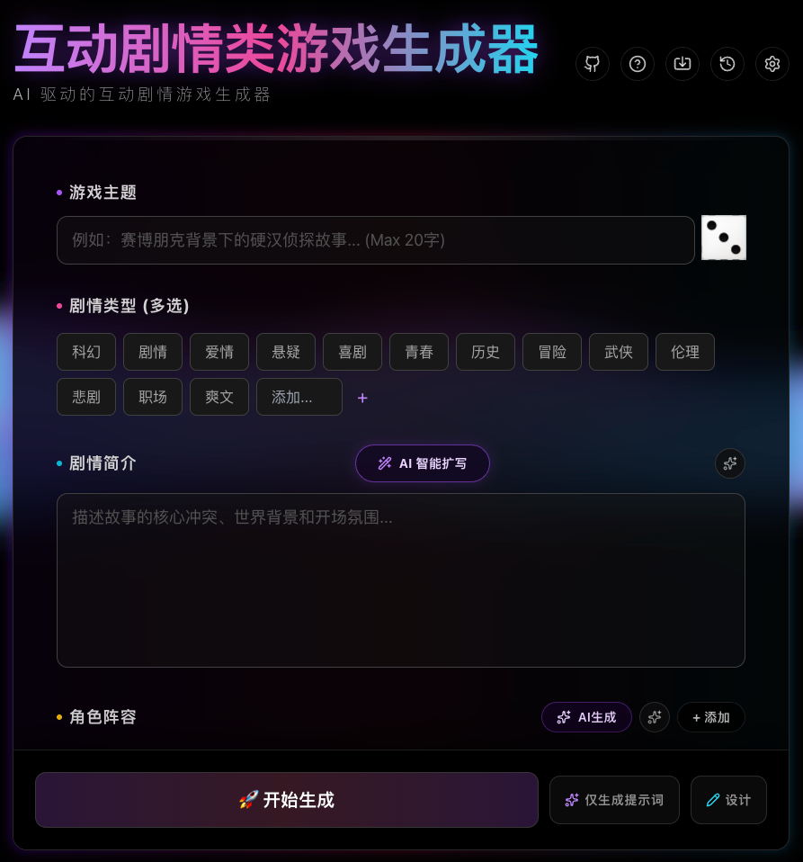

- 生成页
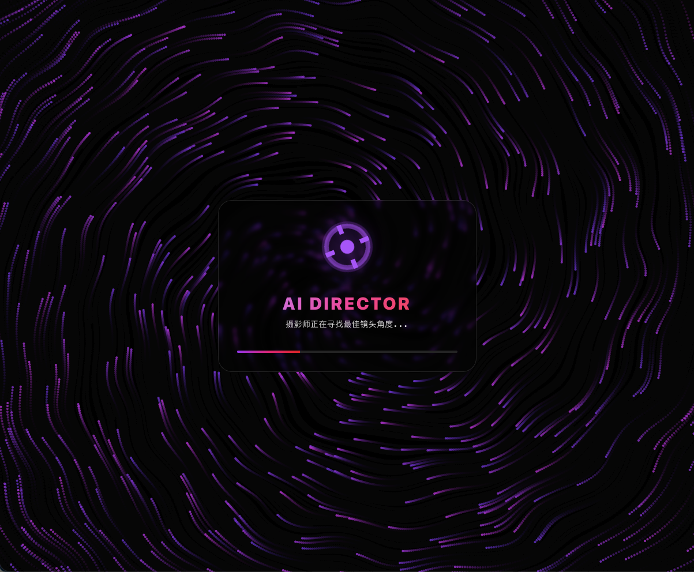

- 游戏页
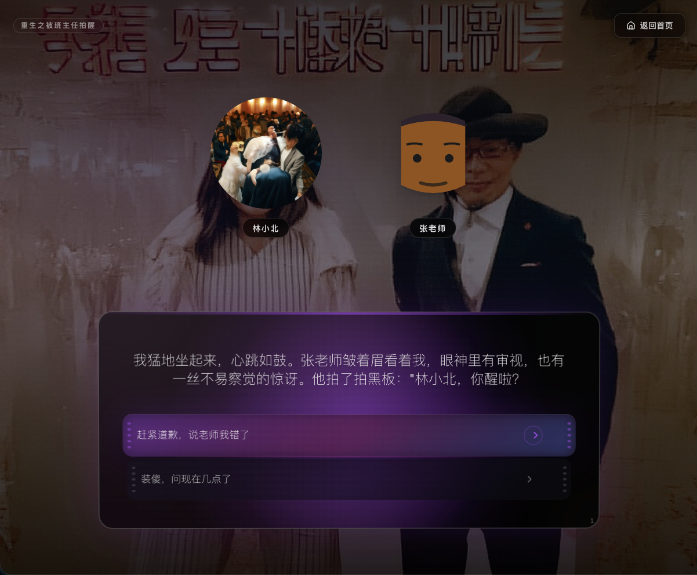

- 结局页
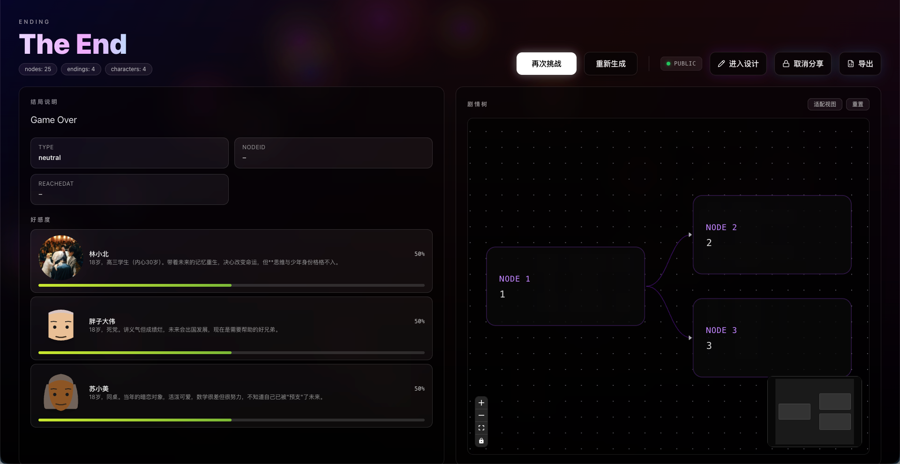

- 设计页

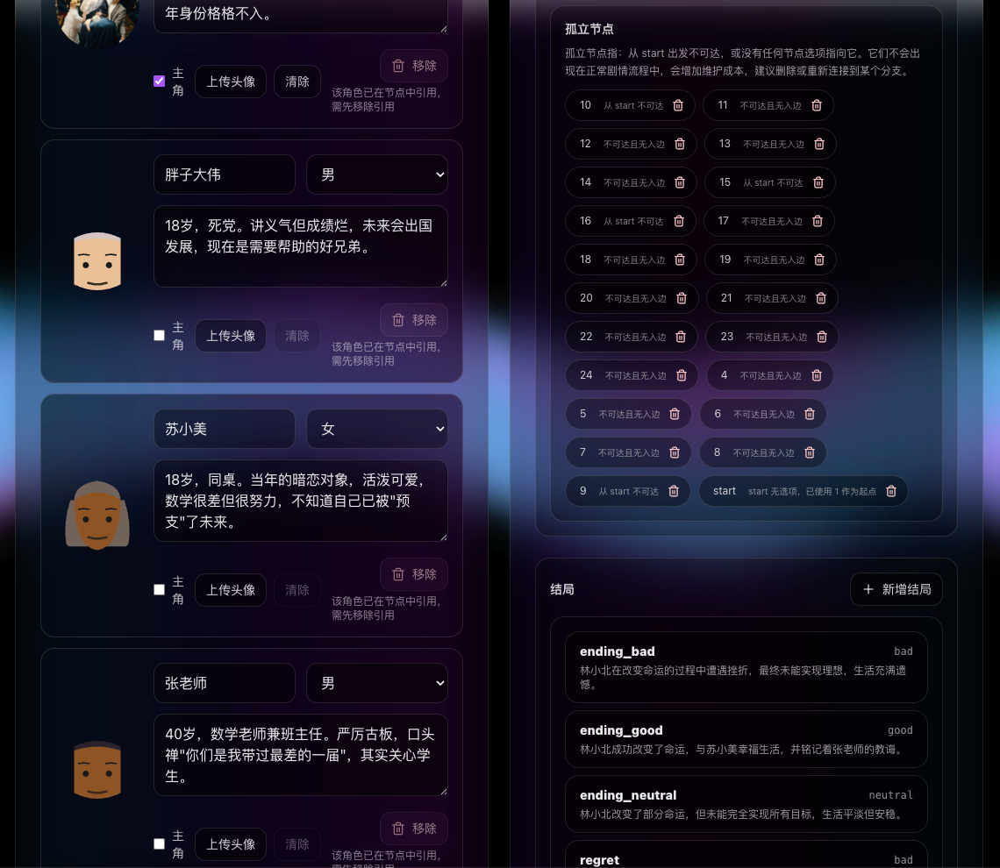
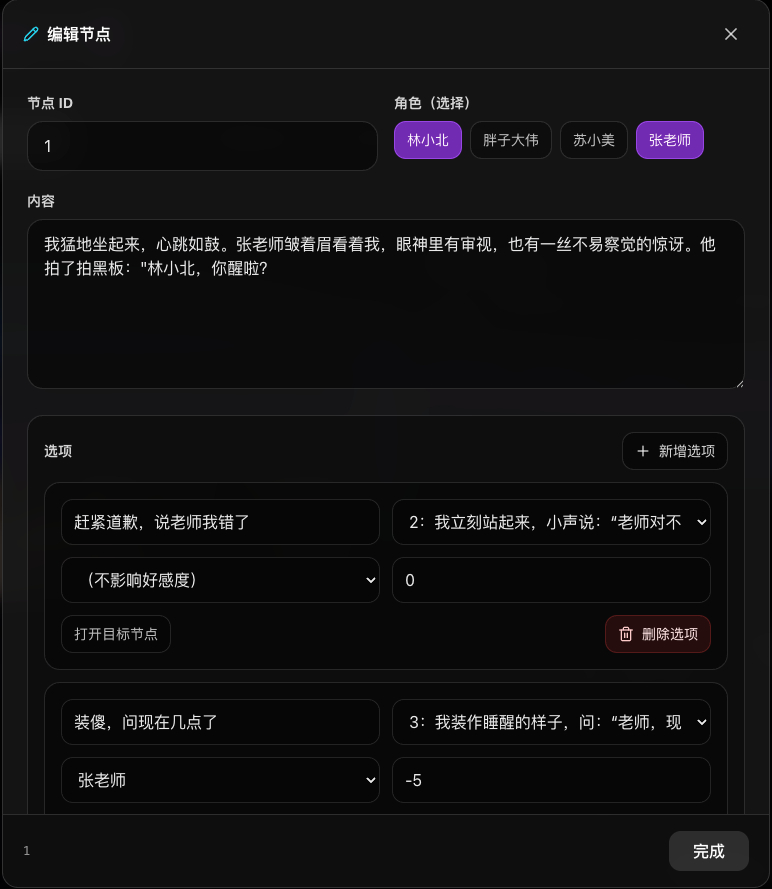

</details>

### 数据流
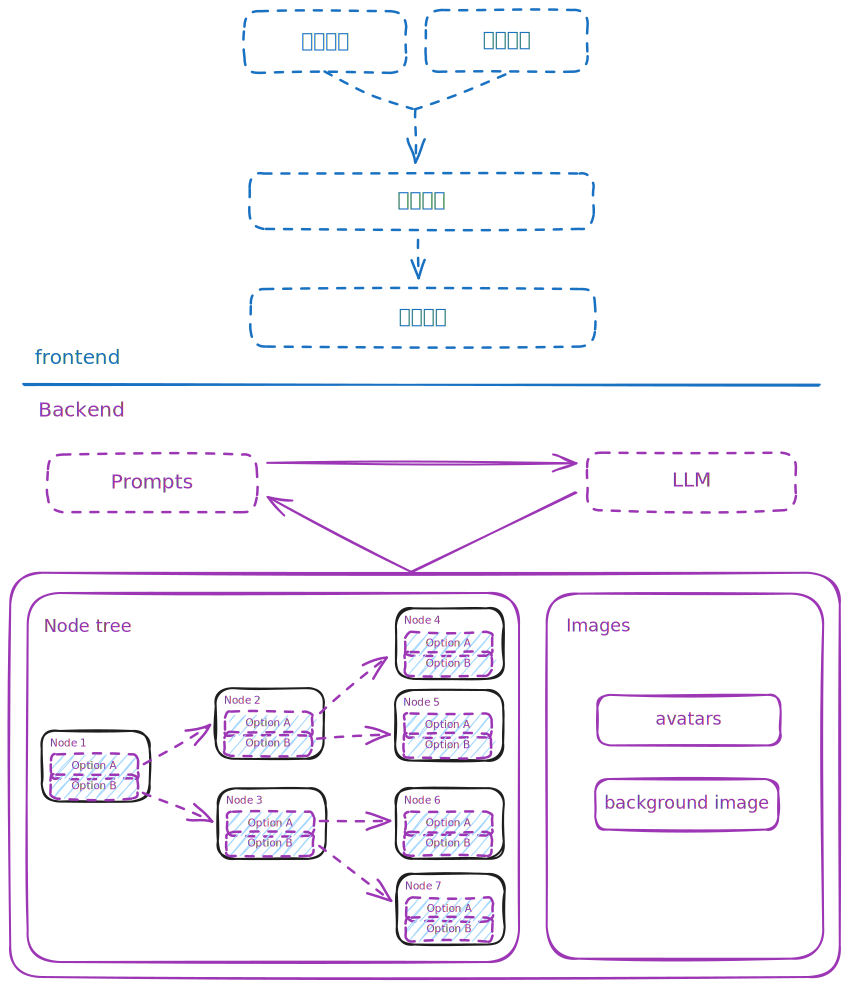

### 图片生成
图片生成使用 GLM 的免费(限制并发)文生图模型 <a href="https://docs.bigmodel.cn/cn/guide/models/free/cogview-3-flash" target="_blank">cogview-3-flash</a>, 虽然质量很差, 但是它免费用我高低得夸它一下

> [!TIP]
> 非常感谢智谱慷慨得提供免费模型, 如果你有 `Coding` 的需求, 可以购买智谱的 <a href="https://www.bigmodel.cn/claude-code?cc=fission_glmcode_sub_v1&ic=Q2N8XA4W77&n=a****3" target="_blank">🔗 GLM Coding Plan</a> 订阅支持一下, 或者 [点击这里试用](https://www.bigmodel.cn/activity/trial-card/A8AMOHCHA5)

### ~~视频生成~~
其实也试过 GLM 的免费(限制并发)的视频生成模型 <a href="https://docs.bigmodel.cn/cn/guide/models/free/cogvideox-flash" target="_blank">cogvideox-flash</a>, 但是生成一个视频大概需要 3 分钟, 而且限制并发数只有 1, 生成的视频质量 emmmmm 非常拉, 其他的商业模型成本太高, 就没有使用视频生成

## 开发
### 技术栈
- 前端: `vite` / `vue` / `inspira-ui`
- 后端: `axum` / `sqlx` / `postgresql`

### 前端
经过一段时间的 `Vibe Coding`, 顺利完成了前端的页面的开发, 前端没有使用任何组件库, 只使用了 `inspira-ui` 作为特效库

### 后端

#### 后端接口
后端提供了以下(主要)接口:
- `/expand/worldview`: 根据 游戏主题 / 剧情类型 生成剧情简介
- `/expand/worldview/prompt`: 返回  `/expand/worldview`接口使用的提示词
- `/expand/character`: 根据 游戏主题 / 剧情类型 / 剧情简介 生成角色
- `/expand/character/prompt`: 返回 `/expand/character`接口使用的提示词
- `/generate`: 生成 [剧情树](#剧情树)
- `/generate/prompt`: 返回 `/generate` 接口使用的提示词

## 剧情树
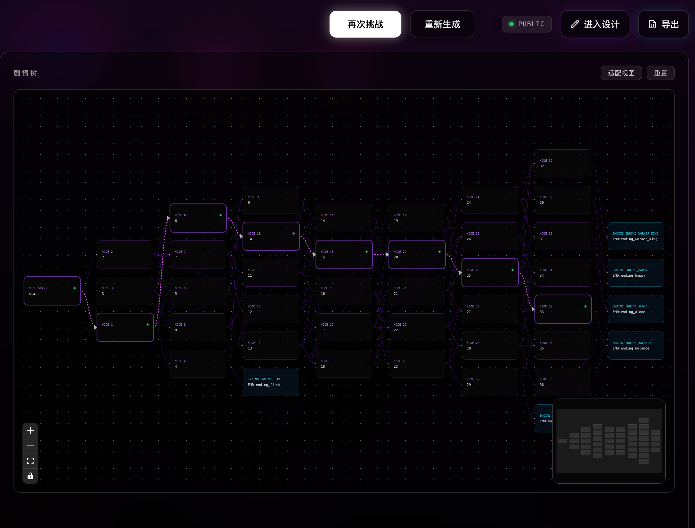
这里面最复杂的就是剧情树了, 因为互动剧情类游戏是 **多故事线** / **多结局**, 所以实际上 **剧情是树结构的, 而不是一条直线, 这导致了很多问题**

### 剧情节点
一个简单的剧情节点的数据结构示例:

```json
{
  "nodes": {
    "start": {
      "content": "数学课上，我趴在课桌上流口水，梦见三十岁的加班生活。突然，后脑勺挨了一巴掌：'又睡觉！'猛一抬头，我惊恐地发现黑板上写着'2014年'，眼前是年轻十岁的班主任老张。我竟然重生了，带着记忆回到高三。",
      "level": 1,
      "characters": ["林小北", "张老师"],
      "choices": [
        {
          "text": "假装镇定，继续上课",
          "nextNodeId": "1"
        },
        {
          "text": "激动地站起来，解释重生",
          "nextNodeId": "2"
        }
      ]
    }
    // ...
  }
}
```

### 剧情树生成
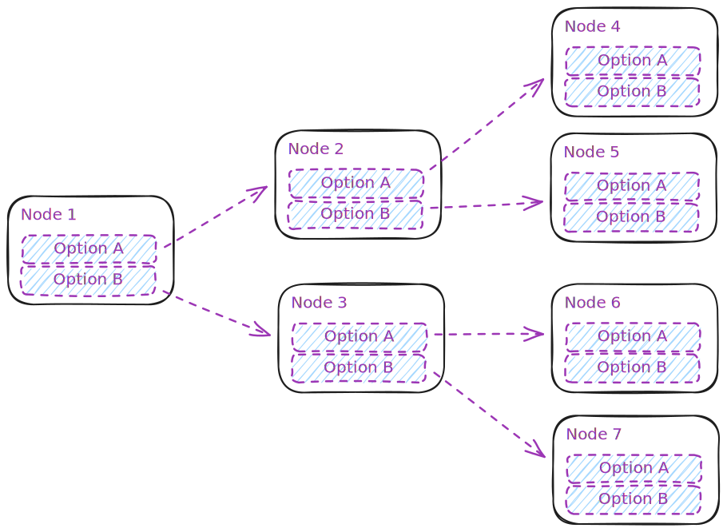

图为一个简单的剧情数结构, 玩家会在每个节点上做出选择, 做出选择后会进入下一个节点

### 剧情节点膨胀


如果不同的选项指向不同的节点, 那么会造成节点树的剧烈的膨胀, 实际上我们并不需要这么多节点, 所以要进行 **节点收束**, 也就是 **允许不同的选项指向同一个后继结点**:

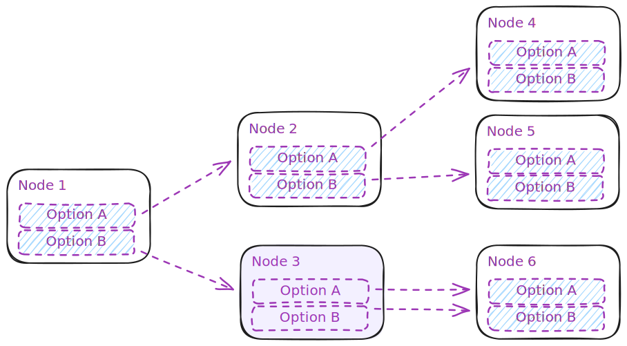

这里的 Node3 中的两个选项都指向了 Node6, 也就是说无论选择哪个选项都不影响剧情走向, 这就会造成另外一个问题: 剧情状态丢失

### 剧情状态丢失
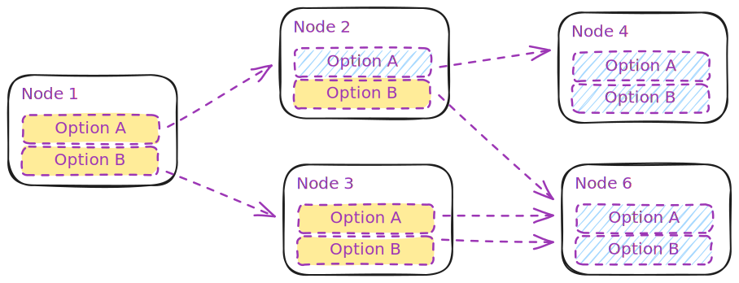

玩家在 Node1 中无论选择了 A 还是 B, 在进入 Node6 时, 之前所有的节点状态都会进行统一, 举个例子:

- Node1: "我发现了女友出轨的证据, 女友极力辩解"
  - A: 信任她
  - B: 结束关系
- Node6: "再次与她相遇 ..."

此时 "我" 在 Node1 做出的选择明显应该深刻影响后续剧情, 但在 Node6 及其之后的节点中, 无论选择 A 还是 B 就都是一样的了

当然这是可以解决的, 这涉及到节点树的 **剧情状态** 设计, 后续文章会探索解决方案

### 游离节点
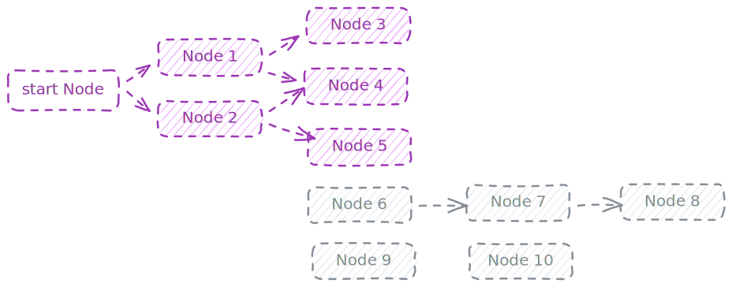

游离节点指的是 **从初始节点无法到达的节点**

什么? 你问我为什么不在提示词中明确告诉 LLM 避免出现这种情况? 因为我试过了, 即使我在提示词中加上了整个要求, **因为 LLM 输出的不确定性以及上下文长度的问题, 还是会有概率出现这个问题**

### 循环引用
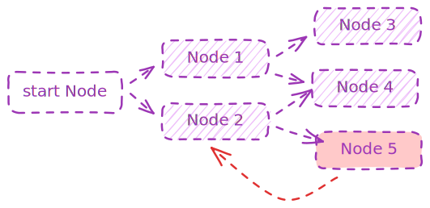

循环引用也是个致命的问题, 它会造成剧情死循环, 就像中了 伊邪那美 一样

### 其他问题
其实还有更多问题, 例如:
- **JSON 解析失败**: LLM 输出的 JSON 可能会解析失败, 导致用户等待了几分钟最后报错 😡, 最常见的是在 JSON 结构中使用中文的双引号
- **没有选项的节点**: 到达某个剧情节点时, 无法继续进行
- **自引用节点**: 节点的某个选项指向自己
- **节点选项空指针**: 剧情节点的某个选项指向了不存在的节点, 这个也很常见, 例如选项 A 指向了 Node 100, 但一共只有 50 个节点
- **大量只有一个选项的节点**: 只有一个选项会导致剧情树变成一条直线
- **节点内容或选项重复**: 节点的内容和选项完全重复, 根本没办法玩下去
- **节点引用了不存在或错误的角色**: 剧情节点中引用了不存在的角色, 或者一个角色都不引用

## 设计缺陷
除了以上列出的剧情树的问题, 整体也有影响用户体验的严重的问题:

- **剧情过于普通**: AI 生成的剧情总是感觉非常虚假, 就像写日记一样, 这根本不是玩家想要的剧情
- **生成剧情耗时太长**: 生成一次剧情大概需要 `1w` tokens, 大约需要 `1~2` 分钟, 如果开启 `think mode`, 耗时就会达到 `8` 分钟(使用的是 `deepseek`), 没错, 需要让玩家等待 `8` 分钟

## 总结
至此, 一个可以使用的 互动剧情类游戏生成器 已经初现雏形, 所有的问题我们将在后续文章中探索解决方案

## 参考
- <a href="https://www.bigmodel.cn/claude-code?cc=fission_glmcode_sub_v1&ic=Q2N8XA4W77&n=a****3" target="_blank">🔗 GLM Coding Plan</a>
- <a href="http://movie-games.xiaban.run/" target="_blank">互动剧情类游戏的生成工具</a>
- <a href="https://zh.wikipedia.org/wiki/%E4%BA%92%E5%8A%A8%E7%94%B5%E5%BD%B1%E6%B8%B8%E6%88%8F" target="_blank">互动电影游戏</a>
- <a href="https://store.steampowered.com/curator/36149206" target="_blank">奇异人生 系列</a>
- <a href="https://store.steampowered.com/app/1222140/_/" target="_blank">底特律：化身为人</a>
- <a href="https://store.steampowered.com/app/939400/LoveChoice/?l=schinese" target="_blank">拣爱</a>
- <a href="https://store.steampowered.com/app/2322560/_/" target="_blank">完蛋! 我被美女包围了!</a>
- <a href="https://store.steampowered.com/app/1341820/As_Dusk_Falls/" target="_blank">日落黄昏时(As Dusk Falls)</a>
- <a href="https://store.steampowered.com/app/1577120/_/" target="_blank">采石场惊魂</a>
- <a href="https://gemini.google/tw/overview/video-generation/?hl=zh-TW" target="_blank">video-generation</a>
- <a href="https://www.adobe.com/tw/products/firefly/features/ai-video-generator.html" target="_blank">Adobe Firefly</a>
- <a href="https://docs.bigmodel.cn/cn/guide/models/free/cogview-3-flash" target="_blank">cogview-3-flash</a>
- <a href="https://docs.bigmodel.cn/cn/guide/models/free/cogvideox-flash" target="_blank">cogvideox-flash</a>