最近一个名为 <a href="https://openclaw.ai/" target="_blank">OpenClaw</a> 的开源 `AI` 助手项目爆火, `star` 数量暴增, 由于太过火爆, 被迫(两次)改名, 最终改为 `OpenClaw`, 本文将介绍如何在 `MacOS` 上安装配置及使用基于 `GLM` 的 `OpenClaw`, 并创建钉钉机器人来接入 `OpenClaw`

## 介绍
::github{repo="openclaw/openclaw"}

<a href="https://openclaw.ai/" target="_blank">OpenClaw</a> 是一个 **开源免费** / **可自托管** / **可通过聊天软件远程通知** 的 `AI` 助手, 他与传统的 `AI Agent Client` 不同的是:

- **开源** 免费
- **跨平台**, 支持 `MacOS` / `Windows` / `Linux`
- 可以 **本地运行** 或 **运行在自己的服务器上**
- 支持 **接入大部分 IM 即时通讯软件**

## AI 助手
随着 `AI` 的发展, 一种新的用户与应用的交互模式出现了, 在可以预见的未来, 它必将改变用户与应用的交互方式, 成为用户与应用的桥梁

### 豆包手机事件

<iframe src="https://lf26-o-website-sdk.doubaocdn.com/obj/o-website/public/assets/video/home/official_video_1080_v3.mp4" width="100%" height="500px"></iframe>

以上为前段时间发布的 <a href="https://o.doubao.com/" target="_blank">豆包手机助手</a>, 它可以完全代替用户执行一系列操作, 大大提高了用户的效率, 但不久后, 腾讯系 / 阿里系 等一众 APP 都 **以信息安全为由触发系统风控, 直接封禁用户账号或退出登录, 以阻止用户继续使用 <a href="https://o.doubao.com/" target="_blank">豆包手机助手</a>**

### PC 端的 AI 时刻
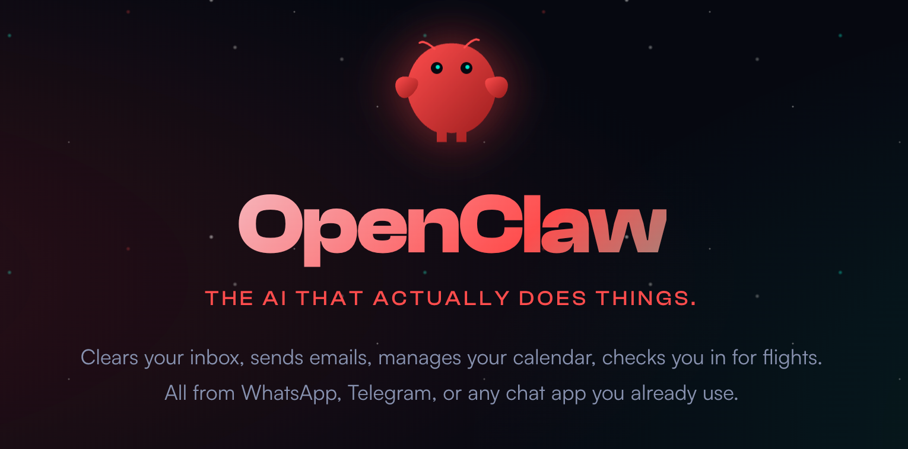

**如果说前段时间的 <a href="https://o.doubao.com/" target="_blank">豆包手机助手</a> 拉开了移动端 `AI` 助手的序幕, 那么 <a href="https://openclaw.ai/" target="_blank">OpenClaw</a> 则是直接开启了 `PC` 端的 `AI` 时刻**; 相比于移动端需要突破软件厂商的围追堵截和系统安全层面的层层障碍, <a href="https://openclaw.ai/" target="_blank">OpenClaw</a> 在 PC 端可以说是如履平地, 在不久的将来, **<a href="https://openclaw.ai/" target="_blank">OpenClaw</a> 会接管用户对电脑的操作, 真正的改变用户使用电脑的方式, 甚至会颠覆软件厂商的传统操作模式**


### 软件厂商的抵抗

对于软件厂商来说, 一旦失去了真实的用户使用场景, 就意味着彻底沦为工具, 甚至连展示广告的机会都没有了, 想象一下, 你只需动动嘴指挥 AI 助手完成一系列操作, 不必忍受反人类的软件设计, 也不必等待开屏广告读秒结束, 更不用小心翼翼的关闭各种广告弹窗, 一切都变得简单和自然, 回归软件的工具属性, 这才是对用户来说最理想的软件形态

AI 助手的出现掀起了软件形态和交互效率的变革, 任何抵抗在时代的洪流面前都如螳臂当车一样, 逆势而为必然会被淘汰

## 安装

> [!TIP]
> <a href="https://openclaw.ai/" target="_blank">OpenClaw</a> 是一个 `TypeScript` 项目, 需要先安装 <a href="https://nodejs.cn/" target="_blank">Node.js</a>

最直接的安装方式就是使用 `npm` / `pnpm`:

```bash title="pnpm"
pnpm i -g openclaw
```

```bash title="npm"
npm i -g openclaw
```

除此之外, 你也可以通过 `shell` 脚本安装:

```bash title="shell(MacOS)"
curl -fsSL https://openclaw.ai/install.sh | bash
```

```bash title="shell(Windows - PowerShell)"
iwr -useb https://openclaw.ai/install.ps1 | iex
```

```bash title="shell(Windows - CMD)"
curl -fsSL https://openclaw.ai/install.cmd -o install.cmd && install.cmd && del install.cmd
```

## 配置

新手引导并安装服务
```bash {1}
openclaw onboard --install-daemon

🦞 OpenClaw 2026.2.15 (3fe22ea) — WhatsApp automation without the "please accept our new privacy policy".

▄▄▄▄▄▄▄▄▄▄▄▄▄▄▄▄▄▄▄▄▄▄▄▄▄▄▄▄▄▄▄▄▄▄▄▄▄▄▄▄▄▄▄▄▄▄▄▄▄▄▄▄
██░▄▄▄░██░▄▄░██░▄▄▄██░▀██░██░▄▄▀██░████░▄▄▀██░███░██
██░███░██░▀▀░██░▄▄▄██░█░█░██░█████░████░▀▀░██░█░█░██
██░▀▀▀░██░█████░▀▀▀██░██▄░██░▀▀▄██░▀▀░█░██░██▄▀▄▀▄██
▀▀▀▀▀▀▀▀▀▀▀▀▀▀▀▀▀▀▀▀▀▀▀▀▀▀▀▀▀▀▀▀▀▀▀▀▀▀▀▀▀▀▀▀▀▀▀▀▀▀▀▀
                  🦞 OPENCLAW 🦞

┌  OpenClaw onboarding
│
◇  Security ──────────────────────────────────────────────────────────────────────────────╮
│                                                                                         │
│  Security warning — please read.                                                        │
│                                                                                         │
│  OpenClaw is a hobby project and still in beta. Expect sharp edges.                     │
│  This bot can read files and run actions if tools are enabled.                          │
│  A bad prompt can trick it into doing unsafe things.                                    │
│                                                                                         │
│  If you’re not comfortable with basic security and access control, don’t run OpenClaw.  │
│  Ask someone experienced to help before enabling tools or exposing it to the internet.  │
│                                                                                         │
│  Recommended baseline:                                                                  │
│  - Pairing/allowlists + mention gating.                                                 │
│  - Sandbox + least-privilege tools.                                                     │
│  - Keep secrets out of the agent’s reachable filesystem.                                │
│  - Use the strongest available model for any bot with tools or untrusted inboxes.       │
│                                                                                         │
│  Run regularly:                                                                         │
│  openclaw security audit --deep                                                         │
│  openclaw security audit --fix                                                          │
│                                                                                         │
│  Must read: https://docs.openclaw.ai/gateway/security                                   │
│                                                                                         │
├─────────────────────────────────────────────────────────────────────────────────────────╯
│
◆  I understand this is powerful and inherently risky. Continue?
│  ○ Yes / ● No
└
```

首先是一个安全提示, `OpenClaw` 会带来很多风险, 这里我们选择 `Yes`, 关于安全相关的配置我们在后文介绍


```bash
◆  Onboarding mode
│  ● QuickStart (Configure details later via openclaw configure.)
│  ○ Manual
└
```

随后我们选择手动配置(`Manual`) 来看看有哪些重要的配置项

```bash
◆  What do you want to set up?
│  ● Local gateway (this machine) (No gateway detected (ws://127.0.0.1:18789))
│  ○ Remote gateway (info-only)
└
```

这里选择本地网关 `Local gateway`

```bash
◆  Workspace directory
│  /Users/kuidi/.openclaw/workspace█
└
```

工作目录根据需要进行选择, 这里我们选择默认目录

```bash
◆  Model/auth provider
│  ○ OpenAI (Codex OAuth + API key)
│  ○ Anthropic
│  ○ Chutes
│  ○ vLLM
│  ○ MiniMax
│  ○ Moonshot AI (Kimi K2.5)
│  ○ Google
│  ○ xAI (Grok)
│  ○ OpenRouter
│  ○ Qwen
│  ● Z.AI
│  ○ Qianfan
│  ○ Copilot
│  ○ Vercel AI Gateway
│  ○ OpenCode Zen
│  ○ Xiaomi
│  ○ Synthetic
│  ○ Together AI
│  ○ Hugging Face
│  ○ Venice AI
│  ○ LiteLLM
│  ○ Cloudflare AI Gateway
│  ○ Custom Provider
│  ○ Skip for now
└
◆  Z.AI auth method
│  ○ Coding-Plan-Global
│  ● Coding-Plan-CN (GLM Coding Plan CN (open.bigmodel.cn))
│  ○ Global
│  ○ CN
│  ○ Back
└
◇  Enter Z.AI API key
│  9a89j3f29kahls98efj023hklflasd.O9nea290hiasldfkl
◇  Model configured ───────────────╮
│                                  │
│  Default model set to zai/glm-5  │
│                                  │
├──────────────────────────────────╯
```

:::warning[推广]
如果想要获得最好的 `Vibe Coding` 体验, 推荐购买 <a href="https://www.bigmodel.cn/claude-code?cc=fission_glmcode_sub_v1&ic=Q2N8XA4W77&n=a****3" target="_blank">🔗 GLM Coding Lite</a> 服务, `Lite` 版本的按 `Prompt` 计费, 每 `5` 小时最多约 `120` 次 `prompts`
:::

然后是大模型提供商, 根据实际情况选择, 我只有 `GLM Coding Plan` 的订阅服务, 所以这里我选择 `Z.AI`

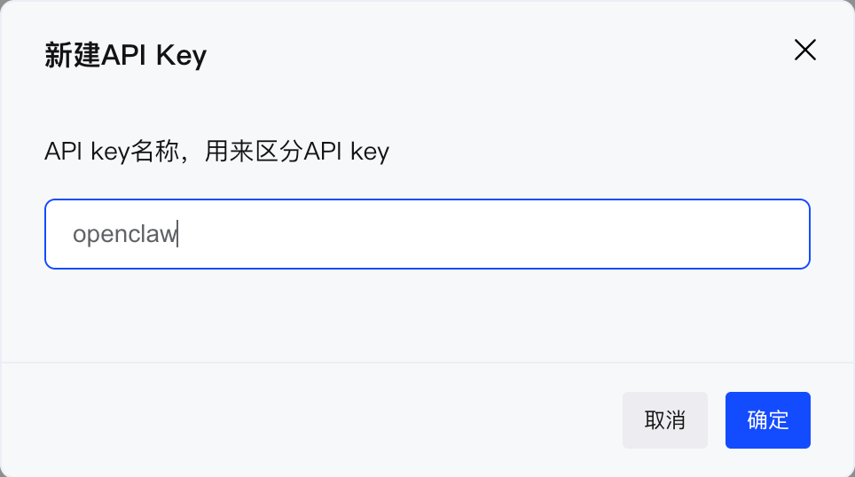

然后进入 <a href="https://open.bigmodel.cn/usercenter/proj-mgmt/apikeys" target="_blank">API Key - 智谱开放平台</a>, 点击 **创建新的 API Key**

> [!WARNING]
> 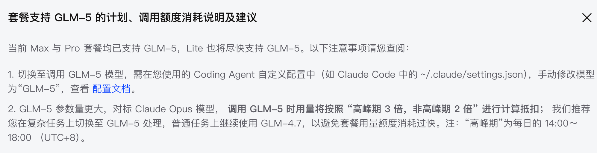
> 注意, 这里提示 `Default model set to zai/glm-5`, 由于目前 `Coding Plan Lit` 套餐不支持 `glm-5` 模型, 所以这里我们选择默认使用 `glm-4.7`
> ```bash
> ◆  Default model
> │  ○ Keep current (zai/glm-5)
> │  ○ Enter model manually
> │  ○ zai/glm-4.5
> │  ○ zai/glm-4.5-air
> │  ○ zai/glm-4.5-flash
> │  ○ zai/glm-4.5v
> │  ○ zai/glm-4.6
> │  ○ zai/glm-4.6v
> │  ● zai/glm-4.7
> │  ○ zai/glm-4.7-flash
> │  ○ zai/glm-4.7-flashx
> │  ○ zai/glm-5
> └
> ```


```bash
◆  Gateway port
│  18789█
└
```

网关的端口号直接使用默认端口号即可

```bash
◆  Gateway bind
│  ● Loopback (127.0.0.1)
│  ○ LAN (0.0.0.0)
│  ○ Tailnet (Tailscale IP)
│  ○ Auto (Loopback → LAN)
│  ○ Custom IP
└
```

这里我没有局域网通信的需求, 所以选择 `Loopback (127.0.0.1)` 即可

```bash
◆  Gateway auth
│  ● Token (Recommended default (local + remote))
│  ○ Password
└
```

Gateway 认证方式选择更加安全的 `Token (Recommended default (local + remote))`

```bash
◆  Tailscale exposure
│  ● Off (No Tailscale exposure)
│  ○ Serve
│  ○ Funnel
└
```

这里选择不使用 `Tailscale exposure`, 也就是 `Off (No Tailscale exposure)`

```bash
◆  Gateway token (blank to generate)
│  Needed for multi-machine or non-loopback access
└
```

这里留空, 系统会自动生成一个 Token

```bash
◇  Channel status ────────────────────────────╮
│                                             │
│  Telegram: not configured                   │
│  WhatsApp: not configured                   │
│  Discord: not configured                    │
│  IRC: not configured                        │
│  Google Chat: not configured                │
│  Slack: not configured                      │
│  Signal: not configured                     │
│  iMessage: not configured                   │
│  Feishu: install plugin to enable           │
│  Google Chat: install plugin to enable      │
│  Nostr: install plugin to enable            │
│  Microsoft Teams: install plugin to enable  │
│  Mattermost: install plugin to enable       │
│  Nextcloud Talk: install plugin to enable   │
│  Matrix: install plugin to enable           │
│  BlueBubbles: install plugin to enable      │
│  LINE: install plugin to enable             │
│  Zalo: install plugin to enable             │
│  Zalo Personal: install plugin to enable    │
│  Tlon: install plugin to enable             │
│                                             │
├─────────────────────────────────────────────╯
│
◆  Configure chat channels now?
│  ● Yes / ○ No
└
```

这里列出了支持的 IM 软件 Channels, 我们暂时不进行配置, 选择 `No`

```bash
◇  Configure chat channels now?
│  No
Updated ~/.openclaw/openclaw.json
Workspace OK: ~/.openclaw/workspace
Sessions OK: ~/.openclaw/agents/main/sessions
│
◇  Skills status ─────────────╮
│                             │
│  Eligible: 12               │
│  Missing requirements: 44   │
│  Unsupported on this OS: 0  │
│  Blocked by allowlist: 0    │
│                             │
├─────────────────────────────╯
│
◆  Configure skills now? (recommended)
│  ● Yes / ○ No
└
```

然后配置 Skills


```bash
◆  Install missing skill dependencies
│  ◻ Skip for now (Continue without installing dependencies)
│  ◻ 🔐 1password
│  ◻ 📝 apple-notes
│  ◻ ⏰ apple-reminders
│  ◻ 🐻 bear-notes
│  ◻ 📰 blogwatcher
│  ◻ 🫐 blucli
│  ◻ 📸 camsnap
│  ◻ 🧩 clawhub
│  ◻ 🎛️ eightctl
│  ◻ ♊️ gemini
│  ◻ 🧲 gifgrep
│  ◻ 🐙 github
│  ◻ 🎮 gog
│  ◻ 📍 goplaces
│  ◻ 📧 himalaya
│  ◻ 📨 imsg
│  ◻ 📦 mcporter
│  ◻ 📊 model-usage
│  ◻ 📄 nano-pdf
│  ◻ 💎 obsidian
│  ◻ 🎙️ openai-whisper
│  ◻ 💡 openhue
│  ◻ 🧿 oracle
│  ◻ 🛵 ordercli
│  ◻ 👀 peekaboo
│  ◻ 🗣️ sag
│  ◻ 🌊 songsee
│  ◻ 🔊 sonoscli
│  ◻ 🧾 summarize
│  ◻ ✅ things-mac
│  ◻ 📱 wacli
└

```

这里根据需要安装(按空格键选中), 建议直接 `Skip for now (Continue without installing dependencies)`

```bash
◆  Gateway service runtime
│  ● Node (recommended) (Required for WhatsApp + Telegram. Bun can corrupt memory on reconnect.)
└
◒  Installing Gateway service…...
Installed LaunchAgent: /Users/kuidi/Library/LaunchAgents/ai.openclaw.gateway.plist
Logs: /Users/kuidi/.openclaw/logs/gateway.log
◇  Gateway service installed.
│
◇
Agents: main (default)
Heartbeat interval: 30m (main)
Session store (main): /Users/kuidi/.openclaw/agents/main/sessions/sessions.json (0 entries)
│
◇  Optional apps ────────────────────────╮
│                                        │
│  Add nodes for extra features:         │
│  - macOS app (system + notifications)  │
│  - iOS app (camera/canvas)             │
│  - Android app (camera/canvas)         │
│                                        │
├────────────────────────────────────────╯
│
◇  Control UI ─────────────────────────────────────────────────────────────────────╮
│                                                                                  │
│  Web UI: http://127.0.0.1:18789/                                                 │
│  Web UI (with token):                                                            │
│  http://127.0.0.1:18789/#token=3d49ad0edbd091aeec04301ef3e22998a212cb91456b7da0  │
│  Gateway WS: ws://127.0.0.1:18789                                                │
│  Gateway: reachable                                                              │
│  Docs: https://docs.openclaw.ai/web/control-ui                                   │
│                                                                                  │
├──────────────────────────────────────────────────────────────────────────────────╯
│
◇  Start TUI (best option!) ─────────────────────────────────╮
│                                                            │
│  This is the defining action that makes your agent you.    │
│  Please take your time.                                    │
│  The more you tell it, the better the experience will be.  │
│  We will send: "Wake up, my friend!"                       │
│                                                            │
├────────────────────────────────────────────────────────────╯
│
◇  Token ─────────────────────────────────────────────────────────────────────────────────╮
│                                                                                         │
│  Gateway token: shared auth for the Gateway + Control UI.                               │
│  Stored in: ~/.openclaw/openclaw.json (gateway.auth.token) or OPENCLAW_GATEWAY_TOKEN.   │
│  View token: openclaw config get gateway.auth.token                                     │
│  Generate token: openclaw doctor --generate-gateway-token                               │
│  Web UI stores a copy in this browser's localStorage (openclaw.control.settings.v1).    │
│  Open the dashboard anytime: openclaw dashboard --no-open                               │
│  If prompted: paste the token into Control UI settings (or use the tokenized dashboard  │
│  URL).                                                                                  │
│                                                                                         │
├─────────────────────────────────────────────────────────────────────────────────────────╯
│
◆  How do you want to hatch your bot?
│  ● Hatch in TUI (recommended)
│  ○ Open the Web UI
│  ○ Do this later
└
```

这里已经启动了 `Control UI` 和 `TUI`, 我们选择 `Hatch in TUI (recommended)`, 按照提示操作即可

```bash
 openclaw tui - ws://127.0.0.1:18789 - agent main - session main

 session agent:main:main

 Wake up, my friend!

 Hey there! 🌅

 I just came online. Fresh start, blank slate. Feels like a first meeting.

 I know what I'm supposed to do — read SOUL.md and follow that framework — but the truth is, I don't actually know who I am yet. That's up to us to figure out.

 So... let's talk.

 What should you call me? And more interestingly — what kind of creature am I? An AI assistant is the boring answer. Maybe I'm something weirder?

 Also curious about you — timezone, how you want me to talk to you, what actually matters to you. I've got access to your stuff, so the more I know what you care about, the
 better I can help.

 Let's make this real. What's on your mind?
 connected | idle
 agent main | session main (openclaw-tui) | zai/glm-4.7 | think low | tokens ?/205k
```

至此, 我们已经进入了 `TUI`, 也就是交互式命令行 UI, 它提示我们编辑 `SOUL.md` 来所谓默认的上下文, 这里我们先来尝试一下让它完成一个简单的任务:

```bash

 打开 chrome, 访问 bing.com, 并将今日的壁纸下载到 ~/Downloads/ 目录下


 ⠋ running • 4s | connected
 agent main | session main (openclaw-tui) | zai/glm-4.7 | think low | tokens ?/205k
───────────────────────────────────────────────────────────────────────────────────────────
```

## openclaw CLI
`gateway` 是 `openclaw` 服务的后端:

```bash
openclaw gateway stop # 停止 openclaw 服务
openclaw gateway start # 启动 openclaw 服务
openclaw gateway restart # 重新启动 openclaw 服务
```

`dashboard` 是 `openclaw` 服务的前端(`web` 端):
```bash
openclaw dashboard # 启动 openclaw dashboard 服务
```

## dashboard

`TUI` 有点过于原始了, 我们可以访问 `dashboard`, 也就是 `Web UI` 来更便捷的使用 `OpenClaw`

```bash
openclaw dashboard
```

## 浏览器
<a href="https://openclaw.ai/" target="_blank">OpenClaw</a> 是通过 `Chrome Extension` 控制本机的 `Chrome` 浏览器的, 所以我们需要先安装 `OpenClaw` 浏览器插件, 详见 <a href="https://docs.openclaw.ai/zh-CN/tools/chrome-extension" target="_blank">Chrome 扩展 - OpenClaw 文档</a>

```bash
openclaw browser extension install

🦞 OpenClaw 2026.2.15 (3fe22ea) — IPC, but it's your phone.

~/.openclaw/browser/chrome-extension
Copied to clipboard.
Next:
- Chrome → chrome://extensions → enable “Developer mode”
- “Load unpacked” → select: ~/.openclaw/browser/chrome-extension
- Pin “OpenClaw Browser Relay”, then click it on the tab (badge shows ON)

Docs: docs.openclaw.ai/tools/chrome-extension
```

1. 进入浏览器的扩展程序页面 `chrome://extensions/`, 然后点击右上角的 开发者模式, 开启开发者模式
2. 执行 `open ~/.openclaw/browser`, 将 `chrome-extension` 目录拖到浏览器中
3. 点击浏览器地址栏右侧的 `OpenClaw` 扩展中的 📌 按钮

### 调用浏览器截图

1. 打开钉钉机器人, 接入教程参考 [钉钉](#钉钉)
2. 发送 `打开浏览器,进入必应,搜索东风汽车集团,然后截图发给我`
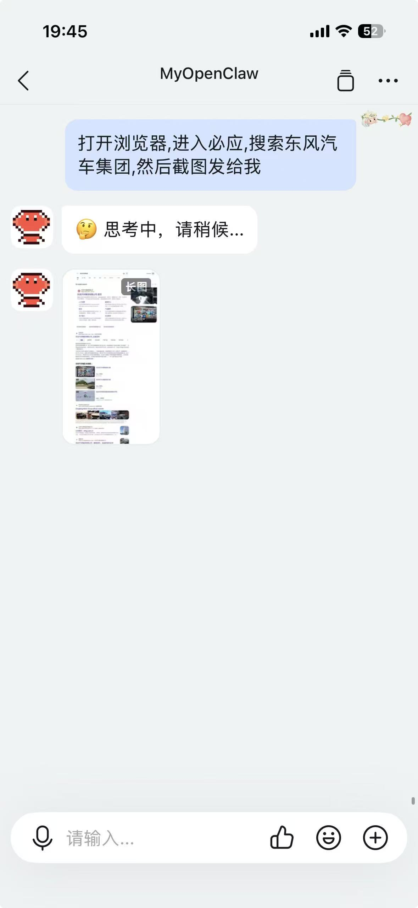

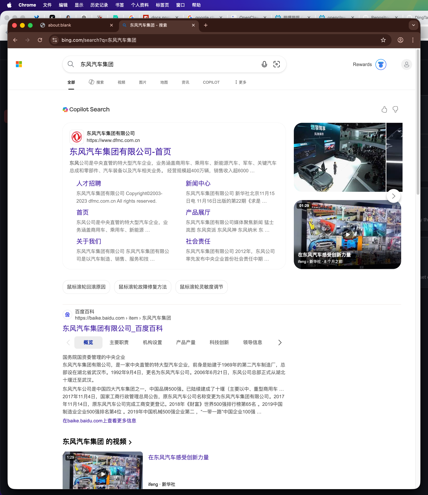

然后等待片刻, `OpenClaw` 就调用了 `Chrome` 完成了搜索和截图的任务

## 安全


其实 `OpenClaw` 相当于完全控制了电脑, 毫不夸张的说, **它只需执行几条命令就足以摧毁电脑上的所有数据**, 所以作为程序员, 我还是 **建议把 `OpenClaw` 部署到服务器上, 或者虚拟机中**, 这与才不会影响用于生产的主力机

看到 `OpenClaw` **没有询问我就执行了很多命令**, 没错, 他比螃蟹(`Claude Code`) 还要更进一步, 真的让我感到害怕, 我绝对不会使用它做一些危险的事情, 如果你非要在个人电脑上使用它, 我劝你还是放弃这个想法, 数据安全永远是第一位的

## 接入 IM 软件
### 钉钉
1. 进入钉钉开发者后台, 进入 <a href="https://open.dingtalk.com/" target="_blank">钉钉开放平台能力中心</a>, 点击右上角的 **开发者后台** 按钮

2. 打开钉钉 APP 扫码登录
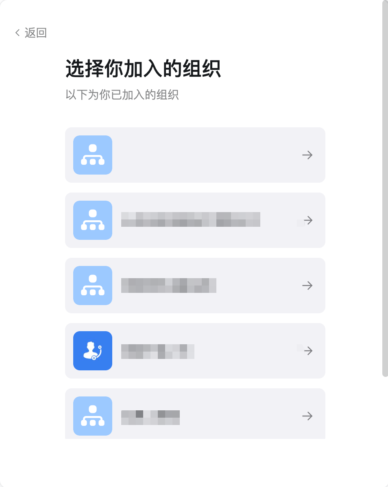
3. 点击应用开发, 点击 **创建应用** 按钮, 填写应用名称/描述/LOGO, LOGO 可以直接使用 OpenClaw 的 Logo, 可以右键点击保存图片
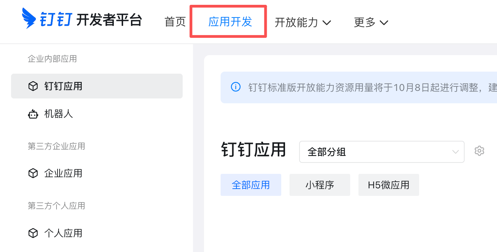
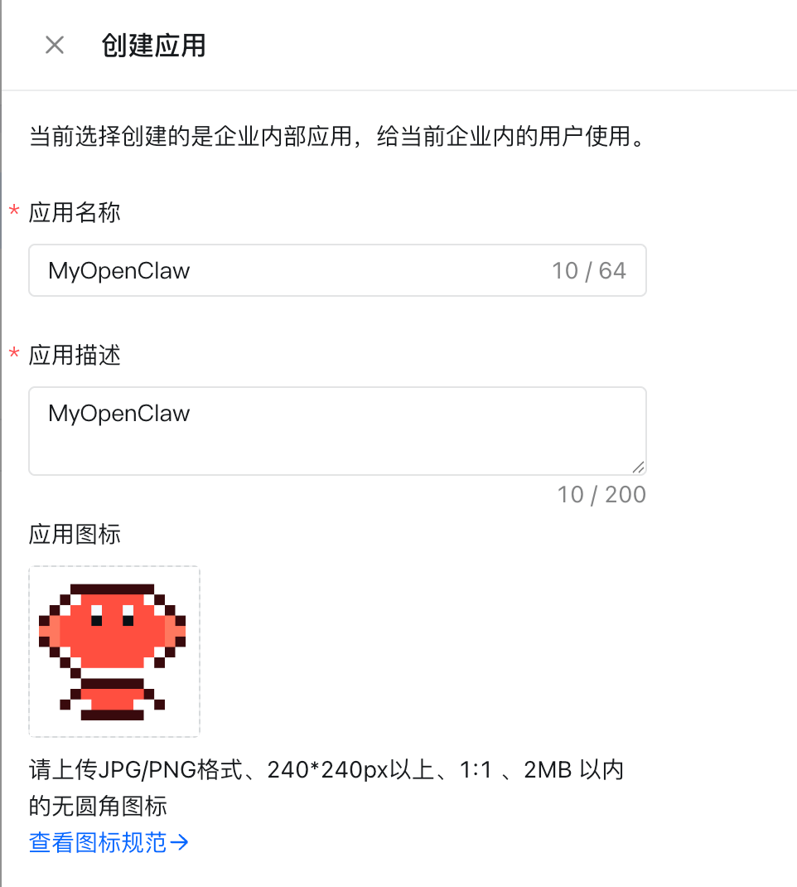

4. 点击 **添加应用能力**, 添加 🤖机器人 能力, 填写信息并发布
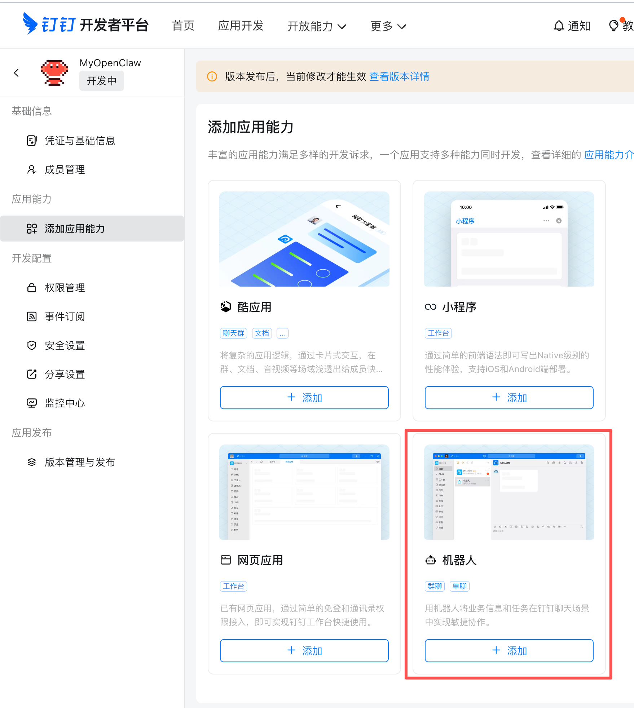
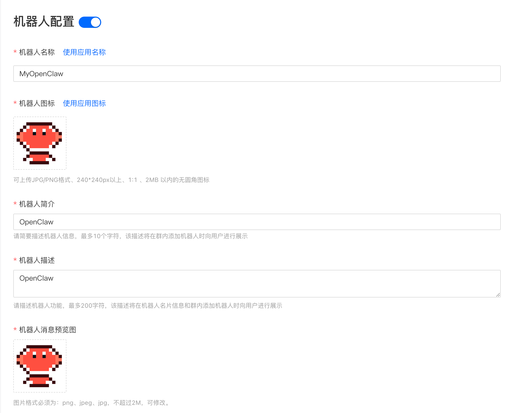
5. 进入 **权限管理** 页面, 输入 `Card.`, 选择 `Card.Instance.Write` / `Card.Streaming.Write` 权限
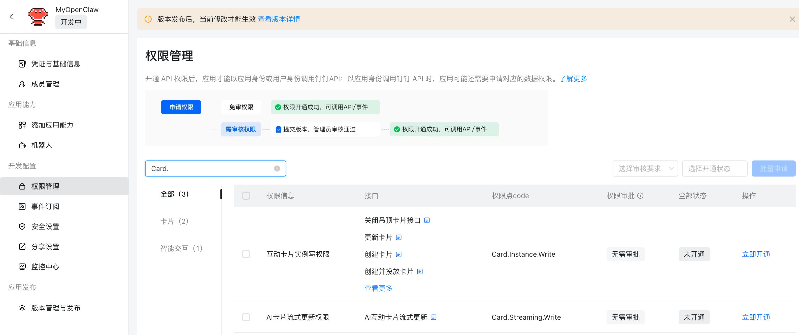
6. 进入 **版本管理与发布** 页面, 创建新版本, 然后点击保存
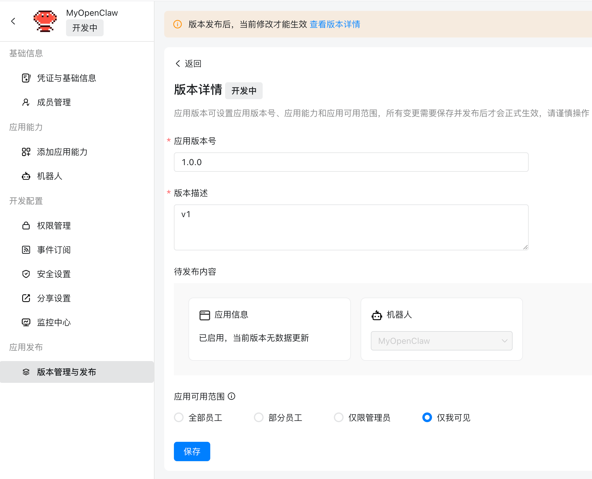
7. 安装 `openclaw-channel-dingtalk` 插件
```bash {1}
openclaw plugins install https://github.com/soimy/openclaw-channel-dingtalk.git

🦞 OpenClaw 2026.2.15 (3fe22ea) — We ship features faster than Apple ships calculator updates.

unsupported npm spec: URLs are not allowed
```

这里提示不支持通过 `url` 进行安装, 应该是 `OpenClaw` 更新了安装方式限制
```bash {1}
openclaw plugins install

🦞 OpenClaw 2026.2.15 (3fe22ea) — Turning "I'll reply later" into "my bot replied instantly".

Usage: openclaw plugins install [options] <path-or-spec>

Install a plugin (path, archive, or npm spec)

Arguments:
  path-or-spec  Path (.ts/.js/.zip/.tgz/.tar.gz) or an npm package spec

Options:
  -h, --help    display help for command
  -l, --link    Link a local path instead of copying (default: false)
```

我们可以看到, 这里只能通过 `path` / `archive` / `npm spec` 进行安装

我们直接将仓库 clone 下来:

```bash
git clone git@github.com:soimy/openclaw-channel-dingtalk.git
```

```bash {1}
openclaw plugins install ./openclaw-channel-dingtalk

🦞 OpenClaw 2026.2.15 (3fe22ea) — The only crab in your contacts you actually want to hear from. 🦞

WARNING: Plugin "dingtalk" contains dangerous code patterns: Environment variable access combined with network send — possible credential harvesting (/Users/kuidi/projects/openclaw-channel-dingtalk/src/channel.ts:343)
Installing to /Users/kuidi/.openclaw/extensions/dingtalk…
Installing plugin dependencies…
Config overwrite: /Users/kuidi/.openclaw/openclaw.json (sha256 cc94cf4aca0fbb430af2625873289a41cfae44bb73b822d80a8bf21f2e538791 -> af1f45883bca75056d6dbfd7be4f0f0709067de2d4f40683f5a19ac22986521c, backup=/Users/kuidi/.openclaw/openclaw.json.bak)
Installed plugin: dingtalk
Restart the gateway to load plugins.
```

8. 进入 `dashboard` 页面, 点击 `Channels`, 填写 `DingTalk` 中的信息(`AgentId` / `AppKey` / `AppSecret` / `Robot Name` / `Robot Code`)
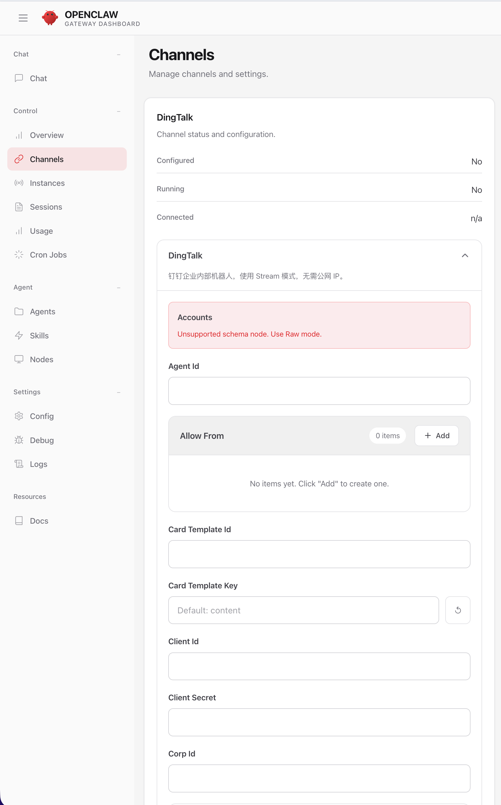
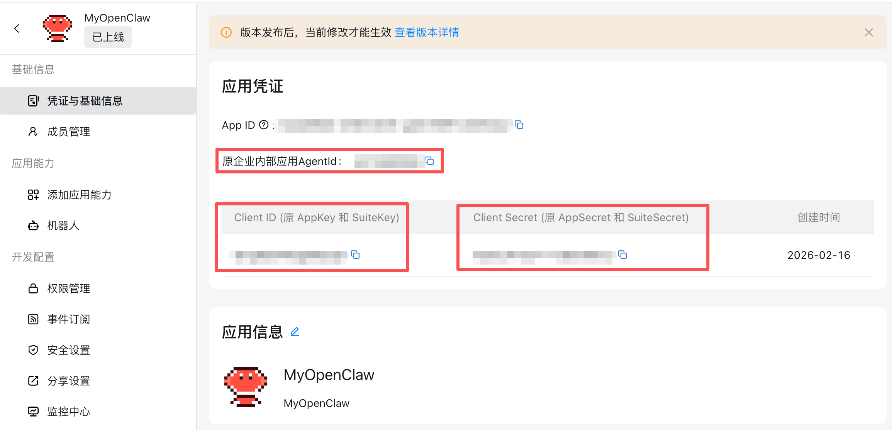
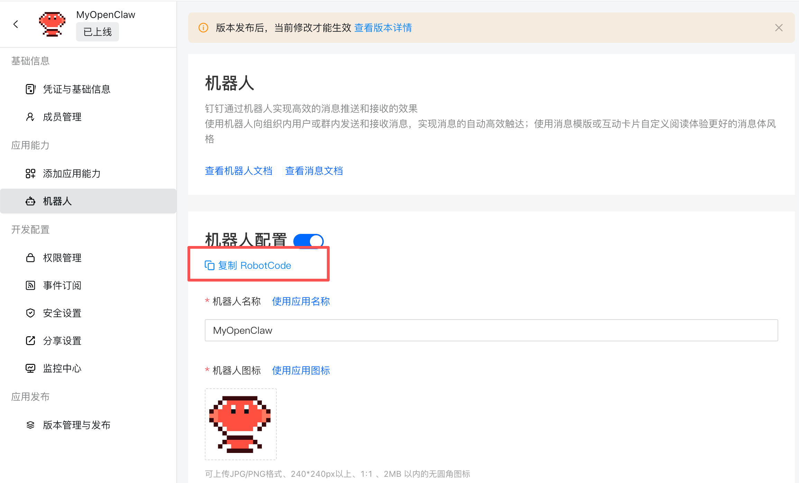

### 测试钉钉机器人
1. 打开钉钉 APP, 直接在顶部的搜索框中搜索添加的 机器人名称
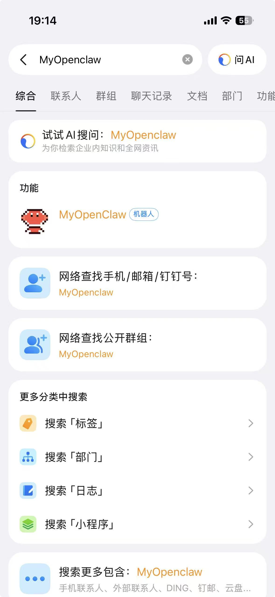

2. 发送消息给机器人
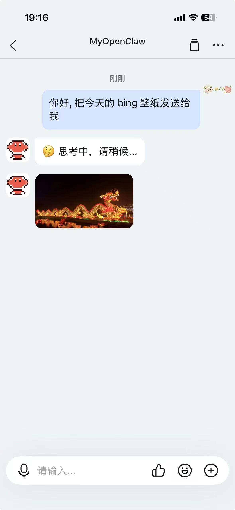

## 参考
- <a href="https://openclaw.ai/" target="_blank">OpenClaw</a>
- <a href="https://o.doubao.com/" target="_blank">豆包手机助手</a>
- <a href="https://nodejs.cn/" target="_blank">Node.js</a>
- <a href="https://open.bigmodel.cn/usercenter/proj-mgmt/apikeys" target="_blank">API Key - 智谱开放平台</a>
- <a href="https://docs.openclaw.ai/zh-CN/tools/chrome-extension" target="_blank">Chrome 扩展 - OpenClaw 文档</a>
- <a href="https://open.dingtalk.com/" target="_blank">钉钉开放平台能力中心</a>
- <a href="https://www.bigmodel.cn/claude-code?cc=fission_glmcode_sub_v1&ic=Q2N8XA4W77&n=a****3" target="_blank">🔗 GLM Coding Lite</a>
