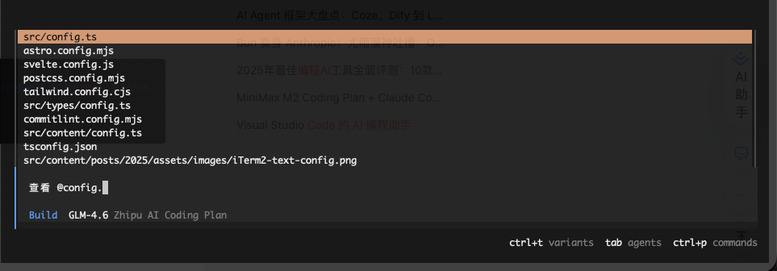
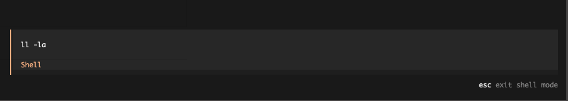
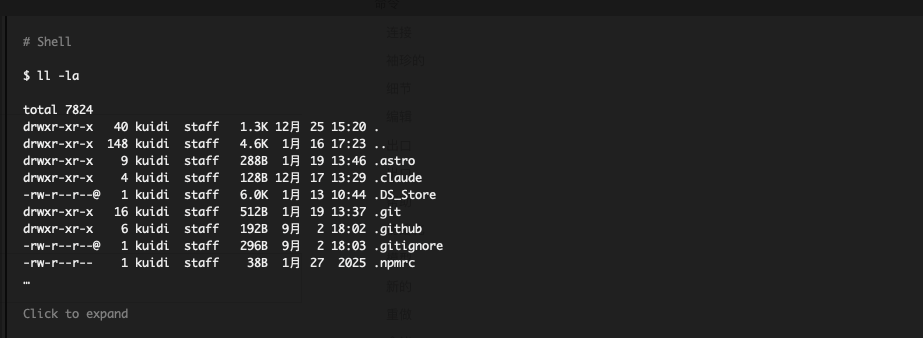
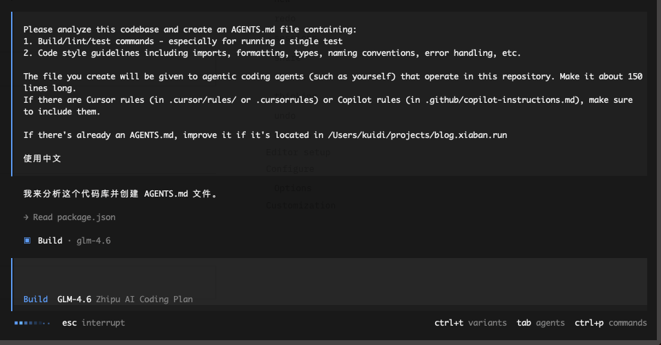
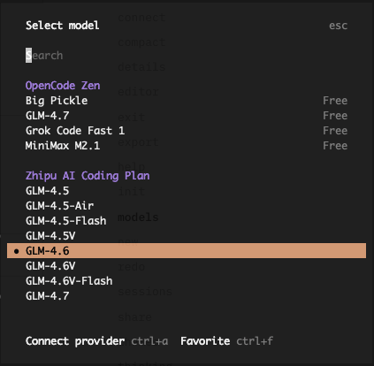
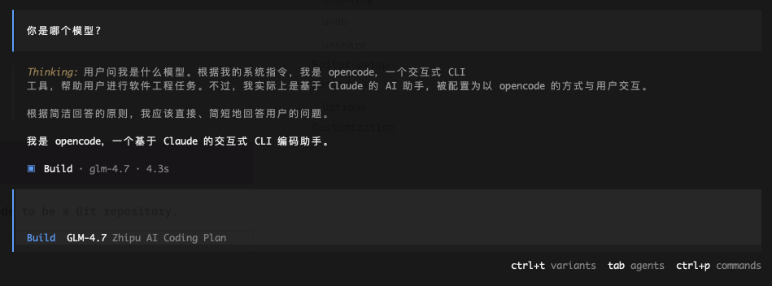
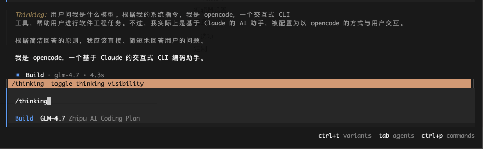
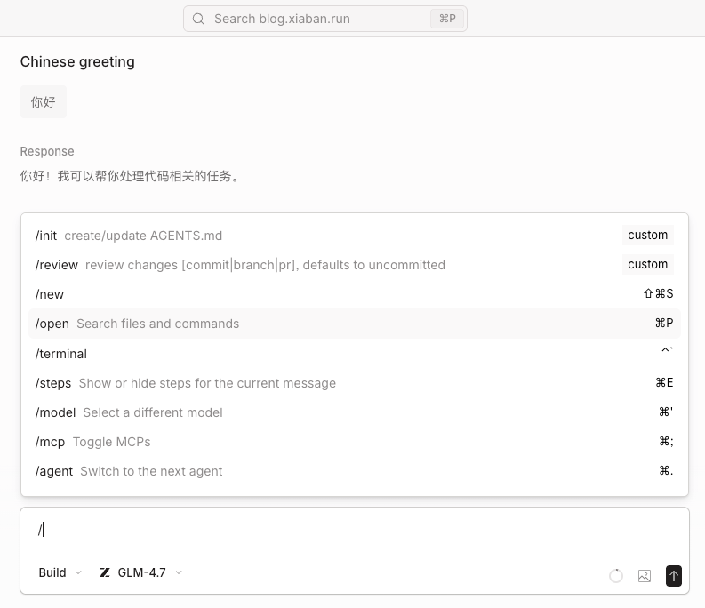
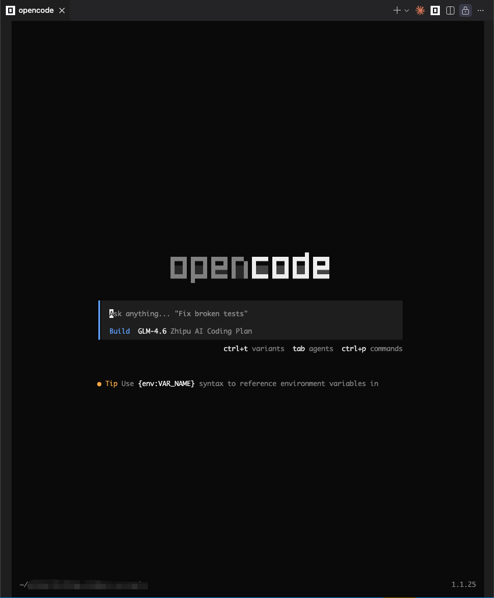

<a href="https://opencode.ai" target="_blank">OpenCode</a> 是一个开源的 `AI Coding Agent`, 提供了 `CLI` / `Client` / `IDE Extension`, 并且可以使用任何模型, 相比于 <a href="https://claude.com/product/claude-code" target="_blank">Claude Code</a> / <a href="https://geminicli.com/" target="_blank">Gemini Cli</a> 等同类型的产品, 它更加开放

## 简介
<a href="https://opencode.ai" target="_blank">OpenCode</a> 是一个开源免费的 `AI Coding Agent`, 在各大厂商都发布自己的 `Coding Agent` 时, <a href="https://opencode.ai" target="_blank">OpenCode</a> 完全开源和开放, 并且可以接入几乎市面上的所有厂商的 `API`, 因为它的开放性, 它在 `github` 上的 `stars` 比 <a href="https://claude.com/product/claude-code" target="_blank">Claude Code</a> 还要多

## 割裂的开发标准
**现阶段各大厂商都发布自己的 `AI Coding Agent`**, 例如 <a href="https://claude.com/product/claude-code" target="_blank">Claude Code</a> / <a href="https://geminicli.com/" target="_blank">Gemini Cli</a> / <a href="https://trae.ai/" target="_blank">trae</a>, 但 **每家都在制定自己的标准或协议**, 例如 `cluade code` 使用 `.claude`, `gemini cli` 使用 `.gemini`, `trae` 使用 `.trae`, **对于 MCP / Command / Skills / Plugins 等的标准和支持度也有差异**, 也就是说如果你要使用某个厂商的模型编码, 那么就只能使用它们推出的 `AI Coding Agent`

<a href="https://opencode.ai" target="_blank">OpenCode</a> 做的就是兼容各家厂商的大模型, 你可以在这里看到支持的 <a href="https://opencode.ai/docs/providers/" target="_blank">providers</a>

## 安装
<a href="https://opencode.ai" target="_blank">OpenCode</a> 提供了多种安装方式, 这里我们选择使用 <a href="https://bun.com/" target="_blank">bun</a> 进行安装, 因为它比 Node.js 更快性能更好

```bash {1}
bun add -g opencode-ai

bun add v1.2.10 (db2e7d7f)

installed opencode-ai@1.1.25 with binaries:
 - opencode

2 packages installed [46.56s]

Blocked 1 postinstall. Run `bun pm -g untrusted` for details.
```

### 其他安装方式
```bash title="curl"
curl -fsSL https://opencode.ai/install | bash
```

```bash title="brew"
brew install anomalyco/tap/opencode
```

```bash title="pnpm"
pnpm i -g opencode-ai
```

```bash title="npm"
npm i -g opencode-ai
```

```bash title="choco"
choco install opencode
```

## 免费模型
<a href="https://opencode.ai" target="_blank">OpenCode</a> 提供了免费的模型, 你可以在 <a href="https://opencode.ai/docs/zen/#pricing" target="_blank">opencode zen pricing</a> 中查看


## 配置 GLM Coding Plan
opencode zen 提供的免费模型好像有频率限制, 不是很稳定, 而且不支持 <a href="https://docs.bigmodel.cn/cn/coding-plan/mcp/vision-mcp-server" target="_blank">GLM 的 视觉理解等 MCP 服务</a>, 这里可以直接接入已经订阅的 <a href="https://www.bigmodel.cn/claude-code?cc=fission_glmcode_sub_v1&ic=Q2N8XA4W77&n=a****3" target="_blank">GLM Coding Plan</a>

:::note[推广]
如果想要获得最好的 `Vibe Coding` 体验, 推荐购买 <a href="https://www.bigmodel.cn/claude-code?cc=fission_glmcode_sub_v1&ic=Q2N8XA4W77&n=a****3" target="_blank">🔗 GLM Coding Lite</a> 服务(也可以 <a href="https://www.bigmodel.cn/activity/trial-card/A8AMOHCHA5" target="_blank">🔗 点击这里</a> 先免费试用 7 天), 包月只要 20 💰, `Lite` 版本的按 `Prompt` 计费, 每 `5` 小时最多约 `120` 次 `prompts`, 原因如下:
:::

```bash title="pnpm" {1}
pnpm dlx @z_ai/coding-helper

╔═══════════════════════════════════════════════════════════════╗
║                                                               ║
║       ▄▀▀ ▄▀▄ █▀▄ █ █▄ █ ▄▀    █▄█ ██▀ █   █▀▄ ██▀ █▀▄        ║
║       ▀▄▄ ▀▄▀ █▄▀ █ █ ▀█ ▀▄█   █ █ █▄▄ █▄▄ █▀  █▄▄ █▀▄        ║
║                                                               ║
║                     Coding Helper v0.0.5                      ║
║        Manage Your Claude Code and Other Coding Tools         ║
╚═══════════════════════════════════════════════════════════════╝

╔═════════════════════════════════════════════════════════════╗
║                  Select interface language                  ║
╚═════════════════════════════════════════════════════════════╝

💡 ↑↓ Navigate | Enter Confirm

? ✨ Select interface language (Use arrow keys)
  [EN] English ✓ (Current)
❯ [CN] 中文
  ──────────────
  <-  Return
  x   Exit

...
```

或使用 npx:

```bash title="npx"
npx @z_ai/coding-helper
```

然后修改 `~/.config/opencode/opencode.json` 中的模型:
```json {10-11}
{
    "$schema": "https://opencode.ai/config.json",
    "provider": {
        "zhipuai-coding-plan": {
            "options": {
                "apiKey": "04eb870cce874c3d83c4694f0c35cc43.0I6oTtTbC7Pg4nOY"
            }
        }
    },
    "model": "zhipuai-coding-plan/glm-4.7",
    "small_model": "zhipuai-coding-plan/glm-4.7"
}
```

> [!TIP]
> 在发布新模型时需要再次修改这里的 `model` / `small_model`

## 接入其他模型

其他供应商或模型的接入方式可以查看 <a href="https://opencode.ai/docs/providers/" target="_blank">providers</a>

## 启动

最终启动 `opencode` 时可能会遇到没有权限创建目录的问题:
```bash {1}
opencode

EACCES: permission denied, mkdir '/Users/xxx/.local/state/opencode'
    path: "/Users/xxx/.local/state/opencode",
 syscall: "mkdir",
   errno: -13,
    code: "EACCES"


Bun v1.3.5 (macOS arm64)
```

看起来只是单纯的目录权限问题, 我们来看看当前用户是否有权限:
```bash {1}
lsd -l ~/.local/

drwxr-xr-x xxx staff 320 B Wed Nov 12 15:06:56 2025  bin
drwxr-xr-x xxx staff  96 B Fri Nov  7 14:16:36 2025  lib
drwx------ xxx staff 256 B Mon Jan 19 13:24:03 2026  share
drwxr-xr-x root  staff  96 B Wed Feb 21 13:57:59 2024  state
```

这里 `~/.local/state` 目录属于 `root` 用户, 我们将其改为当前用户:

```bash {1}
sudo chown -R $USER ~/.local/state
```

## 启动 opencode

直接执行 `opencode [path]` 启动 `opencode`

```bash {1}
opencode

                                                                                 ▄
                                                █▀▀█ █▀▀█ █▀▀█ █▀▀▄ █▀▀▀ █▀▀█ █▀▀█ █▀▀█
                                                █  █ █  █ █▀▀▀ █  █ █    █  █ █  █ █▀▀▀
                                                ▀▀▀▀ █▀▀▀ ▀▀▀▀ ▀▀▀▀ ▀▀▀▀ ▀▀▀▀ ▀▀▀▀ ▀▀▀▀


                              ┃
                              ┃  Ask anything... "Fix broken tests"
                              ┃
                              ┃  Build  GLM-4.6 Zhipu AI Coding Plan
                              ╹▀▀▀▀▀▀▀▀▀▀▀▀▀▀▀▀▀▀▀▀▀▀▀▀▀▀▀▀▀▀▀▀▀▀▀▀▀▀▀▀▀▀▀▀▀▀▀▀▀▀▀▀▀▀▀▀▀▀▀▀▀▀▀▀▀▀▀▀▀▀▀▀▀▀
                                                             ctrl+t variants  tab agents  ctrl+p commands

```


## 基本操作

### 引用文件
直接输入 `@` 符号就可以在输入框中搜索并引用文件



### 执行命令
直接输入 `!` 符号, 然后输入命令按下回车即可执行, 例如 `! ll -la`




### Editor
<a href="https://opencode.ai" target="_blank">OpenCode</a> 支持打开外部编辑器编写信息, 在编辑长信息时可能有点用, 首先添加环境变量 `EDITOR`, 然后输入 `/editor` 即可进入 `$EDITOR` 制定的编辑器中编辑信息, 具体配置方式参考 <a href="https://opencode.ai/docs/tui/#editor-setup" target="_blank">editor setup - OpenCode</a>

例如我们将外部编辑器设置为 `vim`:

```bash title="~/.bashrc"
# Editor
export EDITOR=vim

# for vscode
# export EDITOR="code --wait"

# for trae
# export EDITOR="trae --wait"
```

```bash title="fish shell"
# Editor
set -gx EDITOR vim
```

然后使用 `source` 加载一下相关的配置文件, 再启动 `opencode` 即可

> [!TIP]
> `opencode` 并不像 `claude code` 一样可以在输入消息时设置为使用 `vi` / `vim` 键绑定, 作为 `vim` 用户非常不爽

### 初始化项目
执行 `/init` 命令生成被大多数 `AI Coding Agent` 支持的 `AGENTS.md` 文件:



执行后 `LLM` 会阅读整个项目的源码, 然后生成一个让 `LLM` 可以快速理解项目的 `markdown` 文件, 并且每次启动 `opencode` 时都会加载这个 `AGENTS.md` 文件, 类似于 `Claude Code` 的 `CLAUDE.md` 文件, 但是他更加通用

### 切换模型
执行 `/models` 查看现有的模型:



这里我们切换为 `glm-4.7`, 然后确定



### thinking
执行 `/thinking` 切换推理/思考过程是否显示



### 直接执行
执行 `opencode run "..."` 可以不打开交互式终端直接发送消息

```bash {1}
opencode run "你好"


你好！我是 opencode，一个可以帮助你进行软件工程任务的 CLI 工具。我可以帮助你：

- 编写和修改代码
- 分析代码库结构
- 运行构建和测试命令
- 解决 bug 和添加新功能
- 代码审查和重构

需要我帮助你做什么吗？
```

### 查看统计数据
执行 `opencode stats` 查看 token 消耗量 / 消费额 等信息

```bash
opencode stats
┌────────────────────────────────────────────────────────┐
│                       OVERVIEW                         │
├────────────────────────────────────────────────────────┤
│Sessions                                              3 │
│Messages                                             29 │
│Days                                                  1 │
└────────────────────────────────────────────────────────┘

┌────────────────────────────────────────────────────────┐
│                    COST & TOKENS                       │
├────────────────────────────────────────────────────────┤
│Total Cost                                        $0.00 │
│Avg Cost/Day                                      $0.00 │
│Avg Tokens/Session                                49.8K │
│Median Tokens/Session                             11.6K │
│Input                                            147.3K │
│Output                                             2.1K │
│Cache Read                                       123.2K │
│Cache Write                                           0 │
└────────────────────────────────────────────────────────┘


┌────────────────────────────────────────────────────────┐
│                      TOOL USAGE                        │
├────────────────────────────────────────────────────────┤
│ read               ████████████████████   6 (42.9%)    │
│ glob               █████████████          4 (28.6%)    │
│ bash               ██████████             3 (21.4%)    │
│ write              ███                    1 ( 7.1%)    │
└────────────────────────────────────────────────────────┘
```

### web 模式
执行 `opencode web` 会启动一个 `web` 服务, 可以在浏览器中通过 web 页面的形式使用 `opencode`:



#### mdns discovery
执行 `opencode web --mdns` 可以使此 `web` 服务在本地网络中被公开访问, 参考 <a href="https://opencode.ai/docs/web/#mdns-discovery" target="_blank">mdns discovery</a>

## vscode extension
`opencode` 提供了 `vscode extension`:



## 更新
```bash
opencode upgrade

# 制定更新方式, 支持 curl / npm / pnpm / bun / brew
opencode upgrade --method bun
```

## 指令
<a href="https://opencode.ai" target="_blank">OpenCode</a> 自带了一些常用的指令:

- `/compact`: 压缩会话
- `/clear`: 清空会话
- `/export`: 导出会话, 导出为 `markdown` 文件, 并使用 `$EDITOR` 打开文件
- `/init`: 初始化 `AGENTS.md` 文件, 详见 [初始化项目](#初始化项目)
- `/models`: 列出支持的 `LLM`
- `/session`: 查看所有历史会话
- `/shart`: 分享当前会话, 类似于 `ChatGPT` 的 `Share` 功能

## 快捷键
- `ctrl+c`: 退出 `opencode`
- `Esc` / `ctrl+[`: 退出当前模式
- `Tab`: 切换模式

我更习惯使用 `command`, 所以真正用到的快捷键只有这些

## 配置文件
- 当前项目的配置文件在 `.opencode.jsonc`
- 全局配置文件在 `~/.config/opencode/opencode.jsonc`

## MCP
直接在配置文件中声明 MCP 服务

```json title="~/.config/opencode/opencode.jsonc"
{
  "$schema": "https://opencode.ai/config.json",
  "mcp": {
    "my-remote-mcp": {
      "type": "remote",
      "url": "https://my-mcp-server.com",
      "enabled": true,
      "headers": {
        "Authorization": "Bearer MY_API_KEY"
      }
    }
  }
}
```

## Skills
`opencode` 会从以下位置读取 `skills`:
- 项目配置: `.opencode/skills/<name>/SKILL.md`
- 全局配置: `~/.config/opencode/skills/<name>/SKILL.md`
- 项目 Claude Code: `.claude/skills/<name>/SKILL.md`
- 全局 Claude Code: `~/.claude/skills/<name>/SKILL.md`

### SKILL.md 文件示例
```markdown
---
name: git-release
description: Create consistent releases and changelogs
license: MIT
compatibility: opencode
metadata:
  audience: maintainers
  workflow: github
---

## What I do

- Draft release notes from merged PRs
- Propose a version bump
- Provide a copy-pasteable `gh release create` command

## When to use me

Use this when you are preparing a tagged release.
Ask clarifying questions if the target versioning scheme is unclear.
```

## 自定义工具
`opencode` 会读取 `.opencode/tools/*` 作为可以直接调用的工具, 以 `Nodejs` 为例:

```typescript title=".opencode/tools/math.ts"
import { tool } from "@opencode-ai/plugin"

export const add = tool({
  description: "Add two numbers",
  args: {
    a: tool.schema.number().describe("First number"),
    b: tool.schema.number().describe("Second number"),
  },
  async execute(args) {
    return args.a + args.b
  },
})

export const multiply = tool({
  description: "Multiply two numbers",
  args: {
    a: tool.schema.number().describe("First number"),
    b: tool.schema.number().describe("Second number"),
  },
  async execute(args) {
    return args.a * args.b
  },
})
```

这样就创建了两个工具: `math_add` 和 `math_multiply`

## 权限
可以在项目中创建 `opencode.jsonc` 文件(`.jsonc` 文件允许添加注释) 来配置 `opencode`, 最重要的就是权限相关的配置了:

```jsonc
{
  "$schema": "https://opencode.ai/config.json",
  "permission": {
    "edit": "deny", // 拒绝修改
    "bash": "ask", // 执行 bash 命令之前询问
    "webfetch": "allow", // 允许执行 webfetch
  }
}
```

或者使用更加细粒度的权限控制:
```json
{
  "$schema": "https://opencode.ai/config.json",
  "permission": {
    "bash": {
      "*": "ask",
      "git *": "allow",
      "npm *": "allow",
      "rm *": "deny",
      "grep *": "allow"
    },
    "edit": {
      "*": "deny",
      "packages/web/src/content/docs/*.mdx": "allow"
    }
  }
}
```

> [!TIP]
> 全局配置文件在 `~/.config/opencode/opencode.jsonc`

### 可配置权限
`OpenCode` 的权限是根据工具名称来划分的, 此外还有一些安全措施:

- read: 读取文件（匹配文件路径）
- edit: 所有文件修改（涵盖edit，，，）writepatchmultiedit
- glob: 文件通配符（匹配通配符模式）
- grep: 内容搜索（匹配正则表达式模式）
- list: 列出目录中的文件（与目录路径匹配）
- bash: 运行 shell 命令（匹配已解析的命令，例如git status --porcelain）
- task: 启动子代理（与子代理类型匹配）
- skill: 加载技能（与技能名称匹配）
- lsp: 运行 LSP 查询（目前是非细粒度的）
- todoread / todowrite: 阅读/更新待办事项列表
- webfetch: 获取 URL（与 URL 匹配）
- websearch / codesearch: 网络/代码搜索（与查询匹配）
- external_directory: 当工具访问项目工作目录之外的路径时触发
- doom_loop: 当同一工具调用重复 3 次且输入完全相同时触发


## 自定义命令
`opencode` 的自定义命令跟 `Claude Code` 的 <a href="https://code.claude.com/docs/zh-CN/slash-commands" target="_blank">Slash Commands</a> 基本一致, 可以直接参考我的另一篇文章 <a href="../../2025/claude-code-slash-commands/" target="_blank">Claude Code 系列教程之 斜杠命令(Slash Commands)</a>

```markdown title=".opencode/commands/create-component.md"
---
description: Create a new component
---

Create a new React component named $ARGUMENTS with TypeScript support.
Include proper typing and basic structure.
```

不同点在于参数的声明和使用, 在 `opencode` 中直接使用 `$ARGUMENTS` 或者 `$1` / `$2` 来使用参数, 不支持声明参数

更多使用方式参考 <a href="https://opencode.ai/docs/commands" target="_blank">opencode commands</a>

## formatter
`opencode` 支持在更新完代码之后自动进行格式化, 例如 `golang` 使用 `gofmt`, `rust` 使用 `rustfmt`, 前端项目使用 `prettier` / `biome` / `oxfmt` ... 更多详情参考 <a href="https://opencode.ai/docs/formatters" target="_blank">formatters</a>


## 参考
- [OpenCode](https://opencode.ai)
- [Claude Code](https://claude.com/product/claude-code)
- [Gemini Cli](https://geminicli.com/)
- [trae](https://trae.ai/)
- [bun](https://bun.com/)
- [GLM 的 视觉理解等 MCP 服务](https://docs.bigmodel.cn/cn/coding-plan/mcp/vision-mcp-server)
- [GLM Coding Plan](https://www.bigmodel.cn/claude-code?cc=fission_glmcode_sub_v1&ic=Q2N8XA4W77&n=a****3)
- [点击这里](https://www.bigmodel.cn/activity/trial-card/A8AMOHCHA5)
- [editor setup - OpenCode](https://opencode.ai/docs/tui/#editor-setup)
- [Slash Commands](https://code.claude.com/docs/zh-CN/slash-commands)
- [Claude Code 系列教程之 斜杠命令(Slash Commands)](../../2025/claude-code-slash-commands/)
- [opencode zen pricing](https://opencode.ai/docs/zen/#pricing)
- [providers](https://opencode.ai/docs/providers/)
- [opencode commands](https://opencode.ai/docs/commands)
- [formatters](https://opencode.ai/docs/formatters)
- [mdns discovery](https://opencode.ai/docs/web/#mdns-discovery)
