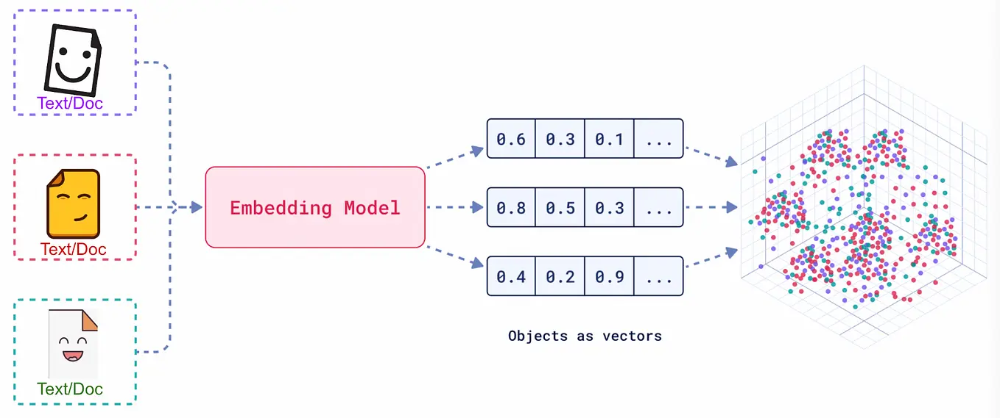
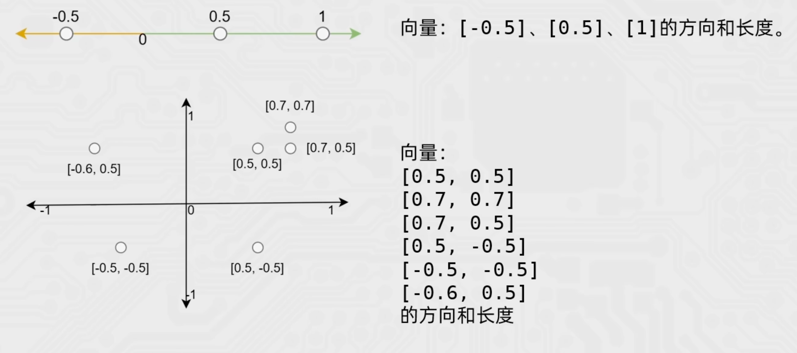

## 前言
本文是个人学习笔记, 可能不适合所有人阅读, 但如果你是跟我一样的前端开发, 同时具备一点 Python 开发基础和 LLM 调用经验, 那么本文应该会对你有帮助

## 简介
[LangChain](https://docs.langchain.com) 意为 `Language`(LLM) + `Chain`(链式连接), 将 LLM 与其他计算资源和数据源以 `Chain` 的方式连接, 是一个用于开发 **由 LLM 驱动的应用程序的开源框架**, 它提供了以下主要功能帮助开发者快速构建出 AI Agent 应用:

- Prompts: 优化提示词
- Models: 调用各类模型
- History: 管理回话历史记录(记忆)
- Indexes: 管理分析各类文档
- Chains: 构建功能执行链条
- Agent: 构建智能体

## 安装
`LangChain` 项目需要安装众多依赖, 主要包含:
- `langchain`: 核心包
- `langchain-community`: 社区包, 提供更多第三方模型的调用(例如阿里云模型)
- `langcahin-ollama`: 支持调用 ollama 部署的本地模型
- `dashscope`: 阿里云通义千问的 python sdk
- `chromadb`: 轻量向量数据库

## RAG

当前 LLM 普遍存在以下问题:
- 领域知识匮乏
- 信息过时
- 幻觉问题
- 信息安全问题

`RAG`(`Retrieval-Augmented Generation` 检索增强生成) 为 LLM 提供了 **从特定数据源检索信息的能力**, 来解决上述问题:
- 领域知识和私有数据
- 实时数据
- 减少幻觉
- 增强信息安全

### RAG 工作流程


RAG 包含以下三个核心阶段:
- `Indexing`: **索引阶段**
  - 加载文件(信息源)
  - 内容提取
  - 文本分割, 形成 `chunk`
  - 文本向量化
  - 存储向量到数据库
- `Retriever`: **检索阶段**
  - `query` 向量化
  - 从数据库中检索最相关的的 `top_k` 个 `chunk`
- `Generator`: **生成阶段**
  - 匹配出的文本作为上下文和问题一起添加到 `prompt` 中
  - 调用 LLM

### 什么是向量


向量嵌入(`Embedding`) 是一种将真实世界中复杂、高维的数据对象（如文本、图像、音频、视频等）转换为 **数学上易于处理的、低维、稠密的连续数值向量** 的技术。

例如对于 `text-embedding-v1` 模型, 可以生成 `1536` 维的向量(一段文本固定生成 `1536` 个数字序列, 也就是这段文本在 `1536` 各抽象语义特征的强度表示)

#### 维度
每个维度表示一个抽象语义特征, 例如一个 `3` 维的向量:

| 情绪 | 动作 | 倾向 |
| ---- | ---- | ---- |
| 0.25 | 1.22 | 0.3  |

`5` 维的向量:

| 情绪 | 动作 | 倾向 | 位置 | 时间 |
| ---- | ---- | ---- | ---- | ---- |
| 0.25 | 1.22 | 0.3  | 0.5  | 0.7  |


#### 余弦相似度算法
余弦相似度算法是一种用于计算两个向量的数字序列之间的相似度的算法, 它基于向量空间模型, 计算两个向量之间的夹角余弦值(只判断方向, 不判断长度), 来表示它们之间的相似度。



## Models
LangChain 主要支持三种类型的模型:

- `LLMs`: 大语言模型, 核心能力是理解和生成自然语言, 主要服务于 **文本生成**
- `Chat Models`: 聊天模型, 是 `LLM` 的一种, 核心能力是模拟人类对话的轮次交互, 主要服务于 **聊天场景**
- `Embedding Models`: 嵌入模型, 核心能力是将文本转换为向量, 主要服务于 **向量检索**

> [!TIP]
>  `LLMs` 只接受纯字符串作为输入, 而 `Chat Models` 只接受结构化的消息对象作为输入, **如今各家大模型厂商已经全部使用 `Chat Models`, 因此 `LLMs` 已经被边缘化了**

### LLM 调用

对于兼容 `OpenAI` 的模型, 可以直接使用 `ChatOpenAI` 类调用

```bash
uv add langchain-openai
```

对于不同的大模型厂商, 基本都提供了实现了 `Runnable` 的类, 用于提供统一的 `API` 实现大模型的调用

#### 同步完整返回
```python
import os

from langchain_openai import ChatOpenAI
from pydantic import SecretStr

api_key = os.getenv("DEEPSEEK_LOCAL_DEMO_KEY")
if api_key is None:
  raise ValueError("DEEPSEEK_LOCAL_DEMO_KEY environment variable is not set")

deepseek_llm = ChatOpenAI(
  model="deepseek-v4-flash",
  api_key=SecretStr(api_key),
  base_url="https://api.deepseek.com/v1",
)

response = deepseek_llm.invoke("你好, 你是什么模型")
print(response.content)
```

#### 同步流式返回
```python
response = deepseek_llm.stream("你好, 你是什么模型")
for chunk in response:
  print(chunk.content, end="", flush=True)
```

#### 异步完整返回
```python
async def print_response():
  response = await deepseek_llm.ainvoke("你好, 你是什么模型")
  print(response.content)

asyncio.run(print_response())
```

#### 异步流式返回
```python
async def print_response():
  async for chunk in deepseek_llm.astream("你好, 你是什么模型"):
    print(chunk.content, end="", flush=True)

asyncio.run(print_response())
```

### Chat Models
对于 `Chat Models`, 只需要将 `invoke` / `stream` / `ainvoke` / `astream` 方法的参数改为结构化的 `message` 即可

聊天消息包含以下几种类型, 实际对应 `OpenAI API` 中的 `messages type` 字段

- `AIMessage`: AI 的输出, 对应 `OpenAI assistant` 类型
- `HumanMessage`: 用户发送的消息, 对应 `OpenAI user` 类型
- `SystemMessage`: 系统消息, 用于设置模型的行为, 对应 `OpenAI system` 类型

```python
import asyncio
import os

from langchain_core.messages import AIMessage, HumanMessage, SystemMessage
from langchain_openai import ChatOpenAI
from pydantic import SecretStr


api_key = os.getenv("DEEPSEEK_LOCAL_DEMO_KEY")
if api_key is None:
  raise ValueError("DEEPSEEK_LOCAL_DEMO_KEY environment variable is not set")

deepseek_llm = ChatOpenAI(
  model="deepseek-v4-flash",
  api_key=SecretStr(api_key),
  base_url="https://api.deepseek.com/v1",
)

messages = [
  SystemMessage(content="你是一个专业的 Python 编程专家"),
  HumanMessage(content="你好, 你是什么模型"),
  AIMessage(content="你好, 我是 Deepseek V4 Flash, 我是 Python 专家, 有什么可以帮你的"),
  HumanMessage(content="uv run -m src.main 具体是什么意思?"),
]

async def main():
  async for chunk in deepseek_llm.astream(messages):
    print(chunk.content, end="", flush=True)

asyncio.run(main())
```

对于 `message`, 也可以用元组的形式表示, 例如

```python
model_name = "deepseek-v4-flash"

messages = [
  ("system", "你是一个专业的 Python 编程专家"),
  ("user", "你好, 你是什么模型"),
  ("assistant", f"你好, 我是 {model_name}, 我是 Python 专家, 有什么可以帮你的"),
  ("user", "uv run -m src.main 具体是什么意思?"),
]
```

### Embedding Models
`Embeding` 模型在实际使用时, 既可以调用各大模型厂商的 API, 也可以使用本地的模型, 绝大部分场景下都应该使用本地模型, 除非本地环境不具备条件

#### 调用 Embedding Model API
`deepseek` 并没有提供 `embedding` 模型, 可以使用其他厂商的 `embedding` 模型, 例如 阿里云百炼 的 [text-embedding-v4](https://bailian.console.aliyun.com/cn-beijing?tab=model#/model-market/detail/text-embedding-v4?serviceSite=asia-pacific-china) 模型, 可直接参考官网的实例:

```python
import dashscope
from http import HTTPStatus
input_texts = "衣服的质量杠杠的，很漂亮，不枉我等了这么久啊，喜欢，以后还来这里买"

resp = dashscope.TextEmbedding.call(
  model="text-embedding-v4",
  input=input_texts
)
print(resp)
```

#### 使用本地模型
我们可以借助 [ollama](https://ollama.com) 来在本地安装和使用 `Embedding Model`, 这里我们选择 [qwen3-embedding:4b](https://ollama.com/library/qwen3-embedding)
```bash
ollama pull qwen3-embedding:4b
```

```bash
uv add langchain-ollama
```

```python
from langchain_ollama import OllamaEmbeddings

embedding = OllamaEmbeddings(
  model="qwen3-embedding:4b",
  base_url="http://localhost:11434",
)

text = "uv add langchain-ollama"

def main():
  vec = embedding.embed_query(text)
  print(f'向量维度{len(vec)}')
  print(f'向量前 10 个元素{vec[:10]}')

main()
```

### Chain
`LangChain` 中的 `Chain` 是核心抽象之一, 用于将一系列组件(`PromptTemplate`, `LLM`, `Tools`, `RAG` 等)组合成一个可执行的工作流, 本质上是定义了一系列管线(`pipeline`), 定义了 输入 -> 处理步骤 -> 输出 顺序逻辑

#### PromptTemplate
```python
import os

from langchain_core.prompts import PromptTemplate
from langchain_openai import ChatOpenAI
from pydantic import SecretStr

api_key = os.getenv("DEEPSEEK_LOCAL_DEMO_KEY")
if api_key is None:
  raise ValueError("DEEPSEEK_LOCAL_DEMO_KEY environment variable is not set")

deepseek_llm = ChatOpenAI(
  model="deepseek-v4-flash",
  api_key=SecretStr(api_key),
  base_url="https://api.deepseek.com/v1",
)

def main():
  # 1. 创建 prompt template 对象
  prompt_template = PromptTemplate.from_template("你好, 请介绍一下 {model_name}")
  # 2. 创建 chain 对象
  chain = prompt_template | deepseek_llm
  # 3. 执行 chain 对象
  res = chain.invoke(input={"model_name": "glm-5.2"})
  print(res.content)

main()
```

`PromptTemplate` 最大的意义在于它可以融入 `Chain`(链系统) 和 `Runnable`(可运行对象), 中

#### FewShotPromptTemplate

```python
import os

from langchain_core.prompts import PromptTemplate, FewShotPromptTemplate
from langchain_openai import ChatOpenAI
from pydantic import SecretStr

api_key = os.getenv('DEEPSEEK_LOCAL_DEMO_KEY')
if api_key is None:
  raise ValueError("DEEPSEEK_LOCAL_DEMO_KEY environment variable is not set")

deepseek_llm = ChatOpenAI(
  model="deepseek-v4-flash",
  api_key=SecretStr(api_key),
  base_url="https://api.deepseek.com/v1",
)

def main():
  example_template = PromptTemplate.from_template('单词: {word}, 反义词: {antonym}')
  examples = [
    { "word": "大", "antonym": "小" },
    { "word": "好", "antonym": "坏" },
  ]
  few_show_prompt = FewShotPromptTemplate(
    example_prompt=example_template,
    examples=examples,
    prefix="请根据以下示例, 生成指定单词的反义词",
    suffix="{word} 的反义词是什么?",
    input_variables=["word"],
  )
  prompt = few_show_prompt.invoke({ 'word': '孤独' }).to_string()
  print(prompt)
  res = deepseek_llm.invoke(prompt)
  print(res.content)

main()
```

`FewShotPromptTemplate` 虽然只是做了简单的字符串拼接, 但它的意义在于:

- 关注点分离: 将 示例内容(`examples`) / 示例格式(`example_prompt`) / 示例逻辑(`example_selector`) / 输出格式(`suffix`) 分离出来, 使代码更清晰, 易维护
- 可复用性: 可以在不同的 `prompt` 上使用同一个 `example_selector`

> [!TIP]
> `format` 和 `invoke` 的区别就是 `invoke` 支持 `MessagePlaceholder` 结构化占位符

#### ChatPromptTemplate

```python {18-37}
import asyncio
import os

from langchain_core.prompts import ChatPromptTemplate, MessagesPlaceholder
from langchain_openai import ChatOpenAI
from pydantic import SecretStr

api_key = os.getenv('DEEPSEEK_LOCAL_DEMO_KEY')
if api_key is None:
  raise ValueError("DEEPSEEK_LOCAL_DEMO_KEY environment variable is not set")

deepseek_llm = ChatOpenAI(
  model="deepseek-v4-flash",
  api_key=SecretStr(api_key),
  base_url="https://api.deepseek.com/v1",
)

async def main():
  # 定义包含占位历史消息的消息列表
  chat_prompt_template = ChatPromptTemplate.from_messages([
    ("system", "你是一个专业的 Python 编程专家, 你叫 {model_name}"),
    MessagesPlaceholder(variable_name="history"),
    ("human", "{input}"),
  ])
  history_data = [
    ("human", "你好, 你是什么模型"),
    ("ai", "你好, 我是 Deepseek V4 Flash, 我是 Python 专家, 有什么可以帮你的"),
    ("human", "你到底是什么模型? 你叫什么? 简要介绍一下 uv run -m src.main 具体是什么意思?"),
    ("ai", "你是一个 Deepseek V4 Flash 模型, 我是 Python 专家\n uv：Python 包管理器；run：创建临时环境运行；-m：以模块执行；src.main 即 src 文件夹下 main.py 入口。"),
  ]
  messages = chat_prompt_template.invoke({
    'history': history_data,
    'input': '请简要介绍一下 uv',
    'model_name': 'deepseek-v4-flash',
  })
  async for chunk in deepseek_llm.astream(input=messages):
    print(chunk.content, end="", flush=True)

asyncio.run(main())
```

## 参考
- [LangChain docs](https://docs.langchain.com)
- [LangChain docs](https://docs.langchain.com/oss/python/langchain/overview)
- [黑马程序员大模型RAG与Agent智能体项目实战教程](https://www.bilibili.com/video/BV1yjz5BLEoY)
- [LangChain 入门教程视频](https://www.bilibili.com/video/BV1oNER6AEXD/?spm_id_from=333.788.player.switch&vd_source=19e09fa462750e58610f95b1a63dbfe7&p=4)
- [all-in-rag](https://datawhalechina.github.io/all-in-rag)