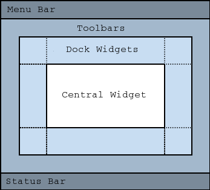

## pyqt6 与 pyside6
本文以 [pyqt6](https://www.riverbankcomputing.com/static/Docs/PyQt6/) 为主, [pyside6](https://doc.qt.io/qtforpython-6/index.html) 是官方提供的绑定库, 两者差异较小

## 安装
```bash
uv init pyqt6-demo
uv python pin 3.13 # (可选) 指定 python 版本为 3.13
uv add pyqt6
```

## 介绍
### 编程范式
支持以下两种风格, 具体 API 参考 [pyside6 模块 API](https://doc.qt.io/qtforpython-6/api.html)

- `Widgets`: 传统桌面控件, **UI 显示为各平台原生控件样式**, 纯 `py` 文件
- `QML`: QT 引擎绘制, **在各平台样式表现一致**, 编写 `qml + js + py` 文件

> [!TIP]
> 本文只介绍 `Widgets`

### QtCore
核心库, 类比于各编程语言的标准库, 也是整个 `qt` 的基础

常用 API:
- `Signal`: 信号
- `Slot`: slot
- `QFile`: 文件

### QtGui
负责 绘图 / 字体 / 图片 / 颜色 / 键盘 / 鼠标 等相关功能

常用 API:
- `QPixmap`: 图片
- `QImage`: 图像
- `QFont`: 字体

### QtWidgets
基础的原生组件, 类比于原生的 `HTML` 元素

常用 API:
- `QPushButton`: 按钮
- `QLineEdit`: 输入框
- `QComboBox`: 下拉选择框
- `QSlider`: 滑动条
- `QCheckBox`: 复选框
- `QRadioButton`: 单选框
- `QTabWidget`: 选项卡
- `QTreeWidget`: 树状结构
- `QTableWidget`: 表格

## 低代码可视化编辑器

### Qt Designer
对应 `Widgets` 风格, 详见 [Qt Widgets Designer](https://doc.qt.io/qt-6/qtdesigner-manual.html)

```bash
uv add --dev pyqt6-tools
```

### Qt Design Studio
对应 `QML` 风格, 详见 [Qt Design Studio](https://www.qt.io/development/ui-design-tools)

## 安装官方套件
进入 [Qt 官方下载页面](https://www.qt.io/development/download), 这里有三种版本, 选择 [Community Edition](https://www.qt.io/development/download-qt-installer-oss?hsLang=en) 版本, 并安装

## 开始
```bash
uv init pyside6-demo
cd pyside6-demo

uv python pin 3.13 # (可选) 指定 python 版本为 3.13
uv add pysdie6
```

`src/main.py`:
```python
import sys

from PySide6.QtWidgets import QApplication, QLabel, QPushButton
from PySide6.QtCore import Slot

@Slot()
def say_hello():
  print("Hello from pyside6-demo!")

app = QApplication(sys.argv)
label = QLabel("====================")

button = QPushButton("Say Hello")
button.clicked.connect(say_hello)
button.setSizeIncrement(100, 50)
button.show()

sys.exit(app.exec())
```

```bash
uv run src/main.py # 或点击 vscode 右上角的 play 按钮
```

## property
```python
from PyQt6.QtCore import QObject, pyqtProperty

class Foo(QObject):

    def __init__(self):
        QObject.__init__(self)

        self._total = 0

    @pyqtProperty(int)
    def total(self):
        return self._total

    @total.setter
    def total(self, value):
        self._total = value
```

## 与 Vue 的对比
| vue           | pyside6                                           | 备注                                                                     |
| ------------- | ------------------------------------------------- | ------------------------------------------------------------------------ |
| 响应式系统    | `properties`(`pyside6`) / `pyqtProperty`(`pyqt6`) |                                                                          |
| `Component`   | `QWidget`                                         |                                                                          |
| `props`       | 构造函数 / `setter`                               |                                                                          |
| `event`       | `Signal.connect` & `Slot`                         |                                                                          |
| `emit`        | `Signal.emit`                                     |                                                                          |
| `slot`        | ❌                                                 | `Qt` 中 `Slot` 为事件函数, 没有插槽的概念, 与之相近的是手动操作 `layout` |
| `expose`      | `pubilc methods`                                  |                                                                          |
| `ref`         | 对象的引用                                        |                                                                          |
| `watch`       | `Signal`                                          | `Qt` 通过事件(`Signal`)实现                                              |
| `computed`    | `@property`                                       |                                                                          |
| `onMounted`   | `showEvent`                                       |                                                                          |
| `onUnMounted` | `closeEvent`                                      |                                                                          |

## 与 javascript 的对比
| javascript         | pyside6                               | 备注                                     |
| ------------------ | ------------------------------------- | ---------------------------------------- |
| `Object`           | `QObject`                             |                                          |
| `localStorage`     | `QSettings`(`pyqt6`)                  | QSetting 为不同系统提供了不同的 保存位置 |
| `appendChild`      | `addWidget` / `setParent`             |                                          |
| `querySelector`    | `findChild(QPushButton, "button")`    |                                          |
| `querySelectorAll` | `findChildren(QPushButton, "button")` |                                          |
| `removeChild`      | `removeLater()`                       |                                          |

## API
### QObject
`QObject` 是所有 `Qt` 类的基类, 提供了基本的属性、信号、槽等功能, 具体作用如下:

- 构建对象树: 提供了 `parent` / `setParent` / `children` 等 API 实现对象树的构建
- 内存管理: 父组件销毁时, 子组件也会被销毁, 释放内存
- 设置对象名称: `setObjectName`
- 手动销毁对象: `deleteLater`, 因为 `python` 的 `del` 不会真正释放 qt 对象
- 查找子对象: `findChild(QPushButton, "button")`
- 查找所有子对象: `findChildren`
- 事件系统: 提供 `resizeEvent` / `mousePressEvent`
- 生命周期管理:
- 信号槽: 信号(`Signal`) 与 �槽(`Slot`)用于在组件之间通信, 信号触发时, 插槽会被调用

### QWidget
[QWidget](https://doc.qt.io/qt-6/zh/qwidget.html) 是可显示 `UI` 元素的基类, 类提供了向屏幕呈现和处理用户输入事件的基本功能。`Qt XML` 提供的所有 `UI` 元素要么是 `QWidget` 的子类，要么与 `QWidget` 子类相关联使用

所有的 Widget 都继承自 `QWidget`:
```bash
QWidget
├── QMainWindow
├── QDialog
├── QLabel
├── QPushButton
├── QLineEdit
├── QTextEdit
├── QTableWidget
├── QTreeWidget
└── ...
```

#### QMainWindow
[QMainWindow](https://doc.qt.io/qt-6/zh/qmainwindow.html?utm_source=chatgpt.com#details) 工业软件主窗口, 布局如下:



#### QLabel
- `setText("text")`
- `setText("<a href="https://x.com">x</a>")`: 链接, 需要设置 `setOpenExternalLinks` 才能打开链接
- `setBuddy(xx_input)`: 关联输入框
- `setWordWrap(True)`: 自动换行
- `setAlignmentFlag(Qt.AlignmentFlag.AlignCenter)`: 设置对齐方式
- `setOpenExternalLinks(True)`: 允许点击
- `setPixmap(QPixmap("image.png"))`: 设置图片, 静态资源必须使用 [Qt Resource System](https://doc.qt.io/qt-6/zh/resources.html), 详见 [Qt 资源系统](#qt-resource-system) 章节

#### QDialog
继承关系:
```bash
QObject
 └── QWidget
      └── QDialog
           ├── QFileDialog
           ├── QMessageBox
           ├── QColorDialog
           ├── QInputDialog
           └── ...
```

- `dialog.exec()`: 显示(模态)对话框, 返回用户选择的结果
- `dialog.show()`: 非模态框

## QT 资源系统
静态资源文件必须使用 [Qt Resource System](https://doc.qt.io/qt-6/zh/resources.html) 管理, 当资源文件更新时:

1. 将静态资源文件(图片 / 视频) 放到 `src/assets` 目录下
2. 打开 `resources.qrc` 文件, 添加资源文件
3. 运行 `rcc -g python resources.qrc -o src/assets/reources_rc.py` 生成 `src/assets/reources_rc.py` 文件
4. 在 `src/main.py` 中通过 `from src.assets import reources_rc` 引入(现在已经引入了)

`rcc` 命令来自 `qt` 工具链, 不包含在 `PyQt6` 包中

## UI
### 尺寸/布局
| Web                                | Qt                                                                                               | 备注                                               |
| ---------------------------------- | ------------------------------------------------------------------------------------------------ | -------------------------------------------------- |
| `flex`                             | `QVBoxLayout` / `QHBoxLayout` / `QGridLayout`                                                    | 详见 [布局](https://doc.qt.io/qt-6/zh/layout.html) |
| `width: 100%` <br/> `height: 100%` | `button.setSizePolicy(QSizePolicy.Policy.Expanding, QSizePolicy.Policy.Expanding)`               |                                                    |
| `width: 100px`                     | `button.setFixedWidth(100)`                                                                      |                                                    |
| `flex: 1`                          | `layout.addWidget(button1, 1)` 平均占据宽度; `setStretchFactor(widget, 1)` 动态修改              |                                                    |
| `position: absolute`               | `setGeometry(x, y, width, height)` / `child.move(20, 20)` / `child.resize(100, 40)`              |                                                    |
| `z-index: 10`                      | `child.raise_()` / `child.lower_()`                                                              | 默认按组件顺序显示, 不支持数值                     |
| `position: fixed`                  | `child.move(x, y)`                                                                               |                                                    |
| `margin` / `padding`               | `child.setContentsMargins(20, 20, 20, 20)` 对应 `padding` / `child.setSpacing(20)` 对应 `margin` |                                                    |

### QSS
可以使用基于 `CSS2` 的 `QSS` 来实现 [自定义样式](https://doc.qt.io/qt-6/zh/stylesheet.html)

#### 选择器

| Web                   | Qt                     | 备注                                                                                                  |
| --------------------- | ---------------------- | ----------------------------------------------------------------------------------------------------- |
| `*`                   | `*`                    | 相同                                                                                                  |
| `button`              | `QPushButton`          | 所有继承 `QPushButton` 的组件被选中                                                                   |
| `#button`             | `#button`              | qt 需要 `widget.setObjectName("button")`                                                              |
| `button:hover`        | `QPushButton:hover`    | [伪状态选择器](https://doc.qt.io/qt-6/zh/stylesheet-syntax.html#pseudo-states)                        |
| _                     | `.QPushButton`         | 只对 `QPushButton` 组件生效, 但继承它的组件就不会生效                                                 |
| `button[flat="true"]` | `QLabel[flat="true"]`  | [属性选择器](https://doc.qt.io/qt-6/zh/stylesheet-examples.html#customizing-using-dynamic-properties) |
| `button span`         | `QLabel QPushButton`   | 相同                                                                                                  |
| `button > span`       | `QLabel > QPushButton` | 相同                                                                                                  |

详见 [样式表示例](https://doc.qt.io/qt-6/zh/stylesheet-examples.html)

- `*`: 选择所有组件
- `QPushButton`: **组件名**, 选择所有 `QPushButton` 组件
- `.QPushButton`: **子选择器**, 选择所有 `QPushButton` 组件, **但不匹配子类**
- `QLabel, QPushButton`: 选择所有 `QLabel` 组件和 `QPushButton` 组件

详见 [选择器类型](https://doc.qt.io/qt-6/zh/stylesheet-syntax.html#selector-types)

### 网络请求
```python
from PySide6.QtCore import QObject, QUrl
from PySide6.QtNetwork import QNetworkAccessManager, QNetworkRequest, QNetworkReply

class Downloader(QObject):
    def __init__(self):
        super().__init__()
        # 1. 实例化全局管理器
        self.manager = QNetworkAccessManager(self)
        # 连接管理器的 finished 信号
        self.manager.finished.connect(self.on_reply_finished)

    def start_download(self, url_str):
        request = QNetworkRequest(QUrl(url_str))
        # 设置请求头
        request.setHeader(QNetworkRequest.KnownHeaders.UserAgentHeader, "QtApp")
        
        print("发送请求...")
        # 2. 发起异步 GET 请求，这一步瞬间执行完，绝不卡顿
        self.manager.get(request)
        print("请求已发出，主线程继续干别的事去了...")

    def on_reply_finished(self, reply: QNetworkReply):
        # 3. 槽函数在网络请求完成后被触发
        if reply.error() == QNetworkReply.NetworkError.NoError:
            data = reply.readAll() # 读取所有下载到的二进制数据
            print(f"下载成功！数据大小: {len(data)} 字节")
        else:
            print(f"下载失败: {reply.errorString()}")
        
        reply.deleteLater() # 安全销毁 reply 对象
```

## 打包
以番茄钟项目为例, 应用名为 `TomatoClock`, 应用图标为 `src/assets/app-icon-256.png`

```bash
uv run pyinstaller \
  --name TomatoClock \
  --windowed \
  --clean \
  --noconfirm \
  --icon icon.icns \
  src/main.py
```

```bash
# 打开应用, 或直接在 finder 中双击运行
./dist/TomatoClock.app/Contents/MacOS/TomatoClock
```

#### 制作应用图标
```bash
mkdir icon.iconset

sips -z 16 16 src/assets/app-icon-256.png -o icon.iconset/icon_16x16.png
sips -z 32 32 src/assets/app-icon-256.png -o icon.iconset/icon_32x32.png
sips -z 128 128 src/assets/app-icon-256.png -o icon.iconset/icon_128x128.png
sips -z 256 256 src/assets/app-icon-256.png -o icon.iconset/icon_256x256.png
sips -z 512 512 src/assets/app-icon-512.png -o icon.iconset/icon_512x512.png

iconutil -c icns icon.iconset
```

## 常见问题
### 如何使继承
继承 `QWidget` 的组件默认没有背景色和边框, 只有组件 `widget.setAttribute(Qt.WidgetAttribute.WA_StyledBackground, True)` / `widget.setAutoFillBackground(True)` 了, border / 背景色 才会生效

### 如何理解信号和槽
信号和槽是 PyQt 中的通信机制, signal 可以出发一个信号, 绑定到这个 signal 上的 slot 就会执行, 可以通过 type 参数指定连接类型:

- `Qt.ConnectionType.DirectConnection`: 直连, 在信号发出的线程立即调用, 如果发送者和接收者不在一个线程, 则操作 UI 时会报错
- `Qt.ConnectionType.QueuedConnection`: 队列连接, 在接收者线程的事件循环中走到它时才执行
- `Qt.ConnectionType.AutoConnection`: 自动连接, 信号发送者和接收者在同一线程则直连, 否则使用队列连接
- `Qt.ConnectionType.BlockingQueuedConnection`: 阻塞队列连接, 同队列连接, 但发送者线程会卡主, 直到接收者线程执行完毕
- `Qt.ConnectionType.UniqueConnection`: 唯一连接, 同一信号和同一个槽之间只连接一次


```python
import sys
import time
from PyQt6.QtCore import QThread, pyqtSignal, Qt
from PyQt6.QtWidgets import QApplication, QMainWindow, QPushButton, QVBoxLayout, QWidget, QLabel


# 1. 定义子线程（负责图像配准、遥感高频计算或无人机数据对接等耗时任务）
class WorkerThread(QThread):
    # 自定义一个信号，用来传递字符串数据
    data_fetched = pyqtSignal(str)

    def run(self):
        print(f"子线程启动，线程ID: {int(QThread.currentThreadId())}")
        for i in range(1, 6):
            time.sleep(1)  # 模拟耗时任务，比如每秒接收一组无人机坐标
            # 发射信号
            self.data_fetched.emit(f"无人机实时数据包 #{i}")
        print("子线程任务结束")


# 2. 主界面
class MainWindow(QMainWindow):
    def __init__(self):
        super().__init__()
        self.setWindowTitle("PyQt 多线程信号槽演示")
        self.resize(400, 200)

        # UI 布局
        layout = QVBoxLayout()
        self.label = QLabel("等待数据...", self)
        self.btn = QPushButton("开始接收数据", self)
        layout.addWidget(self.label)
        layout.addWidget(self.btn)
        
        container = QWidget()
        container.setLayout(layout)
        self.setCentralWidget(container)

        self.btn.clicked.connect(self.start_task)

    def start_task(self):
        print(f"主线程ID: {int(QThread.currentThreadId())}")
        
        # 创建子线程实例
        self.thread = WorkerThread()

        # 核心：连接信号与槽
        # 显式指定：Qt.ConnectionType.QueuedConnection (或者不写，默认的 AutoConnection 也会自动识别为队列)
        self.thread.data_fetched.connect(self.update_ui, type=Qt.ConnectionType.QueuedConnection)

        # 启动子线程，内部会自动调用 run()
        self.thread.start()

    # 3. 槽函数（属于主线程对象，在主线程执行，可以安全更新 UI）
    def update_ui(self, msg):
        print(f"槽函数执行，当前线程ID: {int(QThread.currentThreadId())} -> 收到数据: {msg}")
        self.label.setText(msg)


if __name__ == "__main__":
    app = QApplication(sys.argv)
    window = MainWindow()
    window.show()
    sys.exit(app.exec())
```

### QT 整体架构
```
+--------------------------------------------------------------+
|                    应用程序层 (Your App)                     |
+--------------------------------------------------------------+
|     高级模块 (Qt Quick / QML, Qt Widgets, Qt WebEngine)       |
+--------------------------------------------------------------+
|     核心基础模块 (QtCore, QtGui, QtNetwork, QtSql, QtTest)    |
+--------------------------------------------------------------+
|             Qt 平台抽象层 (QPA - Qt Platform Abstraction)    |
+--------------------------------------------------------------+
|         Windows (Win32)  |  macOS (Cocoa)  |  Linux (X11/Wayland) |
+--------------------------------------------------------------+
```

### QT 事件循环

- 当执行 `app.exec()` 时, 启动主事件循环
- 事件发生: 例如点击某个按钮 / QTimer 时间到了
- 捕获事件并转换: 利用操作系统(`windows win32` / `Macos cocoa`)捕获到事件, 然后把这些事件转换成 `QEvent` 对象
- 插入事件队列: 把这些事件插入到事件队列中, 等待被处理
- 分发和处理: 找到事件对应的目标组件
- 触发事件处理器: 目标组件收到事件后, 触发对应的虚函数, 例如 `slot`

### 在新线程完成耗时操作
```python
from PyQt5.QtCore import QThread, pyqtSignal
import time

# 1. 定义工作线程
class WorkerThread(QThread):
    # 定义一个信号，用于将后台数据安全地传递给前台 UI
    data_fetched = pyqtSignal(str)

    def run(self):
        # 模拟耗时网络请求或图像配准
        time.sleep(5) 
        result = "数据处理完成"
        # 绝对不能直接在子线程里操作 UI 控件（如 self.label.setText()），那会导致程序崩溃
        self.data_fetched.emit(result) 

# 2. 在主界面中调用
# thread = WorkerThread()
# thread.data_fetched.connect(self.update_ui_method)
# thread.start()
```

### QThread
QThread 有两种主流的使用方式, 分别是:
- 直接继承 `QThread` 类, 实现 `run` 方法
- 使用 `moveToThread(output_thread)`

### 如何进行性能分析
#### cProfile
```python
import cProfile
import pstats

def my_heavy_function():
    # 你的核心业务逻辑
    return sum(i * i for i in range(1000000))

if __name__ == "__main__":
    profiler = cProfile.Profile()
    profiler.enable()  # 开始性能分析

    my_heavy_function()

    profiler.disable()  # 结束性能分析
    stats = pstats.Stats(profiler).sort_stats('tottime')
    stats.print_stats(10)  # 只打印耗时前 10 的函数
```

#### PyCharm 性能分析
参考以下文档:

- [Pycharm 图形化性能测试工具 Profile](https://blog.csdn.net/Castlehe/article/details/118088763)
- [读取 Profiler 快照](https://www.jetbrains.com/zh-cn/help/pycharm/read-the-profiling-report.html)

## 参考
- [QT for Python 文档](https://doc.qt.io/qtforpython-6/index.html)
- [QT 文档](https://doc.qt.io/)
- [PyQt 教程](https://maicss.com/pyqt/v6/menusAndToolbars)
- [pyside6 模块 API](https://doc.qt.io/qtforpython-6/api.html)
